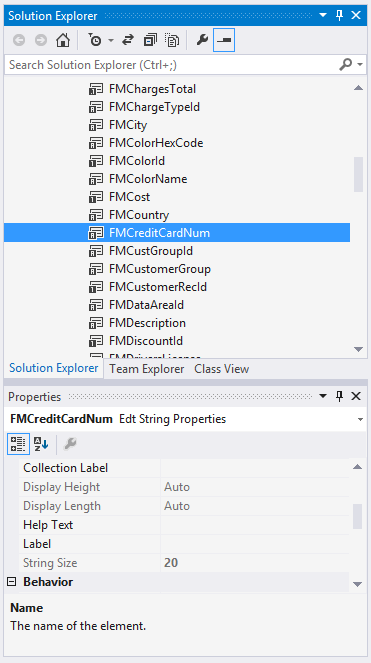

# X++ Primitive data types

[!include [banner](../includes/banner.md)]

This article describes primitive data types in X++. The primitive data types in X++ are **anytype**, **boolean**, **date**, **enum**, **guid**, **int**, **int64**, **real**, **str**, **timeOfDay**, and **utcdatetime**.

## anytype

The **anytype** data type is a placeholder for any data type. You should use variables of this type only as arguments and return values.

To use **anytype** as a variable, you must first assign a value to it, otherwise, a run-time error occurs. After you've assigned a value to **anytype**, you can't convert it to another data type.

Although you can use **anytype** variables in expressions, they're usually used as arguments and return types. The size, precision, scope, default value, and range of **anytype** depend on the conversion type that you assign to it. You can use **anytype** just as you use the data type that you convert it to. For example, if you assign an integer, you can then apply relational and arithmetic operators to the variable.

An **anytype** variable is automatically converted to a date, enumeration (enum), integer, real, string, extended data type (EDT) (record), class, or container when a value is assigned to the type. Additionally, the following explicit [conversion functions](xpp-conversion-run-time-functions.md) can be used: **any2date**, **any2enum**, **any2int**, **any2real**, and **any2str**. You can't change the variable to another data type after you've converted it to **anytype**.

### anytype examples

```xpp
// An example of using anytype variables.
public static str range(anytype _from, anytype _to)
{
    return queryValue(_from) + '..' + queryValue(_to);
}

// Another example of using anytype variables.
void put(int position, anytype data)
{
    record = conPoke (record, position, data);
}

public void AnytypeMethod()
{
    // An example of automatic conversion for anytype.
    anytype a;
    a = "text"; // Automatically assigns a string literal.
}
```

## boolean

The **boolean** data type contains a value that is evaluated as either **true** or **false**. You can use the reserved literal keywords **true** and **false** wherever a **boolean** expression is expected. The size of a **boolean** is 1 byte. The default value is **false**, and the internal representation is a short number.

A **boolean** is automatically converted to an **int**, **date**, or **real**. It has no explicit conversion functions. The internal representation of a **boolean** is an integer. You can assign any integer value to a variable that is declared as the **boolean** type. The integer value **0** (zero) is evaluated as **false**, and all other integer values are evaluated as **true**. Because the internal representation of a **boolean** is an integer, **boolean** values are automatically converted to integers and reals.

### boolean examples

```xpp
public void BooleanMethod()
{
    // Simple declaration of a boolean variable, b.
    boolean b;

    // Multiple declarations of booleans.
    boolean b1, b2;

    // Boolean variable is initialized to true.
    boolean b3 = true;

    // Declares a dynamic array of booleans.
    boolean b4[];

    // This example shows the most common usage of a boolean: a boolean in
    // a conditional statement and as a result of a logical expression.
    void main()
    {
        // Declares a boolean called exprValue.
        boolean exprValue;

        // Assigns ExprValue the value of (7*6 == 42), which equates to true.
        exprValue = (7*6 == 42);

        // If the conditional statement is true, print "OK".
        if (exprValue)
        {
            print "OK";  //"OK" is printed because the expression is true.
        }
    }
}
```

## date

The **date** data type contains the day, month, and year. Dates can be written as literals by using the following syntax: **Date literal = day \\ month \\ year**. You must use four digits for the year.

The **date** data type can hold dates between January 1, 1900, and December 31, 2154. The size of a **date** is 32-bits. The default value is **null**, and the internal representation is a date.

A **date** has no implicit conversions, however, the following explicit [conversion functions](xpp-conversion-run-time-functions.md) can be used: **str2date**, **date2str**, **date2num**, and **int2date**.

You can add and subtract integers from dates, which moves the date some days into the future and past respectively. Subtracting dates from each other will calculate the difference in days, however, adding two dates together is not possible and will lead to a compiler error.

### date examples

```xpp
public void DateMethod()
{
    // Simple declaration of a date variable, d.
    date d;

    // Multiple declaration of two date variables.
    date d1, d2;

    // A date variable, d3, is initialized to the 21st of November 1998.
    date d3 = 21\11\1998;

    // Declaration of a dynamic array of dates.
    date d4[];

    // Using arithmetic operators with integer variables and dates.
    void myMethod()
    {
        int anInteger;
        date aDate;
        // Sets the date variable aDate to January 1, 1998.
        aDate = 1\1\1998;
        // Sets the integer variable anInteger to 30.
        anInteger = 30;
        // Uses an integer value in the computation of dates.
        // This sets aDate to aDate + 30; that is the 31st of January 1998.
        aDate = aDate + anInteger;

        // Create 2 variables, set bDate, and then subtract from that date.
        date bDate;
        int dateDifference;
        bDate = 2\10\1998;
        dateDifference = bDate - aDate; // dateDifference will equal 244.
    }
}
```

## enum

An **enum** is a list of literals. Before you can use an **enum**, you must declare it in Application Explorer.

The literal values are represented internally as integers. The first literal has the number 0, the next literal has the number 1, the next literal has the number 2, and so on. You can use **enum** values as integers in expressions. The default value for the first entry is **0**, and the internal representation is a short number.

An **enum** value is automatically converted to a **boolean**, **int**, or **real**. Additionally, the following explicit [conversion functions](xpp-conversion-run-time-functions.md) can be used: **enum2str** and **str2enum**.

Hundreds of enumerable types are built into the standard application. For example, the **NoYes** enum has two associated literals: **No** has the value **0**, and **Yes** has the value **1**. You can create as many enum types as you want, and you can declare up to 251 (0 to 250) literals in a single enum type. To reference an **enum** value, enter the name of the enum, two colons, and then the name of the literal. For example, to use the literal **No** in the **NoYes** enum, enter **NoYes::No**.

### Create an enum

1. In Solution Explorer, right-click the project, point to **Add**, and then click **New Item**.
2. Under **Dynamics 365 Items**, select **Data Types**.
3. Click **Base Enum** to select the new item type.
4. In the **Name** field, enter a name for the enum, and then click **Add**. A new enum is added to the project, and the enum designer for the new element is opened.
5. In the enum designer, right-click the enum name, and then click **New Element**.
6. In the **Properties** window, enter the name of the enum element.

### enum examples

```xpp
public void EnumMethod()
{
    // Declare the enum (a NoYes enum) in the Application Explorer.
    NoYes done;

    // An array of Criteria enums.
    Criteria crit[100];
}
```

## guid

The **guid** data type holds a *globally unique identifier* (GUID) value. A GUID is an integer that can be used across all computers and networks, wherever a unique identifier is required. It's unlikely that the number will be duplicated. A valid GUID meets all the following specifications:

- It must have 32 hexadecimal digits.
- It must have four dash characters that are embedded at the following locations: 8-4-4-4-12.
- Braces ({}) at the beginning and end of a string are optional. For example, both "12345678-BBBb-cCCC-0000-123456789012" and "{12345678-BBBb-cCCC-0000-123456789012}" are valid GUID strings.
- It must have a total of either 36 or 38 characters, depending on whether braces are added.
- The hexadecimal digits a–f (or A–F) can be uppercase, lowercase, or mixed.

The size of a **guid** is 16 bytes or 128-bits. The following explicit [conversion functions](xpp-conversion-run-time-functions.md) can be used: **any2guid**, **guid2str**, **newGuid**, **str2guid**, **Global::guidFromString**, and **Global::stringFromGuid**.

### guid examples

The following set of examples shows how to use the **guid** functions. The code output of these examples follows.

```xpp
// An example of how to use the GUID functions.
static void GuidRoundTripJob(Args _args)
{
    guid guid2;
    str string3;

    // Convert a guid to a string, and back to a guid.
    guid2 = newGuid();
    info(strFmt("Info_a1:  guid2 == %1", guid2));
    string3 = guid2str(guid2);
    info(strFmt("Info_a2:  string3 == %1", string3));
    guid2 = str2guid(string3);
    info(strFmt("Info_a3:  guid2 == %1", guid2));

    // Test string representations of a guid. Mixing upper and lower case letters does not affect the guid.
    guid2 = str2guid("BB345678-abcd-ABCD-0000-bbbbffff9012");
    string3 = guid2str(guid2);
    info(strFmt("Info_b1:  8-4-4-4-12 format for dashes works (%1)", string3));
    info(strFmt("Info_b2:  Mixed upper and lower case works."));

    // Test invalid dash locations, see output is all zeros. Dash locations must be exact.
    guid2 = str2guid("CC2345678abcd-ABCD-0000-cccc9012");
    string3 = guid2str(guid2);
    info(strFmt("Info_c1:  These embedded dash locations are required.  %1", string3));

    // Braces {} are optional.
    guid2 = str2guid("{DD345678-abcd-ABCD-0000-ddddaaaa9012}");
    string3 = guid2str(guid2);
    info(strFmt("Info_d1:  Braces {} are optional (%1)", string3));
}
```

### guid code output

The following output appears in the Infolog. Note that the string includes the optional braces.

```xpp
Message (02:26:46 pm)
Info_a1:  guid2 == {93945629-734B-475E-99CE-6AA7AFA43259}
Info_a2:  string3 == {93945629-734B-475E-99CE-6AA7AFA43259}
Info_a3:  guid2 == {93945629-734B-475E-99CE-6AA7AFA43259}
Info_b1:  8-4-4-4-12 format for dashes works ({BB345678-ABCD-ABCD-0000-BBBBFFFF9012})
Info_b2:  Mixed upper and lower case works.
Info_c1:  These embedded dash locations are required.  {00000000-0000-0000-0000-000000000000}
Info_d1:  Braces {} are optional ({DD345678-ABCD-ABCD-0000-DDDDAAAA9012})
```

## int and int64

*Integers* are numbers that have no decimal places. There are two integer types: **int** and **int64**. Integers are used as control variables in repetitive statements or as indexes in arrays.

You can also use *integer literals* anywhere that an integer expression is expected, and both relational and arithmetic operators can be applied. An integer literal is the integer as it's entered directly in the code, such as **32768**. An **int** is 32-bits wide, and an **int64** is 64-bits wide. The default value is **0**, and the internal representation is a long number. An integer is automatically converted to a **boolean**, **enum**, or **real**.

Additionally, the following explicit [conversion functions](xpp-conversion-run-time-functions.md) can be used: **str2int**, **int2str**, **str2int64**, and **int642str**. The range of an **int** is \[-2,147,483,647 : 2,147,483,647\], and the range of an **int64** is \[-9,223,372,036,854,775,808 : 9,223,372,036,854,775,808\]. All integers in either of these ranges can be used as literals.

### int and int64 examples

The following example shows how to declare integers and use them in expressions. If you try to assign the largest integer plus 1 to an **int64**, you get the wrong result, because the number is interpreted as a 32-bit number. Therefore, the number is wrapped around and stored instead as -2,147,483,647. To prevent this behavior, add "u" to the end of the number. For example, enter **int64 i = 0x8000 0000u** (0x8000 0000 is 2,147,483,648).

```xpp
public void IntegerMethod()
{
    // Declaration of an integer variable, i.
    int i;

    // Declaration of two int64 variables.
    int64 i1, i2;

    // An integer variable is initialized to the value 100.
    int i3 = 100;

    // Declaration of a dynamic array of integers.
    int i4[];
    void element()
    {
        // Two integer variables are declared and initialized.
        int k = 1, j = 2;

        // j is assigned the result of j + ((i + i) DIV 2).
        j +=(i + i) div 2;

        // This results in: j=3.

        if (j > 2 )
        {
            print "J is greater than 2";
        }
        else
        {
            print "J is NOT greater than 2";
        }
    }
}
```

## real

A **real** variable can hold decimal values in addition to integers. You can use *decimal literals* anywhere that a **real** is expected. A decimal literal is the decimal as it's entered directly in the code, such as **2.123876**. Real literals can also be written by using exponential notation, such as **1.0e3**.

Reals can be used in all expressions, and they can be used with both relational and arithmetic operators. A **real** has a precision of 16 significant digits. The default value for a **real** is **0.0**, and the internal representation is a binary-coded digital (BCD) number. The BCD encoding enables exact representations of values that are multiples of 0.1. The range of a **real** variable is -(10)¹²⁷ through (10)¹²⁷. All reals in this range can be used as literals in X++.

A **real** variable is automatically converted to a **boolean**, **enum**, or **int**. If the result is an integer, or if the operator is an integer operator, the **real** is converted to an integer. If the result is a **boolean**, the **real** is converted to a **boolean**, and so on. Additionally, the following explicit [conversion functions](xpp-conversion-run-time-functions.md) can be used: **str2num** and **num2str**.

Direct assignments between X++ **real** and the Microsoft .NET Framework **System.Decimal** convert the value correctly. A call to a conversion function isn't required. A *decimal number* is a floating-point value that consists of a sign, a numeric value where each digit is in the range 0 through 9, and a scaling factor that indicates the position of a floating decimal point that separates the integral and fractional parts of the numeric value. The binary representation of a **real** value consists of a 1-bit sign, a 96-bit integer number, and a scaling factor. The scaling factor is used to divide the 96-bit integer and specify what part of it is a decimal fraction. The scaling factor is implicitly the number 10 raised to an exponent in the range 0 through 28. Therefore, the binary representation of a decimal value represents (\[-2⁹⁶ through 2⁹⁶\] ÷ 10(0\\ through\\ 28)), where -(2⁹⁶-1) is the minimum value that can be expressed and 2⁹⁶-1 is the maximum value.

> [!NOTE]
> The type that is used to represent **real** values in finance and operations applications has changed from the interpreted X++ of Microsoft Dynamics AX 2012. However, you don't have to rewrite any code, because the new type can express all the values that the old type could express. We provide this material in the interest of full disclosure only.

All instances of the **real** type are now implemented as instances of the .NET decimal type (**System.Decimal**). Just as the **real** type in previous versions, the decimal type in a binary-coded decimal type is resilient to rounding errors. The range and resolution of the decimal type differ from previous versions. The original X++ **real** type supported 16 digits and an exponent that defined the position of the decimal point. However, the X++ **real** type for finance and operations applications can represent decimal numbers in the range 79,228,162,514,264,337,593,543,950,335 (2⁹⁶-1) through -79,228,162,514,264,337,593,543,950,335 (-\[2⁹⁶-1\]).

Rounding is still required for the new **real** type. For example, the following code produces a result of 0.9999999999999999999999999999 instead of 1. No number of decimals will suffice to represent the value of 1/3 accurately. The discrepancy obtained here is due to the fact that only a finite number of decimals are provided. You should use the **round** function to round to the number of decimals required.

```xpp
// An example of using the debugger to show the value of the variables.
public static void UseTheDebugger(Args a)
{
    real dividend = 1.0;
    real divisor = 3.0;
    str stringvalue;
    System.Decimal valueAsDecimal;
    real value = dividend/divisor * divisor;
    valueAsDecimal = value;
    info(valueAsDecimal.ToString("G28"));
    // An example of using the Round function to round to the number of decimals required.
    value  = round(value, 2);
}
```

### real examples

```xpp
public void RealMethod()
{
    // Simple declaration of a real variable, r.
    real r;

    // Multiple declaration of two real variables.
    real r1, r2;

    // A real variable is initialized to the approximate value of pi.
    real r3 = 3.1415;

    // Declaration of a dynamic array of reals.
    real r4[];

    // An example of a real literal written using exponential notation.
    real r;
    r = 1.000e3;
    r = 1.2345e+3;
    r = 1.2345e+03;
    r = 1234.5e4;
    r = 1.0e1; // Means 1.0E1
}

// An example of automatic conversions.
void main()
{
    // Declares a variable of type integer with the name exprValue.
    int exprValue;

    // Declares a real variable with the name area.
    real area = 3.141528;
    exprValue = Area/3;

    // The expression Area/3 is a real expression because
    // division is a real operator, and the result is 1.047176. This result is
    // automatically converted (actually truncated) to an integer with the value 1,
    // because exprValue is an integer.
}

// An example of a real being converted to .NET System.Decimal.
void AnotherMain(Args _args)
{
    real real9;
    System.Decimal sysdec1;

    // Direct assignments supported between these types.
    sysdec1 = 2.3456;
    real9 = sysdec1;
    info(strFmt("strFmt says real9 == %1", real9));
}

/***
Message (05:48:43 pm)
strFmt says real9 == 2.35
***/

// An example of using reals in expressions.
void myMethod()
{
    // Two real variables are declared and initialized.
    real i = 2.5, j = 2.5;

    // j is assigned the result of j * i, so j=6.25.
    j = j * i;
    if (j > (i * 2)) // If j > 5
    {
        print "Great"; // "Great" is printed.
    }
    else
    {
        print "Oops"; // else "Oops" is printed.
    }
}
```

## str

A **str** variable (a *string*) is a sequence of characters that are used as texts, help lines, addresses, telephone numbers, and so on.

To declare a string, use the **str** keyword.

*String literals* are characters that are enclosed in quotation marks (""). String literals can be used wherever string expressions are expected. Examples of string literals include "StringLit" and "Hello World". If you want the string to span more than one line, precede it with an at sign (@). You can use strings in logical expressions, such as comparisons. You can also concatenate strings by using the + operator.

The default value for a string is **empty**, and the internal representation is a list of characters. There are no automatic conversions for strings, however, the following explicit [conversion functions](xpp-conversion-run-time-functions.md) can be used: **str2int**, **str2int64**, **int2str**, **str2num**, **num2str**, **str2date**, and **date2str**.

A string can hold an unlimited number of characters, however, you can specify the maximum length of a string in the variable declaration. The string is then truncated to that maximum length. An example is shown in the next section.

### str examples

```xpp
void StringMethod()
{
    // Declare a dynamic string of unlimited length.
    str unlimitedString;

    // Declare a string with a maximum of 64 characters
    // in order to force a truncation, initialized to "A".
    str 64 maxLengthString = "A";

    // Declare an array of 100 strings.
    str 30 hundredStrings[100];

    // Using strings in expressions.
    void myMethod()
    {
        // Two strings are declared and initialized.
        str a="Hello", b="World";

        // The concatenation of a, " " and b is printed in a window.
        print a+" "+b;
    }
}
```

### String truncation

String values can be declared in X++ to contain a maximum number of characters. Typically, this is achieved by encoding this information in an extended data type and setting the **String Size** in the **Properties** window. In the following screenshot, **FMCreditCardNum** cannot exceed 20 characters.



Run the following code in the debugger by including it in a static **Main** method to observed the behavior.

```xpp
creditCardNumber = "12345678901234567890Excess string";
```

You can also specify length constraints in X++:

```xpp
str 20 creditCardNumber;
```

All assignments to these values are implicitly truncated to this maximum length.

## timeOfDay

The **timeOfDay** (time) data type is an integer value that represents the number of seconds that have passed since midnight. Like integers, **timeOfDay** variables can be used as literals. Relational and arithmetic operators can be applied to **timeOfDay** variables. A **timeOfDay** variable can also be used in expressions. The range of a **timeOfDay** data type is in the closed interval \[0; 86,400\]. Values above 86,400 (23:59:59) can't be interpreted. A **timeOfDay** variable is automatically converted to a **boolean**, **enum**, or **real**. Additionally, the following explicit [conversion functions](xpp-conversion-run-time-functions.md) can be used: **str2time** and **time2str**.

### timeOfDay examples

```xpp
public void TimeofdayMethod()
{
    // Declaration of a timeOfDay variable, time1.
    timeOfDay time1;

    // Declaration and initialization of a timeOfDay variable to 00:21:35.
    timeOfDay time2 = 1295;
}
```

## utcdatetime

The **utcdatetime** data type combines the **date** type and the **timeOfDay** type. A **utcdatetime** variable also holds information about the time zone, however, this information can't be accessed in code.

The format for a **utcdatetime** literal is **yyyy-mm-ddThh:mm:ss**. The uppercase "T" is required. This format can be written without quotation marks. The minimum value is **1900-01-01T00:00:00**, and the maximum value is **2154-12-31T23:59:59**. This maximum value matches the upper range of **date** and **timeOfDay**. The smallest unit of time in **utcdatetime** is one second.

A **utcdatetime** variable that has been declared but hasn't been initialized has the default value **1900-01-01T00:00:00**. This value is the value that is returned by **DateTimeUtil::minValue()**. Some functions treat an input parameter of this minimum value as **null**. For example, the **DateTimeUtil::toStr** method returns an empty string, however, the **DateTimeUtil::addSeconds** method returns a usable **utcdatetime** value.

There are no implicit conversions for the **utcdatetime** data type. The **DateTimeUtil** class provides many methods that you can use to manipulate **utcdatetime** values.

The following explicit [conversion functions](xpp-conversion-run-time-functions.md) can also be used: **str2datetime** and **datetime2str**.

Additionally, the **Global** class provides the **utcDateTime2SystemDateTime** and **CLRSystemDateTime2UtcDateTime** conversion methods to support common language runtime (CLR) interop.

Comparison operators are the only type of operators that can be used with the **utcdatetime** data type. The following operators can be used to compare two **utcdatetime** values: !=, &lt;, &lt;=, ==, &gt;, and &gt;=. When you add a **utcdatetime** field to a table, we recommend that you base the field on an EDT.

### utcdatetime examples

```xpp
public void UtcdatetimeMethod()
{
    // Declaring a utcdatetime literal.
    utcdatetime myUtc2 = 1988-07-20T13:34:45;

    // Another example of declaring a utcdatetime literal.
    int iDay = DateTimeUtil::day(1988-07-20T13:34:45);

    // utcdatetime using a quoted string parameter into the DateTimeUtil::parse method.
    utcdatetime myUtc4 = DateTimeUtil::parse("1988-07-20T13:34:45");
}
```

[!INCLUDE[footer-include](../../../includes/footer-banner.md)]

