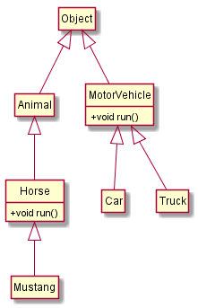

# X++ variables

[!include [banner](../includes/banner.md)]

This topic describes variables in X++.

- A *variable* is an identifier that points to a memory location where information of a specific data type is stored. The size, precision, default value, implicit and explicit [conversion](xpp-conversion-run-time-functions.md) functions, and range depend on the variable's data type.
- The *scope* of a variable defines the area in the code where an item can be accessed.
- *Instance variables* are declared in class declarations, and can be accessed from any methods in the class or from methods that extend the class.
- *Local variables* can be accessed only in the block where they were defined.
- When a variable is declared, memory is allocated, and the variable is initialized to the default value.
- You can assign values to both static fields and instance fields as part of the declaration statement.
- Variables can be declared anywhere in a code block in a method. They don't have to be declared at the beginning of a method.
- *Constants* are variables where the value can't be changed when the variable is declared. They use the **const** or **readonly** keyword.
- Constants differ from *read-only fields* in only one way. Read-only fields can be assigned a value only one time, and that value never changes. The field can be assigned its value either inline, at the place where the field is declared, or in the constructor.

When you declare variables of managed types that aren't authored in X++, you have two options. You can fully qualify the type names in the declaration by including the full namespace, or you can add a **using** statement to your file and then omit the namespace from the type name.

## Variable examples

```xpp
// An example of two valid variable names.
str variableName;
CustInfo custNumber;

// An example of simultaneously declaring and initializing a variable.
real pi = 3.14159265359; // Assigns value of pi to 12 significant digits.

// An example of initializing an object by using the new method on the class.
Access accessObject = new Access(); // Simple call to the new method in the Access class.

// An example of multiple declarations using integers.
int i,j; // Declares 2 integers, i and j.

// An example of multiple declarations using an array.
int a[100,5], b=1; // Declares array with 100 integers with 5 in memory and b as an integer with value 1.

// An example of how variable scopes work.
class ScopeExample
{
    // The variable a is declared within the class.
    int a;

    // Because the method below is declared within the class,
    // it can access all the variables defined within the class.
    void aNewMethod()
    {
        // The variable b is declared within the method.
        // It can only be accessed by this method.
        int b;
    }
}

// An example of an assignment of field members inline.
public class FieldAssignmentExample
{
    int field1 = 1;
    str field2 = "Banana";
    void new()
    {
        // ...
    }
}

class ConstantExample
{
    // An example of a constant being declared at the class level.
    public const str MyContent = 'SomeValue';
    public int ResultSoFar()
    {
        return 1;
    }
}

// The constants can then be referenced by using the double-colon syntax.
str value = ConstantExample::MyContent;
// If you're in the scope of the class where the const is defined,
// you can omit the type name prefix (ConstantExample in this example).

// An example of the using clause where the alias can denote
// namespaces and classes.
using System;
using IONS=System.IO; // Namespace alias.
using Alist=System.Collections.ArrayList; // Class alias.
public class NamespaceExample
{
    public static void Main(Args a)
    {
        Int32 I; // Alternative to System.Int32.
        Alist al; // Using a class alias.
        al = new Alist();
        str s;
        al.Add(1);
        IONS.Path::ChangeExtension(@"c:\tmp\test.xml", ".txt");
    }
}
```

## var

You can declare a variable without explicitly providing the type of the variable, if the compiler can determine the type from the initialization expression. The variable is still strongly-typed into one, unambiguous type.

You can use **var** only on declarations where initialization expressions are provided. (The compiler will infer the type from the initialization expression.) In some cases, this approach can make code easier to read.

You should use **var** to declare local variables in these situations:

- When the type of the variable is obvious from the right side of the assignment
- When the exact type isn't important
- For the declarations of **for** loop counters
- For disposable objects inside **using** statements

Don't use **var** when the type isn't clear from the initialization expression.

## var examples

```xpp
// When the type of a variable is clear from
// the context, use var in the declaration.
var var1 = "This is clearly a string.";
var var2 = 27; // This is an integer (not a real).
var i = System.Convert::ToInt32(3.4);

// Don't use var when the type of the variable is not clear
// from the context. Use an explicit type instead.
int var4 = myObject.ResultSoFar();
```

## Declare anywhere

Declarations can now be provided wherever statements can be provided. A declaration is syntactically a statement, a *declaration statement*.

You can provide declarations immediately before the variable is used, and you don’t have to declare all the variables in one place. Therefore, you have precise control over the scope of your variables.

You can give variables smaller scopes, outside which the variables can’t be referenced. The lifetime of the variable is the scope that it’s declared in. Scopes can be started at the block level (inside compound statements), in **for** statements, and in **using** statements.

There are several advantages to making scopes small:

- Readability is enhanced.
- You reduce the risk that a variable will be reused in an inappropriate manner during long-term maintenance of the code.
- It's easier to refactor code. You can copy in code without having to worry that variables might be reused in contexts where they shouldn’t be reused.

In the following example, we declare the loop counter inside the **for** statement that it's used in.

```xpp
void MyMethod()
{
    for (int i = 0; i < 10; i++)
    {
        info(strfmt("i is %1", i));
    }
}
```

The scope of the variable is the **for** statement itself, and includes the condition expression and the loop update parts. The value can’t be used outside this scope.

In the following example, when the compiler reaches the **info** statement, it will issue the following error message: "'i' isn't declared."

```xpp
void MyMethod()
{
    for (int i = 0; i < 10; i++)
    {
        if (i == 7)
        {
            break;
        }
    }
    // The next statement causes a compiler error.
    info(strfmt("Found: %1", i));
}
```

You can also scope variables to a **using** statement, as shown in the following example.

```xpp
static void AnotherMethod()
{
    str textFromFile;
    using (System.IO.StreamReader sr = new System.IO.StreamReader("c:\\test.txt"))
    {
        textFromFile = sr.ReadToEnd();
    }
}
```

When you use an object that implements **IDisposable**, you should declare and instantiate that object in a **using** statement. The **using** statement calls the **Dispose** method on the object correctly, even if an exception occurs while you're calling methods on the object. You can achieve the same result by putting the object inside a **try** block and then explicitly calling **Dispose** in a **finally** block. In fact, the compiler translates the **using** statement in just this manner.

The following example shows some of the features that we have been describing.

```xpp
// loop variable declared within the loop: It will
// not be misused outside the loop
for(int i = 1; i < 10; i++)
{
    // Because this value is not used from outside the loop,
    // its declaration belongs in this smaller scope.
    str s = int2str(i);
    info(s);
}
```

To prevent confusion, the compiler issues an error message if you try to introduce a variable that will hide another variable in an enclosing scope, or even in the same scope. For example, the following code will cause the compiler to issue the following diagnostic message: "A local variable named 'i' can't be declared in this scope because it would give a different meaning to 'i', which is already used in a parent or current scope to denote something else."

```xpp
{
    int i;
    {
        int i;
    }
}
```

## Constants, read-only variables, and macros

The concept of macros is fully supported. Constants have the following advantages over macros:

- You can add a documentation comment to a constant but not to the value of a macro. Eventually, the language service will pick up this comment and provide useful information to the user.
- A constant is known by IntelliSense.
- A constant is cross-referenced. Therefore, you can find all references for a specific constant but not for a macro.
- A constant is subject to access modifiers. You can use the **private**, **protected**, and **public** modifiers. The accessibility of macros isn't rigorously defined.
- Constant variables have scope, whereas macros don't have scope.
- You can see the value of a constant or a read-only variable in the debugger.

Macros that are defined in class scopes (that is, in class declarations) are effectively available in all methods of all derived classes. This feature was originally a bug in the implementation of the legacy compiler macro, however, many application programmers often take advantage of it now. The X++ compiler still honors this feature, but no new code that uses it should be written. This feature also has a significant effect on the performance of the compiler.

Constants can be declared at the class level, as shown in the following example.

```xpp
private const str MyConstant = 'SomeValue';
```

The constants can then be referenced by using the double colon (::) syntax.

```xpp
str value = MyClass::MyConstant;
```

If you're in the scope of the class where the constant (**const**) is defined, you can omit the type name prefix (**MyClass** in the preceding example). Therefore, you can easily implement the concept of a macro library. The list of macro symbols becomes a class that has public **const** definitions.

You can also define constants as variables only. The compiler will maintain the invariant so that the value can't be modified.

```xpp
{
    const int Blue = 0x0000FF;
    const int Green = 0x00FF00;
    const int Red = 0xFF0000;
}
```

Read-only fields can only be assigned a value once, and that value never changes; the field can be assigned its value either inline, at the place where the field is declared, or in the constructor.

## Null values for data types

The concept of **null** values that is available in many other database management systems (DBMSs) is not supported. A variable in X++ always has a type and a value, however, for each data type, one value is considered **null** (for example, when the **validateField** table method is run).

| Type | Value that is treated as null |
|------|-------------------------------|
| Date        | 1900-01-01                                              |
| Enum        | An element that has its value set to **0**              |
| Integer     | 0                                                       |
| Real        | 0.0                                                     |
| String      | An empty string                                         |
| Time        | 00:00:00                                                |
| Utcdatetime | Any value that has its date portion set to **1900-01-01**, regardless of the value of the time portion. For example, the value **1900-01-01T22:33:44** is treated as **null**. Note that any **utcDateTime** value that has its date portion set to **1900-01-01** is shown as blank by the X++ **print** statement. Only the value **1900-01-01T00:00:00** is shown as blank by the **Global::info** method. That value is the value from the **DateTimeUtil::MinValue** method. |

When the **validateField** method checks whether a user has entered a value in a mandatory field, **0** isn't accepted in an **integer** type field, the first entry isn't accepted in an **enum** type field, and so on. Additionally, in SQL X++ statements, the values that are listed in the previous table yield **false** in a Boolean comparison. However, in non-SQL X++ statements, the equal and relational operators work with these values, just as they work with other values. Variables of the **container** type, and classes and variables of the **table** type can be **null** in the traditional DBMS sense. A **table** type is **null** if all its fields have their **null** value.

## Casting

Casting refers to assignments between variables whose declared types are both in the same inheritance chain. A cast is either a down-cast or an up-cast. Consider the following class hierarchy.



The MotorVehicle class isn't related to the Animal class, though both derive from Object. An **up-cast** happens when assigning an expression of a derived type to a base type:

```xpp
Animal a = new Horse();
```

A **down-cast** happens when assigning an expression of a base type to a derived variable.

```xpp
Horse h = new Animal();
```

Both up-casts and down-casts are supported in X++. However, down-casts are dangerous and should be avoided whenever possible. The down-cast example above fails with an `InvalidCastException` at runtime, since the assignment doesn't make sense. X++ supports late binding on a few types, like `object` and `formrun`. This means that the compiler won't diagnose any errors at compile-time when it sees a method being called on those types, if that method isn't declared explicitly on the type. It's assumed that the developer knows what they're doing. For instance, the following code may be found in a form.

```xpp
Object o = element.args().caller();
    o.MyMethod(3.14, “Banana”);
```

The compiler can't check the parameters or return values for the `MyMethod` method, since this method isn't declared on the object class. At runtime, the call will be made using reflection, which is much slower than calls that don't require reflection. Calls to methods that are defined on the late-binding types will be checked. For example, the call to `ToString` in the following example:

```xpp
o.ToString(45);
```

will cause a compilation error:

```xpp
'Object.toString' expects 0 argument(s), but 1 specified.
```

because the `ToString` method is defined on the `object` class. There's one difference from the implementation in previous versions of X++ (AX2012 and earlier) related to the fact that methods could be called on unrelated objects, as long as the name of the method was correct, even if the parameter profiles weren't entirely correct. This is no longer supported.

### Example - casting

```xpp
public class MyClass2
{
    public static void Main(Args a)
    {
        Object obj = new Car();
        Horse horse = obj; // exception now thrown
        horse.run();    // Used to call car.run()!
    }
}
```

You should use the `is` and `as` operators liberally in your code. The `is` operator can be used if the expression provided is of a particular type (including derived types). The `as` operator will perform casting into the given type and return null if a cast isn't possible.

[!INCLUDE[footer-include](../../../includes/footer-banner.md)]
