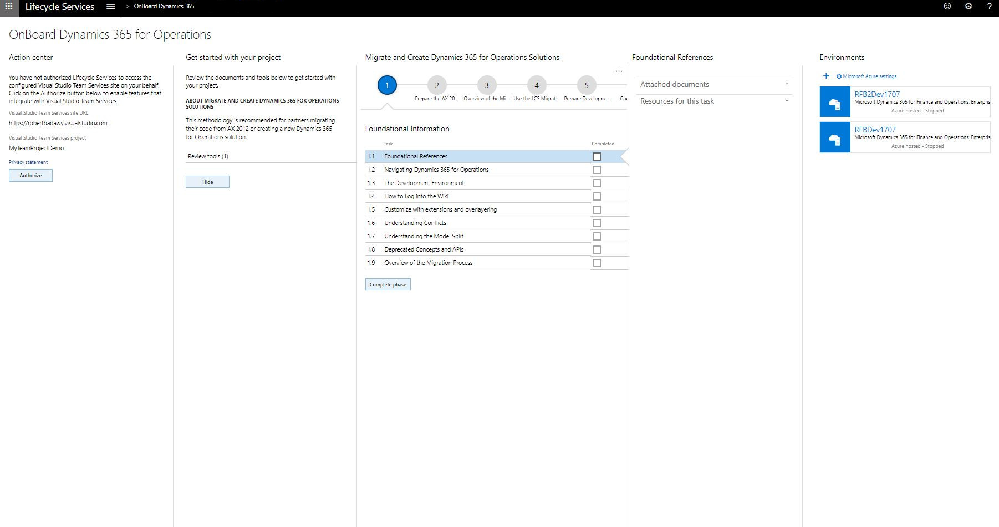
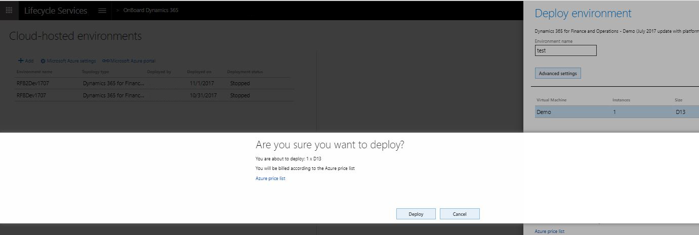
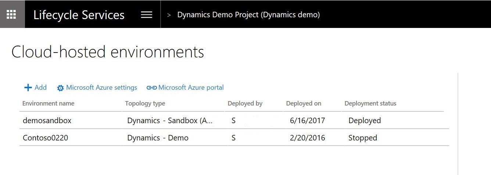
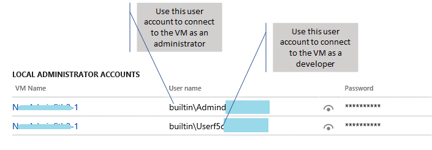

# Deploy and access development environments

[!include [banner](../includes/banner.md)]

This article describes how to access development instances, configure local development virtual machines (VMs), and find important configurations settings for developers and administrators.

> [!NOTE]
> - Microsoft Support may provide limited troubleshooting on Tier 1 development environments.
> - In certain circumstances, a fresh deploy of a Tier 1 environment may be requested by Microsoft Support to resolve an issue.
> - Development environments shouldn't contain business critical data and are considered disposable.
> - Only 120 environments are support per tenant. We recommend that you limit the number of cloud-hosted environments under a specific tenant to allow enough capacity to be able to deploy sandbox and production environments.
 

## Definitions

| Term      | Definition                             |
|-----------|----------------------------------------|
| End user  | A user who accesses an instance through the web client. The end user must have Microsoft Azure Active Directory (Azure AD) credentials to access an instance and must be provisioned/added as a user of that instance. |
| Developer | A user who will develop code through the Microsoft Visual Studio environment. A developer requires Remote Desktop access to development environment (VM). The developer account must be an administrator on the VM. |


## Deploy cloud development environments

To deploy a cloud development environment in your Lifecycle Services (LCS) project:

1. Create a connection between an LCS project and your Azure subscription. You'll need your Azure subscription ID and authorize the use of the subscription.
2. Select **+** under **Environments** to deploy.

    

3. Select an application and platform version.
4. Select an environment topology. For more information, see [Sign up for preview subscriptions](sign-up-preview-subscription.md).
5. If you chose a cloud-hosted environment, select which Azure connector you want to use. Then select **Deploy**.

    



## Cloud environment that is provisioned through LCS

When a cloud environment is provisioned through LCS:
+ The user who requests the cloud environment is provisioned as the administrator in that environment.
+ User accounts are provisioned on the development VM to allow access to the environment using Remote Desktop, these credentials are accessible on the environment page in LCS.

### Access an instance through a URL

The system can be accessed by end users. The administrator can add users to this system by using the **Users** page in the instance. These additional users don't have to be users in LCS. You obtain the base URL for the cloud environment from your LCS project site.

1. Go to your LCS project navigation menu, and select **Cloud-hosted environments**.
2. In the environment list section, select the deployed environment.
3. When the environment page opens, you can access the application by clicking **Login** &gt; **Log on to finance and operations** in the upper-right corner.
4. Use valid end user credentials to sign in to the application. If the current LCS user is the user who originally deployed the environment, that user is probably a valid end user and the administrator of the application.
5. In your browser, make a note of the base URL after you sign in. For example, the base URL might be `https://dynamicsAx7aosContoso.cloud.dynamics.com`.

### Access the cloud instance through Remote Desktop

Cloud environments can be accessed both as an end user and as a developer. The developer gets access to the system through Remote Desktop credentials. The Remote Desktop credentials are obtained from the environment page on the LCS project site (see the illustration earlier in this article).



For environments deployed **before Platform update 12**:
1. Click the VM name.
2. Use the local administrator user name and password that are shown to connect to the cloud VM through Remote Desktop. You can reveal the password by selecting the show password icon.

For any environments deployed **on or after Platform update 12**, there are distinct accounts, a developer account and an admin account. 

After you sign in to the environment through Remote Desktop, if you want to access the local application from the browser, use the same base URL that you use to access the application from a remote computer. The previous section explains how to obtain this base URL from LCS.

### Delete cloud-hosted developer environments

When you're done with the developer environment, or in some cases where troubleshooting an infrastructure issue is too time consuming, you can always delete the environment from LCS and create a new one later.  To delete a cloud-hosted environment from LCS, use the following steps:

1. Go to your LCS project navigation menu, and select **Cloud-hosted environments**.
2. Highlight the environment that you want to remove and select **Deallocate**, which will power down the machine in your Azure subscription.
3. After the deallocation is successful, the environment will be in a *Deallocated* state.  You may now use the **Delete** button to start the deletion process.

You can't delete a cloud-hosted environment if the virtual network (VNET) that was created with it is also being used by other cloud-hosted environments. This scenario isn't common, but in some cases customers want all their developer environments to reuse an existing VNET so that they can share files more easily between them. If you have implemented this scenario, you must delete the other environments before you delete the base environment that created the original VNET.

If the delete operation fails, check to see if one of the following issues may have occurred:

- The Azure connector management certificate has expired.
- The Azure subscription has been moved to a different tenant than where it was originally.
- The Azure subscription has been disabled.
- There are Azure policies in your subscription that prevent you from deleting one or more resources in your environment's resource group.

If LCS wasn't able to successfully complete the delete operation, the operation will be marked as *Incomplete*. Use the **Delete LCS metadata** button to clean up this environment's metadata from the LCS backend systems. 

> [!NOTE]
> This operation will not try to delete the resources in the Azure subscription. It is the customer's responsibility to manually remove the environment's resource group if it still exists. 

You can easily identify the environment’s resource group in the Azure subscription, as it will have the same name as the environment in LCS.

## VM that is running locally

A virtual hard disk (VHD) is made available for download from LCS, so that you can set it up on a local machine. This system is intended to be accessed by a developer and is a preconfigured one-box development environment of finance and operations apps. The VHD is available in the Shared Asset library of LCS under the asset type **Downloadable VHD**.

1. Go to the LCS main page and select **Shared asset library** or go to [Shared Asset Library](https://lcs.dynamics.com/V2/SharedAssetLibrary).
2. Select the asset type **Downloadable VHD**.
3. Find the VHD you're looking for based on the desired finance and operations version. The VHD is divided into multiple file parts that you need to download. For example, the asset files that start with "VHD - 10.0.5" are the different files you need in order to install version 10.0.5.
4. Download all files (parts) associated with the desired VHD to a local folder.
5. After the download is complete, run the executable file that you downloaded, accept the software license agreement, and choose a file path to extract the VHD to. These steps create a local VHD file that you can use to run a local virtual machine.

### Configure the VHD for Commerce

Follow the steps in this section if you're also configuring for Commerce.

To use the downloadable VHD for POS customizations, you must also follow this step.

- On the host computer, enable Nested VM support. For more information, see [Run Hyper-V in a Virtual Machine with Nested Virtualization](/virtualization/hyper-v-on-windows/user-guide/nested-virtualization).

### Running the virtual machine locally

Follow these steps to run the VM from Hyper-V Manager.

1. To start the VM, select **Start**.
2. To open the VM in a window, select **Connect**.
3. Select the **Ctrl+Alt+Delete** button on the toolbar. The VM receives most keyboard commands, but Ctrl+Alt+Delete isn't one of them. Therefore, you must use the button or a menu command.
4. Sign in to the VM by using the following credentials:

    - User name: **Administrator**
    - Password: <strong>pass@word1</strong>

    > [!TIP]
    > You can resize the VM window by changing the screen resolution. Right-click the desktop on the VM, and then click **Screen resolution**. Select a resolution that works well for your display.

5. Provision the administrator user. For more information, see the next section.
6. Start the Batch Manager Service. This step is required if you're running batch jobs or workflows.

    1. Open a **Command Prompt** window as an administrator.
    2. Type **net start DynamicsAxBatch**, and then press Enter.

   You can also start the service from the **Services** window.

7. [Apply updates](../migration-upgrade/upgrade-latest-platform-update.md#apply-a-platform-update-to-environments-that-are-not-connected-to-lcs) as needed.

#### Commerce configuration

For POS customizations, you must also follow these steps on the guest VM.

1. Download and install [Microsoft Emulator for Windows 10 Mobile Anniversary Update](https://www.microsoft.com/download/details.aspx?id=53424).
2. Start the Hyper-V host service. For more information, see [Hyper-V: The Hyper-V Virtual Machine Management service must be running](/previous-versions/windows/it-pro/windows-server-2008-R2-and-2008/ee956894(v=ws.10)). If errors occur during startup, you can also try to uninstall and reinstall the Hyper-V role on the guest VM.

### Provision the administrator user

For developer access, you must be an administrator on the instance. For environments that are provisioned through LCS, we encourage you to deploy with the correct user. For more information, see [Frequently asked questions](access-instances.md#frequently-asked-questions). To provision your own credentials as an administrator on a local VM, run the Admin user provisioning tool. On the local VM, a link is provided on the desktop.

1. Run the admin user provisioning tool as an administrator (right-click the icon, and then click **Run as administrator**).
2. Enter your email address, and then select **Submit**.

> [!NOTE]
> The Admin user provisioning tool isn't supported in environments that are provisioned through LCS. It should be used only on local VMs.

> [!NOTE]
> For local VMs that use the virtual hard drive (VHD) that was released for versions 10.0.24 and later, the instructions in [Set up the downloadable VHD for first use](vhd-setup.md) should be used instead.

### Commerce configuration

Follow the steps in this section if you're also configuring for Commerce.

### Base URL of the local application

After the user is provisioned as an administrator, that user can access the instance on the computer by navigating to the following base URL: `https://usnconeboxax1aos.cloud.onebox.dynamics.com`. If you're using version control and plan to connect multiple development VMs to the same Azure DevOps project, rename your local VM. For instructions, see [Rename a local development (VHD) environment](../migration-upgrade/vso-machine-renaming.md).

#### Commerce configuration

The URL of the POS app is `https://usnconeboxax1pos.cloud.onebox.dynamics.com/`. 

The URL of the Cloud POS app is `https://usnconeboxax1pos.cloud.onebox.dynamics.com`. After you complete the configuration steps, this VM is provisioned with your Azure AD tenant. Your Azure AD admin account is mapped to a cashier worker account in demo data. You can use this cashier account to easily activate a POS device in this environment.

- Cashier user ID: **000160**
- Cashier password: **123**
- Cashier LE: **USRT**
- Cashier store: **Houston**

## Location of packages, source code, and other AOS configurations

On a VM, you can find most of the application configuration by opening the web.config file of AOSWebApplication.

1. Start IIS.
2. Go to **Sites** &gt; **AOSWebApplication**.
3. Right-click, and then click **Explore** to open File Explorer.
4. Open the web.config file in Notepad or another text editor. The following keys are of interest to many developers and administrators:

    - **Aos.MetadataDirectory** – This key points to the location of the packages folder that contains platform and application binaries, and also source code. (Source code is available only in development environments.) Typical values are: c:\packages, c:\AosServicePackagesLocalDirectory, and J:AosServicePackagesLocalDirectory.
    - **DataAccess.Database** – This key holds the name of the database.
    - **Aos.AppRoot** – This key points to the root folder of the Application Object Server (AOS) web application.

### Commerce configuration

The software development kit (SDK) is available at C:\RetailSDK. For more information about how to use and customize applications, see the following topics:
- [Retail software development kit (SDK) architecture](../../../commerce/dev-itpro/retail-sdk/retail-sdk-overview.md)
- [Point of sale (POS) device activation](../../../commerce/dev-itpro/retail-device-activation.md)

#### Remove preexisting encrypted data from headquarters

If while configuring the shared hardware station on a VHD image you see the following "NoCertificateFoundException" error in the Event Viewer, the Commerce configuration for the VHD environment may require the manual removal of the merchant properties from the deployed environment. 

`No certificate found for id <id value presented>...`

In AOS of your VHD environment, if preloaded values are set in the **SECUREMERCHANTPROPERTIES** or **CONNECTIONSTRING** attributes, those values should be cleared from the following tables:

```SQL
SELECT SECUREMERCHANTPROPERTIES FROM dbo.RETAILHARDWAREPROFILE -- hardware profile form
```
 
```SQL
SELECT SECUREMERCHANTPROPERTIES FROM dbo.RETAILCHANNELPAYMENTCONNECTORLINE -- online stores form
```

```SQL 
SELECT SECUREMERCHANTPROPERTIES FROM dbo.CREDITCARDACCOUNTSETUP -- payment service form 
```

```SQL 
SELECT CONNECTIONSTRING FROM dbo.RETAILCONNDATABASEPROFILE -- payment service connection string for CDX
```
 
If preloaded values are found, set the attribute values to empty with scripts similar to the following examples.

> [!WARNING]
> The example UPDATE scripts provided below are illustrative for newly provisioned environments experiencing the certificate issue described above. You should only update values for the intended table or rows to avoid disruptive or destructive data updates. Additional selectors may be required if updating specific rows for the tables being updated.

```SQL
UPDATE dbo.RETAILHARDWAREPROFILE SET SECUREMERCHANTPROPERTIES=";)
```

```SQL
UPDATE dbo.RETAILCHANNELPAYMENTCONNECTORLINE SET SECUREMERCHANTPROPERTIES=";)
```

```SQL
UPDATE dbo.CREDITCARDACCOUNTSETUP SET SECUREMERCHANTPROPERTIES=";)
```

```SQL
UPDATE dbo.RETAILCONNDATABASEPROFILE SET CONNECTIONSTRING=";
```

Once cleared, use the forms in headquarters to set up your payment gateway merchant details in the hardware profile, online store channel, or the payments service forms appropriate for the environment. For the setup instructions required for your payment options, see the appropriate article:
 - [Set up Dynamics 365 Payment Connector for Adyen](../../../commerce/dev-itpro/adyen-connector-setup.md)
 - [Dynamics 365 Payment Connector for PayPal](../../../commerce/paypal.md)

## Redeploy or restart the runtime on the VM
 
To restart the local runtime and redeploy all the packages, follow these steps.

1. Open File Explorer, and go to C:\CustomerServiceUnit.
2. Right-click **AOSDeploy.cmd**, and then click **Run as administrator**.

This process might take a while. The process is completed when the cmd.exe window closes. If you just want to restart AOS (without redeploying the runtime), run **iisreset** from an administrator **Command Prompt** window, or restart AOSWebApplication from IIS.

## Frequently asked questions

### Can we join cloud-hosted environments to our Azure AD domain as it is currently deployed in a workgroup?
These environments are self-contained and haven't been tested, nor are they supported when joined to an Azure AD domain when deployed via Azure.  

### Is there a way to hide the local account passwords in LCS?
This is only possible if you lower a user's security role in the project to *Project team member* role, and it isn't possible to hide the local account passwords for the *Environment manager*, or *Project owner* roles.

### Are cloud-hosted environments supported with Azure Bastion?
These environments haven't been tested, nor are they supported with Azure Bastion.  

### Environment is in a failed state with the error message, "Updated AAD Tenant is missing reply URL configuration". How do I resolve this issue?
This message indicates that a Tier 1/customer-managed environment is configured with an Azure AD tenant different from the one used at the time of deployment. There are different options available to help resolve this issue:
1. (Recommended) Delete the environment and redeploy with the tenant in which the environment will be used. 
2. Revert the settings to the tenant configuration used at the time of deployment.
3. Follow the instructions in [How can I fix my existing environment when my environment is in a failed state or if I am getting sign-in errors?](access-instances.md#how-can-i-fix-my-existing-environment-when-my-environment-is-in-a-failed-state-or-i-am-getting-sign-in-errors) to update the reply URL in the target tenant.  

### As a partner/ISV, how can I facilitate cloud-hosted deployments for customers that I work with?
A Tier 1/customer-managed environment should be deployed under the customer's Azure AD tenant, to ensure that all the configuration and integrations are correctly provisioned for any given environment. The tenant and environment association is determined based on the user who deployed the environment.

To facilitate cloud-hosted deployments, we recommend that partners follow this step to create customer-specific, cloud-hosted environments. In this way, they'll ensure that the deployment is registered under the correct tenant.

- Deploy the environment via a user from the tenant that the environment will be used with. The Admin user provisioning tool shouldn't be used to change the tenant for a Tier 1/customer-managed/cloud-hosted environment.

> [!NOTE]
> The Azure AD tenant that is associated with the Azure subscription doesn't play any role in environment configuration. The Azure subscription and the corresponding connector configuration are used only to deploy Azure resources.

### I have run the Admin user provisioning tool on my development environment, and now I receive the following sign-in error: "Error: AADSTS50011: The reply URL specified in the request doesn't match the reply URLs configured for the application."
As was stated earlier, it's important that finance and operations environments be deployed under the correct Azure AD tenant. For Tier 1/customer-managed environments that are deployed via LCS, changes to the Azure AD tenant settings aren't supported after deployment.

### How can I fix my existing environment when my environment is in a failed state or I am getting sign-in errors?

If you have environments where the Admin user provisioning tool was previously used to update the tenant settings, we recommend that you delete those environments and then redeploy them under the correct Azure AD tenant.

If an existing environment can't be deleted and redeployed, its URL must be added to the configured Azure AD tenant. The following commands can be run by the tenant admin. 

> [!Note]
> Since these URLs are being added manually, the clean-up of these URLs will also have to be done manually when the environment is deleted.

1. If not already on your machine you will need to install the Microsoft.Graph Powershell module.

    ```powershell
    Install-Module Microsoft.Graph
    ```

2. Retrieve the following values from the web.config file.

    ```powershell
    $AADTenant = <Value of Aad.TenantDomainGUID from web.config>
    $EnvironmentUrl = <Value of Infrastructure.HostUrl from web.config>

    # For example, if value is spn:fd663e81-110e-4c18-8995-ddf534bcf5e1 then take only fd663e81-110e-4c18-8995-ddf534bcf5e1
    $AADRealm = <Value of Aad.Realm from web.config without spn: prefix. >
    ```

3. Run the following commands **via the tenant admin account for the Azure AD tenant in the web.config file**.

    ```powershell
    # Using tenant admin account under this tenant login via Microsoft Graph PowerShell cmdlet.
    Connect-MgGraph -TenantId $AADTenant -Scopes "Application.ReadWrite.All"

    # Get Service Principal details
    $SP = Get-MgServicePrincipal -Filter "AppId eq '$AADRealm'"
    
    # Add Reply URLs
    [System.Collections.ArrayList]$ReplyUrls = $SP.ReplyUrls
    $ReplyUrls.Add("$EnvironmentUrl")
    $ReplyUrls.Add("$EnvironmentUrl/oauth")

    #Set/Update Reply URL
    Update-MgServicePrincipal -ServicePrincipalId $SP.Id -ReplyUrls $ReplyUrls
    
    # Log out
    Disconnect-MgGraph
    ```

### I've fixed my environment, but it's still in a failed state. How do I resolve this issue?
Restart your environment from LCS by first performing **Stop** and then **Start** operations against your environment. If the environment configuration is found to be correct, then the environment URL will be restored automatically **within 2 hours** of the **Start** operation.

### While running the Admin user provisioning tool on my local development environment, I get the error "The value's length for key 'password' exceeds its limit of '128'."
If you're using the virtual hard drive (VHD) that was released for versions 10.0.24 and later, the Generate Self-Signed Certificates tool needs to be run before the Admin user provisioning tool. For more information, see [Set up the downloadable VHD for first use](vhd-setup.md).

[!INCLUDE[footer-include](../../../includes/footer-banner.md)]

