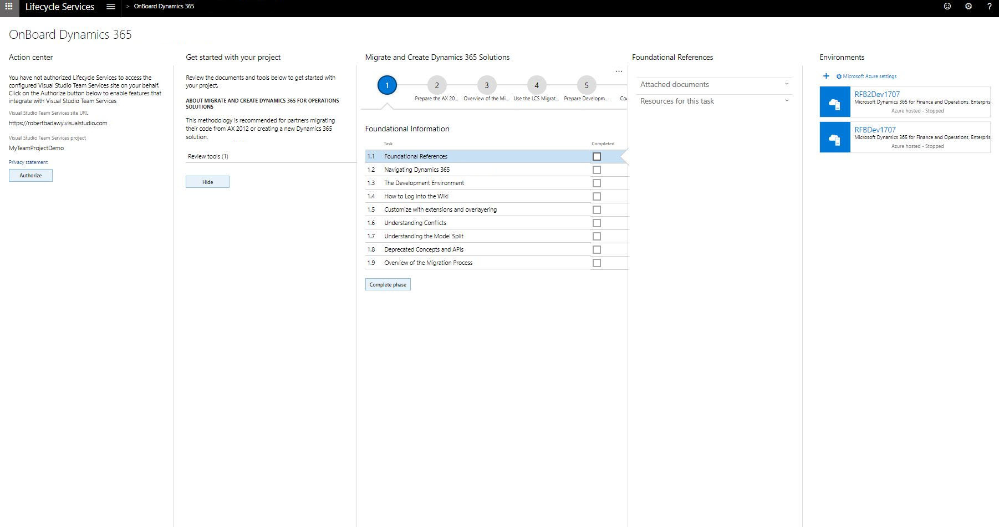
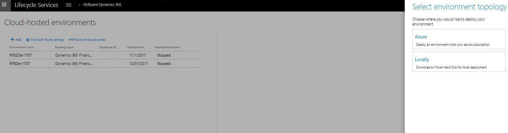

---
# required metadata

title: Deploy and access development environments
description: This topic describes how to access development instances, configure on-premises development VMs, and find important configuration settings for developers and administrators.
author: jorisdg
manager: AnnBe
ms.date: 02/05/2020
ms.topic: article
ms.prod: 
ms.service: dynamics-ax-platform
ms.technology: 

# optional metadata

# ms.search.form: 
# ROBOTS: 
audience: Developer
# ms.devlang: 
ms.reviewer: rhaertle
ms.search.scope: Operations
# ms.tgt_pltfrm: 
ms.custom: 10031
ms.assetid: 4be8b7a1-9632-4368-af41-6811cd100a37
ms.search.region: Global
# ms.search.industry: 
ms.author: jorisde
ms.search.validFrom: 2016-02-28
ms.dyn365.ops.version: AX 7.0.0

---

# Deploy and access development environments

[!include [banner](../includes/banner.md)]

This topic describes how to access development instances, configure on-premises development virtual machines (VMs), and find important configurations settings for developers and administrators.

## Definitions

| Term      | Definition                             |
|-----------|----------------------------------------|
| End user  | A user who accesses an instance through the web client. The end user must have Microsoft Azure Active Directory (Azure AD) credentials to access an instance and must be provisioned/added as a user of that instance. |
| Developer | A user who will develop code through the Microsoft Visual Studio environment. A developer requires Remote Desktop access to development environment (VM). The developer account must be an administrator on the VM.      |


## Deploying cloud development environments

The process of deploying cloud hosted environments differs for Lifecycle Services (LCS) trial or partner projects and LCS customer implementation projects.

For a **Trial** or **Partner** project:

1. Create a connection between an LCS project and your Azure subscription. You will need your Azure subscription ID and authorize the use of the subscription.
2. Select **+** under **Environments** to deploy.

    
    
3. Select an application and platform version.
4. Select an environment topology. You can choose to either use a cloud hosted environment or download a VHD. For more information, see [Sign up for preview subscriptions](sign-up-preview-subscription.md).

    
    
5. If you chose a cloud-hosted environment, select which Azure connector you want to use. Then select **Deploy**.

    
    
6. If you did not choose a cloud-hosted environment, select a VHD to download.

For a **Customer Implementation** project:
1. Sign in to your LCS Implementation project.
2. Select **Configure** to deploy.

    
    
3. Select an application and platform version.
4. Specify the settings and select **Save**.

    

Customers are provided with one free "develop and test" environment hosted in Microsoft's Azure subscription. Under "Develop and test", there are two types of environments, **Develop** and **Build and Test**. For development and customization activities, configure a **Develop** environment. **Build and Test** environments are not supported for standard development activities. Instead, they are used for daily build and test automation. For more information, see [Deploy and use an environment that supports continuous build and test automation](../perf-test/continuous-build-test-automation.md).  

Additional develop and build environments can either be purchased or hosted in your own Azure subscription. To deploy an environment in your own subscription, go to the **Cloud-hosted environment** page.


## Cloud environment that is provisioned through LCS

When a cloud environment is provisioned through LCS:
+ The user who requests the cloud environment is provisioned as the administrator in that environment.
+ User accounts are provisioned on the development VM to allow access to the environment using Remote Desktop, these credentials are accessible on the environment page in LCS.

### Accessing an instance through a URL

The system can be accessed by end users. The administrator can add users to this system by using the **Users** page in the instance. Note that these additional users don't have to be users in LCS. You obtain the base URL for the cloud environment from your LCS project site.

1. Go to your LCS project page.
2. In the **Environments** section, click the deployed environment.
3. When the environment page opens, you can access the application by clicking **Login** &gt; **Log on to Finance and Operations** in the upper-right corner.
4. Use valid end user credentials to sign in to the application. If the current LCS user is the user who originally deployed the environment, that user is probably a valid end user and the administrator of the application.
5. In your browser, make a note of the base URL after you sign in. For example, the base URL might be `https://dynamicsAx7aosContoso.cloud.dynamics.com`.

### Accessing the cloud instance through Remote Desktop

Cloud environments can be accessed both as an end user and as a developer. The developer gets access to the system through Remote Desktop credentials. The Remote Desktop credentials are obtained from the environment page on the LCS project site (see the illustration earlier in this topic).


For environments deployed **before Platform update 12**:
1.  Click the VM name.
2.  Use the local administrator user name and password that are shown to connect to the cloud VM through Remote Desktop. You can reveal the password by selecting the show password icon.

For any environments deployed **on or after Platform update 12** , there are distinct accounts, a developer account and an admin account. Customers will not have access to virtual machine admin accounts on development or build environments that are running in Microsoft subscriptions. Thus, the admin account will be hidden unless the environment is running in their Azure subscription. For more information, see [Development and build VMs that don't allow admin access FAQ](../sysadmin/VMs-no-admin-access.md). 

After you sign in to the environment through Remote Desktop, if you want to access the local application from the browser, use the same base URL that you use to access the application from a remote computer. The previous section explains how to obtain this base URL from LCS.

## VM that is running on-premises
A virtual hard disk (VHD) is made available for download from LCS, so that you can set it up on a local machine. This system is intended to be accessed by a developer and is a pre-configured one-box development environment of Finance and Operations apps. The VHD is available in the Shared Asset library of LCS under the asset type **Downloadable VHD**.

1. Go to the LCS main page and select **Shared asset library** or go to [Shared Asset Library](https://lcs.dynamics.com/V2/SharedAssetLibrary).
2. Select the asset type **Downloadable VHD**.
3. Find the VHD you are looking for based on the desired Finance and Operation version. The VHD is divided into multiple file parts that you need to download. For example, the asset files that start with "VHD - 10.0.5" are the different files you need in order to install version 10.0.5.
4. Download all files (parts) associated with the desired VHD to a local folder.
5. After the download is complete, run the executable file that you downloaded, accept the software license agreement, and choose a file path to extract the VHD to.
6. This creates a local VHD file that you can use to run a local virtual machine.

### Commerce configuration

Follow the steps in this section if you are also configuring for Commerce.

To use the downloadable VHD for POS customizations, you must also follow this step.

-   On the host computer, enable Nested VM support. For more information, see [Run Hyper-V in a Virtual Machine with Nested Virtualization](https://msdn.microsoft.com/virtualization/hyperv_on_windows/user_guide/nesting).

### Running the virtual machine locally

Follow these steps to run the VM from Hyper-V Manager.

1. To start the VM, select **Start**.
2. To open the VM in a window, select **Connect**.
3. Select the **Ctrl+Alt+Delete** button on the toolbar. The VM receives most keyboard commands, but Ctrl+Alt+Delete isn't one of them. Therefore, you must use the button or a menu command.
4. Sign in to the VM by using the following credentials:
   - User name: **Administrator**
   - Password: <strong>pass@word1</strong>

    > [!TIP]
    > You can resize the VM window by changing the screen resolution. Right-click the desktop on the VM, and then click **Screen resolution**. Select a resolution that works well for your display.
   
5. Provision the administrator user. For more information, see the next section.
6. Start the Batch Manager Service. This step is required if you're running batch jobs or workflows.
   1.  Open a **Command Prompt** window as an administrator.
   2.  Type **net start DynamicsAxBatch**, and then press Enter.

   You can also start the service from the **Services** window.

#### Commerce configuration

For POS customizations, you must also follow these steps on the guest VM.

1.  Download and install [Microsoft Emulator for Windows 10 Mobile Anniversary Update](https://www.microsoft.com/download/details.aspx?id=53424).
2.  Start the Hyper-V host service. For more information, see [Hyper-V: The Hyper-V Virtual Machine Management service must be running](https://technet.microsoft.com/library/ee956894(v=ws.10).aspx). If errors occur during startup, you can also try to uninstall and reinstall the Hyper-V role on the guest VM.

### Provisioning the administrator user

For developer access, you must be an administrator on the instance. To provision your own credentials as an administrator, run the admin user provisioning tool that is provided on the desktop, and provide your email address (Azure AD credentials) in the tool.

1.  From the desktop, run the admin user provisioning tool as an administrator (right-click the icon, and then click **Run as administrator**).
2.  Enter your email address, and then select **Submit**.

### Commerce configuration

Follow the steps in this section if you are also configuring for Commerce.

#### For Dynamics 365 for Operations, Version 1611

1.  Run the RetailTenantUpdateTool.
    -   The icon for this tool is available on the desktop.
    -   This tool is also available at the following location: C:\windows\System32\WindowsPowerShell\v1.0\PowerShell.exe -File C:\RetailSDK\Tools\RetailTenantUpdateTool.ps1

2.  Double-click the icon to start this tool. You will be prompted for your Azure AD credentials. You must use the same credentials that you used in the admin user provisioning tool earlier.

#### For Dynamics 365 for Operations 7.0

1.  Install [Microsoft Online Services Sign-In Assistant for IT Professionals RTW](https://go.microsoft.com/fwlink/?LinkID=286152).
2.  Install [Azure Active Directory Module for Windows PowerShell (64-bit version)](https://go.microsoft.com/fwlink/p/?linkid=236297).
3.  Query Azure AD for your tenant and user ID. Open a Windows PowerShell Integrated Scripting Environment (ISE) window with administrative privileges, and run the following command. You will be prompted for Azure AD credentials. Use the same user account that you used in the admin user provisioning tool earlier.

    ```powershell
    $msocred = Get-Credential 
    Connect-MsolService -Credential $msocred 
    $company = Get-MsolCompanyInformation 
    Write-Host "TenantID: $($company.ObjectId)" 
    $msocred.UserName 
    $users = Get-MsolUser -SearchString "$($msocred.username)" 
    foreach($u in $users) 
    { 
        if($u.SignInName -eq $msocred.UserName) 
        { 
            Write-Host "SignInName:$($u.SignInName) UserId: $($u.ObjectId)" 
        } 
    }
    ```
        
    [](./media/retailconfig02.png)

4.  Update the following SQL script, and run it in on AXDB for that environment. Supply values for the following parameters from the preceding Windows PowerShell script output:

    -   **TenantID** – For example, c83429a6-782b-4275-85cf-60ebe81250ee
    -   **UserId** – For example, a036b5d8-bc8c-4abe-8eec-17516ea913ec

    <!-- -->
    ```sql
    DECLARE @TenantId NVARCHAR(1024)         DECLARE @UserId NVARCHAR(1024) 
    SET @TenantId = ‘‘ 
    SET @UserId = ‘‘ 
    IF(LEN(@TenantId) > 0 AND LEN(@UserId) > 0) 
        BEGIN 
        UPDATE AxDBRAIN.dbo.SYSSERVICECONFIGURATIONSETTING SET [VALUE] = @TenantId WHERE [NAME] = ‘TENANTID’ 
        UPDATE RetailHoustonStore.ax.SYSSERVICECONFIGURATIONSETTING SET [VALUE] = @TenantId WHERE [NAME] = ‘TENANTID’ 
        UPDATE AxDBRAIN.dbo.RETAILSTAFFTABLE SET EXTERNALIDENTITYID = @TenantId, EXTERNALIDENTITYSUBID = @UserId WHERE STAFFID = ‘000160’
        END 
    ELSE 
        BEGIN 
        RAISERROR (15600, -1, -1, ‘TenantId and UserId must be set before running this script’) 
        END
    ```

5.  Reset Internet Information Services (IIS) by running **IISRESET** in an elevated **Command Prompt** window.
6.  Update the Real-time service profile to use the new admin user.
    1.  Go to **Retail and Commerce** &gt; **Headquarters setup** &gt; **Commerce scheduler** &gt; **Real-time service profiles**.
    3.  Edit the JBB record so that it uses the user that you used earlier (for example, `administrator@contosoax7.onmicrosoft.com`).
    4.  Run CDX Job 1070 (Staff) for the default channel database.
    5.  Verify that the job succeeded by viewing the **Download Sessions** page on the client.

### Base URL of the local application

After the user is provisioned as an administrator, that user can access the instance on the computer by navigating to the following base URL: `https://usnconeboxax1aos.cloud.onebox.dynamics.com`. If you're using version control and plan to connect multiple development VMs to the same Azure DevOps project, rename your local VM. For instructions, see [Rename a local development (VHD) environment](../migration-upgrade/vso-machine-renaming.md).

#### Commerce configuration

The URL of the POS app is `https://usnconeboxax1pos.cloud.onebox.dynamics.com/`. 

The URL of the Cloud POS app is `https://usnconeboxax1pos.cloud.onebox.dynamics.com`. After you complete the configuration steps, this VM is provisioned with your Azure AD tenant. Your Azure AD admin account is mapped to a cashier worker account in demo data. You can use this cashier account to easily activate a POS device in this environment.

-   Cashier user ID: **000160**
-   Cashier password: **123**
-   Cashier LE: **USRT**
-   Cashier store: **Houston**

## Location of packages, source code, and other AOS configurations
On a VM, you can find most of the application configuration by opening the web.config file of AOSWebApplication.

1.  Start IIS.
2.  Go to **Sites** &gt; **AOSWebApplication**.
3.  Right-click, and then click **Explore** to open File Explorer.
4.  Open the web.config file in Notepad or another text editor. The following keys are of interest to many developers and administrators:
    -   **Aos.MetadataDirectory** – This key points to the location of the packages folder that contains platform and application binaries, and also source code. (Source code is available only in development environments.) Typical values are: c:\packages, c:\AosServicePackagesLocalDirectory, and J:AosServicePackagesLocalDirectory.
    -   **DataAccess.Database** – This key holds the name of the database.
    -   **Aos.AppRoot** – This key points to the root folder of the Application Object Server (AOS) web application.

### Commerce configuration

The software development kit (SDK) is available at C:\RetailSDK. For more information about how to use and customize applications, see the following topics:
-   [Retail software development kit (SDK) architecture](../../../retail/dev-itpro/retail-sdk/retail-sdk-overview.md)
-   [Point of sale (POS) device activation](../../../retail/dev-itpro/retail-device-activation.md)

## Redeploying or restarting the runtime on the VM
To restart the local runtime and redeploy all the packages, follow these steps.

1.  Open File Explorer, and go to C:\CustomerServiceUnit.
2.  Right-click **AOSDeploy.cmd**, and then click **Run as administrator**.

This process might take a while. The process is completed when the cmd.exe window closes. If you just want to restart AOS (without redeploying the runtime), run **iisreset** from an administrator **Command Prompt** window, or restart AOSWebApplication from IIS.

