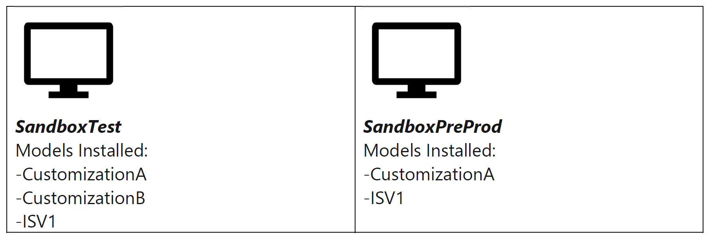

# All-in-one deployable packages

Customers can update the software in their environments by applying software deployable packages. These packages can originate from the customers themselves in the form of customizations. They can also be provided by partners and independent software vendors (ISVs). Microsoft recommends that customers combine all these various packages into a single package before they apply them to an environment. For customers who have self-service environments, this approach is a hard requirement.

This article outlines the best practices for creating and managing an all-in-one deployable package.

> [!IMPORTANT]
> - The enforcement of all-in-one packages will be done in phases. Requests to extend the support for deployable packages that are **not** all-in-one deployable packages ended on October 31, 2020.
> - If a payment connector is currently deployed in your environment, you will have to [create a payment connector package](../../../commerce/dev-itpro/payment-connector-package.md) and include it in the all-in-one deployable package.
> - If you currently use Microsoft Dynamics 365 Commerce functionality for the retail point of sale, you will also have to [synchronize self-service installers](../../../commerce/dev-itpro/Synchronize-installers.md).  For Commerce Scale Unit, please see [Deploy the package to CSU](../../../commerce/dev-itpro/retail-sdk/retail-sdk-packaging.md#deploy-the-package-to-csu).

## What is an all-in-one deployable package?

An all-in-one deployable is a software deployable package that contains all the models and binaries that you currently have in an environment. Think of it as a single package that represents all the non-Microsoft software in an environment.

For example, you have two environments: **SandboxTest** and **SandboxPreProd**.

If your software deployable package contains CustomizationA, CustomizationB, and ISV1, it's a fully deployable package for the SandboxTest environment. This is because it exactly matches the model list. It's also a fully deployable package for the SandboxPreProd environment because it has all the models that are installed, plus CustomizationB.

However, if your software deployable package contains only CustomizationA, it isn't fully deployable for either environment. The package is missing some of the models that are already installed.

## How do I create an all-in-one deployable package?

There are two primary methods for creating an all-in-one deployable package:

- If you're using the continuous integration/continuous deployment model, you're already creating all-in-one deployable packages.
- If you don't have a build environment, you can create a package in Microsoft Visual Studio. For more information, see [Create deployable packages of models](../deployment/create-apply-deployable-package.md).

## What if my ISV packages don't contain source code?

ISVs can choose whether to share their source code with you. If they don't share it, they will provide a binary-only package. This package can easily be managed into an all-in-one deployable package. For instructions, see [Manage third-party models and runtime packages by using source control](manage-runtime-packages.md).

## How can I deploy ISV licenses?

ISVs can send license deployable packages to provide or update a license. However, for self-service environments licenses should also be included in an all-in-one deployable package. You can add a task to your build or release pipelines to add any licenses you have to a deployable package. For more information, see [Add license files to a deployable package in Azure Pipelines](pipeline-add-license-package.md).

## Why are these packages important?

The best practice of using fully deployable packages helps reduce the complexity and number of packages that are applied to a given environment. In some circumstances, installation of different packages can change the behavior of your environment. For example, if you install ModelA and then ModelB instead of ModelB and then ModelA.

In addition, this approach is a hard requirement for self-service environments. This is because those environments use containerization technology and build a brand-new environment every time that you apply a package. If you apply ModelA today and then apply only ModelB tomorrow, you will effectively uninstall ModelA.

[!INCLUDE[footer-include](../../../includes/footer-banner.md)]
