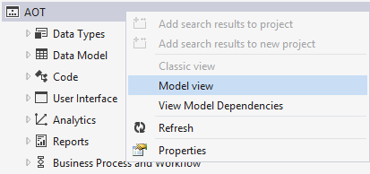
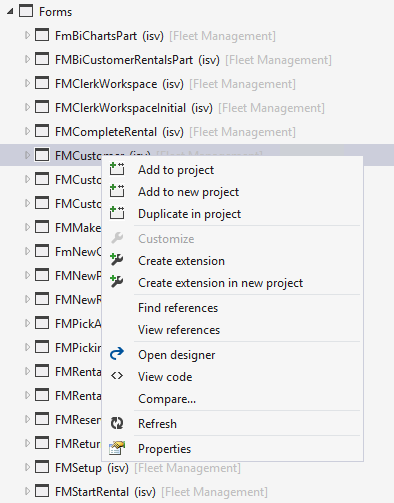
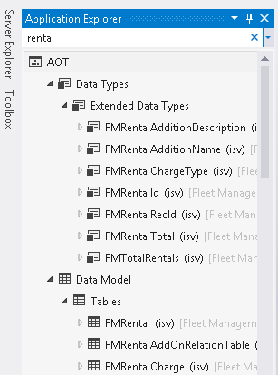

# Application Explorer

[!include [banner](../includes/banner.md)]

This article reviews Application Explorer, and the various views and filtering methods in it. The article also describes how to work with elements in Application Explorer.

## Application Explorer

Application Explorer is the tool that you use to find the elements that you want to add to a project so that you can work with them. To access Application Explorer, on the **View** menu, click **Application Explorer**. An important difference between Application Explorer and the Application Object Tree (AOT) in the MorphX environment of Microsoft Dynamics AX 2012 is that you don't use Application Explorer to add or edit model elements. Instead, you use it to view elements, view code, find references to a selected element, and add elements to a project. To create, design, edit, and build model elements, you must use a finance and operations project.

### Application Explorer views

The content in Application Explorer can be organized in two ways. In the *classic view*, all the elements from every model are grouped according to type. This view resembles the way that the AOT was organized in Dynamics AX 2012. The following illustration shows the classic view. 

 

The second view is called the *model view*. In this view, each model is listed separately. The elements within each model are grouped, as in the classic view. The following illustration shows the model view. Notice that the node for the Fleet Management model is expanded, and that the elements in the model are arranged as they would be in the classic view. 

 

To switch to the model view, right-click the **AOT** node, and then click **Model view**. To switch back to the classic view, right-click the **AOT** node, and then click **Classic view**. 

### Working with elements

To work with elements, you must select them in the Application Explorer:

-   To select one element, click it.
-   To select a contiguous group of elements, hold down the Shift key while you click through the group of elements.
-   To select noncontiguous elements, hold down the Ctrl key while you click the individual elements.

After you select the elements, right-click the selection to view the actions that you can perform. The following illustration shows the actions that are available for a form element. 

 

The actions that are available depend on the elements that you've selected. The following are some of the common actions that you can perform for elements in Application Explorer. **Note:** When the selected node is an element that exists in more than one model (in the case of overlayering customizations), the selected element will depend on the view that Application Explorer is currently in:

-   If Application Explorer is in **model view**, the selected element is the element that belongs to the Application Explorer model that it appears under.
-   If Application Explorer is in **classic view**, the selected element depends on the current context and the selected project in Solution Explorer. For example, if **Add to project** is the selected action, the selected element will be the element that belongs to the model of the current project, when applicable.

| Action                          | Description                                                                                         
|---------------------------------|-------------------|
| Add to project                  | Add the selected element or elements to the current project.|
| Add to new project              | Add the selected element or elements to a new project. |
| Duplicate in project            | Create a copy of the selected element or elements in the current project.|
| Customize                       | Create a customized version of the element. Click **Customize** when you want to do overlayering (customization) of an existing element. The model that you're using for your current project must be in the same package as the selected element, and it must belong to a higher layer than the element that you want to customize. When you click **Customize**, a new “customization” model element file is created and is added to your project. |
| Create extension                | Create an extension for the element. A new extension model element (.Extension) is added to the current project in Solution Explorer. This is the preferred way to work with existing elements.          |
| Create extension in new project | Create an extension for the element as part of a new project. You define the new project when the **New Project** dialog box opens.                                                                        |
| Find References                 | Find all of the X++ code and other elements that reference the selected element.|
| View references                 | Create a diagram that shows the other elements that reference the selected element.|
| Open designer                   | Open the element designer for the element of that type, so that you can view the element. Although you can modify the element, this is typically done when the element is part of a project.                            |
| View code                       | Open the code editor, where you can view and edit the X++ code for the element.  |
| Refresh                         | Update the metadata for the element.                                            |
| Compare                         | Compare the element with the XML representation of the element that you select. Typically, you will compare an element with a different version of the element from a source code control repository.                   |
| Properties                      | Open the **Properties** dialog box in Visual Studio, so that you can see the property settings for the element.                                                                                                        |

Some elements have unique commands that let you perform actions for that type of element. For example, table elements have two commands that provide additional information about the table. The first is the **View hierarchy** command. When you right-click a table element and click this command, you will see a graphical representation of the table hierarchy that the table is part of. For example, the following illustration shows the table hierarchy for the FMVehicle table. 

 

A similar hierarchy tool is available for classes. The second command is **Open table browser**. When you click this command, the data from the table is displayed as a list in the program.  

### Filtering Application Explorer

Application Explorer can contain a very large number of elements. This can make it difficult to find the specific element or elements that you want to work with. However, Application Explorer can filter the elements, based on a query that you supply. To filter the elements that are displayed, you can enter a query in the search bar at the top of Application Explorer. 

 

To apply a simple filter, just type the text that you want to filter by, and then click the **Filter** button at the end of the search bar. For example, if you want to find all of the elements that have a name that contains the word “rental,” enter **rental** as the search term. 

 

To clear the filter and return to the complete view, click the **Clear filter** button (X) in the search bar. Notice the drop-down arrow at the end of the search bar. If you click this arrow, you will see a list of filter options that you can use to refine the filter:

-   Filter By Type
-   Filter By Model
-   Filter By Name
-   Filter By Modified Date
-   Filter By Extension Point

When you select one of these options, a predefined criterion is added to the search bar. You supply the specific values for the criteria. This feature can provide powerful search capabilities. For example, if you want to find the elements that were modified within a specific period, select **Filter By Modified Date**, and specify the start and end dates. 

 

Previously used filters are listed in the drop-down list at the end of the search bar. You can also perform actions on the filtered results that are displayed in Application Explorer. Right-click the **AOT** node, and then select one of the following actions to perform on the results.

| Action                            | Description                                                      |
|-----------------------------------|------------------------------------------------------------------|
| Add search results to project     | Add the elements from the filter results to the current project. |
| Add search results to new project | Add the elements from the filter results to a new project.       |

These actions can be used only when the filter results are limited to a single model. Your query must contain the **model:** "*Model Name*” criterion to limit the filter to a specific model.

## Additional resources

[Develop and customize home page](developer-home-page.md)

[Development tools in Visual Studio](development-tools-overview.md)

[!INCLUDE[footer-include](../../../includes/footer-banner.md)]
