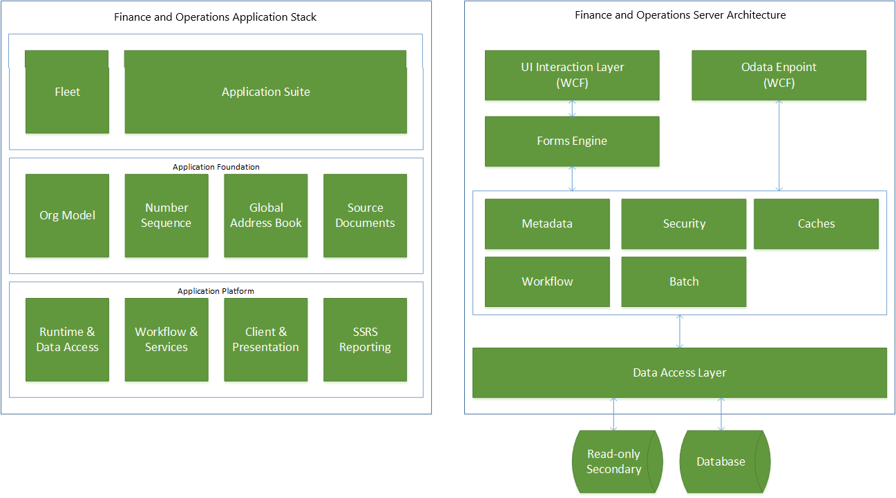

# Application stack and server architecture

[!include [banner](../includes/banner.md)]

The application stack is divided into platform models and application-specific models. The platform models are Application Platform, Application Foundation, and Test Essentials. There are many application-specific models. Some examples are Application Suite, Ledger, Retail, and Case Management.

## Overview

The application stack and server architecture align with three key pillars:

-   New client
-   Cloud readiness
-   New development stack

The application stack is divided into several models: Application Platform, Application Foundation, Test Essentials, and the application suites. The separation enables new application development on the base foundation models, just as the Fleet Management sample application has been developed. Note the following important points about the changes in the server architecture:

-   The services endpoint on the server is now responsible for returning all form and control metadata and data to the browser-based client. There is no longer any remote procedure call (RPC)-based communication with the server. The form objects still run on the server, and rendering has been optimized for browsers and other clients through server and client-side (browser) investments.
-   The server, including the application code base, is deployed to an Internet Information Services (IIS) web application. In the cloud, it's deployed to Microsoft Azure infrastructure as a service (IaaS) virtual machines (VMs).
-   It is hosted on Azure and is available for access through the Internet. A user can use a combination of clients and credentials to access it. The recommended primary identity provider is OrgID, and the store for the identity is Azure Active Directory (Azure AD). The security subsystem uses the same AuthZ semantics for users and roles.
-   Two types of clients must be considered for access in the cloud: active clients and passive clients.
    -   Active clients can programmatically initiate actions based on responses from the server. An active client doesn't rely on HTTP redirects for authentication. A smart/rich client is an example of an active client.
    -   Passive clients can't programmatically initiate actions based on responses from the server. A passive client relies on HTTP redirects for authentication. A web browser is an example of a passive client.

    Currently, Access Control Service (ACS) doesn't support a mechanism for non-interactive authentication. Therefore, even when active clients try to authenticate by using ACS, they must use passive client authentication, in which a browser dialog box prompts the user to enter their credentials.
-   A completely revamped metadata subsystem incorporates the new compiler and Microsoft Visual Studio–based development model. The model store is represented as a set of folders and XML artifacts that are organized by model. The model elements, such as tables, forms, and classes, are represented by an XML file that contains both metadata and source code.

The left side of the following diagram shows how the application stack has been split into distinct models. The right side shows how the key components are stacked in the server. 

   

The finance and operations applications use an entry point security model. A form allows read-only access if the menu item used for navigation to that form has only Read Permissions. However, navigation to that same form through another menu item that provides Create Permissions, Delete Permissions, or Update Permissions allows write operations on the form. This behavior simplifies the development experience, because developers can specify the behavior for a form through a given entry point.

## Cloud architecture
The cloud architecture includes services that automate software deployment and provisioning, operational monitoring and reporting, and seamless application lifecycle management. The cloud architecture consists of three main conceptual areas:

-   **Lifecycle Services (LCS)** – LCS is a multi-tenant shared service that enables a wide range of lifecycle-related capabilities. Capabilities that are specific to this release include software development, customer provisioning, service level agreement (SLA) monitoring, and reporting capabilities.
-   **Finance and operations** – The VM instances are deployed through LCS to your Azure subscription. Various topologies are available: demo, development/test, and high-availability production topologies.
-   **Shared Microsoft services** – A finance and operations application uses several Microsoft services to enable a “One Microsoft” solution where customers can manage a single sign-in, subscription management, and billing relationship with Microsoft across finance and operations applications, Microsoft 365, and other online services.

Many features of the Azure platform are used, such as Microsoft Azure Storage, networking, monitoring, and SQL Azure, to name a few.  Shared services put into operation and orchestrate the application lifecycle of the environments for participants. Together, Azure functionality and LCS will offer a robust cloud service.

## Development environment
The architecture of the development environment resembles the architecture of the cloud instance. It also includes the software development kit (SDK), which consists of the Visual Studio development tools and other components. Source control through Team Foundation Server or Visual Studio Online enables multiple-developer scenarios, where each developer uses a separate development environment. Deployment packages can be compiled and generated on a development environment and deployed to cloud instances by using LCS. The following diagram shows how the key components interact in a development environment.

[!INCLUDE[footer-include](../../../includes/footer-banner.md)]
