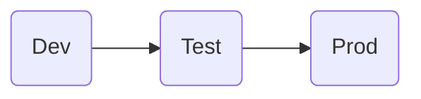
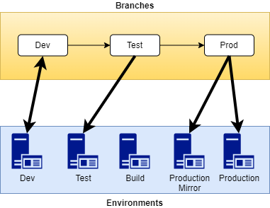
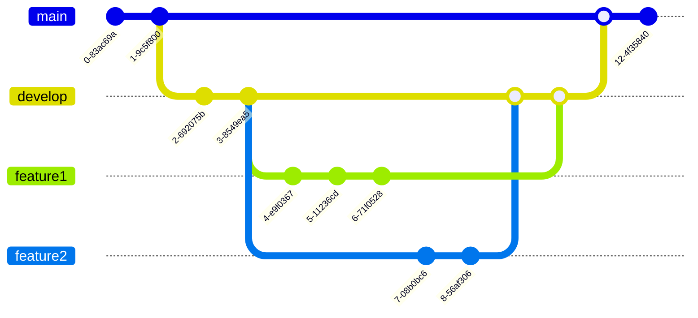

# Branching

Branching configurations for X++ repositories can vary depending on the development team preference and the finance and operations apps lifecycle. If the implementation already has a preferred branching structure and it meets the [minimum branching criteria](#minimum-branching-criteria) outlined below, you can use their structure to manage new development. Alternatively, you can evaluate the branching structure options in this article.

## Considerations

You will find that a few elements of the X++ development cycle differ from general application development. Keep the following items in mind as you consider how to structure your branches:

- ERP systems are business-critical environments. When designing your code management infrastructure, you should prioritize design elements that minimize both the risk of major production issues and the disaster recovery timeline.
- Because of the complexity and interdependency of the standard system code, it's generally a good idea to perform automated and manual testing of **all critical business processes** after each code update. This testing can take days to complete, so plan for a branch to contain this in-test code for long spans of time while it is being validated.
- Merge conflicts are relatively frequent with X++ due to the pattern of dev teams frequently focusing their collective attention on enhancing specific modules and areas of the product. Plan a branching strategy that reduces the frequency of collisions and eases the resolution of collisions when they do occur.

## Minimum Branching Criteria

Any X++ repo branching strategy should support, at a minimum:

- The isolation of un-tested development code from unit-tested development code. Developers should be protected from teammates accidentally breaking any active development branch, and isolating untested code from in-development code is an ideal way to provide this protection.
- The isolation of unit-tested in-development code from test-eligible code. A code change may pass unit testing but the associated task may still not be ready for functional testing. Any X++ branching structure should clearly notate when a collection of changes is ready for functional testing.
- The isolation if in-test code from production code. This is the fundamental purpose of all version control: avoiding code releases to production environments until code changes have been fully validated.
- Relatively long (weeks) functional testing cycles. See the [Considerations](#considerations) section for more details on why finance and operations apps customizations take longer to validate.

## Branch Policy Guidance

Below are some branch policy best practices we recommend regardless of which branching strategy you choose:

- The live/production code branch should be locked to prevent direct editing; changes should only be made via merge from other branches.
- Before functional testing begins, all code changes should be reviewed by at least one reviewer.

## Recommended Branching Options

### Option 1: Sequential Branches

Sequential branching is a branching approach where the branches mirror the phases of the development cycle as code progresses chronologically from active development to functional testing to the live production environment.

When a developer believes their work item is ready for functional testing, they merge or "promote" all changes associated with their work to the Testing branch. The Testing branch contains all code awaiting functional validation. When the changes associated with a work item pass functional validation, they are promoted to the Production branch. The Production branch contains the code running on (or soon to be deployed to) the live environment.

Unlike a [feature](/azure/devops/repos/git/git-branching-guidance?view=azure-devops&preserve-view=true#use-feature-branches-for-your-work) or [release](/azure/devops/repos/git/git-branching-guidance?view=azure-devops&preserve-view=true#use-feature-branches-for-your-work) branching strategy, sequential branches are long-lived and active for the life of the systems they support. Below is an example of this branch structure along with the merge path between branches.

*Figure 1. Sequential branch structure and merge path.*

#### Pros

Compared to other branching strategies, sequential branching is relatively easy to understand as it mirrors the functional stages of the development cycle. Once configured, it does not requires another branching due to the static sequential branches. This approach can be a benefit when your team is large or inexperienced with feature branching. The simplified branching structure also usually makes it easier for code administrators to isolate bugs.

#### Cons

If your X++ development naturally breaks into feature or release partitions, sequential branching is not the best fit. This is often the case for ISV solutions but less commonly the case for customer specific customizations. For sequential branching to work optimally, two Tier 2 sandbox environments are preferred: a functional testing environment for code validation, and a production mirror environment deployment testing and production troubleshooting. Tier 2 environments are relatively expensive, so budget-sensitive projects may not prefer this approach. Lastly, because the branch names so closely reflect the environments they support, the relationship between the branches and the environments can be confusing.

*Figure 2. Environment branch relationship and code flow. Note that the build VM is not a user-facing environment and is only shown here for completeness.*

### Option 2: Feature Branches

[Feature branching](/azure/devops/repos/git/git-branching-guidance?view=azure-devops&preserve-view=true#use-feature-branches-for-your-work) is a branching approach where new development and bug fixes are isolated to short-lived one-off branches based on the production code branch. The branch is created when feature development begins, and it is merged when functional testing is completed. Any number of feature branches may exist at the same time in a project.

*Figure 3: Feature branch example.*

#### Pros

Feature branches work well for X++ when development work items are relatively small and move quickly, as is often the case after major development has completed on an implementation project. They are the best approach for encapsulating the changes associated with a single work item, as feature branches are almost always isolated to the development of one enhancement or bug fix.

#### Cons

Using feature branches can lead to difficult merge conflicts if your team has several developers committing frequent changes to the same code area. Feature branches are normally totally independent and each branch owner is individually responsible for keeping their branch in sync with other changes. This reduces the risk of code in an individual feature branch "drifting" from changes in other feature branches or the main branch. This "drift" can also increase the overall time required to resolve merge issues. Consider the discipline of your dev team as you investigate this option.
