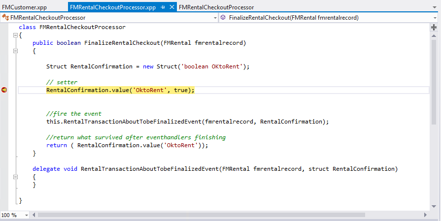
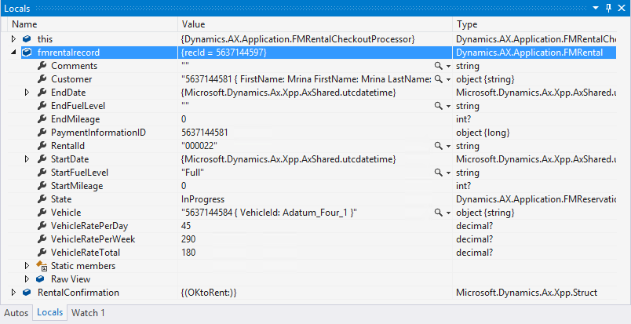

# Build and debug projects

[!include [banner](../includes/banner.md)]

In this tutorial, you’ll learn about using the tools in Visual Studio to analyze and debug code in the Fleet Management application. You’ll go through a simple developer scenario in which you will set breakpoints, modify some code, and build the result. 

## Prerequisites

Previous experience with code and Visual Studio is helpful to get the full benefit of this tutorial. This tutorial requires you to access the environment using Remote Desktop and that you be provisioned as an administrator on the instance.

## Key concepts

-   The debugger in Visual Studio is used to analyze and debug code for your projects.
-   The standard features of the Visual Studio debugger are available to use when you're examining the running application. These features include modifying values of variables, setting breakpoints, and so on.
-   IntelliSense and other features of Visual Studio are vital to efficient code editing and comprehension.
-   Development is an iterative process. After making modifications to the code, the project will be built, and changes can be tested.

## Scenario

The rental company has had unfortunate events when customers rent cars using credit cards that are past the expiration dates. You, the developer, are tasked with revising the application to help prevent this situation. You’ll identify the problem by using the debugger in Visual Studio. After the problem is identified, you’ll edit some code to implement a fix. Finally, you’ll build the project and validate that the fix was successful.

## Run to a breakpoint

1.  On the desktop, double-click the Visual Studio shortcut to open the development environment.
2.  Open the FleetManagement solution. On the **File** menu, point to **Open**, and then click **Project/Solution**.
3.  Browse to the desktop, and then open the **FleetManagement** folder. If the solution file is not on your computer, the steps to create it are listed in [End-to-end scenario for the Fleet Management sample application](fleet-management-sample.md).
4.  Select the file named **FleetManagement**. The file type listed is SLN File.
5.  Click **Open**. Loading the solution may take some time.
6.  Make the **FleetManagement** project the startup project. In **Solution Explorer**, right-click the **Fleet Management** project, and choose **Set as StartUp Project** in the context menu.
7.  In **Solution Explorer**, double-click the **Fleet Management** project to display its content.
8.  Double click the **Classes** folder of the Fleet Management project. Locate the **FMRentalCheckoutProcessor** class. Right-click this class, and then click **Open**. Alternatively, you can use the solution explorer search bar at the top of the solution explorer window. As you enter the name in the search bar, you'll see the corresponding artifacts selected in the solution explorer. You can now see the X++ code for the class. This class has a method named **FinalizeRentalCheckout**.
9.  Place a breakpoint in this method on the line following the first comment. To do this, click in the margin to the left of the line of code where you want the debugger to pause execution. You can also click anywhere in the line of code, and then press F9. The following illustration shows a breakpoint, which is displayed as a red-filled circle in the margin. 

    [](./media/redcirclemargin_builddebugproj.png) 

    The FinalizeRentalCheckout method is called when a rental transaction is saved. This method calls the delegate named RentalTransactionAboutTobeFinalizedEvent. You can implement an event handler method, which is called by this delegate. The method that calls the delegate passes a parameter, named RentalConfirmation, which contains a value that indicates whether the rental should be allowed or blocked. If the rental is allowed, the value contains "true"; if it's blocked, the value contains "false". An event handler can change this value, based on any test the developer chooses to implement in code. In this case, we'll modify the code to test the expiration date of the credit card.
10. Press F5 to start the application for debugging, or, on the **Debug** menu, click **Start Debugging**. It's important that you start the application in one of these ways. If you don't, the Visual Studio debugger won't start, so you won't hit any of the breakpoints you've set. **Note**: The debugger needs to relate code position to source positions. It does this through consuming PDB files produced alongside the assemblies and net modules. The debugger will load symbols from the PDB files as described in the settings in the global tools settings. To open the options page containing the setting that controls which symbols load, go to the **Tools** menu and choose **Options**. In the **Microsoft Dynamics 365 Finance** group, select the **Debugging** page. If this option is selected, the system will load symbols from only the PDB files related to the artifacts in the current solution. This reduces the startup time significantly, so be sure it’s selected for this lab. Be aware that when this option is selected, it won’t be possible to see source code from entities outside of the current solution. After a few moments, the browser will start and display the startup object that was selected in the project.
11. The **Current Rentals** page will open.
    1.  In the Action Pane, click **Edit**.
    2.  When the page is displayed, click **Show list** in the **Show/Hide** list (or press **Ctrl+F8**).

12. Make a change to any existing rental. For example, click **Edit**, and change the time that the rental period started.
13. Click **Save** to force a validation of the rental record. The method in which you placed a breakpoint is called. Execution pauses at the line of code that contains the breakpoint. 

    [](./media/forcevalidation_builddebugproj.png) 
    
    While the application is paused at a breakpoint, you can examine the application state. Use the same techniques that you typically would for any application developed with Visual Studio. For example, place the cursor over a variable or a parameter to see its value in a tooltip. 
    
    [](./media/tooltip_builddebugproj.png)

14. The other debugging tools in Visual Studio are available as well. For example, the **Locals** window shows all of the local variables for the location where execution has stopped. Click the **Locals** tab at the bottom of Visual Studio, and expand the **fmrentalrecord** variable. You will see the internal state of the record, showing the values of all the fields in the record. 

    [](./media/internalstate_builddebugproj.png) 
    
    Notice the value of the **Vehicle** property of the **fmrentalrecord** variable. This property is a foreign key field in the **FMRental** table. The debugger allows us to peek into the related record in the FMVehicle table. It shows values that belong to the **AutoIdentification** field group.
15. The **Breakpoints** window lists all of the breakpoints that have been set. Click the **Breakpoints** tab to see its content. 

    [](./media/breakpoint_builddebugproj.png)

16. Press F10 a few times to step through the code, line-by-line, and use the full complement of debugger features. Notice that the **Locals** window updates the values of variables immediately with each statement that's executed.
17. On the toolbar, click **Continue**, or press F5
18. Close Internet Explorer to close the **Fleet Management** application. Visual Studio will exit the debugging mode. An alternative is to choose **Stop Debugging** from the **Debug** menu. This will leave Internet Explorer open, allowing the next debugging session to start faster.

## Add the validation code

In the **FinalizeRentalCheckout** method, you saw that the developer added code to call the delegate that’s used to determine the validity of the rental. To solve the problem of expired credit cards, you’ll add an event handler, which you’ll use to verify that the credit card isn’t expired. To simplify the lab, the handler will be added in the same file that contains the delegate. Use the following code as inspiration. Rather than copying and pasting the code, type it in manually to see the IntelliSense features in action. These features add to the high level of productivity that Visual Studio users expect.

```xpp
[SubscribesTo(classstr(FMRentalCheckoutProcessor), 
    delegatestr(FMRentalCheckoutProcessor, RentalTransactionAboutTobeFinalizedEvent))]
public static void RentalFinalizedEventHandler(FMRental rentalrecord, Struct rentalConfirmation)
{
    FMPaymentInformation paymentInfo;
    date ccExpiryDate, lastDayOfExpiryMonth;
    str s;

    select firstonly * from paymentInfo where paymentinfo.RecId == rentalRecord.PaymentInformationId;

    if (paymentInfo)
    {
        // Check if the payment info is valid
        // For now, we will check if the credit card is expired
        // Credit cards expire on the last day of the month indicated
        ccExpiryDate = mkdate(1, str2int(paymentInfo.ExpirationMonth), paymentInfo.ExpirationYear);
        lastDayOfExpiryMonth = endmth(ccExpiryDate);

        if (lastDayOfExpiryMonth < today())
        {
            rentalConfirmation.value('OktoRent', false);
            s = "Credit card validation failed for rental ";
        }
        else
        {
            s = "Credit card validation succeeded for rental ";
        }

        info (s + rentalrecord.RentalId);
    }
    else
    {
        rentalConfirmation.value('OktoRent', false);
        info ("No Credit card available for " + rentalrecord.RentalId);
    }
}
```

The preceding code is straightforward. The method is marked as handler for the relevant delegate by using the **SubscribesTo** attribute, as shown. In the code, the customer record is retrieved, and then the credit card date is compared to today's date. If the expiration date of the credit card is in the past, the event handler sets a value in the **RentalConfirmation** structure to signal that the customer isn't eligible to rent a vehicle. The idea is that any number of handlers can subscribe to the delegate. If any handler determines that a rental should not proceed, it sets the **OkToRent** flag to false. A superior implementation might refrain from doing any analysis if it determines that the **OkToRent** flag has already been set to false.

1.  Be sure that you're working in the FMRentalCheckoutProcessor.xpp file. Begin by adding the new event handler definition to the FMRentalCheckoutProcessor class. Add the following code on an empty line just above the brace (}) that marks the end of the class definition.

    ```xpp
    public static void RentalFinalizedEventHandler(FMRental rentalrecord, Struct rentalConfirmation)
    {

    }
    ```

2.  Add the attributes to the beginning of the event handler. These attributes indicate which delegate the event handler is subscribing to.

    ```xpp
        [SubscribesTo(classstr(FMRentalCheckoutProcessor),
            delegatestr(FMRentalCheckoutProcessor, RentalTransactionAboutTobeFinalizedEvent))]
            public static void RentalFinalizedEventHandler(FMRental rentalrecord, Struct 
                                                                           RentalConfirmation)
        {

        }
    ```

3.  Now, add the code that checks the credit card expiration value. The completed method should look similar to the following code.

    ```xpp
    [SubscribesTo(classstr(FMRentalCheckoutProcessor), 
        delegatestr(FMRentalCheckoutProcessor, RentalTransactionAboutTobeFinalizedEvent))]
    public static void RentalFinalizedEventHandler(FMRental rentalrecord, Struct rentalConfirmation)
    {
        FMPaymentInformation paymentInfo;
        date ccExpiryDate, lastDayOfExpiryMonth;
        str s;

        select firstonly * from PaymentInfo where paymentinfo.RecId == rentalRecord.PaymentInformationId;

        if (paymentInfo)
        {
            // Check if the payment info is valid
            // For now we will check if the credit card is expired
            // Credit cards expire on the last day of the month indicated
            ccExpiryDate = mkdate(1, str2int(paymentInfo.ExpirationMonth), paymentInfo.ExpirationYear);
            lastDayOfExpiryMonth = endmth(ccExpiryDate);

            if (lastDayOfExpiryMonth < today())
            {
                rentalConfirmation.value('OktoRent', false);
                s = "Credit card validation failed for rental ";
            }
            else
            {
                s = "Credit card validation succeeded for rental ";
            }

            info (s + rentalrecord.RentalId);
        }
        else
        {
            rentalConfirmation.value('OktoRent', false);
            info ("No Credit card available for " + rentalrecord.RentalId);
        }
    }
    ```

4.  Make sure the handler and the delegate are separated by exactly one blank line.
5.  On the toolbar in Visual Studio, click **Save**.
6.  After you're satisfied with the code, build the code for the Fleet Management project. To do this, in **Solution Explorer**, right-click the **FleetManagement** project name, and then click **Build**. You may see errors or warnings if the code isn't correct. If so, correct the code, and build again until all warnings and errors have been resolved. You're now ready to validate that the revision works as intended.
7.  On the **Debug** menu, click **Delete All Breakpoints**.
8.  Place a new breakpoint in the event-handler method at the line that contains the following statement:

    ```xpp
    if (lastDayOfExpiryMonth < today())
    ```
    
9.  Start the Fleet Management sample with debugging active by pressing F5.
10. Browse to the **Current rentals** page, as described starting in step 11 of the previous section. Select one of the reservations, and click **Edit**.
11. In the **Customer** drop-down list, select Adrian Lannin from the list, and then click **Save**. Execution pauses at the breakpoint that you set in the event-handler method.
12. Press F10 three times to step through the code block. 

    [](./media/stepcodeblock_builddebugproj.png)
    
13. Press F5 to continue. You'll see that the customer has been disallowed.
14. In the same rental, change the customer name to Phil Spencer, and then click **Update**. This time, the transaction is allowed.
15. Close Internet Explorer.
16. Comment out the **SubscribesTo** attribute on the **RentalFinalizedEventHandler** method. This step ensures that the credit card test will no longer run as you work on the remaining tutorials.

## Best practices

Earlier in this tutorial, you had the opportunity to add code to the project and build the solution with your changes. The build process may not have been successful, requiring you to refer to the error window. Using this window, you can get to the error by clicking on the line that describes the error. You may have noticed some diagnostic messages that don’t represent compilation errors. These are diagnostics from the **Best Practice** checker. This tool will check for instances where the developer has violated a known best practice, and display a warning when one is found. The Best Practice rules apply to both code constructs and metadata. Each software development organization is likely to have its own set of best practices that they enforce. They may want to disregard some of the existing best practice checks. To support this, the set of reported best practice diagnostics can be modified by the individual developer. To demonstrate this, complete the following steps:

1.  On the **View** menu, click **Error List**. You should see a small number of best practice warnings.
2.  On the **Dynamics 365** menu, click **Options**. In the **Dynamics 365** group, choose **Best Practices**.
3.  In the **Model** drop-down list, make sure that the **Fleet Management** model is selected. The best practice rules apply to a particular model.
4.  Mark the selections for some of the sets of Best Practice rules. For example, if you select the entry for **CodeStyleRules**, best practice guidelines for variables will be examined. After you've updated the selections, click **OK**.
5.  Rebuild the Fleet Management project by right-clicking the project name and then clicking **Rebuild**. You'll notice that the violations of the best practice rules that you specified appear in the **Error list** window.


[!INCLUDE[footer-include](../../../includes/footer-banner.md)]

