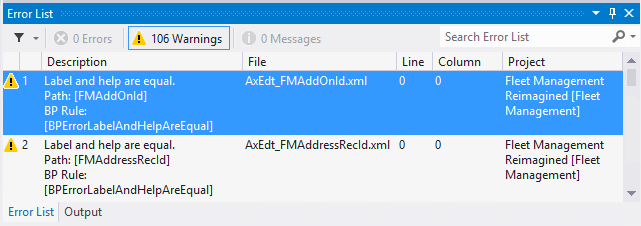
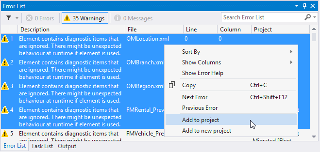

# Build operations

[!include [banner](../includes/banner.md)]

This article reviews the process to build projects and full build of model packages.

The elements of a model must be built so that they can be used by the application. You can build the elements in a project. You can also build all the elements in a model. The following actions are performed during a build operation:

- Metadata validation
- X++ code validation
- Best practice checks
- Report RDL generation
- Compilation, IL generation, and creation of the .NET assemblies
- Label assembly generation and deployment of other resource files
- Database synchronization

## Build a project

When you build a project, only those elements that are new or that have changed are built. To build a project, follow these steps.

1. In Solution Explorer, select the project.
2. On the **Build** menu, click **Build &lt;project name&gt;** to start the build process. Alternatively, right-click the project in Solution Explorer, and then click **Build**.

During the build process, you might notice that some elements that are built aren't part of the project. This behavior is required because of the way that assemblies are created. When you build an element, you’re actually building the .NET module that the element is included in. A single .NET module contains multiple model elements, and a single assembly contains multiple .NET modules. The assembly can be created only if all the .NET modules in the assembly have been built and are up to date. If any elements in any of the .NET modules for an assembly haven’t been built or aren't up to date, they will be built, even if they aren’t included in the current project.

> [!NOTE]
> If you delete an element from a project, you must rebuild the project or perform a full build on the model before the deletion takes effect.

## Rebuild a project

If you want to build all the elements in a project, regardless of whether they have changed, you must perform a rebuild operation. To rebuild a project, follow these steps.

1. In Solution Explorer, select the project.
2. On the **Build** menu, click **Rebuild &lt;project name&gt;** to start the rebuild process. Alternatively, right-click the project in Solution Explorer, and then click **Rebuild**.

## Synchronizing the database at each build

A project property lets you specify that the synchronize operation for the database should be performed every time that you build the project. This can be useful when you’re making changes to the table structure for an application. Each time that you build, you will know that the database is synchronized with the tables as they are defined in the project. For information about how to set project properties, see [finance and operations project type in Visual Studio](projects.md). If your application has a large number of tables, and you aren’t yet testing the application, you can set the **Synchronize database on build** property to **false**. This change will reduce the time that is required to build the project. Then, when you begin testing, be sure to set this property back to **true**. If you must manually synchronize the tables in a project, you can right-click the project in Solution Explorer and then click **Synchronize &lt;project name&gt; with database**. To synchronize the entire database, which can be a long process, on the **Dynamics 365** menu, click **Synchronize database**.

> [!NOTE]
> If you try to synchronize the database before you have fully compiled assemblies, the Visual Studio database synchronization tool will display a message that synchronization has completed successfully, when in fact, the synchronization was not successful.

Tables and views cannot be synchronized against the database until they are fully compiled. After you complete a full build of the Application Platform, Application Foundation, and Application Suite, you can complete a Database Synchronization from the Dynamics 365 menu in Visual Studio.

## Build a model's package

You might want to build all the elements in a specific model. To do this, you must perform a full build on the package that the model belongs to. Follow these steps.

1. On the **Dynamics 365** menu, click **Build models**.
2. In the **Packages** list, select the package(s) to build.
    - Package names are listed alphabetically.
    - Models belonging to the package are shown in brackets.

3. If you want to build the dependent packages first, select **Build referenced packages**. Any dependent package that must be built will be listed.

    [](./media/buildmodelsdialog.png)

4. On the **Options** tab, review the options for the build process. The following options are available.

    | Option                       | Description                                                                                                                                                                       |
    |------------------------------|-----------------------------------------------------------------------------------------------------------------------------------------------------------------------------------|
    | Build Pre-Compiled Forms     | Static HTML is generated for each form during the build process. This allows faster rendering of forms at run time.                                                               |
    | Build Reports                | Reports are built.                                                                                                                                                                |
    | Build Aggregate Measurements | Aggregate measurements are build.                                                                                                                                                 |
    | Run Best Practice Checks     | Best practice checks are performed during the build process.                                                                                                                      |
    | Synchronize Database         | The schema of the SQL database is updated during the build process (after compilation of the metadata and source code), so that it matches the metadata.                          |
    | Build cross reference data   | The data for the cross-reference feature is updated during the build process. Cross reference data enables developers to find references to code and metadata during development. |

5. Click **Build** to start the build process.
6. Expand the **Details** tab to follow details of the build process.

## Build results

After a build operation is completed, you will see the results in Microsoft Visual Studio. The **Output** pane in Visual Studio shows the status of the build. You can use the **Show output from** field to switch between the standard build information and the build details.

[](./media/27_devotoolsconcept.png)

The **Error List** pane in Visual Studio shows the build errors and warning that occurred during the build process. If you see any build errors, you must fix them and then build again, so that valid assemblies can be created for the application. Many of the warnings that appear in the **Error List** pane are best practice checks that inform you of revisions that you should make to your application so that it conforms to the best practices for application development. Ideally, you should address all the best practice warnings for an application.

[](./media/28_devotoolsconcept.png)

You can double-click most errors and warnings to see the source of the issue. The element designer or code editor will open, where you can see what property setting or code is causing the error or warning. The **Task List** pane in Visual Studio shows tasks that have been flagged with "TODO" comments in code. For example, the following comment indicates that some object references still require validation.

```xpp
// TODO: validate object references
```

When the code is built, these "TODO" comments appear in the **Task List** pane. To view the **Task List** pane, on the **View** menu, click **Task List**.

[](./media/29_devotoolsconcept.png)

To make resolution easier, you can add the elements that are affected by the error or task to the current project or to a new project. In the **Error List** pane or the **Task List** pane, select the rows for the errors or tasks that you want to fix, right-click, and then click **Add to project** or **Add to new project**. This saves you the effort of finding the affected elements in the application.

[](./media/30_devotoolsconcept.png)

## Additional resources

[Development tools in Visual Studio](development-tools-overview.md)

[Develop and customize home page](developer-home-page.md)


[!INCLUDE[footer-include](../../../includes/footer-banner.md)]
