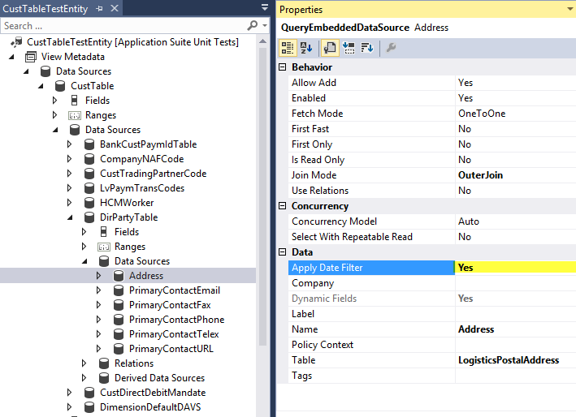
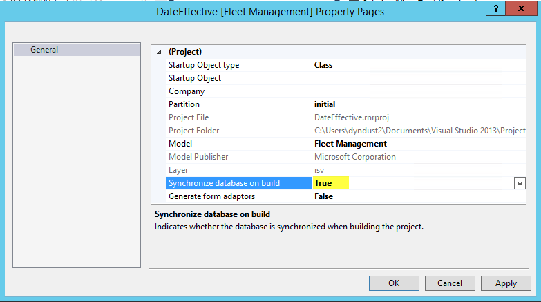
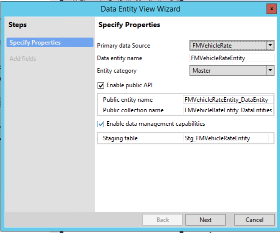
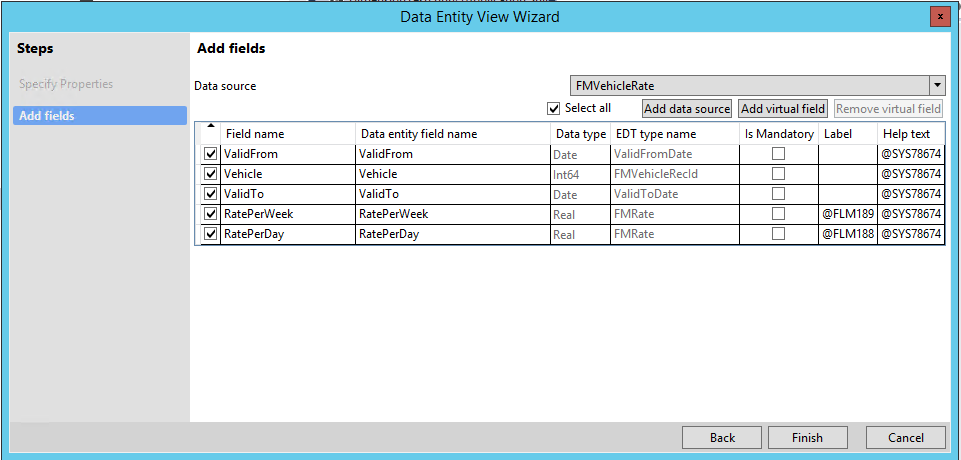
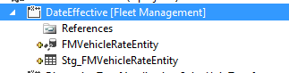
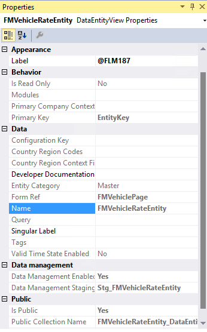
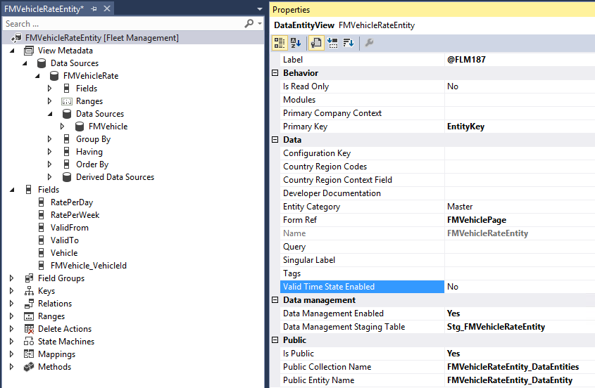
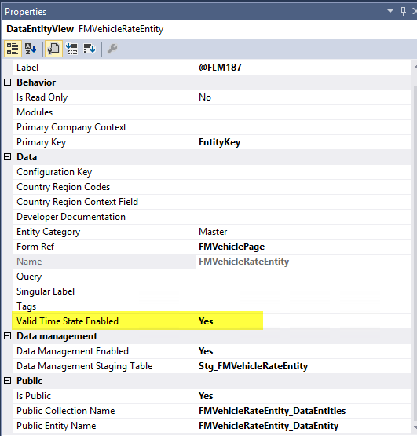
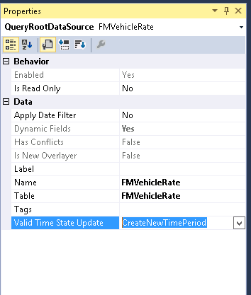

# Date effectivity

[!include [banner](../includes/banner.md)]

This article provides information about date-effective data entities and data sources, and shows how to create a date-effective entity. It also explains how date effectivity applies to read and write activities.

Different design patterns exist for date-effective features that involve data entities. These patterns fall into two main categories:

- **Date-effective entities** – The entity has at least one date-effective data source, and the entity itself is also date effective.
- **Non-date-effective entities** – The entity itself isn't date effective, but it does contain date-effective data sources.

The next sections describe the properties and methods that control the date-effective behavior of entities and their date-effective data sources.

## Date-effective entities

The following table describes the properties that control the date-effective behavior of a data entity.

| Property name of the entity | Node of the property                                    | Value       | Description                                                                                                                                                                                                                                                                                                                                                  |
|-----------------------------|---------------------------------------------------------|-------------|--------------------------------------------------------------------------------------------------------------------------------------------------------------------------------------------------------------------------------------------------------------------------------------------------------------------------------------------------------------|
| ValidTimeStateEnabled       | Data entity node in the designer                        | Yes (or No) | The value **Yes** makes the entity date effective. The entity must have **ValidFrom** and **ValidTo** fields. These fields map to the **ValidFrom** and **ValidTo** fields of a date-effective data source. The value **No** doesn't disable the enforcement of date effectivity on any date-effective tables that are data sources of the entity. |
| ValidTimeStateKey           | Under the data entity node, **Keys** &gt; **EntityKey** | Yes (or No) | The value **Yes** identifies the key that enforces the date-effective values on this particular entity.                                                                                                                                                                                                                                        |

## Read activities

When you set date effectivity at the data entity level, reads from the entity behave the same way as reads from a table. The entity has **ValidFrom** and **ValidTo** fields that the system applies date filters to during reads.

### Query modes and the validtimestate keyword of X++ SQL select

A date-effective entity supports the following three *query modes*, which vary in their use of the X++ **validtimestate** keyword:

- **Default mode** – Returns current records by using `select * from FMVehicleRateEntity; // X++ SQL.`
- **AsOfDate mode** – Returns records valid for the specified date by using `select validtimestate(d1) * from FMVehicleRateEntity;`
- **AsOfDateRange mode** – Returns records valid for the specified date range by using `select validtimestate(d1,d2) * from FMVehicleRateEntity;`

**Important:** For data entities that aren't themselves date effective but have a date-effective data source, only the default query mode is available. This concept is discussed later in this article.

### Applying a date filter at the data source level

Some scenarios require date-effective filtering outside the data entity, at the data source level. For example, the customer entity (CustTableTestEntity) contains CustTable and LogisticsPostalAddress as data sources, where LogisticsPostalAddress is a date-effective table and CustTable is a regular table. The purpose of a customer entity is to have a list of customers and their active primary addresses, if they have primary addresses. Therefore, the customer entity itself isn't date effective, but it requires date filters on one of the data sources. In this case, don't mark the entity **ValidTimeStateEnabled**. Instead, add an **Apply Date Filter** property on the data source. If you set the value of **Apply Date Filter** to **Yes**, the system automatically applies date filters to that data source. The following table describes the properties that control the date-effective behavior of a date-effective data source of a data entity.

| Property name of the data source | Node of the property                             | Value       | Description                                                                                                                                                                                                                                                                                                    |
|----------------------------------|--------------------------------------------------|-------------|----------------------------------------------------------------------------------------------------------------------------------------------------------------------------------------------------------------------------------------------------------------------------------------------------------------|
| Apply Date Filter                | Node of any particular data source of the entity | Yes (or No) | For *reads*, this property controls whether the system applies date filters on the entity data source. In this case, mark the data source **ValidTimeStateEnabled**. This property value has effect regardless of whether the entity itself is date effective. For *writes*, this property has no effect. |

This article describes the use of these date-effective properties and the interactions between them.

### State matrices for reads

This section concerns only reads from the data entity. The following pair of reference matrices describe the combinations of date-effective states that can exist between a data entity and its data source. Each table contains four cases, and each case discusses two distinct targets. Here are the primary points that you should understand:

- On any given read from the entity, the query mode is the same for both the entity and date-effective data sources.
- If the entity isn't date effective, the query mode is limited to the default mode. Therefore, the date-effective data source is accessed only for the current date.
- On the date-effective data source, set the **Apply Date Filter** property to **No** to make the data source return all data – past, current, and future.
- For OData, date-effective filters aren't applied to the data entity. However, filters on the data source are applied at all code paths.

A. Entity *is* date effective, because ValidTimeStateEnabled = Yes

**Data source *is* date effective**

**Data source is *not* date effective**

**Apply Date Filter = Yes**

- **Entity:** Date filters are applied. Any query mode is supported.
- **Data source:** Filters are applied. Any query mode is supported, but the mode is the same as is coded for the entity.

Non-date-effective data sources aren't affected.

**Apply Date Filter = No**

- **Entity:** Date filters are applied. Any query mode is supported.
- **Data source:** No date filters are applied.

Non-date-effective data sources aren't affected.

B. Entity is *not* date effective, because ValidTimeStateEnabled = No

**Data source *is* date effective**

**Data source is *not* date effective**

**Apply Date Filter = Yes**

- **Entity:** No date filters are applied.
- **Data source:** Date filters are applied. Only the default query mode is supported, where the X++ **validtimestate** keyword is omitted.

Non-date-effective data sources aren't affected.

**Apply Date Filter = No**

- **Entity:** No date filters are applied.
- **Data source:** No date filters are applied.

Non-date-effective data sources aren't affected.

The following screenshot shows the **Apply Date Filter** property set to **Yes**. Therefore, date filters are applied to reads of the **Address** data source.

[](./media/date1.png)

## Write activities

This section describes your options for configuring the behavior of date-effective entities and their date-effective data sources. It starts by reviewing the concept of date-effective tables and contrasting them with date-effective entities. **Date-effective table:** When you insert or update data in a date-effective table, you can call the **xRecord.validTimeStateUpdateMode** method on the table buffer. The method accepts an element of the **ValidTimeStateUpdate** enumeration. Here are the available element values:

- CreateNewTimePeriod
- Correction
- EffectiveBased

**Date-effective entity:** By contrast, when you insert or update data in a date-effective data entity, don't use the **validTimeStateUpdateMode** method at the entity level. For writes, the data entity leaves the date-effective processing to the table level. Use the **Valid Time State Update** property on the entity data source to specify the **validTimeStateUpdateMode** method to use for each data source of the data entity.

## Creating a date-effective entity

This section shows how to create a date-effective entity.

#### Create a new project

1. Select **File** &gt; **New** &gt; **Project** to create a new project.
1. In **Solution Explorer**, right-click your project, and then select **Properties**. The **Property Pages** dialog box for your project opens.
1. Change the value of the **Synchronize database on build** property to **True**, and then select **OK**. Set this property only once per project.

    [](./media/date3.png)

#### Add a new data entity to your project

Create a new entity named **FMVehicleRateEntity**, and add it to the project.

1. In the left pane, select **Microsoft Dynamics 365 Artifacts**, and then select **Data Entity** in the left column of the main pane.
1. Select **Add**. The **Data Entity View** wizard starts.
1. Specify the property values for the data entity that you're creating, as shown in the following screenshot. The most important field is **Primary data source**, where you select **FMVehicleRate**.

    [](./media/date5.png) Select **Next**.

1. Add fields to the entity from the primary data source, **FMVehicleRate**.
1. Select all fields, and then select **Finish**.

    [](./media/date6.png)

    The items are added to the project in **Solution Explorer**.

    [](./media/date7.png)

#### Build your project

1. Select **Build** &gt; **Build Solution** to build your project.
1. Verify that the build has no errors. Warnings are acceptable at this stage in the process.

#### Validate the property values

- In **Solution Explorer**, select the **FMVehicleRateEntity** node, and validate the properties of the **FMVehicleRateEntity** entity by comparing them to the values in the **Properties** pane.

    [](./media/date8.png)

#### Make your entity date effective

1. In **Solution Explorer**, right-click the **FMVehicleRateEntity** node, and then select **Open**. The designer for the entity opens in the middle pane.

    [](./media/date9.png)

1. Change the value of the **Validate Time State Enabled** property to **Yes**.

    [](./media/date10.png)

#### Configure the Valid Time State Update property for the date-effective data source

- Select the **FMVehicleRate** data source, and then set the **Valid Time State Update** property to **CreateNewTimePeriod**.

    [](./media/date11.png)

#### Test your project

- Build your project again, and run the following X++ code to test your project.

```xml
/// <summary>
    /// Runs the class with the specified arguments.
    /// </summary>
    /// <param name = "_args">The specified arguments.</param>
    public static void main(Args _args)
    {
        FMVehicleRateEntity FMVehicleRateEntity;
        FMCarClass          vehicle;
        FMVehicleModel      model;
        FMVehicleRate       vehicleRateTable;
        TransDate           d1=1\1\1999,d2=31\12\2014;

        ttsbegin;

        select count(RecId) from FMVehicleRateEntity;
        info(strfmt("Entity - Valid today before insert %1",FMVehicleRateEntity.RecId));

        select count(RecId) from vehicleRateTable;
        info(strfmt("Table - Valid today before insert %1",vehicleRateTable.RecId));

        select firstonly model;

        vehicle.VehicleModel = model.RecId;
        vehicle.VehicleId = "TestV1001";
        vehicle.insert();

            if (vehicle)
            {
                FMVehicleRateEntity.clear();
                FMVehicleRateEntity.FMVehicle_VehicleId = vehicle.VehicleId;
                FMVehicleRateEntity.ValidFrom = d1;
                FMVehicleRateEntity.ValidTo = d2;
                FMVehicleRateEntity.RatePerDay = 100;
                FMVehicleRateEntity.RatePerWeek = 600;
                FMVehicleRateEntity.insert();

                // Should increase by one as compared to before insert numbers
                select count(RecId) from FMVehicleRateEntity;
                info(strfmt("Entity - Valid today after insert %1",FMVehicleRateEntity.RecId));

                // Should increase by one as compared to before insert numbers
                select count(RecId) from vehicleRateTable;
                info(strfmt("Table - Valid today after insert %1",vehicleRateTable.RecId));

                // New record should show in count
                select validtimestate(d1) count(RecId) from FMVehicleRateEntity;
                info(strfmt("Entity - Valid 1999 %1",FMVehicleRateEntity.RecId));

                // New record should show in count
                select validtimestate(d1) count(RecId) from vehicleRateTable;
                info(strfmt("Table - Valid 1999 %1",vehicleRateTable.RecId));

                // update newly created record
                // This should split record into two - 2009 to Today, today to 2014
                // Split happens because of mode in saveEntityDatasource
                select forupdate validtimestate(d1,d2) FMVehicleRateEntity 
                     where FMVehicleRateEntity.FMVehicle_VehicleId == vehicle.VehicleId &&
                           FMVehicleRateEntity.ValidFrom == d1 &&
                           FMVehicleRateEntity.ValidTo == d2;
                FMVehicleRateEntity.RatePerDay = 200;
                FMVehicleRateEntity.update();

                // validate the split
                while select validtimestate(d1,d2) FMVehicleRateEntity
                     where FMVehicleRateEntity.FMVehicle_VehicleId == vehicle.VehicleId
                {
                    info(strfmt("Entity - %1 to %2 , RatePerDay-%3, RatePerWeek-%4",
                            FMVehicleRateEntity.ValidFrom,
                            FMVehicleRateEntity.ValidTo,
                            FMVehicleRateEntity.RatePerDay,
                            FMVehicleRateEntity.RatePerWeek));
                }
                ttsabort;
            }
        }

```

[!INCLUDE[footer-include](../../../includes/footer-banner.md)]
