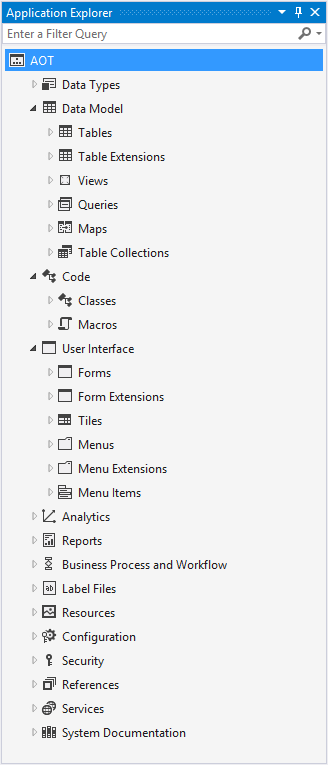
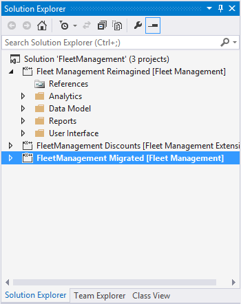

# Development tools in Visual Studio

[!include [banner](../includes/banner.md)]

## What are the development tools?
Application development is carried out in Visual Studio. The development tools support all of the development tasks, including debugging and local testing scenarios. Visual Studio is the exclusive integrated development environment (IDE) for development. All of your application development work will be performed with it. This section is an overview of the main features that are added to Visual Studio when the development tools are installed.

Visual Studio 2019 is supported beginning with platform updates for version 10.0.21 of finance and operations apps.

While working in Visual Studio, you will receive recurring feedback requests regarding new features.
To prevent the feedback requests from appearing in Visual Studio, run the following PowerShell command from a developer’s machine:
Set-ItemProperty HKCU:\Software\Microsoft\Dynamics\AX7\Development\Configurations  -Name ProvideFeedback  -Value "No"

### Application Explorer
In Visual Studio, the model store is represented by the Application Explorer. On the **View** menu, click **Application** **Explorer** to open it. Use the Application Explorer to browse and interact with the elements in the model store that define the applications. The following illustration shows the Application Explorer. For more information, see [Application Explorer](application-explorer.md).

### The project template
Even a simple application can have a large number of elements in its model. The **Operations Project** template has been added to Visual Studio to help you organize and manage the elements that you are working with for a model. You will use the project to design, build, and test model elements. It’s common to have several projects within a single Visual Studio solution. The following illustration shows three projects in a Visual Studio solution. For more information, see [finance and operations project type in Visual Studio](projects.md).

### Element designers
The Visual Studio tools contain designers for each kind of element in the application. You will use these designers when you create or modify elements. The following illustration shows the element designer for a form element. For more information, see [Element designers](element-designers.md).

### Code editor
The X++ code is written in the code editor for Visual Studio. The standard features that a developer expects from the code editor are supported. For example, sections of code are collapsible. IntelliSense provides guidance as you write or modify code. For more information, see [Code editor features](code-editor.md).

### Dynamics 365 menu
The tools add the **Dynamics 365** menu to Visual Studio. Several tools that you will use during the development process are found here. For example, the tools for managing models are accessed from the menu.

[!INCLUDE[footer-include](../../../includes/footer-banner.md)]

