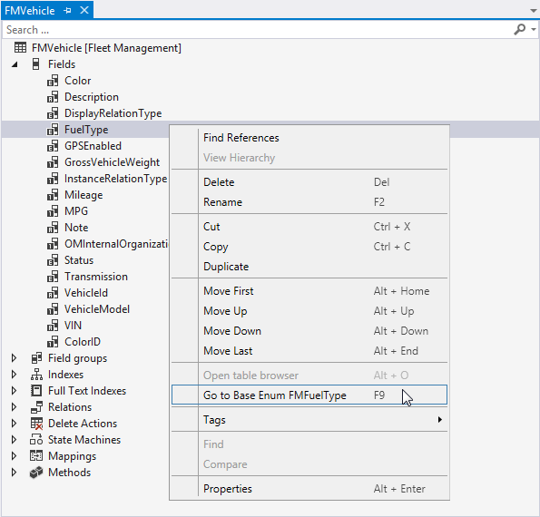

# Element designers

[!include [banner](../includes/banner.md)]

This article reviews the element designers and explains how to use them. The tools contain designers for each kind of element in the program. You use these designers when you create or modify elements.

## Open an element designer

To open an element designer, follow these steps.

1. Find the element in the project or in Application Explorer.
2. Right-click the element. In Application Explorer, click **Open designer**. In the project, click **Open**.
3. Expand the nodes in the element designer to see the details about the element.

## Node properties

When you select the individual nodes in the element designer, the **Properties** pane in Visual Studio shows the various properties for that node. Most of the characteristics of an element are controlled by these properties. For example, the following illustration shows the element designer for the FMCustomer table. Notice that the top-level node is selected.

The following illustration shows the set of properties for the table, which corresponds to the top-level node that is selected.

Each node for the element will have a set of properties that applies to it. To make it easier to find the properties that you want to work with, use the buttons at the top of the **Properties** pane to control how they are displayed. The properties can be arranged in the following ways.

| Organization | Description                                                                                                   |
|--------------|---------------------------------------------------------------------------------------------------------------|
| Alphabetical | Arrange the properties in alphabetical order.                                                                 |
| Categorized  | Arrange the properties into standard categories for the node type.                                            |
| Changed      | Divide the properties into those that have been changed and those that use the default values.                |
| Frequency    | Divide the properties into categories, based on whether a property is often, occasionally, or rarely changed. |

### Working with nodes

When you create or modify elements, you will often find that you must add or remove nodes for the element. For example, to add a field to a table, right-click the **Fields** node for the table element, point to **New**, and then click the type of field to add.

To remove a node, right-click the node, and then click **Delete**. You can also perform other actions for a node. You rename a node, duplicate a node, or move the node up or down in the node list.

### Searching element nodes

Sometimes, the node list for an element can be long, so that it's difficult to find the specific node that you're looking for. Notice that there is a search bar at the top of each element designer. You can enter a string to search for, and the node list will be filtered to include only the nodes that match the search string. For example, the following illustration shows the element designer for the FMCustomer table after the “Email” search term was applied. Only nodes that have names that match that search term appear in the element designer.

If you're working with a customization element or an extension element, you can prefix your search string with **c:** (for "customization elements") or **e:** (for "extension elements") to return only customizations or extensions, respectively. **Examples**

- **e:** returns all extensions that belong to the current element.
- **c:** returns all customizations that belong to the current element.
- **e:Email** returns all extension nodes that have the string "Email" in their name.
- **c:Email** returns all customization nodes that have the string "Email" in their name.

### Navigating to related elements

The value of a node in the element designer is often a reference to another element. For example, a field node in a table element is typically based on an extended data type (EDT) element. When you right-click a node in the element designer, you can click the **Go to &lt;element&gt;** command to navigate to that related element. For example, when you right-click the **FuelType** node in the list of fields for the FMVehicle table, you can click **Go to Base Enum FMFuelType** to show the base enumeration that is used to define the field.

[!INCLUDE[footer-include](../../../includes/footer-banner.md)]
