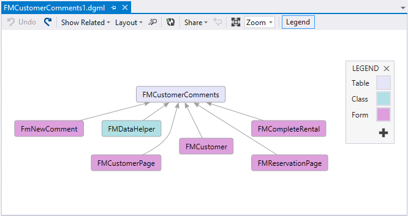

# Commands for determining how elements are used

[!include [banner](../includes/banner.md)]

This article reviews the commands that have been added to the Microsoft Visual studio Tools to help you determine how elements are used in an application. 

Because of the large number of elements in a typical application, commands have been added to the Microsoft Visual Studio Tools to make it easier to determine how an element is used.

## Finding where elements are used

During build operations, cross-reference information is generated that can be used to show how elements are used. You can right-click an element and then click **Find References** to display a list of the locations where that element is used. When you click one of the items in the list, the designer for the element opens. 

## Viewing a reference diagram

When you right-click some higher-level elements, such as tables, the **View Reference** command is available. This command produces a graphic that shows the elements that are related to the current element. You can right-click the items in the graphic and then click **Go To Definition** to navigate to those elements. 

## Additional resources

[Development tools in Visual Studio](development-tools-overview.md)

[Element designers](element-designers.md)

[!INCLUDE[footer-include](../../../includes/footer-banner.md)]