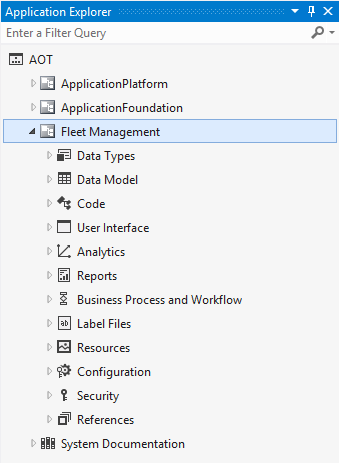

# Development tools tutorial

[!include [banner](../includes/banner.md)]

This tutorial tours the Fleet Management solution in Visual Studio and introduces you to the development tools.

In this tutorial, you'll take a tour of the Fleet Management solution in Visual Studio. You'll see how a project is organized in the Visual Studio development environment. Much of what you'll see uses standard Visual Studio features, plus you will notice that we've added some new customized features. Along the way we'll point out some of these new and customized features and how they ease development. This tutorial will focus on:

- Visual Studio projects and their features.
- Files used in development.

## Prerequisites

This tutorial requires you to access the environment using Remote Desktop and to be provisioned as an administrator for the instance.

## Setup

1. Start Visual Studio using **Run as an administrator**.
2. On the **File** menu, point to **Open** and then click **Project/Solution**.
3. Browse to the **Desktop,** and then open the **FleetManagement** folder. If the solution file is not on your computer, the steps to create it are listed in [Tutorial: Create a Fleet Management solution file out of the Fleet Management models in the AOT](https://community.dynamics.com/ax/b/newdynamicsax/archive/2016/05/19/tutorial-create-a-fleet-management-solution-file-out-of-the-fleet-management-models-in-the-aot).
4. Select the solution file named **FleetManagement**. The file type listed is Microsoft Visual Studio Solution (**SLN** file).
    - The fleet management solution file is available on the downloadable
    - VHD.

5. Click **Open**. The solution may take some time to load.

## View the FleetManagement model

1. On the **View** menu, click **Application Explorer**. **Application Explorer** opens in Classic view. This view provides a familiar view of the **Application Object Tree** (**AOT**), which is similar to what you see in MorphX. The new AOT categorizes model element types a little differently than Microsoft Dynamics AX 2012. For example:
   - Items that were previously found in the **Data Dictionary** node are now under **Data Model** or **Data Types**.
   - Classes and macros are under **Code**.
   - Forms, menus, and other GUI elements are under **User Interface**.
   - Business intelligence components are under **Analytics**.

       

2. In **Application Explorer**, right-click **AOT**, and then click **Model view**.

   

   Model view organizes programmable objects according to their model. For these tutorials, the application suite models have been removed. The core foundation and platform components have been separated from the application suite. This separation is what allowed the application suite models to be removed.
3. Double-click **Fleet Management**, or click the arrow to expand the model's tree node. Model view provides a familiar way to work with a set of programmable objects. It's similar to what you saw in Classic view, but the tree displays only the objects that are part of that particular model.
4. Double-click **User Interface**, and then double-click **Forms** to expand the forms node. In the Fleet Management sample, the names of forms and other programmable objects are prefixed with "FM" so that they're easy to identify. The name of each object is followed by the name of its layer, which in this case is "isv," and then by the name of the model it belongs to, which is "Fleet Management."
5. You can continue to expand the nodes in the tree. For example, double-click **FM Rental** to view the parts, data sources, and methods for the form.
6. From **Application Explorer**>, you can open the Visual Studio code editor and view the source code for the form. For example, right-click **FMRental**, and then click **View code**.
7. You can also open the **Form Designer**. For example, right-click **FMRental**, and then click **Open designer**. You can expand the tree nodes in the **Form Designer** to see and edit the form metadata.
8. You can also preview the form in the **Preview** pane. Click on a control in the preview to it in the Form Designer. Similarly, click on a control in the Form Designer to highlight it in the form preview.

## View the FleetManagement solution and its projects

This section of the tutorial describes the Fleet management projects and solution. Projects enable you to build your model elements (compile, synchronize the database, generate RDL files, etc.), test your application, and debug your code. We recommend that you don't make a change to a model element unless it's a part of a project; otherwise, your changes may not be compiled until you do a full build of your models, which can be a lengthy operation. In **Solution Explorer**, you can see the sample projects, two of which are named **FleetManagement Discounts** and **FleetManagement Migrated**. These projects are contained in a single Visual Studio solution, named **FleetManagement**.

1. In **Solution Explorer**, right-click **Fleet Management Migrated**, and then click **Properties**.
2. In the **Property Pages** dialog box, review the listed properties. In the **Startup Object** field, you can see the name of the first form that runs when you run or debug your project. You can see that the **Startup Object type** field is set to **Form**. You can also view the model name and its layer. A project always belongs to one model.
3. Don't change anything in this dialog box right now. Click **Cancel** to close it.

## View the source file for a model element

The code in a solution is stored as XML. The following instructions show you how to view the code in Visual Studio and the source XML in Internet Explorer.

1. In **Solution Explorer**, be sure that the **Fleet Management Migrated** project node is expanded.
2. Double-click **Code**, and then double-click **Classes**, to open the folder that contains the list of classes for the **Fleet Management Migrated** project.
3. In the list of classes, double-click **FMDataHelper** to open the code editor. Here, you can see the implementation of the **FMDataHelper** X++ class.
4. Scroll down in the code to locate the **main** method. **Tip**: You can also go the main method using the method navigation menu located on the top right of the code editor window.

    

    If this class is set as the startup object of the project, the **main** method will be the execution entry point when you run or debug the project.

    

5. In Windows, open **File Explorer**, and then browse to the following folder: C:\\Packages\\FleetManagement\\FleetManagement\\AxClass
6. Double-click the file named FMDataHelper.xml. If you're prompted to choose a program to open the file with, click **More options**, and then click **Internet Explorer**. Otherwise, open it in Notepad.

    

    In this file, you can see XML code that contains the metadata that describes the **FMDataHelper** class. For example, you can see that the class named **FMDataHelper** contains a set of methods. You can see the code that implements the **intializeNumberSequence** method for example, which is contained by an XML element. The &lt;!\[CDATA\]&gt; tag ensures that the contained text isn't interpreted or changed by the XML parser. This metadata contains the source code that you viewed in the Visual Studio code window. When you develop a solution, you always work with code that's stored as XML. This means that the code files are stored on your computer, not in the database. There isn't an active connection to an application object server (AOS) while you develop your application. To avoid data loss, we recommend that you maintain your project files in a source code control system, such as Visual Studio Team Foundation Server. Although it's helpful to know how and where the source code files are stored, don't modify the XML files directly. **Always use Visual Studio to modify the source code for your projects.**
7. Close the window that**FMDataHelper.xml** file.
8. In **Solution Explorer**, double-click **Label Files** in the **FleetManagement Migrated** project to open the folder to view the labels for the project, and then double-click on the **FLM\_en-US** node to open the label editor.

    

    In the label editor **Search** box, enter "rental." As you type, you'll see the list of labels for the Fleet Management sample that contain the word "rental." You can double-click in any cell that can be edited to change its contents, and then save the label file.

    

## Build the FleetManagement migrated project

1. In the **Solution Explorer**, right-click **Fleet Management Migrated**, and then click **Rebuild**.
2. In the **Output** window, in the **Show output from** list, click **Build**. Verify that the build completed without compilation errors. Wait for the build to complete. The final build message in the **Output** window says, "... build completed." the final build message in the status bar (at the bottom left corner of Visual Studio) says "Ready."

    

3. On the **View** menu, click **Error List** to see the list of best-practice warnings. We've deliberately left some warnings in the build to demonstrate this feature.
4. Double-click any warning message to view the code or resource that caused the warning.
5. In the **Window** menu, click **Close All Documents** to close all open documents.

[!INCLUDE[footer-include](../../../includes/footer-banner.md)]
