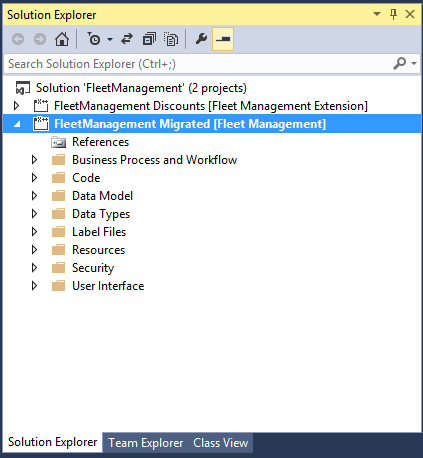

# Development tools tutorial

[!include [banner](../includes/banner.md)]

This tutorial tours the Fleet Management solution in Visual Studio and introduces you to the development tools.

In this tutorial, you take a tour of the Fleet Management solution in Visual Studio. You see how a project is organized in the Visual Studio development environment. Much of what you see uses standard Visual Studio features, plus you notice that the developers added some new customized features. Along the way, the tutorial points out some of these new and customized features and how they ease development. This tutorial focuses on:

- Visual Studio projects and their features.
- Files used in development.

## Prerequisites

You need to access the environment by using Remote Desktop and be provisioned as an administrator for the instance.

## Setup

1. Start Visual Studio by using **Run as an administrator**.
1. On the **File** menu, point to **Open** and then select **Project/Solution**.
1. Browse to the **Desktop**, and then open the **FleetManagement** folder. If the solution file isn't on your computer, see [End-to-end scenario for the Fleet Management sample application](fleet-management-sample.md) for steps to create it.
1. Select the solution file named **FleetManagement**. The file type listed is Microsoft Visual Studio Solution (**SLN** file).
    - The fleet management solution file is available on the downloadable
    - VHD.

1. Select **Open**. The solution might take some time to load.

## View the FleetManagement model

1. On the **View** menu, select **Application Explorer**. **Application Explorer** opens in Classic view. This view provides a familiar view of the **Application Object Tree** (**AOT**), which is similar to what you see in MorphX. The new AOT categorizes model element types a little differently than Microsoft Dynamics AX 2012. For example:
   - Items that you previously found in the **Data Dictionary** node are now under **Data Model** or **Data Types**.
   - Classes and macros are under **Code**.
   - Forms, menus, and other GUI elements are under **User Interface**.
   - Business intelligence components are under **Analytics**.

       :::image type="content" source="./media/aot_introvisualstudio.png" alt-text="Screenshot of Application Explorer opened to Analytics.":::

1. In **Application Explorer**, right-click **AOT**, and then select **Model view**.

   :::image type="content" source="./media/filterquery_introvisualstudio.png" alt-text="Screenshot of the Model View filter query for Fleet Management.":::

   Model view organizes programmable objects according to their model. For these tutorials, the application suite models are removed. The core foundation and platform components are separated from the application suite. This separation is what allows the application suite models to be removed.
1. Double-click **Fleet Management**, or select the arrow to expand the model's tree node. Model view provides a familiar way to work with a set of programmable objects. It's similar to what you saw in Classic view, but the tree displays only the objects that are part of that particular model.
1. Double-click **User Interface**, and then double-click **Forms** to expand the forms node. In the Fleet Management sample, the names of forms and other programmable objects are prefixed with "FM" so that they're easy to identify. The name of each object is followed by the name of its layer, which in this case is "isv," and then by the name of the model it belongs to, which is "Fleet Management."
1. You can continue to expand the nodes in the tree. For example, double-click **FM Rental** to view the parts, data sources, and methods for the form.
1. From **Application Explorer**, you can open the Visual Studio code editor and view the source code for the form. For example, right-click **FMRental**, and then select **View code**.
1. You can also open the **Form Designer**. For example, right-click **FMRental**, and then select **Open designer**. You can expand the tree nodes in the **Form Designer** to see and edit the form metadata.
1. You can also preview the form in the **Preview** pane. Select a control in the preview to it in the Form Designer. Similarly, select a control in the Form Designer to highlight it in the form preview.

## View the FleetManagement solution and its projects

This section of the tutorial describes the Fleet management projects and solution. Use projects to build your model elements (compile, synchronize the database, generate RDL files, and more), test your application, and debug your code. Don't make changes to a model element unless it's part of a project. Otherwise, your changes might not be compiled until you do a full build of your models, which can be a lengthy operation. In **Solution Explorer**, you can see the sample projects, two of which are named **FleetManagement Discounts** and **FleetManagement Migrated**. These projects are contained in a single Visual Studio solution, named **FleetManagement**.

1. In **Solution Explorer**, right-click **Fleet Management Migrated**, and then select **Properties**.
1. In the **Property Pages** dialog box, review the listed properties. In the **Startup Object** field, you can see the name of the first form that runs when you run or debug your project. You can see that the **Startup Object type** field is set to **Form**. You can also view the model name and its layer. A project always belongs to one model.
1. Don't change anything in this dialog box right now. Select **Cancel** to close it.

## View the source file for a model element

The code in a solution is stored as XML. The following instructions show you how to view the code in Visual Studio and the source XML in Microsoft Edge.

1. In **Solution Explorer**, make sure the **Fleet Management Migrated** project node is expanded.
1. Double-click **Code**, and then double-click **Classes** to open the folder that contains the list of classes for the **Fleet Management Migrated** project.
1. In the list of classes, double-click **FMDataHelper** to open the code editor. Here, you can see the implementation of the **FMDataHelper** X++ class.
1. Scroll down in the code to locate the **main** method. **Tip**: You can also go to the main method by using the method navigation menu located on the top right of the code editor window.

    :::image type="content" source="./media/main_introvisualstudio.png" alt-text="Screenshot of the Source menu in the code editor.".:::

    If you set this class as the startup object of the project, the **main** method is the execution entry point when you run or debug the project.

    :::image type="content" source="./media/fmdatahelper_introvisualstudio.png" alt-text="Screenshot of the source code for FmDataHelper.".:::

1. In Windows, open **File Explorer**, and then browse to the following folder: `C:\Packages\FleetManagement\FleetManagement\AxClass`
1. Double-click the file named `FMDataHelper.xml`. If you're prompted to choose a program to open the file, select **More options**, and then select **Microsoft Edge**. Otherwise, open it in Notepad.

    :::image type="content" source="./media/notepad_introvisualstudio.png" alt-text="Screenshot of the browser view of source code.".:::

    In this file, you can see XML code that contains the metadata that describes the **FMDataHelper** class. For example, you can see that the class named **FMDataHelper** contains a set of methods. You can see the code that implements the **intializeNumberSequence** method, which is contained by an XML element. The `<![CDATA]>` tag ensures that the contained text isn't interpreted or changed by the XML parser. This metadata contains the source code that you viewed in the Visual Studio code window. When you develop a solution, you always work with code that's stored as XML. This means that the code files are stored on your computer, not in the database. There's no active connection to an application object server (AOS) while you develop your application. To avoid data loss, maintain your project files in a source code control system, such as Visual Studio Team Foundation Server. Although it's helpful to know how and where the source code files are stored, don't modify the XML files directly. **Always use Visual Studio to modify the source code for your projects.**
1. Close the window that contains the **FMDataHelper.xml** file.
1. In **Solution Explorer**, double-click **Label Files** in the **FleetManagement Migrated** project to open the folder to view the labels for the project. Then, double-click the **FLM\_en-US** node to open the label editor.

    :::image type="content" source="./media/flm_en-us_introvisualstudio.png" alt-text="Screenshot of the label files in Solution Explorer.".:::

    In the label editor **Search** box, enter "rental." As you type, you see the list of labels for the Fleet Management sample that contain the word "rental." You can double-click in any cell that you can edit to change its contents, and then save the label file.

    :::image type="content" source="./media/search-rental_introvisualstudio.png" alt-text="Screenshot of the list of labels filtered by rental.".:::

## Build the FleetManagement migrated project

1. In **Solution Explorer**, right-click **Fleet Management Migrated**, and then select **Rebuild**.
1. In the **Output** window, in the **Show output from** list, select **Build**. Verify that the build completed without compilation errors. Wait for the build to complete. The final build message in the **Output** window says, "... build completed." The final build message in the status bar (at the bottom left corner of Visual Studio) says "Ready."

    :::image type="content" source="./media/output_introvisualstudio.png" alt-text="Screenshot of the Build output window.".:::

1. On the **View** menu, select **Error List** to see the list of best-practice warnings. The project deliberately includes some warnings to demonstrate this feature.
1. Double-click any warning message to view the code or resource that caused the warning.
1. In the **Window** menu, select **Close All Documents** to close all open documents.

[!INCLUDE[footer-include](../../../includes/footer-banner.md)]
