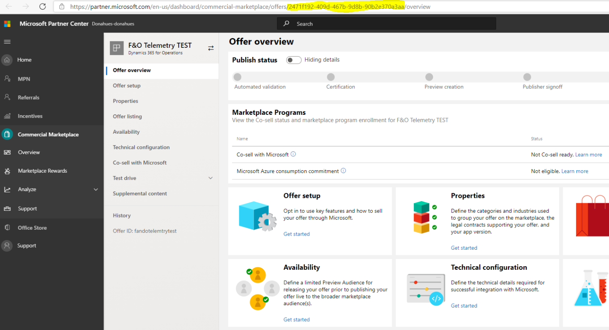
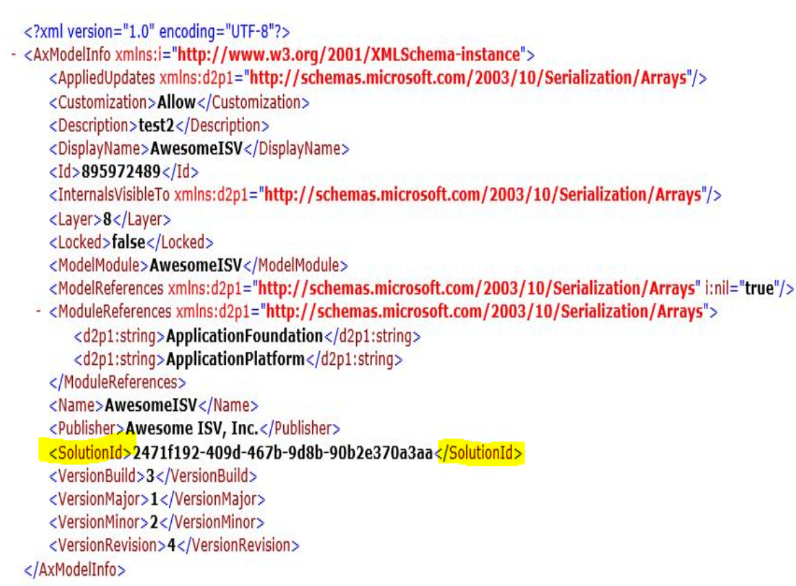

# X++ Modules and ISV Studio

Independent software vendors (ISVs) can link their X++ modules to their registered products and solutions by using [ISV Studio](https://docs.microsoft.com/powerapps/developer/data-platform/isv-app-management). Linking enables ISV's to monitor the success and usage of their applications in Finance and Operations apps.

> [!NOTE]
> For the link from X++ into ISV Studio to work correctly, customers need to have deployed ISV packages with the correct solution ID in all the ISV models, and the customer's environment has to run version 10.0.16 or higher.

## Find the product ID in Partner Center

Sign in to Partner Center and open the **Offer overview** page for your product. From the browser URL bar, locate the product id GUID (global unique identifier) as shown below.

> [!NOTE]
> The product id does not necessarily match the offer code of your product, although they may be similar. Using the offer code in your descriptors will not correctly identify your X++ modules to ISV Studio.

## Update your X++ models' descriptors

For all models that make up your solution, locate the descriptor XML files. In every descriptor belonging to the solution, update the SolutionId tag with the product id from partner center.

After recompilation, the X++ binaries now contain the product id and will link to ISV Studio once deployed to Tier2+ sandbox or production environments.
