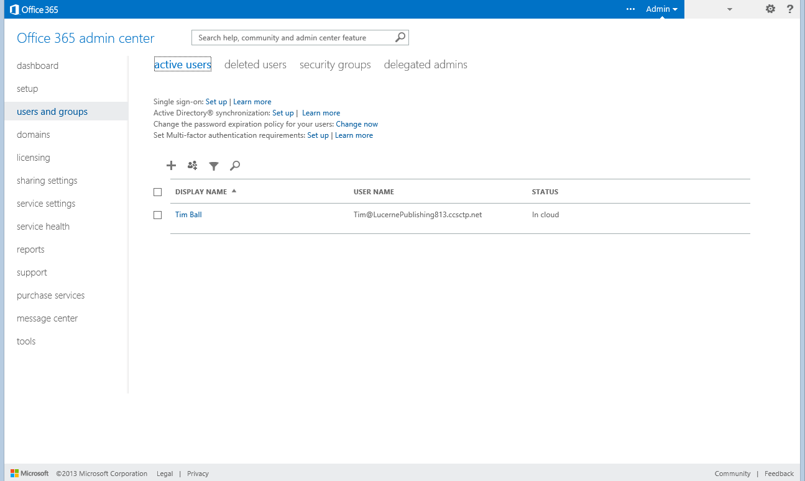

# Sign up for preview subscriptions

[!include [banner](../includes/banner.md)]

This article explains how to subscribe to the preview/partner offer and deploy an environment. The subscription that you create gives you a Microsoft Online Services test tenant and a Microsoft Dynamics 365 Lifecycle Services project where you can deploy an environment. This article will also help you set up additional users in your Microsoft Online Services tenant and gain experience with service administration capabilities. Here are the skills that you will learn:

- Subscribe, and create a new Microsoft Online test tenant.
- Navigate to Lifecycle Services projects.
- Use various features of Lifecycle Services.
- Add users to Microsoft Azure Active Directory (Azure AD) and the client.
- View resources in your subscription email.

## Key terms

- **Microsoft Online Services tenant** – A tenant is the group of all subscriptions and users for your organization. The tenant is created at the same time as your first subscription in Microsoft Online Services.
- **Subscription** – A subscription gives you an online cloud environment and experience. It also lets you see how customizations that you develop can be deployed to the cloud.
- **Microsoft Azure Active Directory** – The cloud environment includes Azure AD. Azure AD helps you manage users, groups, security roles, and licenses for online applications, much as you manage them for on-premise environments.
- **Users** – Users of the services that your organization has subscribed to are managed in Azure AD. Any users in your tenant can be added and assigned to security roles.
- **Developers and administrators** – Developers and administrators are users who also have access to Lifecycle Services that lets them manage projects and environments. These users are also end users.
- **Organizational account** – Users receive Azure AD credentials. These credentials are separate from other desktop or corporate credentials. The Azure AD credentials are used to sign in to Microsoft 365 and other Microsoft cloud services. Users sign in by using their organizational account.

    > [!IMPORTANT]
    > For this release, we ask that you not use any existing credentials that are associated with other online services, such as Microsoft 365 or Microsoft Dynamics CRM Online.

- **Microsoft account** – Microsoft accounts were formerly known as Passport accounts or Windows Live ID accounts. Currently, Microsoft accounts can't be used with finance and operations applications, Microsoft Dynamics 365 Commerce, or other Microsoft Online Services. However, Microsoft accounts are still required for Microsoft Connect and other Microsoft Business Solutions sites, such as Information Source and Microsoft Dynamics Community. You will continue to use your Microsoft account to access these services.
- **Microsoft 365 admin center** – Microsoft 365 admin center is the subscription management portal that Microsoft 365 provides for administrators. Microsoft 365 admin center is used to provide management functions for users and subscriptions.
- **Environments** – You can deploy as many single instances of a virtual machine (VM) as you require. We call these instances *environments*.

## Prerequisites

1. You've received an email that invites you to participate in the preview.
2. If your company has an organizational account with Microsoft Online Services, and you're signed in, you must sign out before you continue. Alternatively, you can use **InPrivate Browsing** mode.
3. If you aren't sure whether you're signed in, delete your browser cookies, and then close your browser before you continue.

## Subscribe

> [!IMPORTANT]
> Only one person (tenant administrator) in an organization must perform this task. If you aren't the person who is subscribing to this release, wait until your organization has been signed up and you've received your user credentials. Then continue with the procedure.

1. Finance and operations applications and Retail are available only to existing Microsoft Dynamics 365 channel partners and customers who are currently enrolled in the Business Ready Enhancement Plan (BREP) service plan. To subscribe, visit [PartnerSource Business Center](https://businesscenter.mbs.microsoft.com/#contentdetail/Microsoft_Dynamics_AX_Public_Preview).
2. On the **Account setup** page, in the **Country or region** field, select the country or region.
3. Follow the wizard and prompts to complete the sign-up, until you reach the last step.

    

## Start a new project in Lifecycle Services

> [!NOTE]
> Prospect projects is available only in Global Lifecycle Services (https://lcs.dynamics.com). The preview license is not available in Local Lifecycle Services. For more information about Lifecycle Services in local geographies, see [Dynamics 365 Finance, Supply Chain Management, and Commerce in local geographies](../deployment/deployment-options-geo.md).

To use Lifecycle Services to manage your environments, you must create a new project.

1. Go to <https://lcs.dynamics.com/Logon/Index>.
2. Select **Sign in**.
3. Sign in by using the account that you used to subscribe.
4. Select the plus sign (**+**) to create a new project.

    

5. Select the project type.
6. Enter the project information, and then select **Create**.

    If you plan to evaluate Commerce, be sure to select **Microsoft Dynamics 365 Commerce** in the **Product name** field.

    The new project for managing your instance is created.

    

## Add users to Lifecycle Services

You're already set up as a user of your Lifecycle Services project. If you've also added other Microsoft 365 users, you must add them to this project. Other administrators and developers will then be able to deploy their own environments. These Lifecycle Services users are team members who will actively work on the implementation. Don't confuse them with end users. Start on the project page in Lifecycle Services.

1. Scroll to the right, and then, in the **More tools** section, select the **Project users** tile.
2. In the upper left, select the plus sign (**+**) to add a new user.
3. In the **Email** field, enter the email address of the user that you're adding. This email address should be the Microsoft 365 organization email address that you created earlier.
4. In the **Project role** field, select **Project Owner**.
5. Select **Invite**.
6. Repeat steps 2 through 5 for all users in your organization.

## Deploy environments

Environments should be deployed to an existing Azure subscription.

> [!NOTE]
> Each developer of an environment must deploy their own system to Azure. However, only the first project user must set up the Azure subscription for deployment.

You can create environments in two ways:

- Deploy to Microsoft cloud services (Azure).
- Download a local virtual hard disk (VHD).

Start on the project page in Lifecycle Services.

1. In the **Environments** section, select the plus sign (**+**). The **Microsoft Azure setup** dialog box appears.
2. Enter your Azure subscription ID. You can find your Azure subscription ID in Azure Portal (<https://ms.portal.azure.com/>), under **Settings** in the lower left.
3. Select **Next**.
4. Download the Azure Management Certificate to a local folder on your computer, and then upload it to Azure Management Portal by going to **Settings** &gt; **Management Certificates**. This certificate will enable Lifecycle Services to communicate with Azure on your behalf.
5. Return to Lifecycle Services, and select **Next**.
6. Select the Azure region to deploy in. The **West US** region will have the fastest deployments, but it's important that you select a data center that is close to where you plan to use this system.
7. Select **Connect**.
8. In the list of available topologies, select the topology to deploy. You can select either the **Download** link to download the VHD or **Next** to deploy on Azure. Azure is the preferred path.
9. Enter the name of the environment.
10. Read the pricing and licensing terms, and then select the check box to indicate that you understand them.
11. Select **Next**.
12. Confirm the details, and then select **Deploy**.

    > [!NOTE]
    > Developers and administrators who will use their own environments must sign in and repeat these steps.

    After you deploy your environment, it's available in the **Environments** section.

    

13. Select the environment to view details about the deployment status. The first deployment will require a few hours, but each subsequent deployment will be much faster.
14. When the deployment status changes to **Deployed**, select **Login** to connect to the client, or select the name of the VM to connect to the development machine by using Remote Desktop. After the deployment is completed, you can find the base URL and the information that you require to connect to the environment via Remote Desktop.

## Use the features of Lifecycle Services

Lifecycle Services is the starting point for performing online administrative activities. Here are some of these activities:

- Deploy VMs on Azure.
- Access materials.
- Access downloads of tools and resources.

### Explore the Lifecycle Services project

1. Review the methodology, and complete the tasks and phases as you progress through the life cycle. The phases and task information lets you view tools and resources that are available throughout your enterprise resource planning (ERP) experience.

2. Scroll to the right, and review the tiles.

    ]

    The available tiles include various tools and services in Lifecycle Services. They also include the following additional tiles:

    - **My subscription** – The Microsoft 365 subscription management portal is where you can view and work with your online subscriptions. By selecting **User and Groups** in the left navigation section of the page, you can also manage your online users.

        > [!NOTE]
        > To access the page, you must be a member of the **Global Administrator** role for your organization's Microsoft Online Services tenant.

    - **Feedback and bugs** – This tile opens the **General Feedback** page in Microsoft Connect. Use this page to record bugs, and to design change requests, feature requests, and suggestions.
    - **Microsoft 365 users** – This tile opens the **Users and groups** page in Microsoft 365 admin center. You can add, update, and remove users, reset passwords, and assign licenses for other services.

        > [!NOTE]
        > To access the page, you must be a member of the **Global Administrator** role for your organization's Microsoft Online Services tenant. The installing user is always a global administrator, but other users must be added to this role.

        

[!INCLUDE[footer-include](../../../includes/footer-banner.md)]

