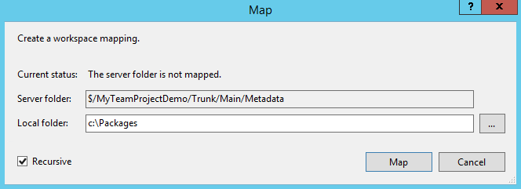
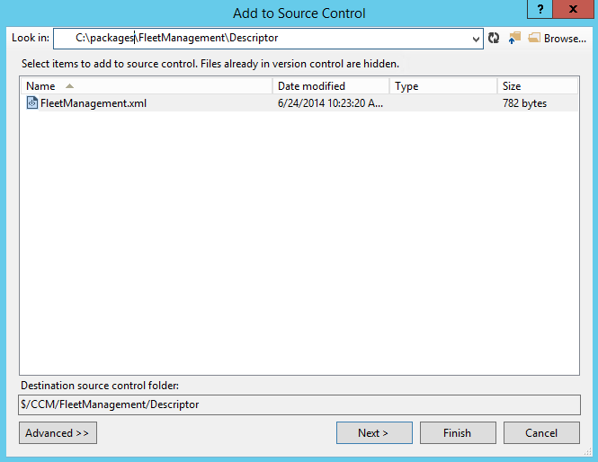

# Version control, metadata search, and navigation

[!include [banner](../includes/banner.md)]

This tutorial shows you how to configure Microsoft Azure DevOps to enable source control on your models. It also helps you learn about other productivity features in the development tools, including the ability to create and organize TODO tasks, search metadata and source code, navigate between related model elements, and create a project from a model.

## Configure your Azure DevOps organization and project

In this section, you create a new project in Azure DevOps. This project hosts the source code of your model. You use the Fleet Management model as an example. If you don't have an Azure DevOps organization, you create one.

### Sign up for Azure DevOps, create an account, and create a new project

Go to <https://www.visualstudio.com/> to sign up for Azure DevOps. Select **Sign up**. If you already have an account in Azure DevOps, go to the [Create an Azure DevOps team project](#create-an-azure-devops-team-project) section later in this article.

1. Sign in by using your Microsoft account.

    > [!NOTE]
    > You can also use an organizational account (Microsoft 365 domain).

1. Create an Azure DevOps organization, and select a URL for your account. Use this URL to connect from your development computer when you configure source control in Visual Studio. The following image shows an example of the account URL.

    :::image type="content" source="./media/accounturl_usingdevotools.png" alt-text="Screenshot of the account URL selection page in Azure DevOps.":::

    When you create the account, you're directed to your account main page where you're prompted to create your first project.
1. Create a demo **Fleet Management** project.

    > [!NOTE]
    > This tutorial assumes that you're using Team Foundation Version Control (TFVC), which is the default option for finance and operations apps. For information about how to use Git for X++ development, see [X++ in Git](git-intro.md).

    :::image type="content" source="./media/firstproject_usingdevotools.png" alt-text="Screenshot of the Create your first project dialog in Azure DevOps.":::

### Create an Azure DevOps team project

If you already have an Azure DevOps organization, go to your account in Microsoft Edge. This article uses **.visualstudio.com** as the example URL for illustration purposes.

1. Go to <https://www.visualstudio.com/>.
1. Under **Recent projects & teams**, select **New** to create a new project.

   :::image type="content" source="./media/clicknew_usingdevotools.png" alt-text="Screenshot of the New project button under Recent projects and teams in Azure DevOps.":::

1. In the **Project name** field, enter **Fleet Management**, enter a **Description**, and then select **Create project**.

### Create the recommended folder structure in your team project

If you migrate your code from a previous version by using the automated code upgrade tool in Microsoft Dynamics Lifecycle Services, the following folder structure is automatically created in your Azure DevOps team project.

:::image type="content" source="./media/vsofolders1.png" alt-text="Screenshot of the default folder structure in Azure DevOps.":::

The **Metadata** folder contains your source XML files organized by packages and models, and the **Projects** folder contains Visual Studio projects. If you're not migrating code and are starting from scratch, create a similar folder structure on the server in your team project before you start development.

### Configure Visual Studio to connect to your team project

1. Open Visual Studio. If you're signed in to the machine as an administrator, open Visual Studio as an administrator.
1. Select **Tools** > **Options** > **Source Control** > **Plug-in Selection**.
1. In the **Current source control plug-in** field, select **Visual Studio Team Foundation Server**.
1. Select **Team** > **Connect to Team Foundation Server**.
1. In **Team Explorer**, select **Select Team Projects**.
1. In the **Select a Team Foundation Server** drop-down list, select the **Azure DevOps organization** that hosts the Fleet Management project, or select **Servers** if it isn't in the menu.

    1. When the **Add/Remove Team Foundation Server** dialog opens, select **Add**.
    1. Enter the URL of your Azure DevOps organization.
    1. Select **OK**.
    1. If prompted, enter your Microsoft Account username and password.

1. Select the **Fleet Management** check box under **Team projects**, and then select **Connect**.

    :::image type="content" source="./media/connecttfsserver_usingdevotools.png" alt-text="Screenshot of the Connect to Team Foundation Server dialog in Visual Studio.":::

### Map your Azure DevOps project to your local model store and projects folder

Your model store root folder contains source files for all packages and models that are part of your application. During deployment, you typically use source files from more than one model across more than one package. Map your model store root folder to the Azure DevOps team project metadata folder.

1. In Visual Studio **Team Explorer**, connect to the team project as described earlier in this document.
1. Open **Source Control Explorer** from **Team Explorer**.
1. Map the **Metadata** folder of your team project to the root folder of the model store on your local drive (typically `K:\AOSService\PackagesLocalDirectory`). An example is shown in the following image.

    > [!NOTE]
    > Your model store might be located under `I:\AosService\PackagesLocalDirectory` or another drive, depending on your machine configuration.

    

1. Select **Map**, and in the next dialog, select **No**.
1. Similarly, map the **/Trunk/Main/Projects** server folder to the **local projects folder** that holds your Visual Studio solution and project files.

## Scenario 1: Open the fleet management solution and add it to Azure DevOps source control

This section describes the steps needed to add a solution to Azure DevOps source control. This scenario is relevant when you start development on a new model and you're adding it to source control for the first time. For code migration scenarios, or when you're synchronizing new models that another developer created, see [scenario 2](#scenario-2-synchronize-models-from-source-control).

### Open the FleetManagement solution

> [!NOTE]
> This project is only an example. You can open any project or solution to learn about the process of adding a solution to source control.

1. On the **File** menu, point to **Open**, and then select **Project/Solution**.
1. Browse to the desktop and open the **FleetManagement** folder.
1. Select the solution file named **FleetManagement**. The file type is listed as **Microsoft Visual Studio Solution**. If the solution file isn't on your computer, create it by following the steps in [End-to-end scenario for the Fleet Management sample application](fleet-management-sample.md).
1. Select **Open**. Loading the solution might take some time.

### Add the FleetManagement solution to source control

1. In **Solution Explorer**, right-click the Fleet Management solution, and select **Add Solution to Source Control**.
1. Select **Team Foundation Version Control**, and then select **Next**.
1. In the **Team Project Location**, select **Projects**.

    > [!NOTE]
    > If you already mapped the server **Projects** folder to a local folder that contains the FleetManagement solution, skip steps 2 and 3.

    :::image type="content" source="./media/vsofolders31.png" alt-text="Screenshot of the folder structure of Team Foundation Server.":::

1. Select **OK**.
1. Go to **Team Explorer > Pending changes**, and then select **Check-in** to check in your solution and its model element to the Azure DevOps source control.

### Add the model descriptor file to source control

All Visual Studio projects belong to models. Models are source code distribution and deployment units that are typically larger in scope than a Visual Studio project. In the previous section, you added element files of the fleet management solution to source control. Because this action was the first time you added elements of the Fleet Management models to source control, you also need to check in the model descriptor file.

1. In Visual Studio, in **Team Explorer**, open **Source Control Explorer**.
1. Right-click the metadata folder (for example, **\Trunk\Main\Metadata**) and select **Add Items to Folder...**.
1. Select your model descriptor file. The model descriptor file is the XML file manifest of your model. It's located in the **Descriptor** folder of the package that the model belongs to. The following image shows an example of where the model descriptor file of the Fleet Management model exists (c:\\packages\\FleetManagement\\Descriptor\\FleetManagement.xml).

    > [!NOTE]
    > Depending on your machine configuration, your model store might be located under K:\AosService\PackagesLocalDirectory, c:\AosService\PackagesLocalDirectory, or another drive.

    

1. Select **Finish**.

    > [!NOTE]
    > Because your solution contains elements from two models, you need to add an extra model descriptor file to source control: K:\\AOSService\\PackagesLocalDirectory\\FleetManagementExtension\\Descriptor\\FleetManagementExtension.xml

1. Check in your pending items. You can now develop the fleet management application by using a state-of-the-art, cloud-based source control system and many other application lifecycle features of Azure DevOps.

### Experiment with source control

In this section, you make minor changes to the **FMRental** table and compare your changes with the latest version in your source code repository.

1. In **Solution Explorer**, select **Fleet Management Migrated > Data model > Tables > FMRental**.
1. Double-click **FMRental** to open the designer.
1. Right-click the **Fields** node, and then select **New > Integer**.

    :::image type="content" source="./media/newinteger_usingdevotools.png" alt-text="Screenshot of adding a new integer field in the FMRental table designer." lightbox="./media/newinteger_usingdevotools.png":::

1. Right-click **Methods**, and add a new method.
1. In the X++ code editor, enter a comment in the new method.
1. Enter a comment in any existing method.
1. Save the **FMRental** table.
1. In **Team Explorer**, right-click **FMRental.xml**, and select **Compare with Latest Version**.

    :::image type="content" source="./media/compareversions_usingdevotools.png" alt-text="Screenshot of the Compare versions option in Team Explorer." lightbox="./media/compareversions_usingdevotools.png":::

1. Browse through the differences in the **comparison (Diff)** window.
1. In **Solution Explorer**, right-click on the **FMRental** table, and select **Source control > Undo > Pending Changes** to revert your changes.

    :::image type="content" source="./media/undo_usingdevotools.png" alt-text="Screenshot of the Undo pending changes option in Solution Explorer." lightbox="./media/undo_usingdevotools.png":::

1. Confirm the undo on the next dialog and close the **diff** window.

## Scenario 2: Synchronize models from source control

In this section, you synchronize existing models and model elements from your Azure DevOps project. Synchronization is relevant in the following cases: 1) You migrated your code from a previous version via Lifecycle Services, or 2) another developer checked in a new model or new model elements, and you want to synchronize them to your development environment.

1. In **Source Control Explorer**, right-click on **Metadata** and select **Get Latest Version**. Getting the latest version synchronizes your local packages folder with the latest code.
1. Alternatively, use the **Advanced** menu to synchronize a specific build version or change sets.

    :::image type="content" source="./media/getlatest.png" alt-text="Screenshot of the Get Latest Version option in Source Control Explorer.":::

1. When synchronization is complete, and if the synchronization adds new models to your environment, refresh your metadata from Visual Studio.
1. Go to **Dynamics 365 &gt; Model Management &gt; Refresh models**.

## Organize TODO tasks in a project

This section describes how to create a Visual Studio project from tasks (TODO comments) embedded in your X++ code.

1. In **Solution Explorer**, select **Fleet Management Migrated > Code > Classes > FMDataHelper**, and then double-click **FMDataHelper**. The X++ code editor opens.
1. Enter a TODO comment (`//TODO: my comment`) inside any method.

    :::image type="content" source="./media/code_usingdevotools.png" alt-text="Screenshot of an example of TODO comments in the X++ code editor." lightbox="./media/code_usingdevotools.png":::

1. Open other Fleet Management classes or tables and add more TODO comments.
1. Rebuild the **FleetManagement Migrated** project.
1. Select **View > Task List** to open the Visual Studio **Task List** window.

    :::image type="content" source="./media/tasklist_usingdevotools.png" alt-text="Screenshot of opening the Task List window in Visual Studio." lightbox="./media/tasklist_usingdevotools.png":::

1. Select **Comments** from the drop-down list.

    :::image type="content" source="./media/tasklistcomments_usingdevotools.png" alt-text="Screenshot of viewing comments in the Task List window." lightbox="./media/tasklistcomments_usingdevotools.png":::

1. Select all TODO items, right-click, and select **Add to new project**.

    :::image type="content" source="./media/addnewproject_usingdevotools.png" alt-text="Screenshot of selecting TODO comments to add to a new project." lightbox="./media/addnewproject_usingdevotools.png":::

1. Adding the items opens the **New project** dialog and enables you to create a new project that contains all of your TODOs.
1. You can save this project as a working project to manage your TODO list.
1. When you finish, undo all of your pending changes in **Team Explorer**.

    :::image type="content" source="./media/undoall_usingdevotools.png" alt-text="Screenshot of undoing all the changes in Team Explorer." lightbox="./media/undoall_usingdevotools.png":::

1. Select **File > Close Solution** to close the FleetManagement solution.

## Use metadata search and navigation tools to find elements and create projects

This section demonstrates how you can perform metadata-based searches throughout your application.

### Use the Metadata search window

1. Select **Dynamics 365 > Metadata search**.
1. In the **Metadata search** window, in the **Search** field, enter the following text to find all of the table insert methods in the Application Suite model that contain a cross-company query: `type:table,method name:insert code:"crosscompany" model:"Application Suite"`.
1. Wait for the search to complete. It might take a while.

   :::image type="content" source="./media/metadatasearchresults_usingdevotools.png" alt-text="Screenshot of metadata search results in the Metadata search window."
:::

1. Double-click a result in the list. The code editor opens and places the cursor at the line that matches your search criteria.
1. Select several elements in the results list by holding down the Ctrl key for multiple selections, right-click, and then select **Add to new project**. When you add the elements, you can create a new solution and project containing the selected elements.

### Try other search examples

You don't need to wait for the search to complete before you interact with search results. You can double-click results at any time to view the metadata or source code that matches your search criteria. The following are some suggested search examples:

- Find vertical tab controls defined in view mode and autowidth mode in the model Application Suite. 

    `type:form,formtabcontrol property:arrangeMethod=Vertical,ViewEditMode=view,WidthMode=Auto model:"Application Suite"`

- Find all grid controls in forms that aren't editable and with the property heightmode = column.

    `type:form,formgridcontrol:allowedit=no,heightmode=column`

- Find all SimpleListDetail forms in the Application Suite model.

    `type:formdesign property:style=simplelistdetail model:"Application Suite"`

- Find all tables that have an index field name that contains the keyword xpNum.

    `type:table,tableindexfield anem: xpNum*`

- Use the search bar drop-down menu to access previous searches.

    :::image type="content" source="./media/accessprevious_usingdevotools.png" alt-text="Screenshot of using the drop-down menu to access previous searches." lightbox="./media/accessprevious_usingdevotools.png":::

## Navigate to related elements

This section highlights a feature that enables you to move from one element to a related element without having to find the related elements in **Application Explorer** or **Solution Explorer**.

1. Open **Application Explorer**, and switch the view to **Model View**.

    :::image type="content" source="./media/modelview_usingdevotool1.png" alt-text="Screenshot of opening Application Explorer in Model View." lightbox="./media/modelview_usingdevotool1.png":::

1. Under the **Fleet Management** model, select **User Interface > Menu items > Display Menu Items > FMCustomer**.

    :::image type="content" source="./media/fmcustomerisv_usingdevotools.png" alt-text="Screenshot of selecting FMCustomer in Application Explorer." lightbox="./media/fmcustomerisv_usingdevotools.png":::

1. Right-click **FMCustomer**, and then select **Open designer**.
1. In the **FMCustomer** menu item designer, right-click the root node, and then select **Go to Form FMCustomer**.

    :::image type="content" source="./media/goformfmcustomer_usingdevotools.png" alt-text="Screenshot of navigating to a form using Application Explorer." lightbox="./media/goformfmcustomer_usingdevotools.png":::

    The **FMCustomer** form designer opens.

1. In the designer of the **FMCustomer** form, expand **Data sources**, right-click **FMCustomer**, and then select **Go to Table FMCustomer**.

    :::image type="content" source="./media/gotablefmcustomer_usingdevotools.png" alt-text="Screenshot of navigating to a table using Application Explorer." lightbox="./media/gotablefmcustomer_usingdevotools.png":::

    The **FMCustomer** table designer opens.

1. By using the same methodology, you can navigate to the EDT element that a table field references. **Tip**: Press F9 instead of opening the context menu. F9 opens the designer of the referenced element. **Tip**: You can add an element to the current project by right-clicking on the document tab and selecting **Add to project**.

    :::image type="content" source="./media/addtoproject_usingdevotools.png" alt-text="Screenshot of the Add to project option in the document tab context menu.":::

## Use Application Explorer to create a project from a model

You can use Application Explorer to search for all or some elements of a model and create a project from the search results.

1. Make sure the option to organize a project by element type is on. Go to **Dynamics 365** > **Options** > **Projects**.
1. Go to Application Explorer and search for elements in the desired model. For example, enter *model:"fleet management"* and select **Enter**.

    :::image type="content" source="./media/appexplorermodelsearch.jpg" alt-text="Screenshot of searching for a model in Application Explorer." lightbox="./media/appexplorermodelsearch.jpg":::

1. When the search finishes, right-click the AOT root node and select **Add search results to new project.**

    :::image type="content" source="./media/addsearchresultstonewproject.jpg" alt-text="Screenshot of adding search results to a new project in Application Explorer." lightbox="./media/addsearchresultstonewproject.jpg":::

1. Specify your project properties in the new project dialog and select **OK** to create the project.

    > [!TIP]
    > To create a project from search results, add any type, name, or other filters to your search as long as all results are in the same model. For example, *model:"Fleet Management" type:Table name:^FM* returns all tables in the Fleet Management model with a name starting with the letters FM.

[!INCLUDE[footer-include](../../../includes/footer-banner.md)]
