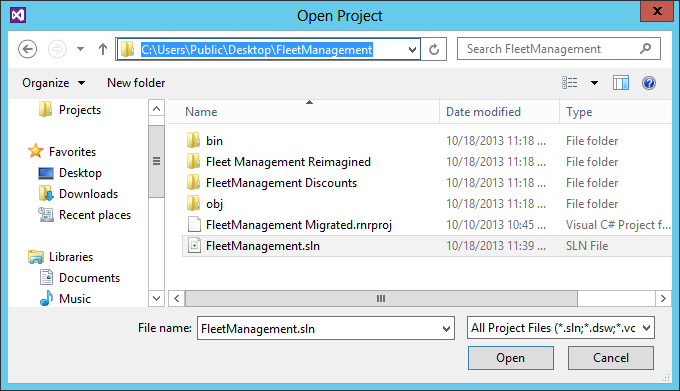
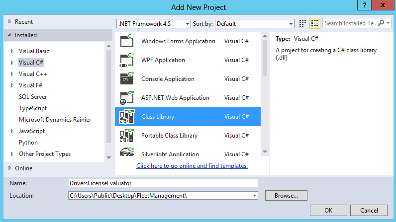
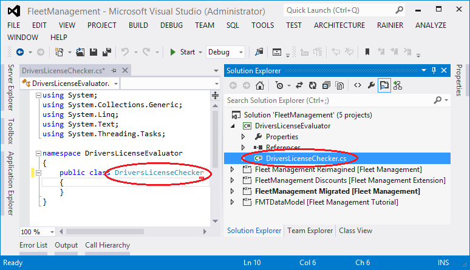

# Write business logic by using C# and X++ source code

[!include [banner](../includes/banner.md)]

The primary goal of this tutorial is to illustrate the interoperability between C# and X++. In this tutorial, you write business logic in C# source code and in X++ source code.

You gain experience with the following:

- New tools in Visual Studio.
- The handling of events in C#.
- The use of Language Integrated Query (LINQ) in C# to fetch data.

## Prerequisite

This tutorial requires that you access the environment by using Remote Desktop, and be provisioned as an administrator on the instance.

> [!NOTE]
> Debugging support for the C# project doesn't work if the **Load symbols only for items in the solution** checkbox is selected. If this option is selected, change it before running the tutorial. If not, the debugger can't debug the C# code. In Visual Studio, select **Extensions** > **Options** > **Dynamics 365...** > **Options** > **Debugging**, and clear the **Load symbols only for items in the solution** checkbox.

## Scenario

Management at the Fleet Management rental company noticed that too many cars are rented to drivers who have a history of unsafe driving habits. Therefore, the company needs to check driving records from external sources before completing a rental. Upper management decided to subscribe to a service that's hosted by the Department of Transportation (DOT). This legal entity manages drivers’ licenses and associated information. This service retrieves the number of citations for the given unique license number. It's not easy to call external services directly from X++ source code. Visual Studio has tools for generating the “code-behind” (in C#) that calls the services, and these tools make the development effort easier. In this tutorial your code doesn't actually call an external service, because the logistics are beyond the scope of the simple lab environment. Instead, you use a mock implementation. The goal of this tutorial is to teach an understanding of the current state of C# and of interoperability with X++, not to provide a real-world solution.

## Create a C# class library

You can create a reference from a project to the C# class library, or to any other type of C# project that generates an assembly. Such references affect the build order. The C# project is built before the project that references and depends on it. The infrastructure understands the references, and makes sure that the C# assemblies are deployed correctly to the cloud before execution. Follow these steps to create a C# class library in the Fleet Management solution:

1. In Visual Studio, select **File** > **Open project/solution**.
2. In the **Open Project** dialog box, in the **File name** text box, type the following path, and then press **Enter**: *C:\\users\\public\\desktop\\FleetManagement*.
3. Select the file named FleetManagement.sln, and then select **Open**. If the solution file isn't on your computer, to create the file see [End-to-end scenario for the Fleet Management sample application](fleet-management-sample.md).

    [](./media/openproject_linqc2.png)

4. Right-click the **FleetManagement** solution, and select **Add** &gt; **New Project**. The **Add New Project** dialog is displayed.
5. In the left pane, select **Visual C\#**, and then in the middle pane, select **Class Library**.
6. At the bottom, in the **Name** text box, enter the name **DriversLicenseEvaluator**.
7. In the **Location** text box, enter the following directory path: `C:\users\public\desktop\FleetManagement`.
8. Verify that your project is set to “.NET Framework 4.5” in the drop-down list at the top.
9. Select **OK** to create the project.

    [](./media/addnewproject_linqc2.png)

10. In **Solution Explorer**, under the DriversLicenseEvaluator project, right-click the file name `Class1.cs` and rename it `DriversLicenseChecker.cs`.
11. Select **Yes**, when prompted to rename all references to the class.

    [](./media/renameclass_linqc1.png)

## Write a C# method named CheckDriversLicense

In this section, you add C# code for a method named CheckDriversLicense to validate the driver’s license. To do this validation, the method retrieves the driver’s license number from the customer table. The method receives the RecId value for the customer record that contains the information required by the method. Your C# code uses the LINQ provider to look up the customer record from the customer table.

1. Add the support assemblies that contain the Common type used in the following code. Add these assemblies from the bin folder under the PackagesLocalDirectory folder for your application version:
    - Microsoft.Dynamics.AX.Xpp.Support.dll
    - Microsoft.Dynamics.AX.Data.Core.dll

1. Select **Add**, and then select **OK**. The assemblies now appear under the references node in the project.
1. Repeat the **Add Reference** process, but this time, add the following DLL file from the indicated path:
    - Dynamics.Ax.FleetManagement.dll, in `C:\Packages\FleetManagement\bin`

1. In **Solution Explorer**, select the reference `Dynamics.Ax.FleetManagement.dll` and set the property **Copy Local** to `False`.
1. In **Solution Explorer**, right-click **DriversLicenseChecker.cs**, and then select **View Code**.
1. Add the following three using statements to the **DriversLicenseEvaluator** namespace, to reduce the verbosity of code that references external classes:
    - `using Dynamics.AX.Application;`
    - `using Microsoft.Dynamics.AX.Framework.Linq.Data;`
    - `using Microsoft.Dynamics.AX.Xpp;`

    Your C# code should now look something like this.

    ```csharp
    using System;
    using System.Collections.Generic;
    using System.Linq;
    using System.Text;
    using System.Threading.Tasks;

    namespace DriversLicenseEvaluator
    {
        using Dynamics.AX.Application;
        using Microsoft.Dynamics.AX.Framework.Linq.Data;
        using Microsoft.Dynamics.Ax.Xpp;

        public class DriversLicenseChecker
        {
        }
    }
    ```

1. Replace the class `CheckDriversLicense` with the following code.

    > [!TIP]
    > If you prefer, you can paste in the code from the `DriversLicenseChecker.cs` file in the `C:\FMLab` directory.

    ```csharp
    public class DriversLicenseChecker
    {
        public static bool CheckDriversLicense(long customerId)
        {
            // Use LINQ to get back to the information about the license number
            FMCustomer customer;
            QueryProvider provider = new AXQueryProvider(null);
            var customers = new QueryCollection<FMCustomer>(provider);

            // Build the query (but do not execute it)
            var query = from c in customers 
                where c.RecId == customerId 
                select c;

            // Execute the query:
            customer = query.FirstOrDefault();
            if (customer == null)
            {
                throw new ArgumentException
                    ("The customerId does not designate a customer");
            }

            if (string.IsNullOrEmpty(customer.DriverLicense))
            {
                // No driver's license was recorded. Veto the rental.
                return false;
            }

            // Call the DOT web service to validate the license number.
            // This is not practical for this lab, because all the service providers
            // charge for this service. Instead, just assume that any license number
            // that contains the sequence "89" is valid.
            // In the demo data, this is true for Adrian Lannin,
            // but not for Phil Spencer.
            return customer.DriverLicense.Contains("89");
        }
    }
    ```

### Understand the LINQ code

Before proceeding with more C# code, verify that you understand the LINQ code you just added. For more details about LINQ, see [Technical Concepts Guide](developer-home-page.md).
The basics are described below.

- First, you create a *provider*. It provides access to all the tables.
- Next, you create a *collection* of all customers. You retrieve the customer of interest from this collection.
- Then, you create a *query* with a where clause that designates the requested customer by its **RecId**.
- The call to the FirstOrDefault method forces execution of the query.
- The method assigns the single matching customer to the customer variable. (Null is assigned if there's no record in the customer database with the provided RecId value.)
- Finally, the customer data is tested to see if the associated driver's license is valid. (The toy example checks if the license contains "89", whereas real-world solutions would call an external service.)

## Handle the event when a record is added

The following subsections provide the following information:

- Explain the upcoming code items and their inter-relationships.
- Show the code for an event handler.
- Associate the handler with the event occurrences.

### Preparatory overview

When you add a record to a table, the system raises the `OnValidateWrite` event before it saves the record in the database. You want to call your `CheckDriversLicense` method each time the `OnValidateWrite` event is raised for the `FMRental` table so it can check the customer's license number. To do this, write a C# method that the event calls, and have it call your `CheckDriversLicense` method. In other words, write an event handler that calls your `CheckDriversLicense` method. The event handler method receives a parameter of type `DataEventArgs`. The event handler can set a value in the `DataEventArgs` structure to accept or reject the record. After you write your event handler method, connect it to the event by assigning or adding it to the `OnValidatedWrite` delegate that's a member of the `FMRental` table. Write this assignment in the `init` method of the data source of the `FMRental` form.

This assignment to a delegate might seem odd. After all, you're modifying existing code (`FMRental`) to add handlers, which contradicts the main value proposition of loose coupling that eventing offers. If you did this in X++, you'd use the `SubscribesTo` attribute to wire up the event handler to the event, as shown in the following example:

```xpp
    [SubscribesTo(tablestr(CompanyInfo), delegatestr(Customer, validateWriteDelegate))]
    public static void onvalidateWrite(Customer customerInfo, EventHandlerResult eventHandlerResult)
    {
        boolean ok = true; // check for the validity

        eventHandlerResult.result(ok);
    }
```

However, this approach requires functionality provided by the X++ compiler, and this functionality isn't available in C#. Therefore, you need to use the eventing mechanism that's available in C#.
> [!NOTE]
> The system calls the data source `init` method when you open the form. Technically, the `init` method is inherited from the `FormDataSource` class.

### Write an event handler method

In C#, write the following event handler method and add it to the `DriversLicenseChecker` class.

```csharp
public static void OnValidatedWriteHandler(Common table, DataEventArgs args)
{
    var validateEventArgs = args as ValidateEventArgs;

    // Do not check if already rejected.
    if (validateEventArgs.parmValidateResult())
    {
        var rentalTable = table as FMRental;
        if (rentalTable == null)
        {
            throw new ArgumentNullException("table");
        }

        var result = CheckDriversLicense(rentalTable.Customer);
        validateEventArgs.parmValidateResult(result);
    }
}
```

Build the `DriversLicenseEvaluator` project by right-clicking the project node and then selecting **Build**.

### Add a reference pointing to the DriversLicenseEvaluator project

Create a reference from the X++ project named **FleetManagement Migrated** to the C# project named **DriversLicenseEvaluator** by completing the following steps.

1. Right-click the FleetManagement Migrated project, select **Add**, and then select **Reference**. Select the row for the DriversLicenseEvaluator project in the **Projects** references tab, and then select **OK**.

    :::image type="content" source="./media/addreference_linqc1.png" alt-text="Screenshot of the Add Reference dialog box in Visual Studio."
    :::

1. Under the FleetManagement migrated project, expand the **References** node. You see a new reference to the **DriversLicenseEvaluator** project.

    :::image type="content" source="./media/solutionexplorerreferences_linqc2.png" alt-text="Screenshot of the Solution Explorer showing the References node with the DriversLicenseEvaluator reference."
    :::

#### Build sequence

Your C# DriversLicenseEvaluator project is built before the FleetManagement migrated project is built. This build order exists because the added reference makes the Fleet project dependent on your project. To view the build sequence, right-click the FleetManagement solution, select **Project Build Order**, and then select **Dependencies**.

:::image type="content" source="./media/projectdependencies1_linqc2.png" alt-text="Screenshot of the Project Dependencies dialog box showing build order in Visual Studio."
:::

:::image type="content" source="./media/projectdependencies2_linqc1.png" alt-text="Screenshot of the Project Dependencies dialog box showing project dependencies in Visual Studio."
:::

### Add your event handler to a delegate

1. In **Solution Explorer**, go to **FleetManagement Migrated > User Interface > Forms > FMRental**.
1. Double-click the **FMRental** form. The Visual Studio designer opens to the form.
1. Expand the **Data Sources** node to show the data sources used in the form.
1. Expand the **FMRental** data source, and then expand the **Methods** node to list the methods defined on the data source.
1. Right-click **Methods**, and then select **Override > init**. The list displays all of the methods on the data source that you didn't override yet. When you select **init**, the process opens the **FMRental.xpp** file in the X++ code editor with the cursor near the template for the init method.
1. At the end of the **init** method body, use the += operator to add one assignment to a delegate.

    ```xpp
    FMRental.onValidatedWrite += eventhandler
        (DriversLicenseEvaluator.DriversLicenseChecker::OnValidatedWriteHandler);
    ```

1. Select **Save**, and then build the entire solution.

## Final test

In this section, you set breakpoints and run the Fleet application under the Visual Studio debugger. This process enables you to prove the following results:

- Your LINQ query runs when the OnValidateWrite event is raised.
- Your LINQ query successfully retrieves the data for one customer.

### Prepare the test

1. In **Solution Explorer**, go to **FleetManagement Migrated > User Interface > Forms**.
1. Right-click **FMRental**, and then select **Set as Startup Object**.
1. In the code editor for DriversLicenseChecker.cs, find the OnValidateWriteHandler method. Find the following line of code.

    ```csharp
    var result = CheckDriversLicense(rentalTable.Customer);
    ```

1. Set a breakpoint on that line of code. Sekect in the left margin at that line. A red dot displays when the breakpoint is set.
1. In the CheckDriversLicense method, set another breakpoint at the following line.

    ```csharp
    if (string.IsNullOrEmpty(customer.DriverLicense))
    ```

### Run the test

For this test, you're debugging the C# code that you wrote. To do this, you need to tell Visual Studio to load the symbols for the assembly that contains the C# code. Go to **Dynamics 365 &gt; Options &gt; Debugging** and verify that the **Load symbols only for items in the solution** checkbox isn't selected.

:::image type="content" source="./media/options_linqc2.png" alt-text="Screenshot of the Debugging options dialog box in Visual Studio."
:::

> [!TIP]
> If you can't get to the breakpoint in the C# code, you might want to open the **Modules** window (**Debug &gt; Windows &gt; Modules**), find the C# module, and load it explicitly.

1. Select **Debug &gt; Start Debugging**. This action starts the Fleet application, and a browser window with the **FMRental** form appears.
1. Select any **Vehicle rental ID** to view details.
1. Select the **Edit** icon near the top left of the form. The icon looks like a pencil.
1. In the **To** field of the **Rental** section, increase the date by one day.
1. Select the **Save** button. This action shifts the focus to Visual Studio at your highlighted breakpoint. This line shows that the OnValidatedWrite event was raised, and that your handler method was called.
1. Press **F5** to continue the run. Instantly, your other breakpoint becomes highlighted.
1. Find the variable customer a few lines above your breakpoint.
1. Right-click the customer variable, and then select **QuickWatch**. Any long integer value proves that your LINQ query worked.

    :::image type="content" source="./media/quickwatch_linqc2.png" alt-text="Screenshot of the QuickWatch window in Visual Studio showing the customer variable."
    :::

1. Press **F5** to complete the **Save** operation.

[!INCLUDE[footer-include](../../../includes/footer-banner.md)]
