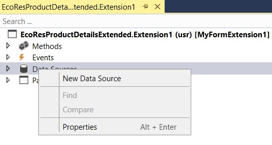
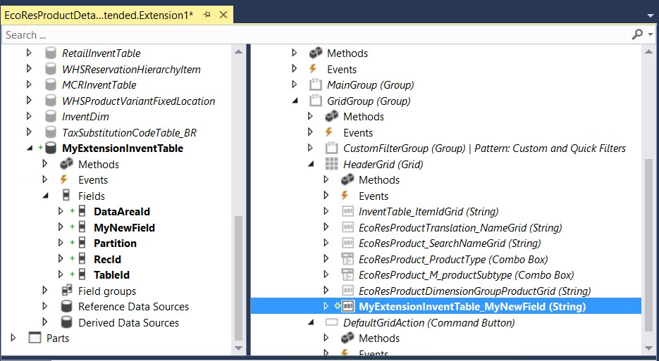
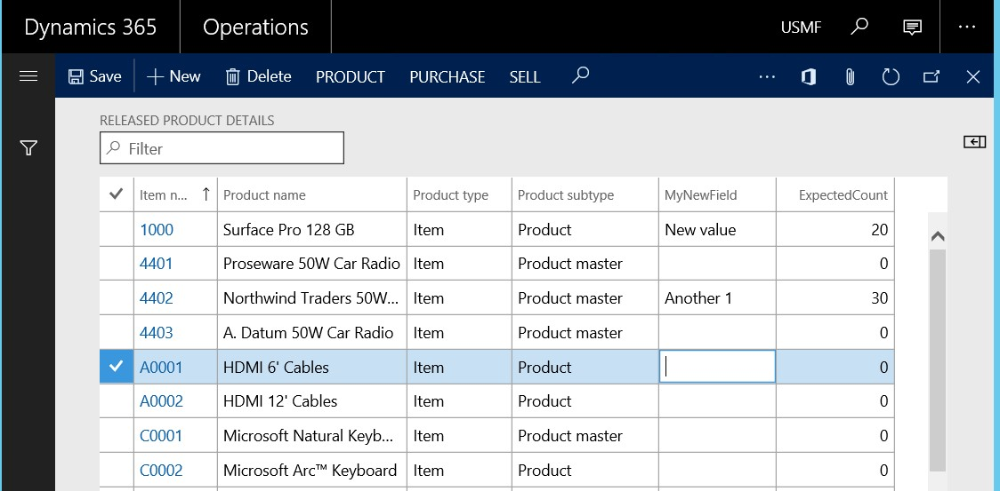

---

title: Add data sources to forms through extension
description: This topic explains how you can add new data sources to existing forms by using extensions.
author: ivanv-microsoft
ms.date: 07/10/2017
ms.topic: article
ms.prod: 
ms.technology: 

# ms.search.form: 
# ROBOTS: 
audience: Developer
# ms.devlang: 
ms.reviewer: tfehr
# ms.tgt_pltfrm: 
ms.custom: 268724
ms.assetid: 
ms.search.region: Global
# ms.search.industry: 
ms.author: ivanv
ms.search.validFrom: 2017-07-01
ms.dyn365.ops.version: Platform update 4

---

# Add data sources to forms through extension

[!include [banner](../includes/banner.md)]

Often, the information that is stored in existing tables doesn't satisfy customer requirements. Therefore, additional tables must be created, and data from those tables must be shown on pages.

You can add new data sources to existing forms through extension. Follow these steps.

1. In the extension model, create a form extension for the selected form.
1. Right-click the form extension, and then select **New Data Source**.

    

1. Specify the **Table** property and other required properties on the data source. For example, define how the data source should be linked with the other data sources for the form. 
1. Drag fields from the new data source into the form design, as shown in the following illustration.

    

1. In a similar manner, you can add fields from existing data sources. For example, the table behind the form might have been extended with additional fields, as shown in the following illustration.

    

    > [!TIP]
    > You might have to right-click the form extension data source and then select **Restore** to make the new fields appear in the list.

1. You can now view and edit the data in these new fields and tables, as shown in the following illustration.

    

[!INCLUDE[footer-include](../../../includes/footer-banner.md)]