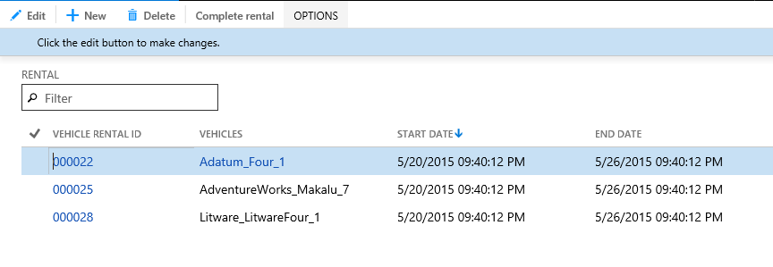
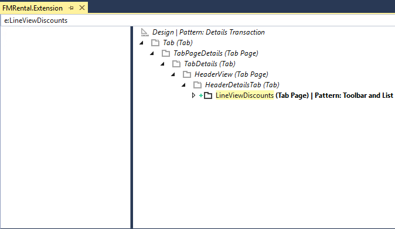
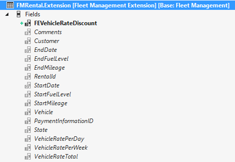
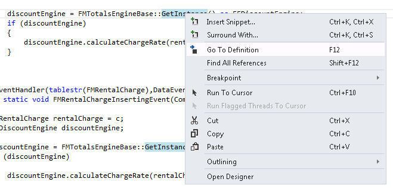
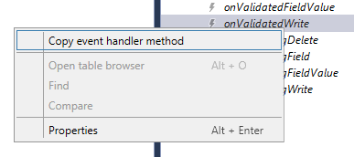

# Customize model elements through extension

[!include [banner](../includes/banner.md)]

In this tutorial, you’ll become familiar with the Fleet Management Extension model. This model contains elements that extend the functionality of the Fleet Management application. You can customize model elements by creating *extensions*. Unlike the overlayering capabilities of Microsoft Dynamics AX 2012, extensions don’t overlay the baseline model elements. Instead, extensions are compiled as a separate assembly that adds to or customizes the model and the associated business logic. You can extend metadata, for example, by adding a field to a table or adding a control to a form, and also extend or customize business logic by defining event handlers and plug-in classes. You can now author event handlers on several pre-defined events on tables, forms, form data sources, form controls, and others. Plug-ins are also a new extensibility concept that enables replacing or extending the business logic of the application.

## Prerequisites

This tutorial requires you to access the environment using Remote Desktop, and that you are provisioned as an administrator on the instance.

## Understanding the Fleet Management model

The Fleet Management application provides a rental car company a system for managing vehicles, customers, and vehicle reservations. The application is designed for use by the Fleet Clerk and Fleet Manager personas.

### Fleet Clerk

The Clerk is the front desk employee who handles the face-to-face and over-the-phone interactions with customers. The Clerk is primarily concerned with entering customer information into the application, creating vehicle reservations for customers, upselling the reservation by offering vehicle accessories, and processing vehicle returns upon completion of a vehicle rental. The Clerk spends the vast majority of their time using the **Fleet Management Workspace** to prepare for interactions with customers by anticipating their needs and providing a pleasant and memorable experience, while interacting with the customer.

### Fleet Manager

The Manager is the back office employee who handles setting business requirements and processes. The Manager is primarily concerned with entering vehicle information, defining the available vehicle accessories, vehicle maintenance, determining pricing, and analyzing business performance measures such as revenue, upsell success, and so on. The application's business logic revolves around the following three primary entities and the relationships between them.

### Customers

Customers contact the Fleet Clerk to make vehicle reservations, choose vehicle accessories, check out and return vehicles, and pay for vehicle rentals. Customer-related information is stored in the table named **FMCustomer**.

### Vehicles

Vehicles vary primarily in their price, which is proportional to the vehicle *class*. The names of tables that store information about vehicles begin with **FMVehicle**.

### Reservations and rentals

Reservations handle the relationship between customers and vehicles. Reservation information includes reservation dates, customer information, vehicle selection and price, and additional charges such as accessories or fees. Reservation and rental information is stored in the **FMRental** and **FMRentalCharge** tables. A calculation engine handles the transactional information related to the pricing of vehicle reservations. Using this data model the Fleet Management application provides a basic car rental experience.

## Extending the Fleet Management model

The basic Fleet Management application has been customized with additional capabilities that enable a rental car company to provide pricing incentives to its customers through discounts. The additional business logic and data that enables these discount capabilities is stored in the Fleet Management Extension model. The discount capabilities add value to the Fleet management application through three primary customizations.

### The Fleet Management Extension data model

Two new tables have been added that store discount-related information. **FEDiscounts** stores the list of all discounts and their rates. **FERentalDiscountRelationTable** keeps track of the reservations that the discounts are applied to. Existing tables have been extended to account for the addition of discounts to the pricing scheme. The table that keeps track of the vehicle rate for a particular reservation, named **FMRental**, has been extended to accommodate discounts to the vehicle rate. The table that keeps track of the accessories for a reservation, named **FMRentalCharge**, has been extended to accommodate discounts applied to accessories.

### The Fleet Management Extension Calculation Engine

The basic calculation engine has been customized to add the various pricing schemes defined by the new discounts. A plug-in class has replaced the functionality of the base calculation engine. When a vehicle is reserved for more than 7 days, the vehicle Fleet Management model calculates savings based on the difference between a vehicle's daily rate and a lower weekly rate. The plug-in removes the weekly rate calculation because this same behavior can be accomplished by using discounts.

### The Fleet Management User Interface Extensions

The Rental, which is contained by the form named **FMRental**, has been extended to enable the Clerk to apply discounts to a reservation. The on-screen price summary is updated in real time with savings information related to discounts that can be applied to vehicles and accessories related to the reservation. In the following steps, you'll explore the customizations that have been made in the Fleet management Extension model, as well as re-implement a portion of the customizations for yourself.

## Setup

If you haven't opened the Fleet Management Solution in a previous tutorial, follow these steps. The fleet management solution file is available on the Dynamics AX downloadable VM.

1. On the **Desktop**, double-click the **Visual Studio** shortcut to open the development environment.
2. Open the **FleetManagement** solution. On the **File** menu, point to **Open**, and then select **Project/Solution**.
3. Browse to the desktop and open the **FleetManagement** folder. If the solution file is not on your computer, the steps to create it are listed in [Tutorial: Create a Fleet Management solution file out of the Fleet Management models in the AOT](https://community.dynamics.com/ax/b/newdynamicsax/archive/2016/05/19/tutorial-create-a-fleet-management-solution-file-out-of-the-fleet-management-models-in-the-aot).
4. Select the solution file named **FleetManagement**. The file type listed is Microsoft Visual Studio Solution.
5. Select **Open**. The solution may take some time to open.

### Installing the demo data

If you've already installed the demo data, you can skip to the next section.

1. In the VM, open Internet Explorer and navigate to the application's base URL.
2. Sign in.
3. On the dashboard, open the navigation pane and navigate to **Fleet Management &gt; Setup &gt; Fleet Setup**.

    [](./media/fleetsetup_customizemodel.png)

4. Click **Setup Demo Data**.

    [](./media/configuration_customizemodel.png)

5. If you're prompted to reload the demo data, select **Yes**.
6. When the data is finished loading, select **Close**.
7. On the dashboard, open the navigation bar and navigate to **System Administration &gt; Common &gt; Maintain aggregate measurements**. (Steps 7 to 9 are not applicable on newer releases.)
8. Select **FMAggregateMeasurements**, and on the Action Pane, select **Refresh now**.
9. Wait until the processing completes. The ongoing processing is indicated at the top of the page by a series of moving dots. The processing is completed when the indicator disappears and the **Time Last Processed** field is updated.

## Open the FMRental form on the one-box environment

1. In the VM, open Internet Explorer and navigate to the base URL of your Dynamics AX application. For more information, see [Deploy and access development environments](../dev-tools/access-instances.md).
2. Sign in, if prompted.
3. Find the **Reservation Management** tile and select it to open the Reservation Management workspace.

    [](./media/reservationmanagementtile.jpg)

4. When the **Reservation Management** workspace opens, select **Current rentals**.

    [](./media/reservationmanagementworkspace.jpg)

5. The **Rental** form opens in grid view.

    [](./media/rentalform_customizemodel.png)

6. After the **Rental** form loads, select **Options &gt; Change view &gt; Header** to open the **Header view**.

    [](./media/headerview_customizemodel.png)

7. When the **Header view** form loads, scroll to the bottom and expand the **Discounts** tab. This tab isn't part of the Fleet Management model. It has been modeled in the Fleet Management Extension Model as an extension to the **FMRental** form.

    [](./media/discounts_customizemodel.png)

8. Select **Add** to add a discount.
9. Select the **Frequent Customer** discount, and then select **OK**. The selected discount is added to the **Discounts** grid.

    [](./media/fcdiscount_customizemodel.png)

10. Use the shortcut key, **Alt+F2** to open the FactBox.
11. Expand the **Rental total** FactBox on the right and view the discount savings that are applied.

    [](./media/rentaltotal_customizemodel.png)

## Overview of the Fleet management discount extension project

In this tutorial, the **FleetManagementDiscounts** Project contains the model elements that belong to the model named **Fleet Management Extension**. Here, you'll explore and learn about the project elements.

### Navigate to FMRental.Extension in the Tree Designer

1. In the Visual Studio, in **Solution Explorer**, in the **FleetManagement Discounts** project, expand **User Interface &gt; Form Extensions**.

    [](./media/solutionexplorer1_customizemodel.png)

    The **FMRental.Extension** element is an extension element that extends the functionality of the **FMRental** form by adding two new data sources and a new tab control.
2. In **Solution Explorer**, double-click **FMRental.Extension** to open the designer. As the following image shows:
    - The data sources shown in *italic* text are data sources defined in the baseline form.
    - The data sources shown in **bold** are the ones defined in the current extension.

    The designer presents an integrated view of the model element, including its extensions. Read-only nodes are shown in italic text, while nodes that belong to the current extension are shown in bold, with other visual cues that indicate the type of customization.

    

3. In the designer's search box, type 'e:' as shown in the image below. This filters the current designer to only show nodes that belong to the current extension.

    [](./media/rentalext-e_customizemodel.png)

4. You can also type 'e:LineViewDiscounts' to filter the designer to show nodes that match the name **LineViewDiscounts** and that belong to the current extension.

    [](./media/lineviewdiscounts_customizemodel.png)

5. Expand the **LineViewDiscounts** node to see its contents.

    [](./media/expandlvdnode_customizemodel.png)

### Open the FMRental.Extension XML file to view the metadata

1. In the **Solution Explorer**, right-click FMRental.Extension form extension, and then click **Open with**.
2. In the **Open with** dialog box, select **XML (Text) Editor**, and then click **OK**.
3. When prompted to close the designer, click **Yes**.
4. Click the corresponding minus signs to collapse the child nodes of the **Controls** and **DataSources** nodes. Refer to the following image for the correct result.

    [](./media/fmrentalcode_customizemodel.png)

    The XML file contains the metadata associated with the **FMRental.Extension** element. You can see that this file contains metadata that describes only one tab page control and two data sources that are part of the extension. You can also see that it doesn't contain any metadata from the base form.

### View other elements in the Fleet Management discount extension project

The **FleetManagement Discounts** project contains two new tables, **FEDiscount** and **FERentalDiscountRelationTable**, and two extensions to existing Fleet Management tables, **FMRental** and **FMRentalCharge**.

1. In **Solution Explorer**, in FleetManagement Discounts, double-click **Data Model &gt; Table Extensions &gt; FMRental.Extension** to open the designer.
2. Expand the **Fields** node to see that this extension contains one added field, FEVehicleRateDiscount, to the base FMRental table.

    [](./media/nodes_customizemodel.png)

3. Similarly, open the **FMRentalChange.Extension** element in the designer to explore its contents.

### Inspect the data event handlers

In **Solution Explorer**, in the FleetManagement Discounts project, double-click **Code &gt; Classes &gt; FMRentalCharge\_Extension** to open the code editor.

[](./media/fmrentalchargecode_customizemodel.png)

This class contains event handler implementations that subscribe to the **Updating** and **Inserting** events of the **FMRentalCharge** table. Microsoft Dynamics AX introduces data events that can occur on tables and other types. You can subscribe to data events of a table, enabling your application to extend business logic without overlayering base X++ code. Later in this tutorial, you'll see how easy it is to subscribe to table events.

> [!NOTE]
> Notice that this class is an extension class (indicated by the \_Extension suffix). You can author event handlers in any class, this class does not need to be an extension class. Extension classes are needed in order to create extension methods. For more details on extension methods, refer to the "Extension methods" section of the [Extension methods](../dev-ref/xpp-classes-methods.md#extension-methods) article.

### View the plug-in classes

In the event handler code of the **FMRentalCharge\_Extension** class shown in the previous section, notice that both event handlers call **FMTotalsEngineBase::GetInstance** to retrieve the current instance of the Fleet Management calculation engine. The calculation engines are implemented by using plug-in classes. A class factory creates the appropriate instances of a plug-in class based on configuration or business data.

1. In the code editor window that displays FMRentalCharge\_Extension.xpp, right-click **GetInstance**, and then select **Go To Definition**. The code editor opens with the abstract class **FMTotalsEngineBase**. This abstract class is called a **plugin point** and it's associated with the following attribute: \[Microsoft.Dynamics.AX.Platform.Extensibility.ExportInterfaceAttribute()\]

    [](./media/godefinition_customizemodel.png)

    Plug-in classes represent extensions or implementations of abstract classes or interfaces. Plug-in classes are associated with attributes defining their metadata and the plug-in point. In this example, there are two plug-in classes associated with the **FMTotalsEngineBase** plug-in point. The base calculation engine is defined by the plug-in class **FMTotalsEngine**. You can find it in the project **FleetManagement Migrated &gt; Code &gt; Classes**.

    [](./media/code1_customizemodel.png)

    The discount calculation engine is defined by the plug-in class **FEDiscountEngine**. You can find it in the project **FleetManagement Discounts &gt; Code &gt; Classes**.

    [](./media/code2_customizemodel.png)

2. Look at the **GetInstance** method. It uses the plug-in factory **SysPluginFactory::Instance** to instantiate the current calculation engine based on current plug-in metadata. The plug-in metadata is specified in the global configuration table, **FMParameters**.

    [](./media/code3_customizemodel.png)

    The finance and operations apps also support configurable plug-in classes where the plug-in metadata associate with the class isn't known at development time and is configurable at runtime by an administrator. This tutorial doesn't cover that feature.

## Create additional Fleet Management extensions

This section shows how you can use the Visual Studio tools to create and interact with extensions.

### Extend the FMVehicle Table

1. In **Solution Explorer**, select the **FleetManagement Discounts** project.
2. In Visual studio, in **Application Explorer,** select **View &gt; Application Explorer**, and search for the table named FMVehicle. Type `FMVehicle type:Table` in the filter bar and press **Enter**.

    [](./media/appexplorersmall_customizemodel.png)

3. Right-click **FMVehicle**, and then select **Create extension**.

    [](./media/appexplorerlarge1_customizemodel.png)

    An extension of the **FMVehicle** table is created in the **FleetManagement Discounts** project named **FMVehicle.Extension**.

    [](./media/expanddiscountsnode2_customizemodel.png)

4. In **Solution Explorer**, right-click **FMVehicle.Extension**, and then select **Open with**. In the dialog box, select **XML (Text) Editor**, and then select **OK**. **Note**: This extension file is simply a template that doesn't contain metadata from the base **FMVehicle** table. An extension file will always contain only the metadata that defines the extension and nothing from the base model element.

    [](./media/code4_customizemodel.png)

5. Close the XML editor.
6. In **Solution Explorer**, double-click **FMVehicle.Extension** to open the designer.
7. Right-click **Fields** and add a new integer field. Change the name of the field to **NumberOfCylinders**.
8. In the **Properties** window, set the **Label** property of the new field to **NumberofCylinders**.
9. Drag-and-drop the **NumberOfCylinders** field into the **AutoReport** field group to extend the field group of the base table.

    

10. Save FMVehicle.Extension.
11. Expand the **Events** node. The **Events** node lists all events that the table exposes. This list includes events that are defined by the framework, and delegate methods that are defined by application developers.

    [](./media/eventsnode_customizemodel.png)

    > [!NOTE]
    > Different framework events are exposed on the designers of many types of element and sub-elements, like table events, form events, form data source events, and form control events.
12. Right-click onValidatedWrite, and then select **Copy event handler method**.

    [](./media/onvalidatewrite_customizemodel.png)

    This step copies the event handler method signature to the clipboard.
13. Add a new class named **FMVehicleEventHandlers** to the **FleetManagement Discounts** project.
14. In **Solution Explorer**, double-click **FEVehicleEventHandlers** to open the code editor.
15. Right-click and paste the event handler method that you copied in step 12.

    ```xpp
    Class FMVehicleEventHandlers
    {
        /// <summary>
        ///
        /// </summary>
        /// <param name="sender"></param>
        /// <param name="e"></param>
        [DataEventHandler(tableStr(FMVehicle), DataEventType::ValidatedWrite)]
        public static void FMVehicle_onValidatedWrite(Common sender, DataEventArgs e)
        {
        }
    }
    ```

16. Insert the following code into the **FMVehicle\_onValidatedWrite** event handler. This code validates that the number of cylinders can't be greater than 8.

    ```xpp
    [DataEventHandler(tableStr(FMVehicle), DataEventType::ValidatedWrite)]
    public static void FMVehicle_onValidatedWrite(Common sender, DataEventArgs e)
        {
            ValidateEventArgs validateArgs = e as ValidateEventArgs;
            FMVehicle vehicle = sender as FMVehicle;
            boolean result = validateArgs.parmValidateResult();

            if (vehicle.NumberOfCylinders > 8)
            {
                result = checkFailed("Invalid number of cylinders.");
                validateArgs.parmValidateResult(result);
            }
        }
    ```

17. Save FMVehicleEventHandlers class

    >[!TIP]
    > You can paste and define your event handlers in any class of your model. The class FMVehicleEventHandlers is used only as an example.

### Extend the FMVehicle Form

Next, add an extension to the **FMVehicle** form in the **FleetManagement Discounts** project. First, be sure to select this project in **Solution Explorer**.

1. Use **Application Explorer** to find the form named **FMVehicle**, and in the **Application Explorer** filter bar, enter `FMVehicle type:form`.
2. Right-click the form, and then click **Create extension**.
3. Add a new integer control named **NumberOfCylinders** to the **Attributes2** group control as shown below. You can find this control by expanding **Design &gt; Tab &gt; TabPageDetails &gt; TabHeader &gt; DetailsDetails &gt; Attributes2**.

    [](./media/numcylinteger_customizemodel.png)

4. Bind the new control to the **NumberOfCylinders** data field in the properties window as follows.

    [](./media/datafield_customizemodel.png)

5. Save FMVehicle.Extension and build the project.

### Test your extensions

1. In **Solution Explorer**, right-click **FleetManagement Discounts**, and then click **Set as StartUp project**.
2. Similarly, in FleetManagement Discounts, set the **FMVehicle.Extension** form as the startup object.
3. Press **Ctrl+F5** to start without debugging, or use the **Debug** menu.
4. After the **Vehicles** form opens, select a vehicle to view its details.
5. Expand the **Details** tab and notice the new **Number of Cylinders** field.

    [](./media/nbofcyls.jpg)

6. In the Action Pane, click **Edit**, and change the value in the **Number of cylinders** field to 12.
7. In the Action Pane, click **Save**.
8. Notice the validation error.
9. Enter a valid number of cylinders, less than 9, and then save the new value.

## Experiment with event handlers on form controls

You can add event handler methods on existing controls.

1. Find the **AddLine** command button control in the **FMRental** form designer, right-click the **OnClicked** event, and select **Copy event handler method**.

    [](./media/addlineonclickedevent.jpg)

2. Paste the event handler method in a class of the Fleet Management Extension model and add X++ code to implement it.

    ```xpp
    /// <summary>
    ///
    /// </summary>
    /// <param name="sender"></param>
    /// <param name="e"></param>
    [FormControlEventHandler(formControlStr(FMRental, AddLine), FormControlEventType::Clicked)]
    public static void AddLine_OnClicked(FormControl sender, FormControlEventArgs e)
    {
    }
    ```

When implementing the AddLine\_OnClicked event handler, you can access the button control instance using the **sender** parameter.

```xpp
FormButtonControl button = sender as FormButtonControl;
```

If you need to access the parent form or any of its variables, this example shows how to access the **FormRun** instance and one of its data sources.

```xpp
FormRun fr;
fr = sender.formRun();
var frDs = fr.dataSource("FMRental");
```

## Experiment with event handlers on form data sources

Just like tables, form controls and other element types, form data sources and form data source fields provide framework-level events. The following example shows how you can use the ValidatingWrite event on a form data source or the Validating event on a form data source field to validate user input on the FMRental form. This functionality is available as of Platform Update 7.

```xpp
/// <summary>
/// When saving a new rental, prevent setting the start mileage on the FMRental form to a value that is equal to 1
/// </summary>
[FormDataSourceEventHandler(formDataSourceStr(FMRental, FMRental), FormDataSourceEventType::ValidatingWrite)]
public static void FMRental_OnValidatingWrite(FormDataSource sender, FormDataSourceEventArgs e)
{
    var datasource = sender as FormDataSource;
    var args = e as FormDataSourceCancelEventArgs;
    if (args != null && datasource != null)
    {
        FMRental record = datasource.cursor() as FMRental;
        if (record.recId == 0)
        {
            if(record.startmileage == 1)
            {
                boolean doCancel = !checkFailed("Start Mileage = 1 is not allowed");
                args.cancel(doCancel);
            }
        }
    }
}
```

```xpp
/// <summary>
/// Prevent changing the start mileage field on the FMRental form to a value that is equal to 1
/// </summary>
[FormDataFieldEventHandler(formDataFieldStr(FMRental, FMRental, StartMileage), FormDataFieldEventType::Validating)]
public static void StartMileage_OnValidating(FormDataObject sender, FormDataFieldEventArgs e)
{
    var dataObject = sender as FormDataObject;
    var args = e as FormDataFieldCancelEventArgs;
    if (args != null && dataObject != null)
    {
        var datasource = dataObject.datasource() as FormDataSource;
        if (datasource != null)
        {
            FMRental record = datasource.cursor() as FMRental;
            if (record.RecId > 0)
            {
                if (record.StartMileage == 1 )
                {
                    boolean doCancel = !checkFailed("Start Mileage = 1 is not allowed");
                    args.cancel(doCancel);
                }
            }
        }
    }
}
```

## Experiment with table extension display and edit methods

Extension methods enable you to extend tables by creating new display and edit methods on these tables without over-layering X++ code (Extension method must belong to a class named with an \_Extension suffix). For example, this class shows how you can extend the FMVehicle table with an extension display method named CupHoldersDisplay.

```xpp
public static class FMVehicle_Extension
{
    public static display int CupHoldersDisplay(FMVehicle vehicle)
    {
        return 7;
    }
}
```

On a form or form extension, you can bind a control to this display method by setting "Data Source = FMVehicle" and "Data method = "FMVehicle\_Extension::CupHoldersDisplay" as the image below shows.


## Create a Fleet extension package for deployment

To deploy your extension to another environment, for example, a test, pre-production or production environment, you must create a deployment package.

1. In Visual Studio, on the **Dynamics AX** menu, point to **Deploy**, and then select **Create Deployment Package**.

    

2. Select the **Fleet Management Extension** check box.
3. In the **Package file location** text box, enter "c:\FMLab".
4. Select **Create**. A deployment package that contains the Fleet management Extension package is created.

## Additional resources

[Download FMLab sample code](https://github.com/Microsoft/FMLab)

[!INCLUDE[footer-include](../../../includes/footer-banner.md)]

