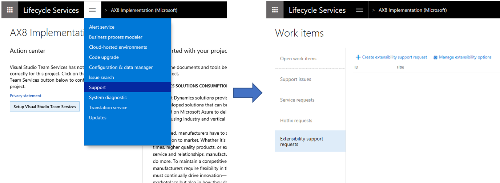
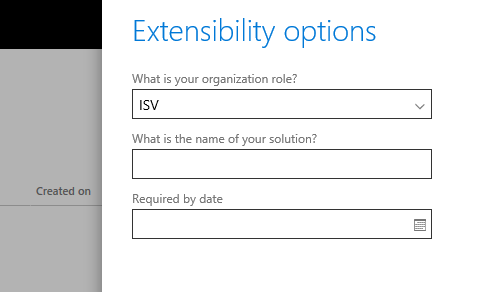

# Extensibility requests

[!include [banner](../includes/banner.md)]

Finance and Operations applications exclusively use extensions to customize the product. We're aware that this change impacts our entire partner ecosystem. We recommend that you read the resources listed on the [Extensibility home page](extensibility-home-page.md). These resources answer many questions and prepare you for building solutions using extensions.

You will discover that some customizations, which were possible with overlayering, cannot be done through extensions. To enable the same business requirements without overlayering, we have added many extension capabilities and expect to add more going forward. For some customizations that were done with overlayering, you will need to log requests, to make us aware of what you need.

## What we are doing
We've been working toward an extension-based customization model for some time. Over the past several releases we have been gradually sealing models. As of Dynamics 365 for Finance and Operations release 8.0, this completes the sealing. From this release forward, only extension-based customizations are allowed. 

In future releases, we will be adding even more extensibility capabilities to enable independent software vendors (ISVs) and value-added resellers (VARs) to deliver complete business solutions. We will prioritize these on a customer-by-customer basis with frequent releases.

## How do I log extensibility requests?
If you discover a customization that you cannot implement as an extension, you must log a request to Microsoft to ensure appropriate extension support is added to the product for your scenario.

Before logging the request, there are a few things to consider:  
- Could the requirement be met with existing extensibility features? Building solutions with extensions requires different design and implementation patterns.
- How important is the requirement to the customer and/or business analyst?  
- Will the implementation be upgrade friendly for the long term?

Learn more about extensibility by reading the resources listed on the [Extensibility home page](extensibility-home-page.md) and related resources.

Extensibility requests are logged using a specific project in LCS. Logged requests are collected under that same project. We recommend that you log related requests under the same LCS project as this helps maintain a holistic view on all requests for a specific solution or an implementation. Microsoft then further identifies logged requests by the organization name that is associated with the LCS account.

In your LCS project, at the top of the page, select the hamburger icon and then click **Support** menu item.

You can view the list of logged extensibility support requests and their status. Click the request ID to review details of the logged request. 

New requests that are logged are briefly assigned a status of **Pending** while the request is copied to the Microsoft tracking databases. Next, an ID is assigned to the request and the status is updated to **Active**. When a request is processed by Microsoft, the status of the request will be updated to **Closed**. Click the request ID to view resolution date and description information. Requests that have been closed are released with monthly application updates.

  > [!NOTE]
  > At this time, there is no state available to indicate feedback from Microsoft on when requests have been planned. 

The **Extensibility support request** form includes two actions:

- **Manage extensibility options**
- **Create extensibility support request**

When you click **Manage extensibility options**,  you can view all of the information that is shared between requests. This information includes, requests for either an **ISV** or **VAR** solution and if the requests are specific for a **Customer** implementation project. If the role selected **ISV** or **VAR**, a solution name must be specified. The name should be recognizable and correlate with AppSource solutions. The **Required by date** indicates the last date that requests can be made to be available for your development. 

  > [!IMPORTANT]
  > Note that Microsoft does not guarantee that all requests will be provided by the date given. However, the required date provides an indication that will be considered when planning for requests at Microsoft.

Extensibility support options can be updated to reflect any changes after a request is created. After you have made your updates to the request, click **Update** to notify Microsoft of your changes.

> [!NOTE]
> There is currently no option with the tool to record what a Customer implementation includes regarding ISV or VAR solutions. 

The action 'Create extensibility support request' is used for creating, or logging, new extensibility requests.
When you log an extensibility request, provide detailed information about what you need to become enabled for extensibility, and include information on what it is you need to extend. This will help Microsoft to be efficient in addressing your requests. You are  welcome to propose how Microsoft could enable the functionality that you need in the standard application in a way that effectively addresses your needs. 

When you select the request type, determine how your request aligns with the request types that Microsoft uses to categorize requests. Each request type changes the form to include specific fields related to the request type. This helps guide the process to make the request actionable for Microsoft. Be sure to provide accurate names when naming elements and methods.
Microsoft rarely enables requests by adding inline delegates, so when possible, consider other types of requests. Common application request types include **extract method**, **extensible enum**, **construct with throw**, and **method change**.  Additionally, there is **platform request** and **metadata change** for proposing changes, including general platform improvements. The request type **method signature change** is typically for a breaking change. It is unlikely that a breaking change can be accommodated under a monthly update as it will require a more major release version to drive such changes.  

Click **Attach file from computer** to upload documents that you can attach to requests. You can use the attachments to supply code snippets that provide additional details for the request. We recommend that you be as specific as possible with your requests.

Log a request for each instance. Do not bundle multiple requests into one. If multiple requests are related, consider adding a document or description that includes request ID's so that any work on the requests is considered in context.

The requests include a point of contact. This is needed for times when the logged extensibility request is not actionable for one reason of another. The requests may require discussion regarding, for example different design options. Microsoft will use this contact information to drive such interactions.
Click **Submit** when you are ready to submit the request to Microsoft. Because requests can’t be edited after they are submitted, verify the data before you submit. Requests that are accidentally submitted with incomplete or inaccurate date can be removed using the designated action after clicking the ID on the request.
Requests that are submitted to Microsoft will temporarily show as **Pending** until the request is created within the Microsoft tracking databases. This will assign an ID to the request and the state will become **Active**. This status update indicates that the request is now visible to Microsoft.

Make sure to read through the privacy statement before you log any requests.

> [!NOTE]
> We will not release extensibility requests as hotfixes.  

Extensibility requests are exclusive for the application. We are not planning to accommodate extensibility requests for Dynamics AX 2012 or earlier releases.

## When will my extensibility requests be enabled?

Extensibility requests are logged to a backlog. Microsoft engineers prioritize all requests, and then work on them in priority order. Please note that Microsoft is not ensuring that all requests will be fulfilled. In particular, requests that are intrusive by nature will not be supported, as they will prevent seamless upgrade.

## How will extensibility requests be made available to deploy?
After Dynamics 365 for Finance and Operations release 8.0, we plan to release frequent application updates with new extensibility requests. This will follow the same release cadence as platform updates. 

## Still have questions?

Read the [Extensibility FAQ](app-sealing-faq.md) and the other resources listed on the [Extensibility home page](extensibility-home-page.md).

[!INCLUDE[footer-include](../../../includes/footer-banner.md)]
