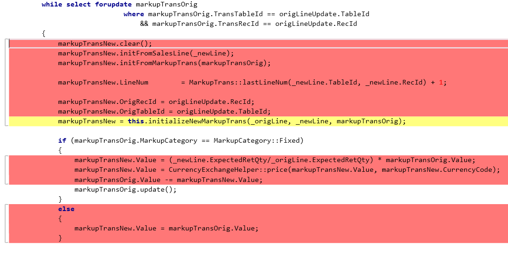
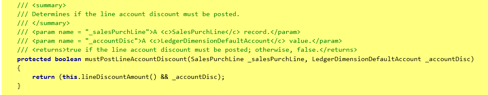

# Write extensible methods

[!include [banner](../includes/banner.md)]

Before you make a method extensible, you should assess the exposed functionality of the method and the impact that the extensions might have on the scenario where the method is used. For example, depending on the business scenario, there is low risk if you enable extensions to initialize a table record but high risk if you enable extensions to skip a specific validation. You might also want to consider the impact if the method is extended in parallel with other extensions.

After you've made a method extensible, future modifications to the method are restricted because of the potential user impact if the method signature or logic is changed.
	
Here are some guidelines to follow when you write extensible code:
	
+ **Write short and concise methods** – A method should have only one responsibility. This approach enables easy extensions of the method, where the extensions can act only on the specific responsibility of the method. As a simple example, keep the construction and initialization of a class object in two separate methods.
+ **Expose only what is necessary** – For any new class members or methods that are added, 'Keep any new class members or methods that you add private, to allow minimal access to them.
+ **Use private, protected, public, and final explicitly** – For methods and class fields, this approach will guide any extenders of your code to your extension points but still let you keep full control of the parts that the extenders should not care about or depend on.
+ **Method parameters**

    - The method is most likely long and should be refactored. Consider whether you should refactor the whole method into a class or split the method into smaller methods that require fewer parameters.
    - In other cases, when several parameters are required, the parameters often have a coherence that can be expressed by a class. By encapsulating these parameters in a class, you make it easy for extenders to add additional parameters to the base method, without breaking application programming interfaces (APIs) later.

+ **Switch blocks**

    - Avoid switch blocks in the middle of methods. A switch block should be in its **own method** to enable it to be extended. 
    - **Long case blocks** are good candidates for being refactored into a class/class hierarchy that has a subclass for each case block. For an example, see the **SalesLineCopyFromSource** class hierarchy.
    - Avoid **default blocks** in switch statements, because they make the method that has the switch block non-extensible.
    - Avoid **throw statements in the default block** of a switch statement, because they make the switch statement non-extensible. One way to handle the throw in the default case is to refactor the switch block to a separate method that is extensible. Alternatively, you can make the whole method replaceable.
			
        In the following example, **findOrderHeaderDefault** is replaceable.

        ```xpp
        private Common findOrderHeader(boolean _forUpdate)
		{
		    switch (this.InventTransType)
		    {
		        case InventTransType::Sales:
		            return this.salesTable(_forUpdate);

		        default: 
		            return this.findOrderHeaderDefault(_forUpdate);
		    }
		}

		[Replaceable]
		protected Common findOrderHeaderDefault(boolean _forUpdate)
		{
		    throw error(Error::wrongUseOfFunction(funcName()));
		}
        ```

+ **While** – Avoid **while** blocks in the middle of methods, because it becomes more difficult to extend the **while** blocks. Ideally, logic in a **while** block should be in a separate method that enables extensions.

    **Refactoring logic within a while loop**

    

    **Extensible method after refactoring**

    

+ **If..else statements**

	- To enable extension of the conditions in an if statement, extract the logic in the if condition into a separate method.
	- Avoid nested if..else blocks, because they make it difficult to change the logic in one of the blocks. One way to resolve this issue is to refactor each condition and the logic in each block into a separate method. In this way, you can extend the conditions or the logic in each block.
	- When the if..else blocks handle specialization, consider moving the logic into a class hierarchy. For an example, see **SalesLineCopyFromSource**.
	- In some scenarios, a throw in an 'else' block of a method (when the method only has an if..else) makes the method non-extensible. One way to handle the throw in the else is to refactor the conditions for the throw into a separate method.

+ **Avoid using PrmIsDefault** – When the method is overridden or wrappable, the caller of **super()** or **next()** provides all parameters. Therefore, **prmIsDefault()** always returns false.
+ **Avoid using enumCnt** – At compile time, this method uses a numeric literal of the number of values that an enum has. If the enum is extended or made extensible later, your code will have to be recompiled. Use **DictEnum.values()** instead.
+ **Construct methods**

	- Use the **SysExtension** framework to enable easy extensions.
	- Avoid a throw in factory methods. One way to resolve this issue is to extract the conditions for the throw into a separate method that is extensible. For more details, see the guidelines for throw statements later in this list.

+ **Static methods** – Static methods can't be extended with extra state. For example, a method extender can introduce properties that can be set by using parameter methods. Use instance methods instead, whenever this approach is possible.
+ **Ability to extend part of the logic in a long method** – If it isn't possible to refactor a whole method, but the goal is to make part of the method extensible, apply the extract method refactoring. The new protected method must have a single responsibility, and it must also have a name that conceptually and precisely describes that responsibility. In this way, owners and all extenders can use the method without breaking each other. For example, initialization, insertion, updates to a table record, or instantiation and initialization of a class can be extracted into smaller methods, and each of these smaller methods can be enabled for extensions. The original method then calls these individual methods. Therefore, the callers to this method aren't broken.			
+ **Throw statements** – A throw that is added to an existing method that is extensible could break extenders. Consider adding the conditions for the throw in an extensible method. In this way, extenders can take advantage of the method, and you can get rid of the throw.

    **If condition refactored out to a protected method**

    

    **Extensible method after refactoring**

    

+ **Create, read, update and delete (CRUD) statements**

	- Use Query objects in scenarios where the queries should be extensible. Implement a protected method that builds the query. In addition, you might want to build several separate methods to add joined data sources, ranges, and selection fields. In this way, different parts of the query can be extended individually.
	- Use **SysQueryInsertRecordSet** to convert insert_recordset to a query.
	- Avoid field lists in select statements. In this way, you enable extenders to retrieve their additional fields without having to extend.
	- Use the **in** keyword in query ranges to enable extenders to add more values to the query range. We recommend this approach especially for query ranges that have enum values.


[!INCLUDE[footer-include](../../../includes/footer-banner.md)]
