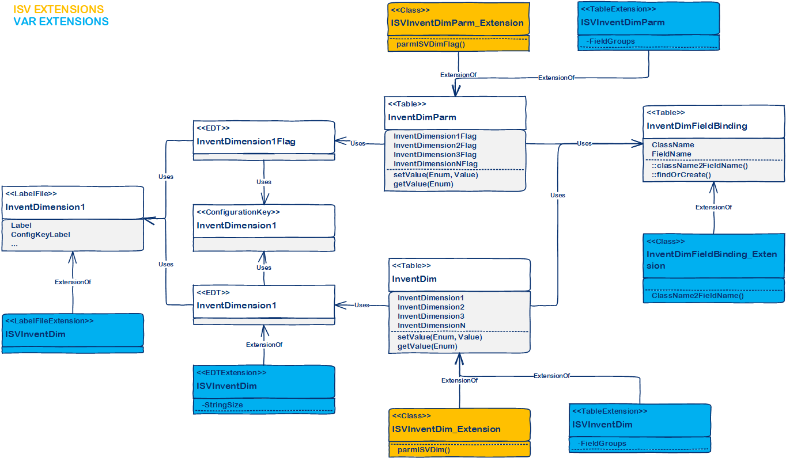

# Add new inventory dimensions through extension

[!include [banner](../includes/banner.md)]

This article provides a high-level overview of how to add new inventory dimensions through extensions. It also includes information about how to access a sample application that contains an actual implementation.

## Solution overview

The cornerstone in this solution is that multiple roles participate in the life cycle of adding new inventory dimensions through extensions. The following description simplifies and generalizes this solution, however, in real life there is overlap between the roles, and sometimes it might even be the same person filling several roles.

### Microsoft's role

Microsoft provides a finite set of unused dimension fields.

In addition to the 15 existing dimensions, Microsoft supports 12 generic dimensions:

- 10 string-based
- 1 real-based
- 1 utcdatetime-based

This brings the total number of inventory dimensions in the standard application to 28:

- 5 product dimensions: Color, Size, Style, Config, and Version
- 5 tracking dimensions: Serial, Batch, Owner, Profile (Russia only), and GTD (Russia only)
- 6 storage dimensions: Site, Warehouse, Location, Status, License Plate, and Pallet (for upgrade and migration only)
- 12 unassigned generic dimensions: InventDimension1 to InventDimension12

Microsoft provides the physical schema.

### ISV role

The ISV adds new inventory dimensions. The ISV solution provides all the specific functionality for the dimension - it must be strong-typed, maintainable, testable, and performant. In addition, the solution must be agnostic to other ISV's solutions.
The ISV builds a solution that doesn't reference the physical schema directly, but goes through an indirection, which can be done seamlessly. 

The ISV provides the logical implementation.

### VAR role

The VAR must be able to deliver a fully functional system to a customer. The system can contain solutions from multiple ISV's - each potentially containing new inventory dimensions. In total, up to 10 ISV dimension fields are supported.

The VAR provides the binding between the physical data model and logical implementation.

## Details

The first half of the solution is straight forward. A new class hierarchy is introduced. Each new dimension must be implemented in a new class deriving from either InventProductDimension or InventTrackingDimension. Currently, there is no support for storage dimensions. With this, ISVs can introduce new dimensions without having to change any of the logic on the InventDim table. 


To reference the new dimension in a strongly-typed fashion, the ISV introduces a table extension class to the InventDim table. The extension classes for Style, Color, and Size can be used as templates.

**Example: InventDimStyle_Extension**

```xpp
/// <summary>
/// The <c>InventDimStyle_Extension</c> class extends the <c>InventDim</c> table with behavior for the style dimension.
/// </summary>
[ExtensionOf(tableStr(InventDim))]
final class InventDimStyle_Extension
{
    public EcoResItemStyleName parmInventStyleId(EcoResItemStyleName _style = this.getValueForDimension(classStr(InventProductDimensionStyle)))
    {
        if (!prmIsDefault(_style))
        {
            this.setValueForDimension(classStr(InventProductDimensionStyle), _style);
        }
        return _style;
    }

    /// <summary>
    /// Returns the field id for the style dimension.
    /// </summary>
    /// <returns>The field id.</returns>
    public static FieldId fieldIdStyle()
    {
        return InventDim::fieldIdForDimension(classStr(InventProductDimensionStyle));
    }
}
```

The dimensions can be referenced like this.

```xpp
//Setting a value
inventDim.parmISVDim("Some value");

//Select statements
select inventDim
    where inventDim.(InventDim::fieldIdISVDim()) == "Some value";
```

The ISV can now build logic, including the data model and user interface for maintaining the list of dimension values, for the new inventory dimension.

The second half of the solution is the data model. The standard application will contain the following for each new dimension:

- A label file.
- A configuration key.
- Two extended data types (EDTs) (for the field on InventDim and for the flag on InventDimParm).
- One field on InventDim table.
- One field on InventDimParm table.
- One field on InventDimFieldMap map and one field on each of the tables (approximately 30) mapped.

The VAR's job is to wire the ISV solutions to the available dimension fields on InventDim for a given customer. To minimize this work, it currently includes the following:

- Implement the binding mapping. This is accomplished by extending the method InventDimFieldBinding.className2FieldName().
- Enable the configuration key.
- Extend the EDT to specify the right string size.
- Extend the Label file, such as copy the ISV-provided labels into the correct label file.
- Extend the ProductDimensions or TrackingDimensions field groups on InventDim, and a few other tables, depending on the type of dimension.
- Extend relations and index as needed on InventDim.



## Known issues

There are some technical limitations influencing the design of the solution. The most significant is the SQL statements throughout the application that contain where-clauses on InventDim. Most of these are implemented using macros, which doesn't change the fact that SQL statements are not extensible. Many of the SQL statements could be rewritten to use query objects to make them extensible, however many delete_from and update_recordset would remain. A viable solution cannot require changes to these SQL statements when adding new dimensions.

Another technical limitation is the amount of inventory dimensions that can be supported. Each adds a small overhead, and the InventDimFixed EDT sets an upper limit at 32. This EDT contains a bit mask for each dimension, and because the EDT is an integer, the limit is 32. The provided solution stays within the limit of 32. If required in the future, InventDimFixed could be changed to be an Int64, a container, or it could be removed.

## Sample application

A sample application called "Product flavor dimension sample app" can be found on [GitHub](https://github.com/Microsoft/Product-flavor-dimension-sample-app).

This sample consists of three models:

- ISV production code
- ISV test code
- VAR integration code

Together these models provide a great starting point for implementing new inventory dimensions. The sample application introduces a new product dimension: Flavor.

The application supports many end-to-end business scenarios, for example creating, buying, and selling items with various flavors.

If needed, please log issues directly in GitHub, and feel free to contribute to the sample application to provide additional coverage.


[!INCLUDE[footer-include](../../../includes/footer-banner.md)]
