---
# required metadata

title: Ledger account combinations
description: This article provides information about combinations of ledger accounts in the dimension framework.
author: RyanCCarlson2
ms.date: 05/01/2019
ms.topic: article
ms.prod: 
ms.technology: 

# optional metadata

# ms.search.form: 
# ROBOTS: 
audience: Developer
# ms.devlang: 
ms.reviewer: kfend
# ms.tgt_pltfrm: 
ms.assetid: 20e6b97e-30ed-48d4-b63c-a073f80300b2
ms.search.region: Global
# ms.search.industry: 
ms.author: rcarlson
ms.search.validFrom: 2019-01-16
ms.dyn365.ops.version: AX 7.0.0

---

# Ledger account combinations

[!include [banner](../includes/banner.md)]

## Introduction

In Microsoft Dynamics AX 2009, the number of dimensions was limited to a minimum of three and a maximum of ten. Additionally, the dimensions were entered in a fixed order. Therefore, code customization and database synchronization were required for every dimension that was added. Then, in Microsoft Dynamics AX 2012, the dimension framework was expanded to allow for a greater number of dimensions - up to ~50 (due to SQL database limits on total column counts in our tables). The user could also dynamically create dimensions and enter them in any order. Finance and operations keeps the behavior from AX 2012. The unlimited nature of the model, the advantages that come from relational database design, and optimization for performance requirements have led to a data model that is more complex than any earlier data model.

## Part 1: "What happens when I create a ledger account combination?"

This part of the article describes the various areas of the dimension framework and how they work together. This information will help you better understand what happens when you create a combination of ledger accounts.

The following illustration shows a model of the various areas of the dimension framework.

[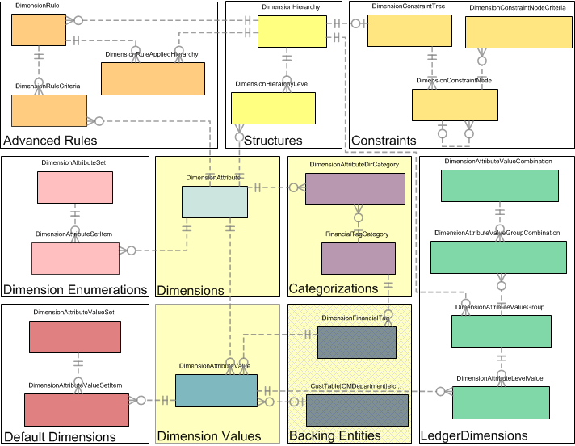](./media/DimensionsFrameworkGraph.png)

This part of the article covers the "Dimensions," "Dimension Values," "Categorizations," and "Backing Entities" regions that are highlighted in yellow in the preceding illustration.

### Dimension attributes

A dimension attribute, which will be referred to as just a dimension, represents an additional piece of classifying information that a user wants to associate with a ledger account combination. It represents classes of things, not specific instances. All the things that can be used to create a dimension are either classes of entities that already exist in the system (for example, department, cost center, expense purpose, customer, vendor, and item) or custom entities that are specific to a particular installation (for example, license plate number, event name, and ticket number).

When a dimension is created, the user can choose where its values come from. Dimension values can come from an existing entity in the system, such as Customer or Department entities, or from a custom list that the user creates. For each dimension that is defined, the dimension framework keeps track of a reference to a table in the system. For example, for the existing Customer entity, a reference to the CustTable table is used. For custom entities that are defined by the user, a reference to the DimensionFinancialTag table is used. The metadata about what each dimension represents is stored in the DimensionAttribute table.

In the example in the following illustration, there are two dimensions on the **Financial dimensions** page. The Customer dimension represents customers that already exist in the application, and the LicensePlate dimension represents a new custom list.

[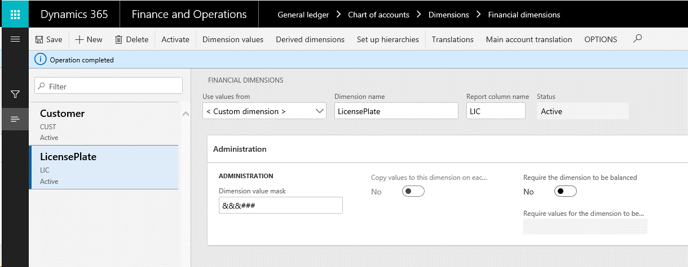](./media/FinancialDimensions.png)

The data about each dimension is stored in the DimensionAttribute table. The SQL query in the following illustration shows some of the basic information that is associated with each dimension.

The **Type** value indicates whether the dimension is backed by an existing entity in the system or a custom list. The dimension framework doesn't directly reference the backing table for an existing entity, such as CustTable. Instead, a custom view is created to make an entity available in the system, so that it can be used in the dimension framework. By default, 36 existing entities can be used as dimensions.

More than one dimension can be created based on the same entity. Sometimes, an entity in the system might be used for multiple purposes when transaction activity is classified in the system. In this case, multiple dimensions can be defined for the entity, one for each purpose. A typical example is a cost center backing entity that is used to represent both the primary cost center (for example, selling) and the cost center that the transaction is being traded against (for example, purchasing).

Internally, special dimensions exist that are automatically created to support key functionality of the dimension framework. A primary example is the MainAccount dimension. This functionality lets the dimension framework treat a main account as a dimension. However, it also prevents users from using a main account to create a dimension. The other types of special dimensions are system-generated dimensions that the dimension framework uses for internal purposes.

### Dimension attribute values

A dimension attribute value is a specific instance of a dimension that is used in the dimension framework. The values for a dimension are determined by the **ViewName** property that is specified on the DimensionAttribute record. For an existing entity, such as CustTable, values consist of the records in that table. For a custom list, values consist of a specific set of records in the DimensionFinancialTag table. You can view the values that are available for a specific dimension by selecting the **Financial dimension values** button on the **Financial dimensions** page.

If the list of values is provided by an existing entity, such as CustTable, the user can't edit it from the **Financial dimensions** page. To create a new dimension value for Customer, the user must go directly to the **Customer** page and create a new customer. After the new customer is created, it can be used in the dimension framework. If the list of values is provided by the user as a custom list, the user can edit the list directly on the **Financial dimensions** page.

The following illustration shows an example of a list of values that is provided by CustTable. In this case, no values are stored in the dimension framework.

[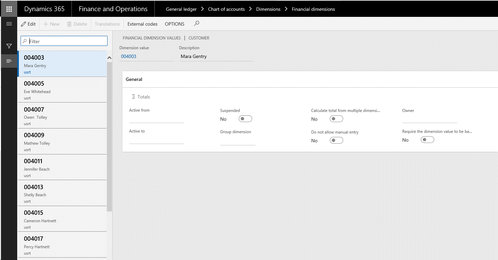](./media/FinancialDimensionValuesForm.png)

The following illustration shows an example of a list of values that is provided by a custom list. In this case, values are stored in the dimension framework.

The following illustration shows the query results from the dimension setup tables for the preceding example.

 

In both these examples, the **Financial dimension values** page shows the values that exist for the entity, not the values that have been used in the dimension framework. Because the representation of these values in the dimension framework isn't created until these values are used in the framework, it must still hold a reference to the backing value. Therefore, values that haven't yet been used can be deleted. This behavior allows for optimization of storage size and performance.

After a dimension value is referenced, so that it must be saved by the dimension framework, it's stored in the DimensionAttributeValue table. This table is the link between the DimensionAttribute record and the specific **RecId** value of the record in the ViewName view or table that is referenced on the DimensionAttribute record. Both the DimensionAttribute and DimensionAttributeValue records are required in order to go back to the originating value that the user entered.

In a system where nothing has been referenced by the dimension framework, there will be no records in the DimensionAttributeValue table.

## Part 2: Dimension enumerations and default dimensions

This part of the article covers the "Dimension Enumerations" and "Default Dimensions" regions that are highlighted in yellow in the following illustration.

Dimension enumerations and default dimensions are two mechanisms that are used to store a set of references to either dimensions or dimension values. Both are typically exposed on a **Financial dimensions** tab on primary data pages, such as **Customers** (CustTable) or **Vendors** (VendTable).

### Dimension enumerations

A dimension enumeration is a set of references to existing dimensions that are persisted for later use. These dimensions have no particular ordering, and the dimension framework imposes no constraints on the dimensions that appear in the set. However, in most cases, the consuming code constrains the set to the set of dimensions that are available in the current ledger. Dimension enumerations are stored in the DimensionAttributeSet and DimensionAttributeSetItem tables.

Each set specifies an enumeration type. This enumeration type is the enumeration ID of the BaseEnum that represents the source of enumeration values that are associated with each dimension. You can find the enumeration number by using the **enumNum()** method. Therefore, it isn't a list of user-entered values from backing entities but a list of enumeration values that are defined by the developer. An example is the storage of a list of dimensions that are associated with each main account, and that are either fixed (labeled **Fixed value**) or not fixed (**Not fixed**).

The following illustration shows an example of dimension enumerations on a page.

 

For the preceding example, the **DimensionFixed** enumeration is used to constrain the list of values in the drop-down list.

 

The value that is selected represents one item by using a value of **1** for **EnumerationValue** (= **DimensionFixed::Fixed**) and the other item by using the default value of **0** for **EnumerationValue** (= **DimensionFixed::NotFixed**). The following illustration shows how the DimensionAttributeSet record is stored.

[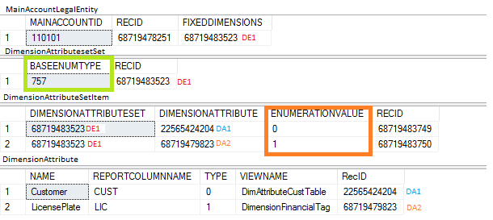](./media/DimensionENumerationSQL.png) 

The MainAccountLegalEntity record references the DimensionAttributeSet record by using its **FixedDimensions** field. The DimensionAttributeSet record represents the combination of dimensions for the enumeration type. The DimensionAttributeSetItem records represent each pair of a dimension and an enumeration value in the set. The enumeration value is represented by its integer value.

### Default dimensions

As dimension enumerations hold a set of dimensions that have associated enumeration values, a default dimension holds a set of dimensions that have specific dimension values. The term *default dimensions* comes from the fact that these sets are typically entered on master data records, not directly on transactions, and they are used to enter default values in a ledger account combination. As for dimension enumerations, no specific structure is associated with default dimensions, and in most instances, the consuming code constrains the set to the dimensions that are available for the current ledger. Default dimensions are stored in the DimensionAttributeValueSet and DimensionAttributeValueSetItem tables.

The following illustration shows an example of default dimensions on a page.

[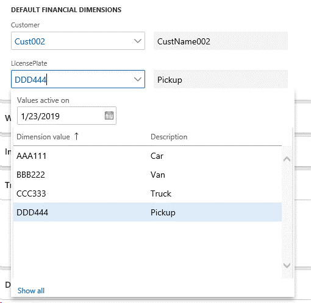](./media/DefaultDimensionsOnForm.png)

In the preceding example, the user has selected a dimension value to associate with each dimension. The following illustration shows how these values are stored in the DimensionAttributeValueSet and DimensionAttributeValueSetItem tables.

[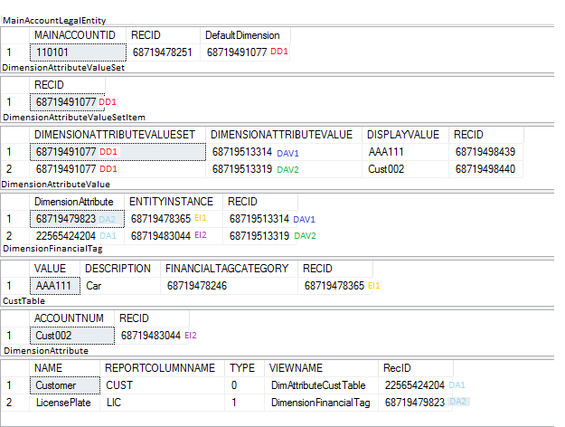](./media/DImensionValueTablesSQL.png)

The MainAccountLegalEntity record holds a foreign key reference to the DimensionAttributeValueSet table that represents the combination of entered values. Specifically, this table represents the set of pairs of dimensions values that are stored in the DimensionAttributeValueSetItem table.

The DimensionAttributeValueSetItem table holds one record for each dimension value that is entered. The record references a DimensionAttributeValue. No records are stored for dimensions that haven't been entered (that is, records that have been left blank). When a default dimension is entered, two records are created in the DimensionAttributeValue table, because the dimension value has now been used in the dimension framework. In this way, the dimension framework values are linked with the backing entities. For performance reasons, the natural key (display value) of a dimension value is stored on the DimensionAttributeValueSetItem table.

To get to the source of the values, you can follow the link that is stored in the **EntityInstance** field on the DimensionAttributeValue table, together with the associated **ViewName** field on the **DimensionAttribute** table, to find the record in the originating tables of CustTable (via the DimAttributeCustTable view) and DimensionFinancialTag.

## Part 3: Structures and constraints

This part of the article covers the "Structures" and "Constraints" regions that are highlighted in yellow in the following illustration.

[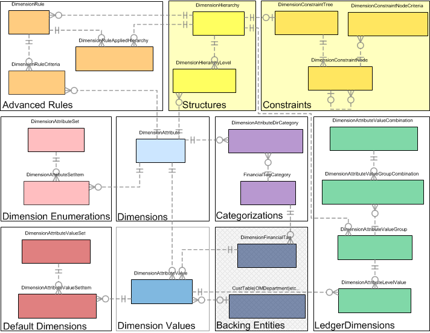](./media/StructuresAndConstraintsInFramework.png)

As was previously stated, the dimension framework allows for an unlimited number of dimensions. Additionally, when users enter a ledger account combination, they can specify which dimensions to include, and in which order. They can also constrain the values that can be entered for each segment in that ledger account combination.

### Account structures

The following illustration shows an example of an account structure.

[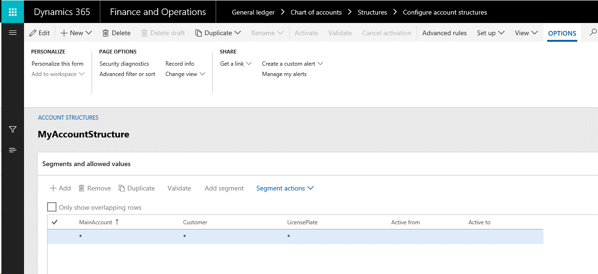](./media/AccountStructureConfigurationForm.png)

As the following illustration shows, this account structure is stored in the DimensionHierarchy table in the database. It's set up to require that a main account be entered as the first segment of a ledger account combination, and that a customer and license plate number be entered as subsequent segments. This setup is the hierarchical order definition. It's stored in the DimensionHierarchyLevel table in the database.

In addition to the order, the constraints must be set up. Constraints are the criteria that define the valid combinations of values. In this example, all segments must have a value for the combination. Otherwise, they aren't considered valid. Any existing value (that is, any value that already exists in the backing entity) can be entered, and there are no specific restrictions on the combinations of values that are valid. This criterion is stored in the DimensionConstraintTree, DimensionConstraintNode, and DimensionConstraintNodeCriteria tables.

[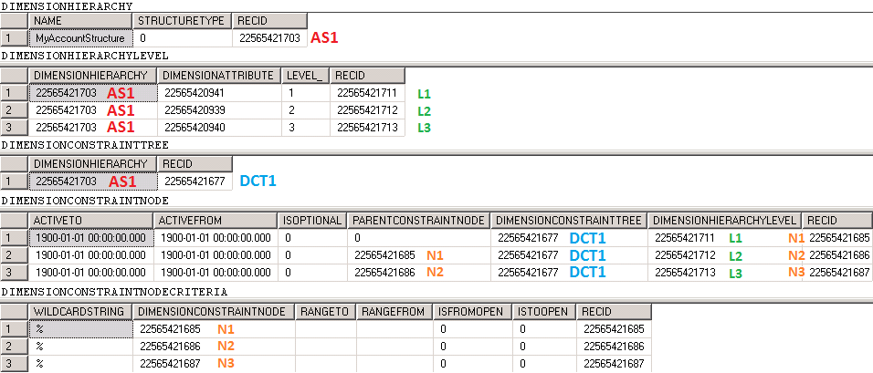](./media/SimpleConstraintsQueryResults.png)

The example in the preceding illustration shows the most basic constraint tree. An asterisk (\*) constraint criterion is associated with each of the three constraint nodes. This constraint criterion represents any existing value. It's stored as a percent sign (%) in the database and is shown as "\<all values\>" in the UI. These constraints are used both to show the values that can be entered for each segment via a lookup and to validate values that are entered in the segment. Eventually, if incorrect values are entered for a ledger account combination, these constraints will produce validation errors.

The dimension framework allows for much more complex constraint trees, where the value that is entered in one segment drives the valid values that can be entered in the next segment. The following illustration shows an example of the versatility.

[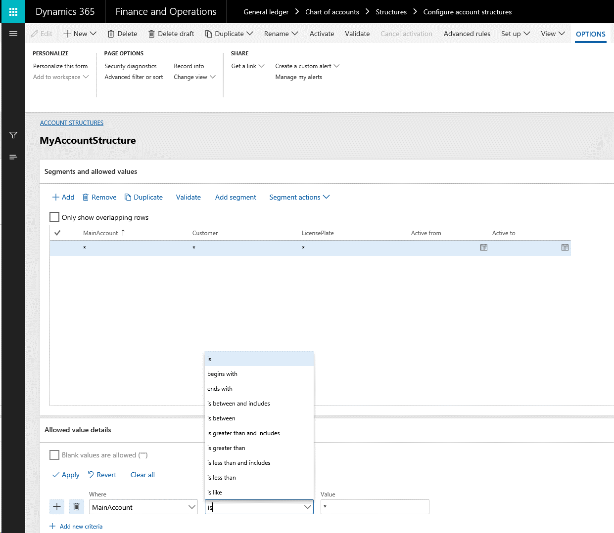](./media/ConstraintbuilderonConfigureAccountStructureForm.png)

The following illustration shows a more complex constraint tree.

The following illustration shows the resulting constraint definition.

[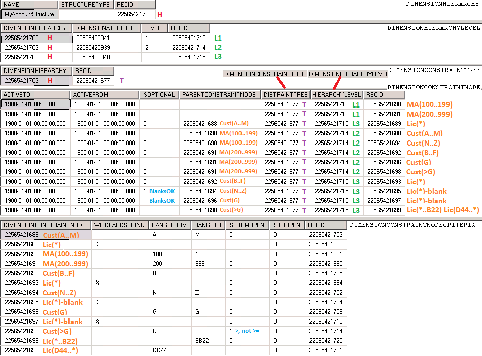](./media/AdvancedConstraintTreeSQL.png)

If a user enters **150-B** for a main account and customer, a specific license plate number must also be entered. However, if the user enters **150-W**, no license plate number is required. In both cases, the user will always see three segments in the ledger account combination, even if one of those segments is left blank. For examples of the effects that these structures, segments, and constraints have when ledger dimension accounts are entered, see the [part 5](#part-5-ledger-dimensions) section of this article section of this article that discusses the entry and storage of ledger account combinations.

If a user wants to show trailing segments only when they must be entered, advanced rules can be combined with the account structure to provide the additional versatility.

## Part 4: Advanced rules

This part of the article covers the "Advanced Rules" region that is highlighted in yellow in the following illustration.

Account structures and constraints let users build simple to complex trees of valid combinations. However, there is sometimes a business requirement to show a dimension as a segment in a ledger account combination only at specific times, instead of just constraining the valid values that are allowed and showing the dimension all the time. Advanced rules support this requirement.

### Advanced rules

Advanced rules can be added to an account structure and its constraints. Although advanced rules are versatile, to help guarantee the best usability, performance, and understanding, be sure to follow these guidelines about when they should and should not be used:

- Rules can't replace the account structure. A structure must always exist, and it must have at least a main account segment.
- Rules can't add dimensions before other segments that are already in the account structure.
- Rules should not be used to replace constraints in the account structure for additional dimensions that are always required, regardless of the main account.
- Rules should not be used to replicate segments that already exist in the account structure, or to replicate other rules.
- Any duplication automatically joins and uses the most restrictive constraint.
- The location of the duplicated segment appears only in the first occurrence of the segment.

To set up an advanced rule, you must define a filter that controls when additional segments are added to a ledger account combination. You must then link rule structures that specify the additional segments that must be added, their order in the hierarchy, and any constraints between them. (Rule structures resemble account structures.)

For example, the following account structure is set up.

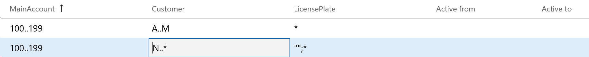

You configure the following advanced rule to optionally add one or more segments only if the user enters main account 145 and customers G through Q.

After the rule is configured, you must create a structure and constraint definition to define what segments should be added to the ledger account combination. To complete this step, you create the following rule structure. The process for creating a rule structure resembles the process for creating an account structure. These structures aren't immediately bound to the rule. Therefore, they can be shared across multiple rules as you require.

After the structure is created, you add it to the dimension rule. The account structure is then activated, together with the rule.

The storage of this data uses some of the same tables as the storage of the account structures (see [part 3](#part-3-structures-and-constraints)). The DimensionRule, DimensionRuleAppliedHierarchy, and DimensionRuleCriteria tables hold the data that is specific to the definition of the rule. They also hold the link to the definition of the rule structures. The remaining tables are shared with the account structure definition.

## Part 5: Ledger dimensions

This part of the article covers the "Ledger Dimensions" region that is highlighted in yellow in the following illustration.

After all the configuration data is set up, ledger account combinations can be entered, validated, and persisted. The primary consumption of the dimension framework occurs when the application uses this area.

### Ledger dimension storage without rules

To understand ledger dimensions, you must understand how users enter ledger account combinations.

This section uses the account structure and rule setup from [part 4](#part-4-advanced-rules) of this article, and explains the user interaction with the account entry control when an account is entered. Here is the account structure, as a reminder.

A single account rule is associated with the account structure.

[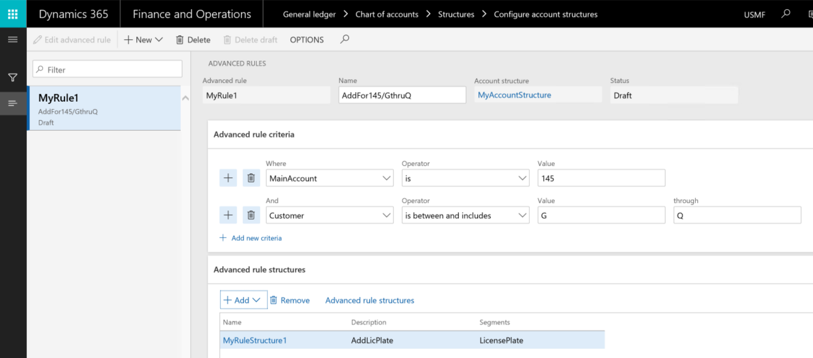](./media/SingleRuleAdded.png)

The following illustration shows the structure that was added.

[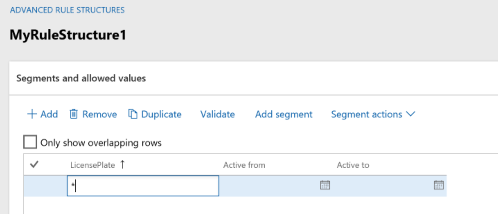](./media/SingleStructureAdded.png)

The following illustration shows what a ledger account field looks like when a user first sees it on a page, and it doesn't have the focus.

When the user clicks in the field, nothing changes. However, if the user selects the drop-down arrow, the lookup appears and shows the possible segments. In the following illustration, there are two possible segments.

For this example, the user enters the combination **150-A**.

As soon as the second segment is entered, and the user presses **Tab** to move out of the control, the dimension framework saves the combination and then validates it, based on the constraints. In this example, the combination is valid. The user can enter segments either as a string or by using the lookup.

For this example, the following information is known about the combination:

- The account structure is named **MyAccountStructure**.
- The first segment is the MainAccount dimension. It has a value of **150**.
- The second segment is the Customer dimension. It has a value of **A**.
- No additional segments were added, because the values didn't match any advanced rules that are associated with this account structure.

Therefore, the two segment values are stored across the four tables, as shown in the following illustration.

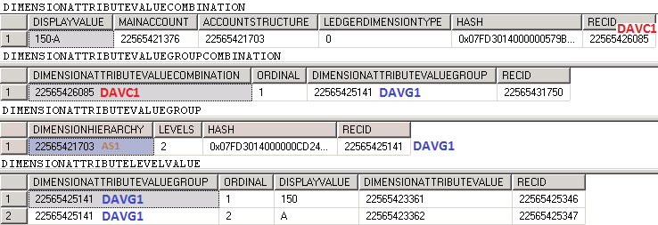]

The first table is named **DimensionAttributeValueCombination**. It stores a full multisegment account combination, together with some denormalized information about the combination. For example, it stores the concatenated segments as a single string, a foreign key reference to the account structure, and a foreign key to the main account that was used (150).

The second table is named **DimensionAttributeValueGroupCombination** and will be explained later.

The third table is named **DimensionAttributeValueGroup**. It stores each related group of segments that is associated with each structure that is present in the combination. In this case, because there is only one structure (the account structure), there is only one record.

The fourth table is named **DimensionAttributeLevelValue**. It stores the individual segment values for each segment in the associated group or structure. One record exists for each segment that is entered. If a segment is empty, no values are stored for it. Each record references the corresponding DimensionAttributeValue record. If an existing DimensionAttributeValue record is found for the value, it's referenced. If an existing DimensionAttributeValue record is not found for the value, one is created. This data links the DimensionAttribute to the real backing entity record. In this case, one DimensionAttributeLevelValue is for the MainAccount record that has an ID of 150, and one DimensionAttributeLevelValue is for the CustTable record that has an ID of A.

To link the group of account structure values and segment values to the main record in the DimensionAttributeValueCombination table, a record is inserted into the second table, DimensionAttributeValueGroupCombination.

To save a single segment in a new combination, at least one record is inserted into each of these four tables. For each additional segment that is entered, an additional record is inserted into the DimensionAttributeLevelValue table. Abstractly, these four tables are referred to as a Ledger Dimension. A Ledger Dimension is expressed as a foreign key that references the **RecId** value in the DimensionAttributeValueCombination table.

### Ledger dimension storage with rules

This section builds on the ledger dimension storage example that was started in the previous section. Here, the user changes the values from **150-A** to **145-Q**. As you know from the advanced rules that were previously set up, this change will cause a third segment to be added to the account structure.

When the user types a hyphen (–) after the second segment, a third segment is added to the control, and it receives the focus.

[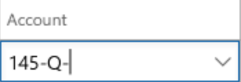](./media/LedgerAccountSegmentAfterTab.png)

If the user opens the lookup while the third segment has the focus, the possible valid values for the third segment are shown.

The user can now enter a license number.

As soon as a value is entered in the third field, and the user presses **Tab** to move out of the control, the combination is validated. If the combination is valid, it's saved as a Ledger Dimension.

For this example, the following information is known about the new combination:

- The account structure is named **MyAccountStructure**.
- The first segment is the MainAccount dimension. It has a value of **145**.
- The second segment is the Customer dimension. It has a value of **Q**.
- Because the values match the rule for the first two segments, an account rule structure that is named **MyRuleStructure1** was added. Therefore, one additional segment was added.
- The third segment is the LicensePlate dimension. It has a value of **AAA 111**.

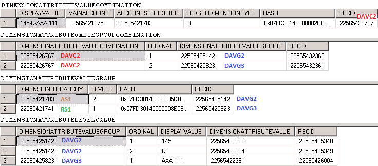]

For this combination, a total of eight rows was inserted across the four tables that store the ledger dimension. The difference between the first ledger account combination that was discussed in the previous post([part 4](#part-4-advanced-rules)) and this ledger account combination is that multiple structures are used to drive the dimensions that make up this ledger account combination. Two records are stored in the DimensionAttributeValueGroupCombination and DimensionAttributeValueGroup tables. Each record represents a structure that is used and joined to the full combination.

Notice that a new **RecId** value is assigned to each record. The combination of the previous values isn't updated. Instead, a new combination is created. Therefore, the Ledger Dimensions are made immutable, because no reference counting is maintained for the use of the combination. The same **150-Q** combination that was originally entered might have been referenced from multiple tables in the application before the user decided to change an instance to **145-Q-AAA 111**. Therefore, a new combination must be created, and the reference to it must be changed only from the table that the ledger account combination is changed on.

Because a new Ledger Dimension is created when a user changes the combination on a record by adding or removing segment values, you might end up with unreferenced or orphaned Ledger Dimensions. By allowing orphaned combinations, you can help improve performance of the overall dimension framework to not deletes records across the tables in question each time a combination is changed. After a combination is used one time, it's likely to be reused. Therefore, if it's immediately removed when the last reference is removed, it might be re-created. Orphaned Ledger Dimensions are still structurally valid and can be reused later if the combination of values in relation to the structures and rules is entered again. If a combination is ever entered another time, no records are inserted, and the existing reference is reused. Therefore, performance is improved.

When advanced rules are used, optimizations are also made for the storage size and insertion cost. For example, in the following illustration, a new account combination is entered.

In this case, the only difference between the new combination and the previous combination is that the license plate number that was provided by the advanced rule was changed. The following illustration shows how the data storage of the combination will look. New records are highlighted in white.

[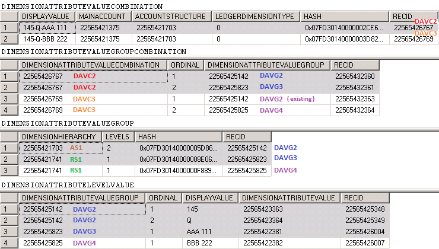](./media/AdditionalLedgerDimensionStorageQueryResults.png)

When the new combination is created, the following five records are inserted. (These records are the records that are highlighted in white in the preceding illustration.)

- One record in DimensionAttributeValueCombination
- Two records in DimensionAttributeValueGroupCombination
- One record (instead of two) in DimensionAttributeValueGroup
- One record (instead of three) in DimensionAttributeLevelValue

This behavior occurs because the values that are stored as part of the account structure "group" are the same in the previous combination (DAVC2) and this combination (DAVC3). Those DimensionAttributeValueGroup and DimensionAttributeLevelValue records didn't have to be re-created. Instead, three records could be reused, and their insertion cost could be saved.

Alternatively, if the structure that is associated with the account rule allows blank values for the license plate number, and a combination of just **145-Q** is created, only two new records are inserted:

- One record in DimensionAttributeValueCombination
- One record in DimensionAttributeValueGroupCombination
- Zero records in DimensionAttributeValueGroup
- Zero records in DimensionAttributeLevelValue

This behavior occurs because all the DimensionAttributeValueGroup and DimensionAttributeLevelValue records already exist and can be fully reused on the new combination. Primarily for this reason, data should never be modified directly in the Ledger Dimension storage tables. A change to a single record might affect not only all references to that ledger dimension, but also one or more other ledger dimensions and references to them.

Although it's partially collapsed in the examples shown in this part of the article, a hash code is assigned to the DimensionAttributeValueCombination and DimensionAttributeValueGroup tables.

## Part 6: Advanced topics

To conclude this article, this part discusses some advanced topics to explain some of the deeper design and implementation decisions that drive the way that the dimension framework works.

The model in the following illustration shows the various areas in the dimension framework.

### Hashes

The design of the database storage in the dimension framework is intended for the following functionality:

- Support immutable data, where data is only inserted, never updated or deleted.
- Reuse previously created combinations to lower insertion costs.
- Avoid reference counting and maintenance of it.
- Provide fast performance to find an existing combination that can be reused.

Because the dimension framework allows for an unlimited number of dimensions and an unlimited number of structures on a ledger account combination, it's difficult to create a single large query or multiple smaller queries to find an existing set or combination. Because the number of records and the order of those records might differ for every combination, a hash-based solution was implemented.

This hash represents the unique information that the records of the associated tables contain, and it allows for fast querying. A single binary container field (160-bit, 20-byte hash column) is stored to uniquely identify the data that the set or combination contains.

The dimension framework uses hashes to uniquely identify data in the following tables:

- **DimensionAttributeValueCombination** – This table consists of data from all the linked records in the DimensionAttributeValueGroup and DimensionAttributeLevelValue tables.
- **DimensionAttributeValueGroup** – This table consists of data from the linked records in the DimensionAttributeLevelValue table.
- **DimensionAttributeSet** – This table consists of data from the associated DimensionAttributeSetItem records.
- **DimensionAttributeValueSet** – This table consists of data from the associated DimensionAttributeValueSetItem records.

### Hash messages

To produce a hash, a message is created that contains individual pieces of ordered information about the contents of the set or combination. Although this message varies, depending on the hash that is being generated, the hash message basically includes information about the dimensions, values, and structures, and the order within the set or combination, if applicable. This information is internally calculated in a prescribed manner and passed on to a hashing routine. This hashing routing then generates a hash to generate a hash key by using a binary container. The exact order and contents of these messages are provided by the methods in the storage supporting classes of the dimension framework. These classes include **DimensionAttributeSetStorage**, **DimensionAttributeValueSetStorage**, and **DimensionStorage**.

> [!NOTE]
> The internal hash function has been updated in Dynamics 365 Finance. For more information, see [Verify hash function changes after update to Dynamics 365 Finance 2020 release wave 2](https://cloudblogs.microsoft.com/dynamics365/it/2020/08/03/verify-hash-function-changes-after-update-to-dynamics-365-finance-2020-release-wave-2/)

### Hash keys

Generation of a hash message requires something that uniquely identifies each dimension, value, and structure that makes up the combination. Although a **RecId** value can serve as a unique identifier, it's considered only a surrogate, because it isn't immutable and can change if, for example, the record is exported and then imported into a different system or partition. The **RecId** value can be reassigned during the import process. If a hash is created with a hash message that uses a **RecId** value, it can no longer be used to identify a combination in the dimension framework for that new system or partition. Instead, a GUID is used. This GUID resides on the DimensionAttribute, DimensionAttributeValue, and DimensionHierarchy tables, and is stored in the **HashKey** column. Every time that a new record is created, a GUID is assigned and remains with that record to uniquely identify it.

### Risks of changing data directly

It's important that no data be directly modified outside the application framework (for example, in Microsoft SQL Server Management Studio). This guideline applies to the modification of data in *any* column of the table, not just the columns that have been discussed in this article. It also applies to the replication of data from one row to another, and to attempts to create "new" sets or combinations outside the dimension framework storage classes.

It's important that you understand this guideline when you're considering backups and partial restorations of data that might affect referential and hash integrity. For example, if you back up only the Ledger Dimension related records and import them into another partition, you might cause issues unless you also import all the other records in the dimension framework, in addition to all the backing entity records, such as records from the CustTable table or other table that were used to create any combinations. Any attempt to modify the data in these tables, or to synthesize GUIDs or hashes, will cause data to become corrupted, and will require complex, time-consuming analysis to find the source of the corruption and try to fix it.

### Apparent duplicate combinations

When you browse the tables of the dimension framework and view only the **DisplayValue** field that is stored on the records, it might appear that combinations are duplicated. However, this apparent duplication just indicates that data in the hash or joined tables differs, even though the **DisplayValue** strings appear the same. The **DisplayValue** strings are stored on the records to improve performance for some scenarios, but they aren't used to uniquely identify the record.

For example, an account structure has **MainAccount-Department** in one company and another account structure has **MainAccount-CostCenter** in a different company. In this scenario, the **DisplayValue** string of two combinations, one for each account structure, can appear as **145-A**. For the first account structure, **A** represents a department in the first company. However, for the second account structure, it represents a cost center in the second company. Additionally, multiple types of a Ledger Dimension are stored in the DimensionAttributeValueCombination table. For example, special types for budgeting might appear the same to have the types as other combinations when you examine the **DisplayValue** fields. However, they hold different information internally and hold uniquely different hash values.

### Versioning/date-effective data

The dimension framework doesn't directly support versioning or date-effective data. If any backing entities that the dimension framework references are versioned, and a new **RecId** value is assigned to newer versions in the same table, the framework will correctly link to the correct version through the DimensionAttributeValue record. If the same backing entity record is used, and another table tracks revisions to it in the owning module, the dimension framework won't be able to determine the difference, because the **RecId** value of the backing entity won't differ between versions. None of the dimension framework tables (such as dimensions, structures, rules, and constraints) support versioning internally. The previous versions are replaced with a new version, and no history is maintained.

When a structure or rule is changed, if ledger account combinations have been saved on unposted transactions, the dimension framework creates new combinations and updates any foreign key references to them on unposted transaction tables. It doesn't change the original combinations, because those combinations might be referenced from posted transactions. The two combinations aren't linked in any way. There is no way to determine what a structure and its rules looked like before the change. Some information can be determined by the data that is stored in the combination. However, because blank values aren't stored, this data is incomplete and can't be used to reconstruct a previous version.

The dimension framework supports "valid from" and "valid to" dates at the level of a dimension value. These dates indicate when the value is considered "valid." They don't represent the historical state of the value in the same way that date-effective data does.

[!INCLUDE[footer-include](../../../includes/footer-banner.md)]

