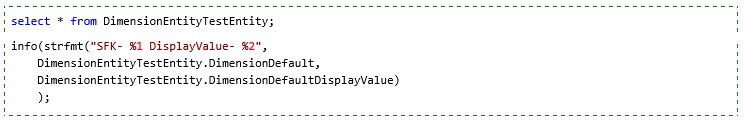
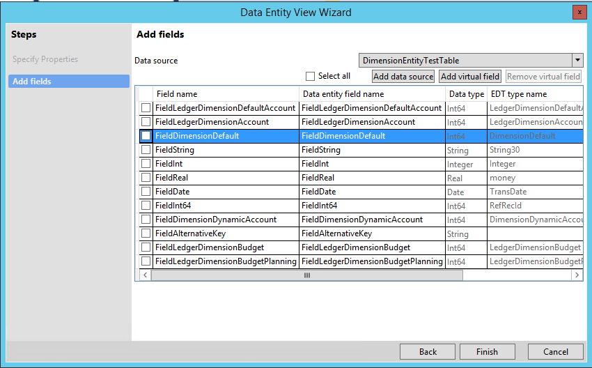
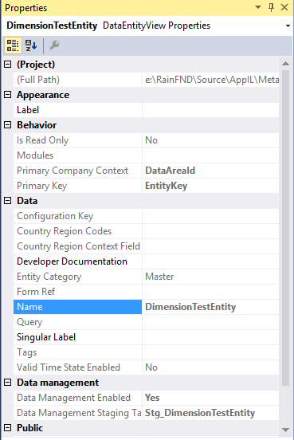
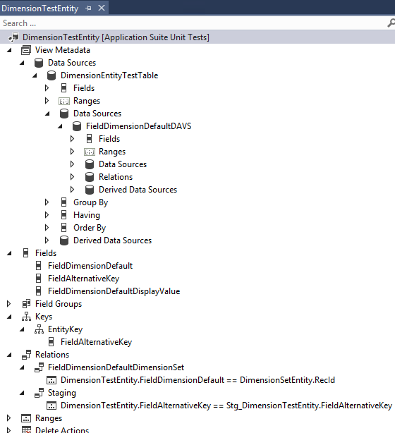
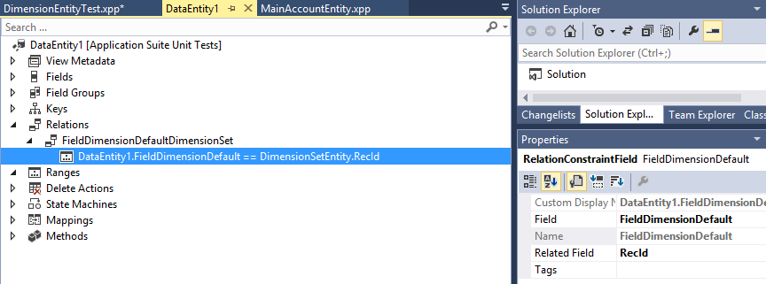

---
# required metadata

title: Support for different dimension patterns
description: To support different dimension patterns, a set of framework data entities can be used as data sources in other entities that involve dimensions.
author: RyanCCarlson2
ms.date: 11/10/2017
ms.topic: article
ms.prod: 
ms.technology: 

# optional metadata

# ms.search.form: 
# ROBOTS: 
audience: Developer
# ms.devlang: 
ms.reviewer: kfend
# ms.tgt_pltfrm: 
ms.assetid: c2431895-0751-4a2a-96cb-f7df76c88f66
ms.search.region: Global
# ms.search.industry: 
ms.author: rcarlson
ms.search.validFrom: 2016-02-28
ms.dyn365.ops.version: AX 7.0.0

---

# Support for different dimension patterns

[!include [banner](../includes/banner.md)]

To support different dimension patterns, a set of framework data entities has been created that can be used as data sources in other entities that involve dimensions.

## The SFK and the Natural key

To support different dimension patterns, a set of framework data entities has been created that can be used as data sources in other entities that involve dimensions. When this nesting of data entities occurs, the surrogate foreign key (SFK) and natural key of the dimensions data entity are treated differently. The following table describes the differences.

| Key type    | Access modifier | Description, when the dimension entity is a data source on another entity|
|-------------|-----------------|--------------------------------------------------------------------------|
| SFK         | private         | As with any SFK, the SFK of the dimension is defined on the outer data entity as a private field.  |
| Natural key | public          | The natural key of the dimension entity is exposed as a public string of dimension attribute values. The values are concatenated together but are separated by the account delimiter. The account delimiter is defined per partition. The concatenated string is used as a display value. The phrase “DisplayValue” is appended as a suffix to some fields of an entity, as explained later in this document. |

## Reads and writes

**Read:** On a read of the outer data entity, the public display value will be retrieved from a computed column by using the dimension entity of the framework. Because the read uses a computed column, it doesn't require any X++ logic for export scenarios. **Write:** On the creation or update of entity instance values, the public display value is resolved to the SFK to match the private field.

### Examples

**DimensionEntityTestEntity** is a test entity that has more than one dimension pattern. For the default dimension, you can focus on the **DimensionDefault** and **DimensionDefaultDisplayValue** fields, and ignore the rest.

#### Read example

#### Write example

The entity exposes a default dimension field, **DimensionDefaultDisplayValue**. This is a display value field. You can set this field to a concatenated string value that is similar to the segmented entry control of the user interface. 

 **DisplayValue** resolves to **DefaultDimension** at run time.

## Create an entity by using a wizard

This section describes how to create a data entity by using a wizard. We recommend that you use the wizard. It requires only that you select the SFK field of the dimension. The wizard creates the required data source, fields, and relations that have all the correct settings.

1. Click **File** &gt; **New** &gt; **Project** to create a new project.
2. In Solution Explorer, right-click your project, and then click **Properties**. The **Property Pages** dialog box for your project opens.
3. In the **Property Pages** dialog box, follow these steps:
   1.  Change the value of the **Model** property to **Application Suite Unit tests**, and then click **OK**. You must set this property only one time per project.
   2.  Change the value of the **Synchronize database on build** property to **True**, and then click **OK**. You must set this property only one time per project.

   

4. Create a new entity that is named **DimensionTestEntity**, and add it to the project. When you click the **Add** button, the **Data Entity View** wizard starts. Under **Installed**, then select **Dynamics 365 Artifacts**, then selec **Data Model**. Select **Data Entity** from the list. **Note:** A naming convention document is evolving that covers data entities and other items.
5. Specify the property values for the data entity that you're creating, as shown in the following screen shot. **Note:** The most important field is **Primary data source**, where you select **DimensionEntityTestTable**.

    Click **Next**.

6. Add fields to the entity from the primary data source, **DimensionEntityTestTable**:
   1.  Clear the **Select all** check box to deselect all fields. 

       

   2.  Manually select the check box for each of the following fields:
       -   FieldDimensionDefault
       -   FieldAlternativeKey

       

   3.  Click **Finish** to add the new data entity to your project. A node for the entity appears in Solution Explorer. 

       

7. Click **Build** &gt; **Build Solution** to build your project.
8. In the **Errors** pane, verify that the build was completed without any errors. At this stage in the process, warnings are tolerated.
9. Validate the properties of **DimensionTestEntity**. In Solution Explorer, select the **DimensionTestEntity** node, and compare the values in the **Properties** pane values to the values in the following screen shot. 

   

10. In Solution Explorer, right-click the **DimensionTestEntity** node, and then click **Open**. The designer for the entity opens in the middle pane. 

    

11. In the designer for **DimensionTestEntity**, expand **Fields** &gt; **FieldDimensionDefaultDisplayValue**, and select the node for the **FieldDimensionDefaultDisplayValue** field.
12. In the **Properties** pane, change the value of the **AccessModifier** property from **Private** to **Public**. 

    

13. Override the **persistEntity** method on the data entity, and enter the following X++ code. 

    

14. For testing, see the existing unit test class, **DimensionEntityTest**.

## Manually configure and understand default dimensions
This section describes how to add a dimension data source to a new entity. The new entity requires the dimension display value from the dimension tables.

1.  On a new entity, create a data source that has the property values that are shown in the following screen shot. In particular, notice the settings for the properties that are described in the following table.

    | Property name | Property value            | Description           |
    |---------------|---------------------------|-----------------------|
    | Allow Add     | No                        |                       |
    | Is Read Only  | Yes                       |                       |
    | Join Mode     | OuterJoin                 |                       |
    | Name          | FieldDimensionDefaultDAVS | The value is derived by appending the four-character literal "DAVS" to the name of the SFK field from the data source.                                         |
    | Table         | DimensionSetEntity        | The name that you chose for the data entity for the data source. The value that is shown here, **DimensionSetEntity**, is a framework dimension data entity for the DefaultDimension pattern. |

    

2.  Create a private field for the dimension SFK. For this entity field, the source field is the **FieldDimensionDefault** SFK field.

    

3.  Create a public field for the dimension display value, and bind it to the data source that you created in a previous step. The name of the dimension display value field must be the private field name, to which the twelve-character literal “DisplayValue” is appended.

    

4.  Add an entity relation. An entity relation will enable OData navigation between entities. The name of the relation should be the name of the private dimension field name, to which “DimensionSet” is appended. The public name for **DimensionSetEntity** is **DimensionSet**. Therefore, the navigation to that entity should have a meaningful name. A good choice is the name of the dimension SFK plus “DimensionSet.”

    

5.  Override the **persistEntity** method, and enter the following X++ code. 

    

[!INCLUDE[footer-include](../../../includes/footer-banner.md)]
