# Support for different dimension patterns

[!include [banner](../includes/banner.md)]

To support different dimension patterns, use a set of framework data entities as data sources in other entities that involve dimensions.

## The SFK and the natural key

When you nest these framework data entities, you treat the surrogate foreign key (SFK) and natural key of the dimensions data entity differently. The following table describes the differences.

| Key type    | Access modifier | Description, when the dimension entity is a data source on another entity|
|-------------|-----------------|--------------------------------------------------------------------------|
| SFK         | private         | As with any SFK, define the SFK of the dimension on the outer data entity as a private field.  |
| Natural key | public          | Expose the natural key of the dimension entity as a public string of dimension attribute values. Concatenate the values together but separate them by the account delimiter. Define the account delimiter per partition. Use the concatenated string as a display value. Append the phrase “DisplayValue” as a suffix to some fields of an entity, as explained later in this document. |

## Reads and writes

**Read:** On a read of the outer data entity, retrieve the public display value from a computed column by using the dimension entity of the framework. Because the read uses a computed column, it doesn't require any X++ logic for export scenarios. **Write:** On the creation or update of entity instance values, resolve the public display value to the SFK to match the private field.

### Examples

**DimensionEntityTestEntity** is a test entity that has more than one dimension pattern. For the default dimension, focus on the **DimensionDefault** and **DimensionDefaultDisplayValue** fields, and ignore the rest.

#### Read example

:::image type="content" source="./media/suba.png" alt-text="Screenshot of the read example.":::

#### Write example

The entity exposes a default dimension field, **DimensionDefaultDisplayValue**. This field is a display value field. Set this field to a concatenated string value that is similar to the segmented entry control of the user interface.

:::image type="content" source="./media/subb.png" alt-text="Screenshot of the write example."::: **DisplayValue** resolves to **DefaultDimension** at run time.

## Create an entity by using a wizard

This section describes how to create a data entity by using a wizard. Use the wizard. It requires only that you select the SFK field of the dimension. The wizard creates the required data source, fields, and relations that have all the correct settings.

1. Select **File** &gt; **New** &gt; **Project** to create a new project.
1. In **Solution Explorer**, right-click your project, and then select **Properties**. The **Property Pages** dialog box for your project opens.
1. In the **Property Pages** dialog box, follow these steps:
   1. Change the value of the **Model** property to **Application Suite Unit tests**, and then select **OK**. Set this property only one time per project.
   1. Change the value of the **Synchronize database on build** property to **True**, and then select **OK**. Set this property only one time per project.

   [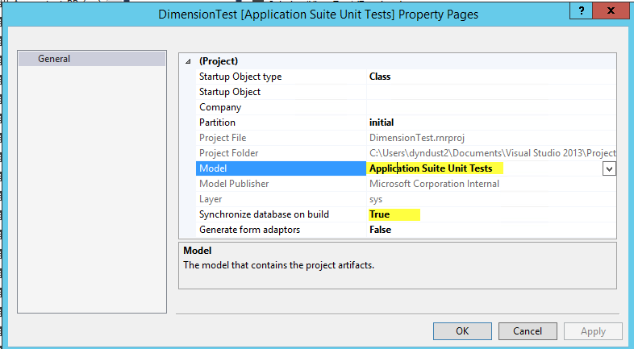](./media/dim2.png)

1. Create a new entity named **DimensionTestEntity**, and add it to the project. When you select **Add**, the **Data Entity View** wizard starts. Under **Installed**, select **Dynamics 365 Artifacts**, and then select **Data Model**. Select **Data Entity** from the list.

   > [!NOTE]
   > A naming convention document is evolving that covers data entities and other items.
1. Specify the property values for the data entity that you're creating, as shown in the following screenshot.

   > [!NOTE]
   > The most important field is **Primary data source**, where you select **DimensionEntityTestTable**.

   [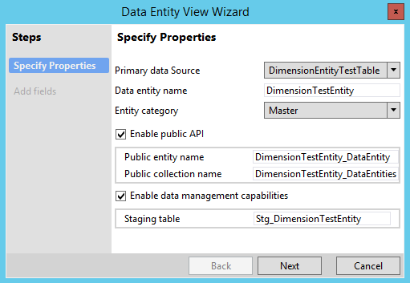](./media/dim4.png) Select **Next**.

1. Add fields to the entity from the primary data source, **DimensionEntityTestTable**:
   1. Clear the **Select all** check box to deselect all fields.

       [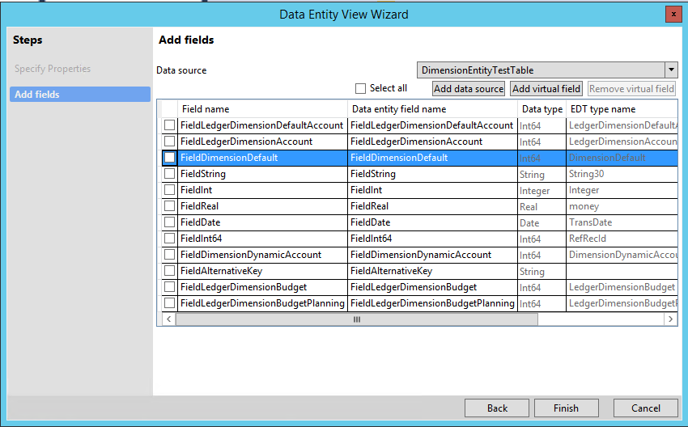](./media/dim5.png)

   1. Manually select the check box for each of the following fields:
       - FieldDimensionDefault
       - FieldAlternativeKey

       [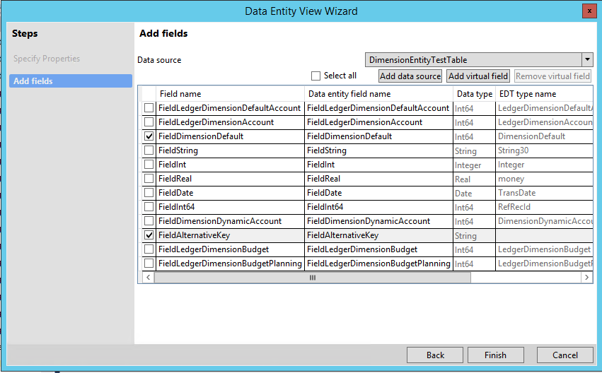](./media/dim6.png)

   1. Select **Finish** to add the new data entity to your project. A node for the entity appears in **Solution Explorer**.

       [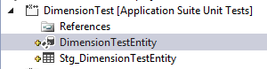](./media/dim7.png)

1. Select **Build** &gt; **Build Solution** to build your project.
1. In the **Errors** pane, verify that the build was completed without any errors. At this stage in the process, warnings are tolerated.
1. Validate the properties of **DimensionTestEntity**. In **Solution Explorer**, select the **DimensionTestEntity** node, and compare the values in the **Properties** pane to the values in the following screenshot.

   [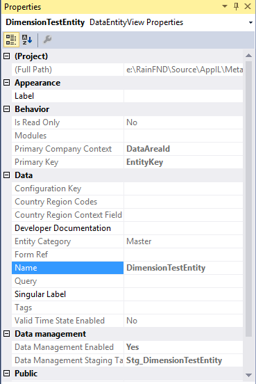](./media/dim8.png)

1. In **Solution Explorer**, right-click the **DimensionTestEntity** node, and then select **Open**. The designer for the entity opens in the middle pane.

    [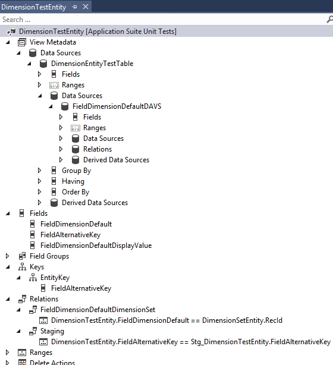](./media/dim9.png)

1. In the designer for **DimensionTestEntity**, expand **Fields** &gt; **FieldDimensionDefaultDisplayValue**, and select the node for the **FieldDimensionDefaultDisplayValue** field.
1. In the **Properties** pane, change the value of the **AccessModifier** property from **Private** to **Public**.

    [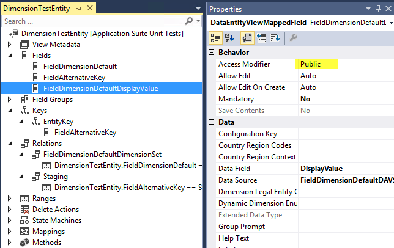](./media/dim10.png)

1. Override the **persistEntity** method on the data entity, and enter the following X++ code.

    [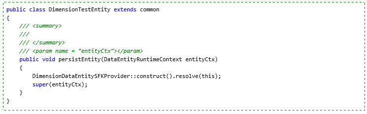](./media/dim11.png)

1. For testing, see the existing unit test class, **DimensionEntityTest**.

## Manually configure and understand default dimensions

This section describes how to add a dimension data source to a new entity. The new entity requires the dimension display value from the dimension tables.

1. On a new entity, create a data source that has the property values that are shown in the following screenshot. In particular, notice the settings for the properties that are described in the following table.

    | Property name | Property value            | Description           |
    |---------------|---------------------------|-----------------------|
    | Allow Add     | No                        |                       |
    | Is Read Only  | Yes                       |                       |
    | Join Mode     | OuterJoin                 |                       |
    | Name          | FieldDimensionDefaultDAVS | The value is derived by appending the four-character literal "DAVS" to the name of the SFK field from the data source.                                         |
    | Table         | DimensionSetEntity        | The name that you choose for the data entity for the data source. The value that is shown here, **DimensionSetEntity**, is a framework dimension data entity for the DefaultDimension pattern. |

    [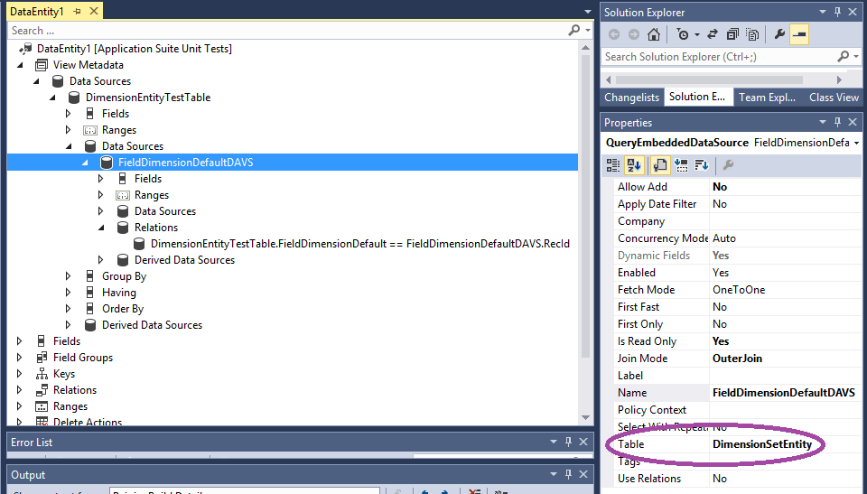](./media/dim12.png)

1. Create a private field for the dimension SFK. For this entity field, the source field is the **FieldDimensionDefault** SFK field.

    [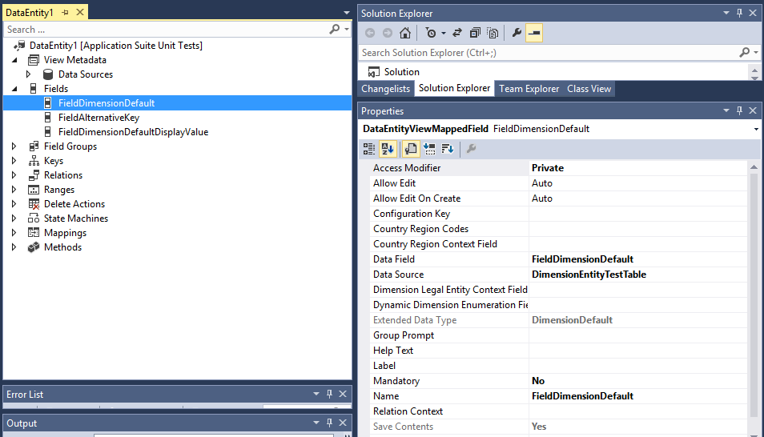](./media/dim13fixed.png)

1. Create a public field for the dimension display value, and bind it to the data source that you created in a previous step. The name of the dimension display value field must be the private field name, to which the twelve-character literal “DisplayValue” is appended.

    [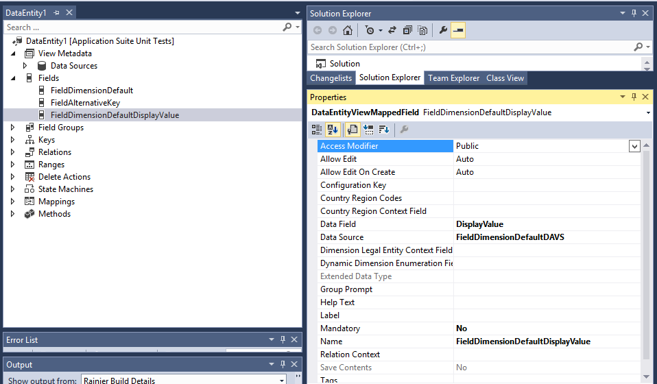](./media/dim14fixed.png)

1. Add an entity relation. An entity relation enables OData navigation between entities. The name of the relation is the name of the private dimension field name, to which “DimensionSet” is appended. The public name for **DimensionSetEntity** is **DimensionSet**. Therefore, the navigation to that entity should have a meaningful name. A good choice is the name of the dimension SFK plus “DimensionSet.”

    [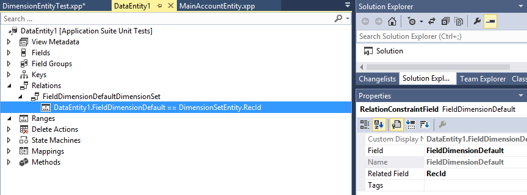](./media/dim15fixed.png)

1. Override the **persistEntity** method, and enter the following X++ code.

    [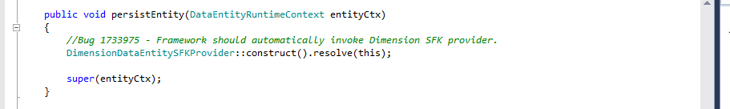](./media/dim16.png)

[!INCLUDE[footer-include](../../../includes/footer-banner.md)]
