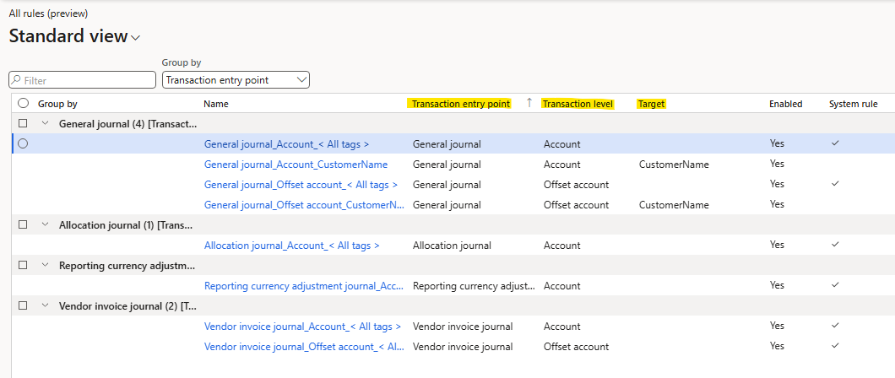
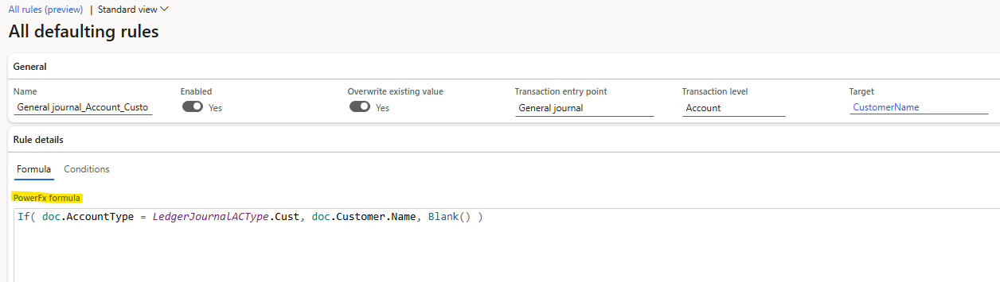
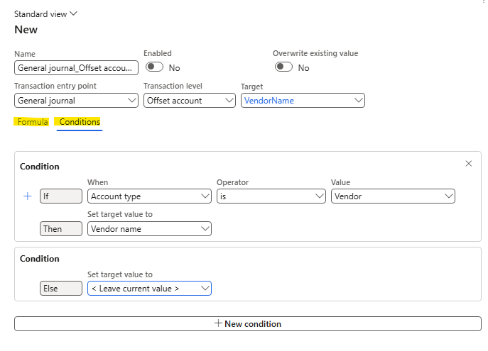
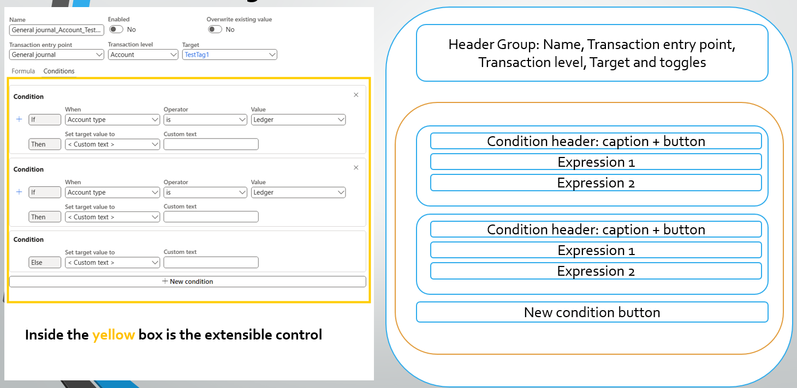
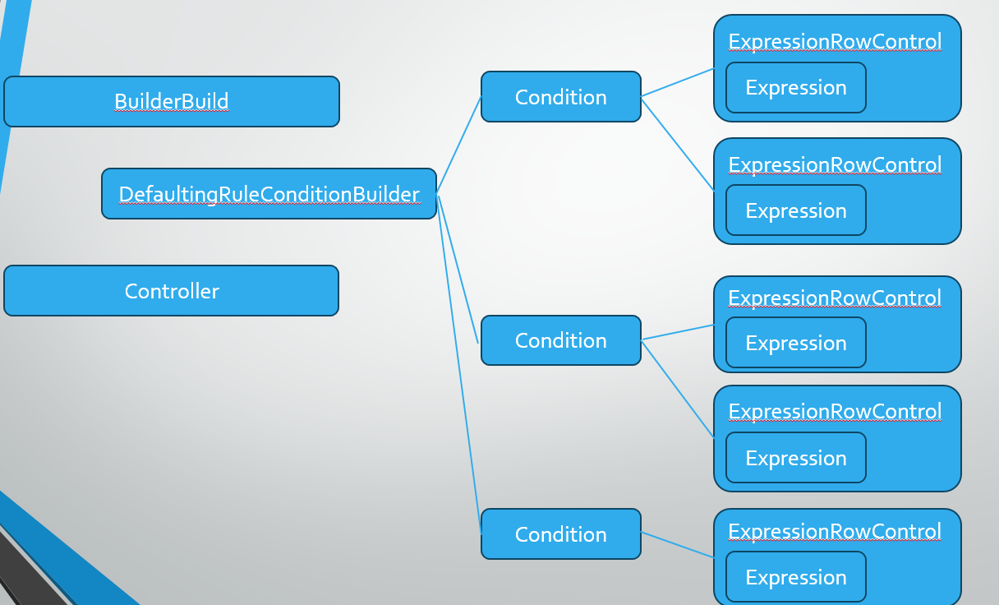

# Financial tag defaulting rules

[!include [banner](../includes/banner.md)]

Financial tag defaulting allows users to define rules as Power Fx formulas that automatically populate financial tag fields on records such as `LedgerJournalTrans`. When a user creates, modifies, or saves a record, the applicable rules execute to default tag values.

## What are financial tag rules

A financial tag rule is defined by three components:

| Component | Description |
|---|---|
| **Transaction Entry Point** | The document or journal the rule applies to (for example, General Journal, Allocation Journal). |
| **Transaction Level** | The level where the FinTag field resides (Header, Account, Offset Account, Line). |
| **Target** | The specific financial tag to populate. |

Each rule contains a Power Fx formula defining the defaulting logic. For example, a rule can default a "CustomerName" tag to the customer's name when the AccountType is Customer.

### System rules vs user rules

| Type | Description |
|---|---|
| **System rules** | Copy the entire FinTag field between levels (for example, header to account). They have a Transaction Entry Point and Level but no Target. Users cannot modify or delete system rules, but can disable them. |
| **User rules** | Created by users to default individual tag values using Power Fx. Users can create, edit, delete, and enable/disable these rules. Rules can be authored using the Condition Builder or by entering Power Fx directly. |

## When rules execute

Rules execute at specific trigger levels defined in the `FinTagRuleTriggerLevel` enum:

| Trigger level | Description |
|---|---|
| `RecordCreated` | When a new record is created. |
| `RecordSaved` | When a record is saved. |
| `PrimaryAccountModified` | When the primary account field changes. |
| `OffsetAccountModified` | When the offset account field changes. |

Defaulting occurs both at the form level (user creates or modifies a record) and at the entity level (during data import).

## Defaulting Rule Condition Builder

The Condition Builder is an extensible control that lets users define defaulting rules without writing Power Fx formulas directly. It provides a UI for building conditions with expressions.

### Supported operators

The builder supports the following operators per data type:

- **String fields**: `contains`, `begins with`, `ends with`, `is`
- **Enum fields**: `is`

The form control rendered depends on the data type: **ComboBox** for enum fields, **String** for text fields.

### Core classes

| Class | Responsibility |
|---|---|
| `DefaultingRuleConditionBuilder` | Master runtime logic and initialization of the extensible control. |
| `DefaultingRuleConditionBuilderBuild` | Defines design-time properties visible in Visual Studio (controller class name, extensible control name). |
| `DefaultingRuleConditionBuilderController` | Initial setup: supported operators, maximum expression count, maximum condition count. |

### Supporting classes

| Class | Responsibility |
|---|---|
| `DefaultingRuleConditionBuilderCondition` | Manages a group of rule expressions within a single condition, including dynamic UI controls for adding/removing expression rows. |
| `DefaultingRuleConditionBuilderExpressionRowControl` | Represents a single expression row (field, operator, value) and handles its controls, state, and conversion to Power Fx syntax. |
| `DefaultingRuleConditionBuilderExpression` | Data object for a single expression: id, field, operator, value, and conditional type. |
| `DefaultingRuleConditionBuilderOperator` | Encapsulates operator metadata and provides mappings between display labels, operator enums, and Power Fx functions. |
| `DefaultingRuleConditionBuilderSupportedOperator` | Defines which operators are available for each data type. |

## Power Fx conversion

The entry points for converting between the Condition Builder and Power Fx are:

- `FinTagRuleFormHelper.updateBuilderFromPowerFxFormula()` — Parses a Power Fx formula and populates the builder UI.
- `FinTagRuleFormHelper.updatePowerFxFormulaFromBuilder()` — Reads the builder state and generates a Power Fx formula.

### Conversion behavior

| Direction | Behavior |
|---|---|
| **Builder to Power Fx** | Always succeeds. Generates an `If()` Power Fx expression from the builder conditions. |
| **Power Fx to Builder** | Succeeds if the formula can be parsed into `If()` structure. For complex formulas that can't be decomposed, the builder displays "Formula is too complex to be shown as conditions" and the condition/expression controls are hidden. |

### Parser classes

| Class | Responsibility |
|---|---|
| `DefaultingRuleConditionPowerFxParser` | Master class for bidirectional conversion between builder objects and Power Fx formulas. |
| `DefaultingRuleConditionPowerFxCondition` | Represents a Power Fx condition; converts between Power Fx syntax and `DefaultingRuleConditionBuilderCondition`. |
| `DefaultingRuleConditionPowerFxExpression` | Represents a Power Fx expression within a condition; converts between Power Fx syntax and `DefaultingRuleConditionBuilderExpressionRowControl`. |
