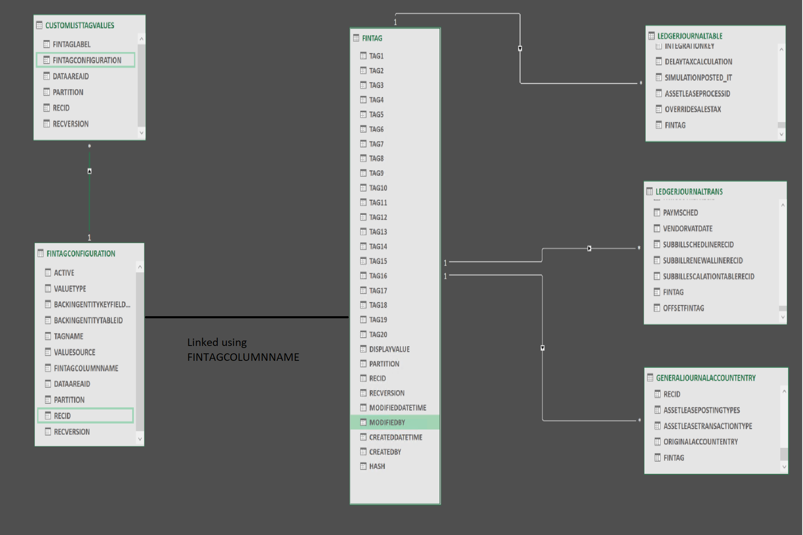

# Financial tags developer overview

[!include [banner](../includes/banner.md)]

Financial tags are user-defined fields used to track additional subledger or external information on accounting entries. An organization can create up to 20 tags per company for data they want to track on accounting entries. Tags are configured at **General Ledger > Chart of Accounts > Financial Tags**.

## Tag types and validation behavior

Financial tags support the following value types:

| Type | Description | Validation |
|---|---|---|
| **List** | Entity-backed list of values | No validation. Users can enter any value. |
| **Custom List** | User-defined list confined to a single tag (not reusable) | No validation. The list provides suggestions only. |
| **Text** | Free-text entry | None |
| **Fixed List** | Entity-backed list with validation (10.0.44+) | Enforced. Only values in the list are accepted. |
| **Fixed Custom List** | User-defined list with validation (10.0.44+) | Enforced. Only values in the list are accepted. |

> [!IMPORTANT]
> **List** and **Custom List** types do not validate entered values at transaction entry or posting. This is by design. If validation is required, use **Fixed List** or **Fixed Custom List** types, available in version 10.0.44 and later.

## DimensionFinancialTag is not FinTag

Financial tags (`FinTag*` tables) and custom financial dimensions (`DimensionFinancialTag` table) are two entirely separate features with no overlap in data or behavior.

| Aspect | Custom financial dimensions (DimensionFinancialTag) | Financial tags (FinTag) |
|---|---|---|
| Purpose | Financial reporting | Tracking non-reporting data on accounting entries |
| Data model | Relational + denormalized for reporting queryability | Lightweight; single hash-based table |
| Editability after posting | Not editable (correcting entries only) | Editable at any time via Edit Voucher |
| Performance impact | Highly variable dimensions degrade storage and performance | Minimal; no dimension framework overhead |

Use financial tags instead of financial dimensions when the data doesn't appear on financial statements (document numbers, serial numbers, payment references, etc.). Converting existing non-reporting dimensions to financial tags prevents further growth in the dimension tables.

## Transaction lifecycle

The data flow for financial tags across a transaction is:

1. **Voucher entry** - Tags are entered or defaulted on journal lines.
2. **Defaulting** - Rules copy tags from header to line or from main account to offset account.
3. **Posting** - Tag values are persisted with the subledger and general ledger entries.
4. **Edit after posting** - Tags can be modified on posted vouchers via the Edit Voucher tool (**General Ledger > Inquiries and reports > Voucher transactions > Edit Voucher**).
5. **Archival** - Tags are included in archive-to-history and archive-to-data-lake operations.

## FinTag data model and core tables

Records in the **FinTag** table are immutable and reused based on a record-level hash key. When a user specifies a combination of tag values that already exists, the existing record is referenced rather than creating a duplicate.

| Table | Description | Record creation |
|---|---|---|
| **FinTagConfiguration** | Each row corresponds to a column in the **FinTag** table, storing the user-defined name and backing entity. Maximum 20 records per company. Deletes are not permitted because they would break existing tag references. | **Financial Tags** form or **FinancialTagConfiguration** entity. |
| **FinTag** | Each record holds up to 20 values, one per column. The combination serves as a foreign key on consuming tables. Updates and deletes are not permitted; changes create a new record to preserve data integrity when multiple consumers reference the same record. A hash is stored for lookup and can be regenerated with `dbo.FinTagCreateHash()`. | Created whenever a user specifies a new combination of values. |
| **FinTagCustomListValue** | Stores the user-defined values for **Custom List** tags. References **FinTagConfiguration**; values are deleted if the tag type changes. | Created via the **Tag Values** button on the Financial Tags form, or through entity import. |
| **FinTagParameters** | Holds the financial tag delimiter. This value cannot be changed after it has been set. | Created once. |
| **FinTagTagNameValueView** | A pivot view that transforms each tag value into a separate row. Used to populate the **FinTagGridLookup** form. | N/A (view). |

> [!WARNING]
> Always filter **FinTagTagNameValueView** by both `DataAreaId` and `FinTag` RecId. Querying without these filters produces a Cartesian product between **FinTag** and **FinTagConfiguration**.
