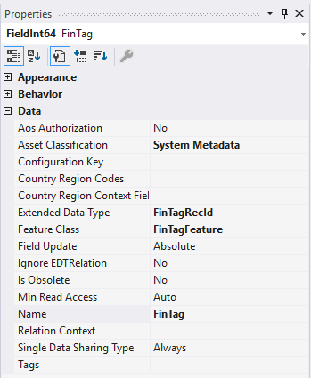
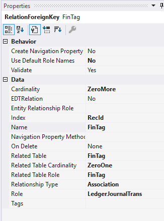
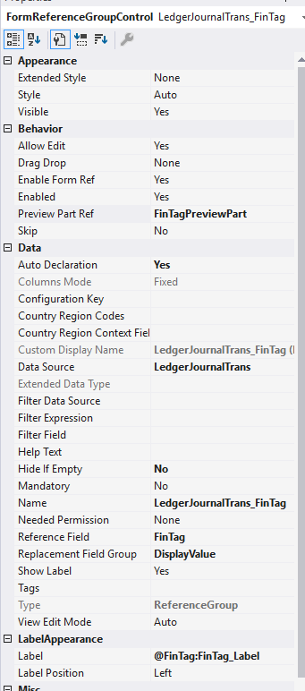
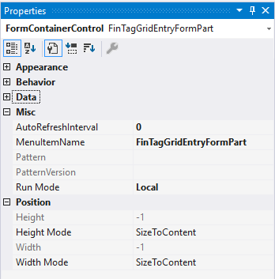
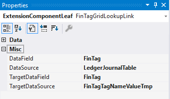
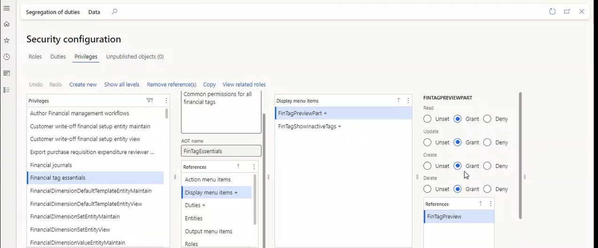
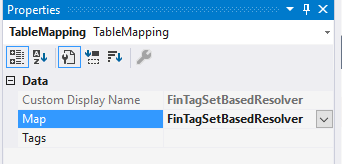
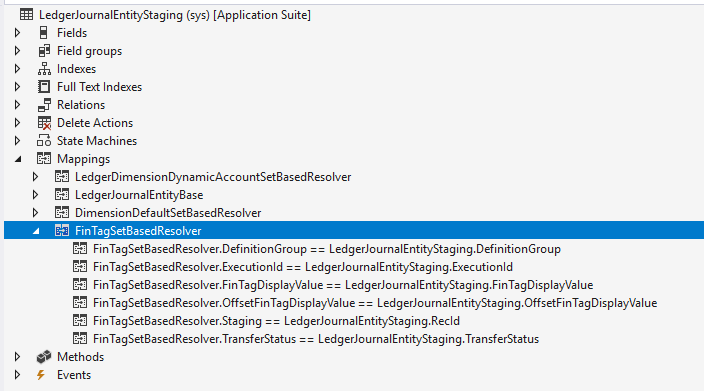

# Uptake financial tags on forms and entities

[!include [banner](../includes/banner.md)]

This article describes how to add financial tag support to tables, forms, and data entities. If you have questions after reading this document, see the General journal implementation as the established pattern.

## Data model setup

Financial tag data is stored in the **FinTag** table. To reference it from your table:

1. Add a **FieldInt64** field with the following properties:

    | Property | Value |
    |---|---|
    | Extended Data Type | `FinTagRecId` |
    | Feature Class | `FinTagFeature` |
    | Asset Classification | `System Metadata` |
    | Label | Leave blank (the EDT provides the label) |

    

1. Add a **RelationForeignKey** relation to the **FinTag** table:

    | Property | Value |
    |---|---|
    | Use Default Role Names | No |
    | Cardinality | ZeroMore |
    | Index | RecId |
    | Name | `FinTag` (or `OffsetFinTag` if applicable) |
    | Related Table | `FinTag` |
    | Related Table Cardinality | ZeroOne |
    | Related Table Role | `FinTag` (or `OffsetFinTag`) |
    | Relationship Type | Association |
    | Role | *Name of your table* |

    If your table uses an offset FinTag field, create a separate relation for it.

    

## Add FinTag to a grid

1. Add a **FormReferenceGroupControl** to the grid with these properties:

    | Property | Value |
    |---|---|
    | Auto Declaration | Yes |
    | Preview Part Ref | `FinTagPreviewPart` |
    | Data Source | The datasource containing a reference to **FinTag** |
    | Hide if Empty | No |
    | Reference Field | The column referencing the **FinTag** table |
    | Replacement Field Group | `DisplayValue` |
    | Label | `@FinTag:FinTag_Label` (default; adjust as needed) |

    

1. In the form's `init` method, register the control after `super()`:

    ```xpp
    public void init()
    {
        super();

        FinTagReferenceGroupController::registerReferenceGroup(
            FinTagReferenceGroupControllerContract::construct(LedgerJournalTrans_FinTag));
    }
    ```

    This code overrides all lookups and events for the control so you can use it for financial tags.

### FinTagReferenceGroupControllerContract properties

| Property | Description |
|---|---|
| `parmReferenceGroupControl` | The **FormReferenceGroupControl** that should have financial tag behaviors. |
| `parmCompanyReferenceField` | *(Optional)* The `FieldId` for a company or `DataAreaId` field on the datasource. Defaults to `curExt()` if not specified. |
| `parmIsReadOnly` | *(Optional)* Whether the control should be read-only. |
| `parmIsInactiveIncluded` | *(Optional)* Whether to display both inactive and active tags. |

## Add FinTag to a tab page

1. Add a **Tab Page** to your tab (set **Auto Declaration** = Yes).

1. On the tab page, add a **FormPartControl**:

    | Property | Value |
    |---|---|
    | MenuItemName | `FinTagGridEntryFormPart` |
    | Run Mode | Local |

    

1. On the form part, add a **Field relation link** under the **Links** node:

    | Property | Value |
    |---|---|
    | DataSource (source) | The datasource containing a reference to **FinTag** |
    | DataField | The column referencing the **FinTag** table |
    | TargetDataField | `FinTag` |
    | DataSource (target) | `FinTagTagNameValueTmp` |

    

1. Update security privileges for roles that need write access to this form part. On the appropriate privileges, add an **EntryPoint**:

    | Property | Value |
    |---|---|
    | ObjectType | MenuItemDisplay |
    | ObjectName | `FinTagGridEntryFormPart` |
    | AccessLevel | The desired level (typically **Update**) |

## Security setup

Users who open pages by using the `FinTagReferenceGroupController` can access the **FinTagPreviewPart** display menu item. The **Financial tag essentials** privilege grants access to all required display menu items.



By default, the **Use basic functionality** duty includes this privilege. Assign this duty to the **System user**, **Retail service**, or **Retail store IT** roles. Either assign one of these roles to the user, or add the **Financial tag essentials** privilege to a role the user already has.


## Changing companies

If your data source allows changing companies, register the form part with the `DataObject` of the company field by using `FinTagFormPartController`:

```xpp
FinTagFormPartController::registerFormPart(
    FinTagFormPartControllerContract::construct(
        FinTagFormPart,
        FinTagEntryTestTable_ds.object(fieldNum(FinTagEntryTestTable, Company))));
```

## Disable editing

Use two patterns for disabling editing on financial tags:

**Pattern 1:** Disable via the data source field:

```xpp
MyTable_ds.object(fieldNum(MyTable, FinTag)).allowEdit(false);
FinTagFormPart.refresh();
```

**Pattern 2:** Disable via the form part:

```xpp
FinTagFormPart.allowEdit(false);
FinTagFormPart.refresh();
```

## Entity support: row by row

For entities that don't require set-based processing, use `FinTagResolver::resolve()` to convert a display value string into a **FinTag** RecId. Call this method before `super()` in `insertEntityDataSource` and `updateEntityDataSource`:

```xpp
public void insertEntityDataSource(DataEntityRuntimeContext _entityCtx, DataEntityDataSourceRuntimeContext _dataSourceCtx)
{
    var myEntityRecord = _entityCtx.getEntityRecord();
    var myEntityDataSourceRecord = _dataSourceCtx.getBuffer();

    myEntityDataSourceRecord.FinTag = FinTagResolver::resolve(
        myEntityRecord.FinTagDisplayValue, myEntityDataSourceRecord.Company);

    super(_entityCtx, _dataSourceCtx);
}
```

## Entity support: set-based

For entities that support set-based processing, use the **FinTagSetBasedResolver** map.

### Step 1: Add the map to the staging table

On the staging table, add a mapping under the **Mappings** node with **Map** = `FinTagSetBasedResolver`.



Set each map connection. All fields except **OffsetDisplayValue** are required.

| Map Field | Description |
|---|---|
| `DefinitionGroup` | The `DMFDefinitionGroupName` field on your staging table. |
| `ExecutionId` | The `DMFExecutionId` field on your staging table. |
| `FinTagDisplayValue` | The display value field for financial tags on your entity. |
| `OffsetFinTagDisplayValue` | *(Optional)* The offset display value field for financial tags. |
| `Staging` | The `RecId` of your staging table. |
| `TransferStatus` | The `DMFTransferStatus` field on your staging table. |



### Step 2: Resolve in copyCustomStagingToTarget

Create a `FinTagSetBasedResolverContract` and pass it to `FinTagSetBasedResolver::resolve()`:

```xpp
public static container copyCustomStagingToTarget(DMFDefinitionGroupExecution _dmfDefinitionGroupExecution)
{
    MyEntityStaging staging;
    FinTagSetBasedResolverContract contract = FinTagSetBasedResolverContract::construct();

    contract.dmfDefinitionGroupExecution = _dmfDefinitionGroupExecution;
    contract.finTagSetBasedResolver = staging;
    contract.columnName = fieldStr(MyEntityStaging, FinTagDisplayValue);
    contract.offsetColumnName = fieldStr(MyEntityStaging, OffsetFinTagDisplayValue);
    contract.stagingTableName = tableStr(MyEntityStaging);
    contract.entityName = "@MyModel:MyEntityLabel";

    FinTagSetBasedResolver::resolve(contract);

    // ...
}
```

### Step 3: Join resolved values to your target table

After resolution, the `primaryStagingTmp` and `offsetStagingTmp` temporary tables on the contract contain the resolved values. Join `StagingRecId` to your staging table's `RecId` to get the `ResolvedReference`:

```xpp
FinTagDataEntitySFKCacheTmp primaryStagingTmp = contract.primaryStagingTmp;
MyEntityDataSource myEntityDataSource;

myEntityDataSource.skipDataMethods(true);

update_recordset myEntityDataSource
    setting FinTag = primaryStagingTmp.ResolvedReference
    join staging
        where staging.DefinitionGroup == _dmfDefinitionGroupExecution.DefinitionGroup
            && staging.ExecutionId == _dmfDefinitionGroupExecution.ExecutionId
            && staging.TransferStatus == DMFTransferStatus::NotStarted
            && staging.MyEntityDataSource == myEntityDataSource.RecId
    join primaryStagingTmp
        where primaryStagingTmp.StagingRecId == staging.RecId
            && primaryStagingTmp.Found == NoYes::Yes
            && myEntityDataSource.FinTag != primaryStagingTmp.ResolvedReference;

// Repeat for offset if needed.
```

### FinTagSetBasedResolverContract properties

| Property | Description |
|---|---|
| `dmfDefinitionGroupExecution` | The `DMFDefinitionGroupExecution` passed into `copyCustomStagingToTarget`. |
| `finTagSetBasedResolver` | A reference to the staging table. |
| `columnName` | The name of the financial tag display value field. |
| `offsetColumnName` | The name of the offset financial tag display value field. |
| `stagingTableName` | The name of the staging table. |
| `entityName` | The name of the entity. |
| `primaryStagingTmp` | *(Output)* The `FinTagDataEntitySFKCacheTmp` containing resolved values for primary display values. |
| `offsetStagingTmp` | *(Output)* The `FinTagDataEntitySFKCacheTmp` containing resolved values for offset display values. |

### FinTagDataEntitySFKCacheTmp fields

| Field | Description |
|---|---|
| `Found` | Yes if the display value was resolved; otherwise, No. |
| `StagingRecId` | The RecId of the staging table. |
| `ResolvedReference` | A `FinTagRecId` pointing to the **FinTag** record for this staging record. |

## Checking FinTag configuration (replacing FinTagFeature)

In version 10.0.41, `FinTagFeature` was made mandatory and removed from code and metadata. Instead of checking the feature flag, check whether FinTag configuration is set up. FinTag configuration is complete when both conditions are met:

1. The FinTag delimiter is set (**General Ledger > Ledger setup > General ledger parameters > Financial Tags > Financial tag segment delimiter**).
1. At least one FinTag value exists in the company (**General Ledger > Chart of accounts > Financial Tags**).

Forms and controls that previously checked `FinTagFeature::isEnabled()` now behave as enabled only when FinTag configuration is complete.

Two methods are available:

| Method | Scope | Use case |
|---|---|---|
| `FinTagConfiguration::atLeastOneCompanySetFinTagConfiguation(CompanyId)` | Single company | Check configuration for a specific company. |
| `FinTagConfiguration::isFinTagConfigurationSetInAtLeastOneCompany()` | Global (cross-company) | Check whether any company has FinTag configured. Use for global forms or cross-company functionality. |
