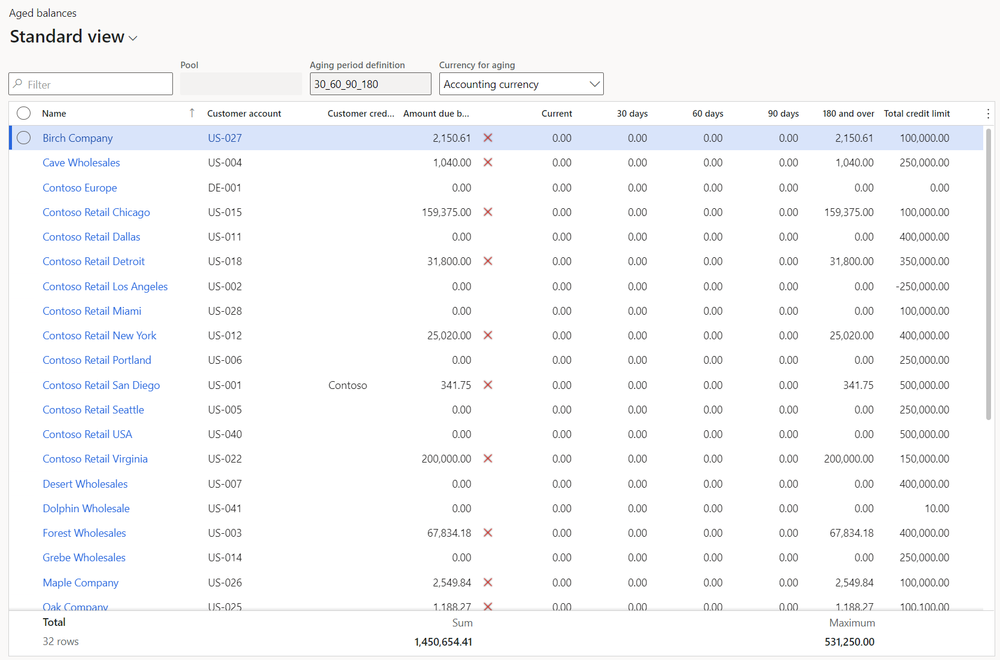
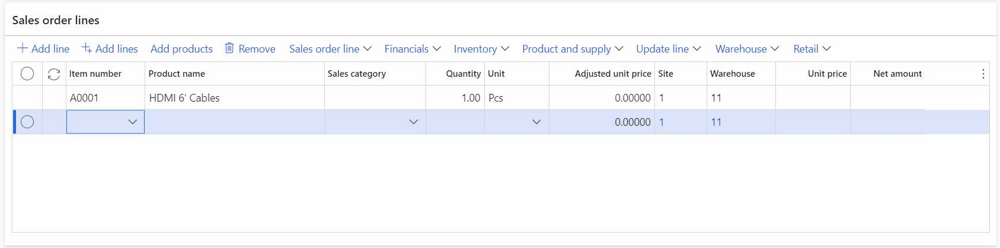
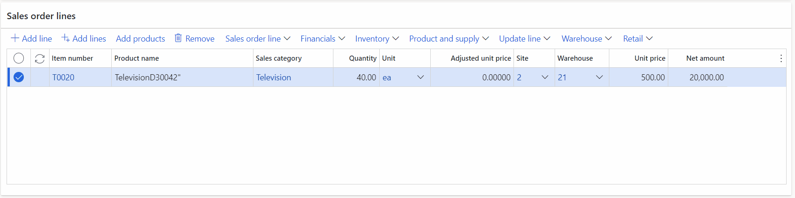
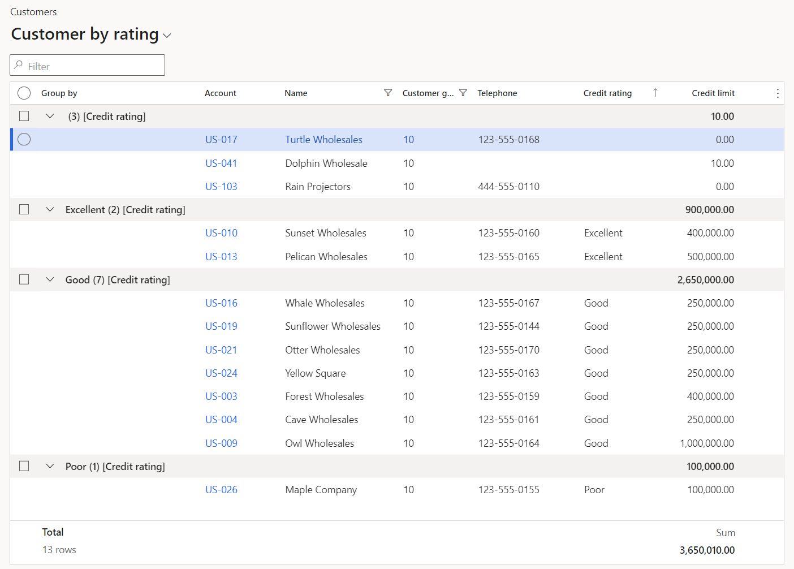
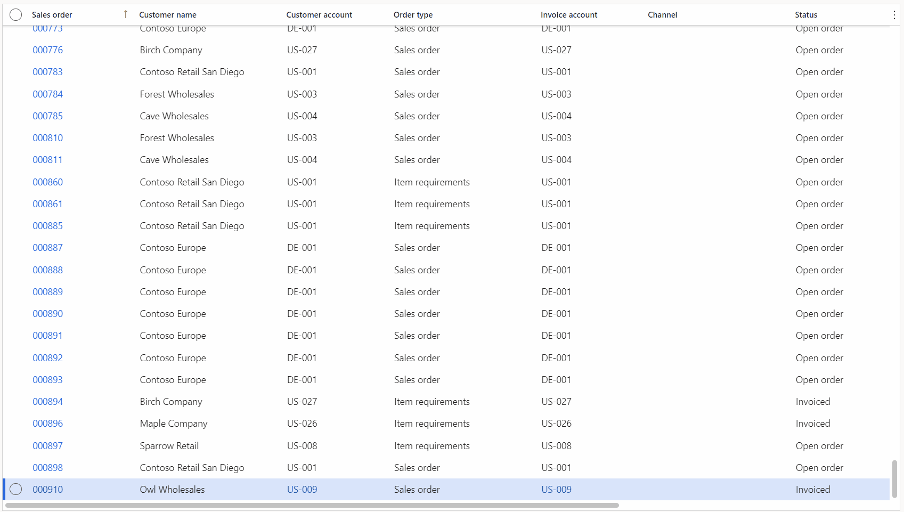

# Grid capabilities

[!include [banner](../../../finance/includes/banner.md)]

The new grid control provides several useful and powerful capabilities that you can use to enhance user productivity, construct more interesting views of your data, and get meaningful insights into your data. This article will cover the following capabilities: 

- Showing calculated values 
- Typing ahead of the system
- Evaluating math expressions 
- Grouping tabular data (enabled separately by using the **Grouping in grids** feature)
- Freezing columns (enabled separately by using the **Freezing columns in grids** feature)
- Autofit column width
- Stretchable columns

## Showing calculated values
In finance and operations apps, users can view a calculated value for each numeric column in a grid. A footer section at the bottom of the grid shows these calculated values.

[]

In versions before 10.0.29, the total is the only supported calculated value. However, as of version 10.0.29, if your organization has enabled the **Extended grid aggregation capabilities** feature, users can select among the following four calculated values:

- Minimum
- Maximum
- Total
- Average

A single column can show only one type of calculated value. However, each column in the grid can be configured to show a different type of calculated value. 

If more than one row is selected in the grid, the calculated value for the column is updated based on the values in the selected rows.   

### Showing the grid footer
There is a footer area at the bottom of every tabular grid in finance and operations apps. The footer can show valuable information that is related to the data that appears in the grid. Here are some examples of this information:

- The number of selected rows in the table (when you select more than one record)
- Calculated values at the bottom of configured, numeric columns (for example, grand totals)
- The number of rows in the dataset 

This footer is hidden by default, but you can turn it on. To show the footer for a grid, select the **Grid options** button in the grid header, and then select the **Show footer** option. After you turn on the footer for a particular grid, that setting will be remembered until the user chooses to hide the footer. To hide the footer, select **Hide footer** on the **Grid options** menu.

### Specifying columns with calculated values
Currently, no columns show calculated values by default. Instead, the setup is considered a one-time activity, like adjusting the widths of columns in grids. After you specify that you want to view a calculated value for a column, that setting will be remembered the next time that you visit the page.

There are two ways to configure a column to show a calculated value:

- Select and hold (or right-click) in the column that you want to view a calculated value for. If the **Extended grid aggregation capabilities** feature is enabled, select **View column totals**, and then select the desired calculated value. If that feature isn't enabled, select **Total this column**. This action causes three events to occur:

    1. The grid footer becomes visible. 
    2. Your preference for viewing a calculated value for the column is saved. 
    3. The desired calculation is initiated for the column and any other columns that you previously configured to show a calculated value. The time that is required to show the calculated values depends on the size of the dataset.

- After the footer is visible, select **Show total** (or **Select calculated value** if the **Extended grid aggregation capabilities** feature is enabled) in the footer area at the bottom of the column that you want to view a calculated value for. If there are no configured columns, that button will be available in the footer in all numeric columns.

    After at least one column is configured to show a calculated value, the **Show total** (or **Select calculated value**) button will be available only on hover or focus. The action of selecting the button just saves your preference for viewing a calculated value in the column, so that the preference is applied during future visits to the page. In the footer, this state is indicated by a dash that appears in the column. (Note that the calculated value will appear immediately if the dataset is small enough.)

If you make a mistake and no longer want to view a calculated value in a specific column, select and hold (or right-click) in the column, and then select **Hide total** (or **View column totals \> None** if the **Extended grid aggregation capabilities** feature is enabled). Alternatively, select **Hide total** (or **Hide calculated value**) in the footer in that column. This preference will also be saved for future visits to the page. 

### Calculating aggregate values
When you go to a page where the footer is visible and columns are already configured to show calculated values, those values might not be shown in the footer. The behavior depends on the size of the dataset on the page. If the dataset is small enough, the calculated values will be shown automatically, together with the number of rows in the dataset. If there are dashes in the footer under the columns that you configured, the dataset is too large for the system to show calculated values immediately. In this case, explicit action is required to calculate the values. To calculate the values, select the **Calculate** button in the footer. Alternatively, select and hold (or right-click) in a column that you want to view the total for, and then select **Total this column** (or **View column totals** and then the desired calculated value if the **Extended grid aggregation capabilities** feature is enabled).

If the calculation takes a long time to be completed, you can cancel the operation at any time by selecting **Cancel**. Sometimes, the dataset will be too large to calculate aggregate values (a limit that is imposed by your organization). In this case, you will instead be notified to filter your data more.

> [!NOTE]
> System administrators can modify the limit for the number of records that are available for calculating aggregates by adjusting the **Maximum number of local records for each grid** parameter on the **Client performance options** page. The default value is 25,000 records. Administrators should be careful when they adjust this value, because a value that is too large can exhaust the available memory on the user's machine. We recommend that the value not exceed 50,000 records.

Calculated values will be automatically updated as you update, delete, or create rows in the dataset.

## Typing ahead of the system
In many business scenarios, the ability to quickly enter data into the system is very important. Before the introduction of the new grid control, users could change data only in the current row. Therefore, after they made changes in a row, users could not switch to a different row or create a new row until the system successfully validated the changes in the current row and (in the case of row creation) ran all the logic that is associated with the creation of a new row. To help reduce the time that users spend waiting for these operations to be completed, and to help improve user productivity, the new grid adjusts these actions so that they are asynchronous. Users can create new rows or move to other rows to make changes while previous row validations and row creation logic are pending. 

[]

To support this new behavior, a new column for the row status has been added to the right of the row selection column when the grid is in edit mode. This column indicates one of the following statuses:

- **Blank** – No status image indicates that the row has been successfully saved by the system.
- **Processing pending** – This status indicates that the changes in the row haven't yet been saved by the server but are in a queue of changes that must be processed. Before you take action outside the grid, you must wait for all the pending changes to be processed. Additionally, the text in these rows is italicized to indicate the unsaved status of the rows. 
- **Invalid state** – This status indicates that some warning or message was triggered during the processing of the row, and it might have prevented the system from saving the changes in that row. In the old grid, if the save operation was unsuccessful, you were forced back into the row to fix the issue immediately. However, in the new grid, you're notified that a validation issue was encountered, but you can decide when you want to fix any issues in the row. When you're ready to fix an issue, you can manually move focus back to the row. Alternatively, you can select the **Fix this issue** action. This action immediately moves focus back to the row that has the issue, and lets you make edits inside or outside the grid. Note that the processing of subsequent pending rows is stopped until this validation warning is resolved. 
- **Paused** – This status indicates that processing by the server is paused because validation of the row triggered a pop-up dialog box that requires user input. Because the user might be entering data in some other row, the pop-up dialog box isn't immediately presented to that user. Instead, it will be presented when the user chooses to resume processing. This status is accompanied by a notification that informs the user about the situation. The notification includes a **Resume processing** action that will trigger the pop-up dialog box.

### Differences when entering data ahead of the system
When you enter data ahead of the place where the system is processing, you can expect a few changes in the data entry experience:

- You will notice that there are no lookup drop-down lists, field values aren't validated after you move to a different column in the same row, and columns don't initially show default values. This behavior occurs when you create or update ahead of the system. However, after the system catches up to the place where you're currently editing, the standard experience will resume. If you made changes to a field that typically receives a default value, your changes override the default field value when the server starts to process the row.
- If you create a new row by using the **Down arrow** key, all columns in the grid will appear as editable. By default, the focus will be put in the first column in the new row. This column might not be the same column that received the initial focus in the legacy grid, or the same column that receives focus after you select a **New** button. Your organization can customize the system and change the column that receives the initial focus when the **Down arrow** key is selected. For more information, see the [Specifying the column that receives the initial focus when new rows are created by using the Down arrow key](#developer-specifying-the-column-that-receives-the-initial-focus-when-new-rows-are-created-by-using-the-down-arrow-key) section. Regardless, you can use personalization to optimize each grid for data entry. Specifically, you can reorder fields so that the first column is the column that you want to start to enter data in. You might also want to reorder fields in general for data entry, to reduce tab stops and hide any fields that aren't required for data entry in this particular view.

### Editing multiple rows simultaneously (bulk edit)

In version 10.0.38 and later, users can update multiple selected rows in a single action by using the **Bulk editing in grids** feature, which can be enabled through Feature management.

To use this feature, follow these steps.

1. In the grid, select the rows that you want to update.
2. Select **Grid options** \> **Edit selected rows**.
3. In the **Edit rows** dialog box that appears, select the columns that you want to update, and provide the new values. Only columns that are backed by editable fields in the grid can be selected for update. The **Edit rows** dialog box defines the order that columns will be updated in (from top to bottom). This order can affect field-level validations that are triggered during the save process. After you've finished specifying the columns and values that you want to update, select **Apply**.

As when you paste from Excel (as described in the next section), the grid shows the updated contents in italic as a preview of the data changes. Select **Discard** to cancel the bulk editing or **Save** to initiate the save process. During the save process, the system uses the **Typing ahead of the system** save model to submit the updates one row at a time. This approach ensures that all form and field validations are run for each row. Monitor the progress and results of each validation by checking the row status at the beginning of the row.

### Pasting from Excel
Users have always been able to export data from grids in finance and operations apps to Microsoft Excel by using the **Export to Excel** mechanism. However, the ability to enter data ahead of the system enables the new grid to support copying tables from Excel and pasting them directly into grids in finance and operations apps. The grid cell that the paste operation is initiated from determines where the copied table begins to be pasted in. The contents of the grid are overwritten by the contents of the copied table, except in two cases:

- If the number of columns in the copied table exceeds the number of columns that remain in the grid, starting from the paste location, the user is notified that the extra columns have been ignored. 
- If the number of rows in the copied table exceeds the number of rows in the grid, starting from the paste location, the existing cells are overwritten by the pasted content, and any extra rows from the copied table are inserted as new rows at the bottom of the grid.

> [!NOTE]
> Currently, this functionality can't be used in specific situations. For example, in grids using the segmented entry control like General journal lines.  

### Copying from a grid in the product
Grids in finance and operations apps support a range selection capability that resembles the corresponding feature in Excel. This capability enables users to use the keyboard to select a range of cells (multiple rows and columns), which can then be copied and pasted as required.  

## Evaluating math expressions
As a productivity booster, users can enter mathematical formulas in numeric cells in a grid. They don't have to do the calculation in an app outside the system. For example, if you enter **=15\*4** and then press the **Tab** key to move out of the field, the system will evaluate the expression and save a value of **60** for the field.

[]

To make the system recognize a value as an expression, start the value with an equal sign (**=**). For more information about the supported operators and syntax, see [Supported math symbols](http://bugwheels94.github.io/math-expression-evaluator/#supported-maths-symbols).

> [!NOTE]
> The ability to evaluate math expressions in numeric controls is available outside the grid. 

## Grouping tabular data
Business users often have to perform ad-hoc analysis of data. Although this analysis can be done by exporting data to Microsoft Excel and using pivot tables, the **Grouping in grids** capability lets users organize their tabular data in interesting ways within finance and operations apps. Grouping works together with the **Calculated values** capability to let you gain meaningful insights into the data by showing calculated values (for example, subtotals) at the group level.

[]

To use this capability, right-click the column that you want to group by, and select **Group by this column**. This action will sort the data by the selected column, add a new **Group by** column to the beginning of the grid, and insert "header rows" at the beginning of each group. These header rows provide the following information about each group:

- Data value for the group 
- Column name (this information is especially useful when you have multiple levels of grouping)
- Number of data rows in this group
- Calculated values for any configured column (for example, subtotals if the column is configured to show a total)

With [Saved views](saved-views.md) enabled, you can save grouping as part of a view on pages that allow queries to be saved to views. For example, those with large view selectors. See the [Switching between views](saved-views.md#switching-between-views) section for more details. 

### Multiple levels of grouping
After you've grouped data by a single column, you can group the data by a different column by selecting **Group by this column** on the desired column. This process can be repeated until you have 5 nested levels of grouping, which is the maximum supported depth. At this point, you will no longer be able to group by additional columns.

At any point, you can remove the grouping on any column by right-clicking that column and selecting **Ungroup**. You can also remove the grouping from all columns by selecting **Grid options** and then **Ungroup all**.

### Sorting grouped data
After you group data by one or more columns, you can change the sort direction for any grouping column through the corresponding column header. 

If you sort on a non-grouped column, the grouping remains intact. The data is sorted inside each group, based on the selected column.

### Expanding and collapsing groups
The initial grouping of data will have all groups expanded. You can create summarized views of the data by collapsing individual groups, or you can use group expanding and collapsing to assist in navigating through the data. To expand or collapse a group, select the chevron (>) button in the corresponding group header row. Note that the expand/collapse state of individual groups is **not** saved in personalization.

### Selecting and unselecting rows at the group level
In the same way that you can select (or unselect) all rows in the grid by selecting the check box at the top of the first column in the grid, you can also quickly select (or unselect) all the rows in a group by selecting the check box in the corresponding group header row. The check box in the group header row will always reflect the current selection state of rows in that group, regardless of whether all rows are selected, no rows are selected, or only some rows are selected.

### Hiding column names
When grouping data, the default behavior is to show the column name in the group header row. You can choose to suppress the column name in group header rows by selecting **Grid options** > **Hide group column name**.

### Grouping on date and time columns
When you group on Date or DateTime fields, you have the option to group by year, month, or day. The group "value" in the corresponding header row will match the format from that field. Additionally, for DateTime and Time fields, you can group by hour, minute, or second.

> [!IMPORTANT]
> Users can't currently add a grouping column after they group on a segment of a date or time column.

## Freezing columns
Some columns in a grid might be important enough for context that you don't want them to scroll out of view. Instead, you might want the values in those columns to always be visible. The **Freezing columns in grid** capability provides this flexibility to users. 

[]

To freeze a column, right-click in the column's header, and then select **Freeze column**. The first time that you complete this step, the selected column becomes the first column and will no longer scroll out of view. Any subsequent column that you freeze will be added to the right of the last frozen column. You can use the standard Move functionality to reorder frozen columns as you require. However, frozen columns can't be moved so that they appear among the set of unfrozen columns. Likewise, unfrozen columns can't be moved so that they appear among the set of frozen columns.

To unfreeze a column, right-click in the frozen column's header, and then select **Unfreeze column**. 

Note that the row selection and row status columns in the new grid are always frozen as the first two columns. Therefore, when these columns are included in a grid, they will always be visible to users, regardless of the horizontal scroll position in the grid. These two columns can't be reordered.

## Autofit column width
As in Excel, users can force a column to be automatically resized based on the content that is currently shown in it. Just double-tap (or double-click) the sizing handles in the column. Alternatively, put the focus in the column header, and then select the **A** key (for autofit).

## Developer topics

### [Developer] Opting out individual pages from using the new grid 
If your organization discovers a page that has some issues utilizing the new grid, an API is available to allow an individual form to use the legacy grid control while still permitting the rest of the system to utilize the new grid control. To opt out an individual page from the new grid, add the following call post `super()` in the `run()` method for the form.

```this.forceLegacyGrid();```

This API will eventually be deprecated to allow for removal of the legacy grid control. However, it will remain available for at least 12 months after its deprecation is announced. If any issues require that this API be used, report them to Microsoft.

#### Forcing a page to use the new grid after previously opting out the grid
If you have opted out an individual page from using the new grid, you might want to later re-enable the new grid after the underlying issues were solved. To do this, you simply need to remove the call to `forceLegacyGrid()`. The change will not take effect until one of the following occurs:

- **Environment redeployment**: When an environment is updated and redeployed, the table that stores the pages that have opted out of the new grid (FormControlReactGridState) is automatically cleared.
- **Manual clearing of the table**: For development scenarios, you will need to use SQL to clear the FormControlReactGridState table and then restart the AOS. This combination of actions will reset the caching of pages that have opted out of the new grid.

### [Developer] Opting individual grids out of the Typing ahead of the system capability
Some scenarios have arisen that don't lend themselves to working well with the *Typing ahead of the system* capability of the grid. (For example, some code that is triggered when a row is validated causes a datasource research to be triggered, and the research can then corrupt uncommitted edits on existing rows.) If your organization discovers such a scenario, an API is available that lets a developer opt an individual grid out of asynchronous row validation and revert to the legacy behavior.

When asynchronous row validation is disabled in a grid, users can't create a new row or move to a different existing row in the grid while there are validation issues on the current row. As a side effect of this action, tables can't be pasted from Excel into finance and operations grids.

To opt an individual grid out of asynchronous row validation, add the following call after `super()` in the `run()` method of the form.

```<gridControl>.allowPreemptiveClient(false);```

> [!NOTE]
> - This call should be invoked only in exceptional cases and should not be the norm for all grids.
> - We don't recommend that you toggle this API at runtime after the form loads.

### [Developer] Size-to-available-width columns
If a developer sets the **WidthMode** property to **SizeToAvailable** for columns inside the new grid, those columns initially have the same width that they would have if the property were set to **SizeToContent**. However, they stretch to use any extra available width inside the grid. If the property is set to **SizeToAvailable** for multiple columns, all those columns share any extra available width inside the grid. However, if a user manually resizes one of those columns, the column becomes static. It will remain at that width and will no longer stretch to take up extra available grid width.

### [Developer] Specifying the column that receives the initial focus when new rows are created by using the Down arrow key
As was discussed in the [Differences when entering data ahead of the system](#differences-when-entering-data-ahead-of-the-system) section, if the "Typing ahead of the system" capability is enabled, and a user creates a new row by using the **Down arrow** key, the default behavior is to put the focus in the first column in the new row. This experience might differ from the experience in the legacy grid or when a **New** button is selected.

Users and organizations can create saved views that are optimized for data entry. (For example, you can reorder columns so that the first column is the one that you want to start to enter data in.) In addition, as of version 10.0.29, organizations can adjust this behavior by using the **selectedControlOnCreate()** method. This method lets a developer specify the column that should receive the initial focus when a new row is created by using the **Down arrow** key. As input, this API takes the control ID that corresponds to the column that should receive the initial focus.

### [Developer] Handling grids with non-React extensible controls
When a grid is loading, if the system encounters an extensible control that is not React based, the system will force the legacy grid to render instead. When a user first encounters this situation, a message will be shown indicating the page needs to be refreshed. Afterwards, this page will load the legacy grid automatically without any further notifications to users until the next system update. 

To overcome this situation permanently, extensible control authors can create a React version of the control for use in the grid.  Once developed, the X++ class for the control can be decorated with the **FormReactControlAttribute** attribute to specify the location of the React bundle to load for that control. See the `SegmentedEntryControl` class as an example.  

[!INCLUDE[footer-include](../../../includes/footer-banner.md)]

