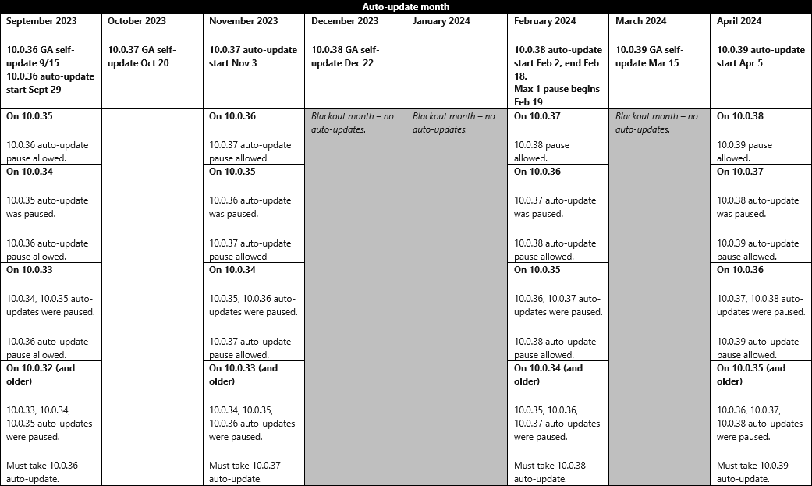

---
# required metadata

title: One Version service updates FAQ
description: This article provides clarity about the service updates, processes, and tools that you can use to stay current in a consistent, predictable, and seamless manner.
author: josaw1
ms.date: 09/29/2023
ms.topic: article
ms.prod: 
ms.technology: 
ms.custom: bap-template
# optional metadata

# ms.search.form:  [Operations AOT form name to tie this article to]
audience: IT Pro
# ms.devlang: 
ms.reviewer: josaw
# ms.tgt_pltfrm: 
# ms.custom: [used by loc for topics migrated from the wiki]
ms.search.region: Global
# ms.search.industry: [leave blank for most, retail, public sector]
ms.author: josaw
ms.search.validFrom: 2018-10-31 
ms.dyn365.ops.version: 8.1
---

# One Version service updates FAQ

[!include[banner](../includes/banner.md)]

This FAQ is intended to provide clarity about the service updates, processes, and tools that you can use to prepare for the change. We will continue to add information to this article as required.

For more information about One Version service updates, see [One Version service updates overview](../../dev-itpro/lifecycle-services/oneversion-overview.md).

> [!IMPORTANT]
> There's an important change coming to the service update release schedule. The number of service updates released annually is being reduced from seven to four. This change impacts the preview availability, general availability (self-update), and end of service dates for version 10.0.38, and goes into full effect beginning with version 10.0.39 (the “April” 2024 release).

### What's changing with the new release cadence?

The following changes are being implemented.
-	Service updates are only released in February (December self-update), April, July, and October. The May, August, and November releases are no longer available for self-update or auto-update.
-	The lifecycle of each release is substantially extended to 404 – 414 days.
-	The preview period is extended. Every release will now include one scheduled update to the preview build.
-	The [First release program](https://aka.ms/FirstReleaseFnO)’s auto-update and feedback phase is extended by two weeks. 
-	The servicing window of every release is substantially extended to 186 - 214 days with improved overlap between releases.
-	The number of consecutive pauses allowed is reduced from three to one. With the release durations extended, the same minimum two annual service updates is maintained.

### Is the change from three to one maximum pauses already in effect?

No. The transition from three to one maximum pauses will be completed by April 2024. The enforcement of one maximum pause goes into effect on February 19, 2024, after all scheduled auto-updates for 10.0.38 are completed.

The following table illustrates allowed pauses by month based on your installed version until the transition is completed. For more information about pausing service updates, refer to [Pause service updates through Lifecycle Services (LCS)](../../dev-itpro/lifecycle-services/pause-service-updates.md).

### Does the new release schedule impact when I can schedule auto-updates?

No. There is no change to how auto-updates are scheduled in Lifecycle Services and when those auto-updates will occur. The only change is what service updates are being released each year. For information about how to pause an update, refer to [Pause service updates through Lifecycle Services (LCS)](../../dev-itpro/lifecycle-services/pause-service-updates.md).

### When does the new service update release cadence take effect?

Version 10.0.38 (the “February” release) is revised to act as a transition release. 10.0.39 (the “April” release) will be the first service update released under the new cadence.

### Is the published 10.0.38 schedule impacted by the new service update release cadence?

Yes. To act as a transition release, some release milestones for 10.0.38 were adjusted to align with the new release cadence.
-	Preview availability was pushed out by two weeks from Oct 13 to Oct 27, 2023.
-	An update to the preview was added, and will be released on Nov 3, 2023.
-	Customers participating in the [First release program](https://aka.ms/FirstReleaseFnO) will receive their auto-updates a month earlier, in December 2023.
-	General availability for self-update will occur a month earlier, on December 22, 2023.
-	There is no change to the general availability broadcast (auto-update) dates.
-	The servicing window is extended from April 12 to Aug 9, 2024.

### Can the updates be delayed? What is the policy?

Yes, customers can pause, delay, or opt out of an update by using the update settings in Lifecycle Services projects. Beginning with the April 2024 auto-update, customers can choose to pause one update. Prior to April 2024, the number of pauses available to a customer depends on their release version relative to the latest version. See [Is the change from three to one maximum pauses already in effect?](#Is-the-change-from-three-to-one-maximum-pauses-already-in-effect) for details.

For information about how to pause an update, refer to [Pause service updates through Lifecycle Services (LCS)](../../dev-itpro/lifecycle-services/pause-service-updates.md).

### How does the timing for general availability of a release work?

The release package is made generally available to all customers for self-update prior to auto-updates. The timing of package release for self-update relative to production auto-updates varies. To determine self-update and auto-update timing for upcoming releases, use the [Targeted release schedule (dates subject to change)](public-preview-releases.md#targeted-release-schedule-dates-subject-to-change).

Production auto-updates for a release are scheduled for the first, second, and third weeks of the month. The configuration setup is available in LCS. Depending on the configuration that you set up in LCS, you will receive updates during the selected week. Sandbox updates will always be scheduled the week before the production update.

As an example, for the 10.0.39 April release, Microsoft will make the release generally available to all customers for self-update by the GA public date of March 15, 2024. Customers who have enabled auto-updates through LCS will receive production updates beginning two weeks after the GA public date during the weekends of April 5, April 12, or April 19, depending on your selected configuration in LCS. Sandbox updates will always be scheduled a week before the update.

Customers can always choose to apply the update at an earlier time or at a time that is more convenient than the suggested times in LCS. If a customer is already on the latest version, the automatic update will be canceled.

## Service updates

### What product versions are affected by service updates?

| Version       | Description |
|---------------|-------------|
| 10 | All customers will be scheduled for automatic service updates. These updates will be combined application and platform updates. Beginning in February 2024 you will only be allowed to pause one update before being required to take the next update. For information about how to pause an update, see [Pause service updates](../../dev-itpro/lifecycle-services/pause-service-updates.md). |

### What do the service updates contain?

Service updates contain application changes  and platform changes that are critical improvements to the service. These changes include regulatory updates. New experiences will be configurable. The service updates are backward compatible. There will be a single version that represents the update.

> [!Note]
> Add-in components, Power Apps, and Dataverse are updated independently of the finance and operations service update package and process.

### What is a regulatory update?

A regulatory update is a new feature or an existing feature change that is required by law, usually for a specific country or region. The regulatory update is always required by a specific law enforcement date (LED) and should be enabled by that date or earlier.

### How can I determine what is changed in a service update?

The "What's new or changed" documentation is the primary source for the details of each service update. The release plans are the primary source of information for all new features and changes for a future release. Features will also include Help topics on Microsoft Learn as needed. 

### What is the upcoming schedule of updates?

Each year, four  service updates are released. You have the option to apply them when it's convenient for you, or you can let Microsoft automatically apply them, based on the selected maintenance window. You are required to be on an update that is no more than one update behind the current update.

To view the targeted release schedule for upcoming releases, see [Service update availability](public-preview-releases.md).

### Are there any major differences between the updates?

There are two major updates each year: the April update and the October update. New experiences can be enabled in these updates. Major updates don't require code or data upgrade. Breaking changes will be communicated 12 months in advance so that customers can plan accordingly. Breaking changes will be introduced only during major updates.

### What does it mean when an update is backward compatible?

Backward compatibility covers binary and functional compatibility. Binary compatibility means that you can apply an update on any runtime environment without having to recompile, reconfigure, or redeploy customizations. It also means that, on a development environment at design time, X++ public and protected application programming interfaces (APIs) and metadata aren't modified or deleted. If Microsoft must break compatibility by removing obsolete APIs, this change will be communicated 12 months in advance and will follow a deprecation schedule. Functional compatibility is about the user experience. All new experiences will be available on an opt-in basis for a 12-month period.

Backward compatibility doesn't include non-X++/metadata APIs. Microsoft reserves the right to update versions of any dependencies that the product uses, and to remove dependencies, without early warning. Microsoft doesn't commit to maintain backwards compatibility of dependent software libraries unless this commitment is expressly stated.

For more information about deprecation guidelines, and deprecated methods and metadata elements, see [Deprecation of methods and metadata elements](../../dev-itpro/migration-upgrade/deprecation-deletion-apis.md).

### What is the process for deprecation?

Before any feature is removed from the product, the deprecation notice will be announced in the product documentation 12 months before the removal.

For breaking changes that only affect compilation time, but that are binary compatible with sandbox and production environments, the deprecation time will be less than 12 months. Typically, these changes are functional updates that must be made to the compiler. 

### If I'm not doing active development/recompilation of my code, how will I learn whether there is a deprecated feature that will affect me? 

Deprecated features will be documented for each release. For more information, see [Removed or Deprecated features](../../dev-itpro/migration-upgrade/deprecated-features.md).

### Can I update just the platform? Similarly, can I update just the application?

No. Only combined application+platform update packages are released for both service updates and quality updates. 

### Service updates for on-premises deployments

The policy and schedule for service updates are now the same for both cloud deployments and on-premises deployments. For example, the option to delay one service update applies to both types of deployment  . The process for applying each of these updates remains slightly different. For more information, see [Apply updates to on-premises deployments](../../dev-itpro/deployment/apply-updates-on-premises.md#update-an-on-premises-deployment).

## Process

### How will Microsoft ensure the quality of releases?

Ensuring the quality of releases is a fundamental principle that is enabled through a series of progressive, rigorous, automated validations, as described in [Service update availability](public-preview-releases.md).

### Can I select the day and time to update?

Customers can configure the day and maintenance time windows in LCS. The service update, which is based on your update settings, will start within 15 minutes. Customers who opt in to receive LCS notifications will receive an email that includes update instructions. Customers will be able to select the designated tier 2/UAT sandbox for the update. Customers will have seven calendar days to do testing and validation before the production environment is updated. All additional sandboxes will automatically be updated on the same day as the production environment. For more information, see [Configure service update](../../dev-itpro/lifecycle-services/configure-service-updates.md).

Customers can optionally apply the update earlier to all environments through LCS. The production-ready deployable package will be made available to all customers via the Action Center in LCS by the Generally available (self-update) date. See [Service update availability](public-preview-releases.md) for the targeted release schedule of upcoming releases.

### A service update was applied to the environment. In LCS, what does the number on the tile for this environment represent?

Microsoft will automatically apply the same service update to all customers. Microsoft will continue to service the update until the release version’s end of service date is reached. In LCS, the available updates tile for that environment represents the cumulative quality update package that is available to be applied to your environment. There are two numbers on the tile. The top number is the release version. The bottom number is the build number of the latest quality update package. This build number will always be higher than that of the service update that was applied to your environment, either through self- or auto-update. Because Microsoft will automatically apply only the same version to all customers, you will be responsible for applying the cumulative hotfix package if it's required.

> [!Note]
> If your environment version is behind that of the latest release version, under available updates you will also see a tile to apply the latest service update via self-update.

### How do I update to the latest version?

Users can update to the latest version by using the tiles on the environment details page in LCS. After the update is released by Microsoft, the tile will show the available update. Customers can choose to apply the update on their own by going through the update experience on their sandbox and production environments. For more details, see [Apply updates to cloud environments](../../dev-itpro/deployment/apply-deployable-package-system.md) and [Apply updates to on-premises deployments](../../dev-itpro/deployment/apply-updates-on-premises.md). 

### How do I update the production environment to the same version after Microsoft updates the sandbox environment?

When Microsoft updates a sandbox environment, the package that is used for the update is saved in the project's asset library. The name of the package is prefixed by the words "Service Update." Because the package was already applied to the sandbox environment, you can mark it as a Release Candidate. You can then go to the production environment and schedule to apply the package, just as you might schedule the application of any other update.

### What is the expected downtime during an auto-update?

The expected downtime for a successful update is approximately 15 minutes. However, we ask for three hours of downtime in case issues occur while the update is applied.

### Can I delay an update?

Yes, you can pause, delay, or opt out of an update via the update settings in LCS projects, provided that all your sandbox and production environments are not more than one version behind the latest available update. After this period, an update will be scheduled and automatically applied by Microsoft. The update experience for a delayed update will incur additional downtime.

### Can I delay an update for longer than the one skipped service update allowed because of seasonal activity or another business reason?

No. Once your environment version is more than one version older than latest, the latest service update will automatically be applied to the default Tier-2 sandbox. Then, seven days later, the update will be applied to all additional sandbox and production environments that are also more than one version older than latest. A customer can pause only one update before they must take the next service update, which in effect requires a minimum of two service updates annually. For example, if a customer on version 10.0.39 chooses to pause update 10.0.40, service update 10.0.41 will automatically be applied first to the Tier-2 sandbox environment and later to all additional sandbox and production environments.

### What does it mean for a release to be “in service”?

A release is a service update version that has been made available to customers. A release is “in service” from the day it is made available to customers for production use to its end of service date. See the Targeted release schedule for release milestones by release.    At most times, there will be three in-service releases at a time:
-	The latest version is the most recently released version as Generally available (self-update), such as 10.0.41.
-	The version used for latest completed scheduled auto-updates, such as 10.0.40.
-	The post-update servicing version, such as 10.0.39. A release in post-update servicing will reach its End of Service date about one month after auto-updates complete for the latest version (in this example, 10.0.41). This gives customers who had opted to pause (in this example, 10.0.40) to complete their required update (to 10.0.41) before the servicing window for their version (10.0.39) is closed.

The below figure visualizes the staggered release rollout and servicing model described above:

*** OneVersion FAQs_Staggered Release Rollout and Servicing Model.png GOES HERE ***
*** OneVersion FAQs_Staggered Release Rollout and Servicing Model_legend.png GOES HERE ***

> [!Important]
> For issues reported from versions that have reached end of service, the support team is not able to take your case. You must first update to the latest service update and then apply the latest quality update, and then if the issue still persists, report it.    

### What happens to an environment that is running a finance and operations apps version that is no longer supported?

For environments that are running a finance and operations app version that is no longer supported, a warning message will appear at the top of the environment details page in LCS.

For all Microsoft-managed environments, and sandbox and production environments in on-premises implementation projects, some LCS functionality might not be available when an environment is running a finance and operations app version that is no longer supported. This functionality includes the ability to complete the following actions:

- Enable maintenance mode.
- Use all capabilities that are provided for moving databases on an environment or across environments.
- Enable firewall access to SQL Server databases.
- Download Regression suite automation tool (RSAT) certificates.
- Regenerate RSAT certificates.

After you apply a service update for a supported version, this functionality will be available in the affected environment.

### How do the automatic updates affect my Microsoft-managed additional sandbox environments in my LCS implementation project? 

All additional sandbox environments will be updated during the same update window as your production environment, and they will be updated to the same release version that is used for the production update. The update will also apply to additional sandboxes environments that are on versions that have not reached end of service.

### What happens during an update when my additional sandboxes are on different versions from that of default sandbox and production, which are scheduled to receive the latest service update?       

All environments will be updated to the current version being used for auto-updates.

### What if the default sandbox environment is manually updated to the exact same version or newer version than the automatic update version? 

Automatic updates for the production environment and all additional sandbox environments will be updated to the current version being used for auto-updates.
 
The default sandbox environment update will be canceled. 

### What if the default sandbox environment is manually updated to an older version than the automatic update version? 
 
The default sandbox environment, production environment, and all additional sandbox environments will be updated to the current version being used for auto-updates.

### What if the production environment is manually updated _before_ the production environment email is sent? 

Automatic updates for the production environment and all additional sandbox environments will be canceled. 

### What if the production environment is manually updated _after_ the production environment email is sent? 

Automatic updates for the production environment will be canceled, but all additional sandbox environments will be updated to the current version being used for auto-updates.

### What if I find an issue during the sandbox update?

If you find an issue when doing validations in a sandbox environment, you can request to skip the update directly through LCS by providing a valid support ticket number and a business justification. See [Pause service updates through Lifecycle Services (LCS)](../../dev-itpro/lifecycle-services/pause-service-updates.md). 

### What if I find a critical issue during sandbox testing, but I can't pause the production automatic update?

Critical issues should always be submitted to the Support team via LCS as soon as they are identified. The support staff will work with you to fix the critical issue.

### How much time do I have for validation?

You will have seven calendar days for validation after the update is applied to your sandbox environment. If you need more time, you can access the deployable package via the Action Center in LCS and apply it to your environments. In this way, you will get additional time to test the update before a production roll-out.

### What happens when the service update is completed?

After the service update is applied by Microsoft, you will receive a notification that indicates whether the update was successful or whether it could not be applied. Reasons why an update might be unable to be applied:

- **Pending Package Sign-off** – If a package is pending signoff, Microsoft won't apply the service update to production.
- **Deployment Failure** – If there was a deployment failure, the environment will be rolled back to the original state.
 
### If there is a failure, can I reschedule the update to be automatically applied?

No. You won't be able to reschedule the update. However, you can apply the package when it's convenient for you, just as you might schedule the application of any other update.

### Will critical hotfixes be automatically applied to my sandbox/production environment during automatic update?

The service update that will be made generally available to all customers for self- and auto-update will contain hotfixes and new functionality. If a critical issue is reported and fixed after the service update has been applied, customers can pull the latest cumulative quality update from the tile in LCS.

### How will my ISVs stay current?

Service updates to customer environments are backward compatible, and no action is required by the independent software vendors (ISVs). ISVs develop on the minimum required platform release that their code depends on. Breaking changes will have a 12-month lead time to enable ISVs to include them and do validation. We recommend that the ISVs take advantage of each service update’s preview release so that they can get early access to the platform bits and validate their solutions against the update before it's made generally available. There is a [Preview Early Access](https://www.yammer.com/dynamicsaxfeedbackprograms/#/threads/inGroup?type=in_group&feedId=12792233) Yammer group that we encourage both ISVs and customers to join. It's a great forum to receive F&O preview- and release-related announcements and to collaborate with others in the F&O community.

### What about new features?

All new features will be available on an opt-in basis for a 12-month period. They won't require any change management until you choose to enable them.

### Are batch jobs suspended during a service update?

Batch jobs are suspended during the maintenance windows and resume when the maintenance is completed.

For information about how to pause an update, see [Pause service updates through Lifecycle Services (LCS)](../../dev-itpro/lifecycle-services/pause-service-updates.md).

## Tools

### How can I get early access to non-released updates?

Beginning with version 10.0.26, the preview package for all service updates is made available to all customers through the Shared Asset Library in LCS, under **Software deployable package**. Preview packages can be deployed to development or test environments. They can't be used in production environments. You agree to the program terms at installation. Sign up for access to preview packages (formerly known as the Preview Early Access Program (PEAP)) is no longer required.

To be in the first group of customers to take service updates to production, you can join the [First release program](https://aka.ms/FirstReleaseFnO). While enrolled in First Release, Microsoft will keep your system current with the latest updates. First Release customers receive updates to all sandbox and production environments  and are always updated before general availability.

### Is any tooling available to support testing of the latest release?

The [Regression Suite Automation Tool](../../dev-itpro/lifecycle-services/using-task-guides-and-bpm-to-create-user-acceptance-tests.md) is [available now](https://www.microsoft.com/download/details.aspx?id=57357). This tool significantly reduces the time and cost of user acceptance testing (UAT). UAT is typically required before you take a Microsoft application update or apply custom code and configurations to your production environment. It lets functional power users record business tasks by using the Task recorder and convert them into a suite of automated tests, without having to write source code. Test libraries are stored and distributed in LCS by using the Business Process Modeler (BPM) libraries, and they are fully integrated with Azure DevOps for test execution, reporting, and investigation. Test data parameters are decoupled from test steps and stored in Excel data files.

### How can I test and validate that the integrations continue to work?

Data task automation lets you easily repeat many types of data tasks and validate the outcome of each task. You can also use automated testing of data entities by using task outcome validation. For more information, see [Data task automation](../../dev-itpro/data-entities/data-task-automation.md).

## Preparing for One Version

### How can I log an extensibility request?

Extensibility requests can be logged in LCS. Details are available in the [Extensibility requests](../../dev-itpro/extensibility/extensibility-requests.md) article. Note the following timelines for logging and using the available extensions.

| Date         | Extensibility requests |
|--------------|------------------------|
| January 2019 | All extensibility requests must be logged by January 1, 2019. We ask that ISVs and customers analyze the code and make these requests by that date. We will provide exceptions to stay on 7.3 after April 2019 only if the request has been filed by January 1, 2019. |
| December 2019 | For the requests that were logged by January 1, 2019, extensions will be available on or before December 31, 2019. Customers who use these extensions are required to move to the current version by April 2020. |

### What does "end of service" mean?

Microsoft won't provide any fixes to issues on versions that have reached their end of service. If you encounter an issue on a version that has reached its end of service, you must update to the latest update and then report the issue if it persists. See [Service update availability](public-preview-releases.md) for end of service dates by version.

All environments will continue to be operated by Microsoft. All automatic processes around your environments, such as monitoring or self-healing, will also continue as is for supported versions.

### Are individual hotfixes supported?

Individual hotfixes won't be supported after 8.1. To apply a fix, customers must update to the latest cumulative update available. Critical fixes are also applied via cumulative update and are available through the LCS servicing experience.

### Will you notify me about critical hotfixes released for the monthly update that I'm on? 

Customer reported issues are searchable via LCS Issue search. You can sign up to be notified when an open issue is resolved. A summary list of customer reported issues is published to LCS Issue search for every preview and general availability release. You can find the list by title search using pattern, “Version 10.0.xx of Finance and Operations apps”.

## Commerce service updates

### What options are available to help minimize the impact on my Commerce cloud components?

Commerce cloud components will require the same down time as your Dynamics 365 headquarters. In an upcoming release, the Retail Cloud Scale Unit (RCSU) will be available to reduce and further schedule updates to your deployment. For more information about RCSU, see the published release information on our [documentation](/business-applications-release-notes/October18/dynamics365-retail/planned-features) and [release notes](/business-applications-release-notes/?panel=products1#pivot=products) sites.

### Will there be options to take individual hotfixes for my commerce solution components?

All fixes and updates for commerce components will be cumulative.

### What are the maintenance downtime requirements that might affect channel operations?

For retailers that have a business need for redundancy, Modern POS offline capability enables core point of sale (POS) operations to be available for use while disconnected from the internet or while the cloud environment is being updated. Stores that use Commerce Scale Unit will also continue to operate with support for core POS operations during cloud maintenance windows. For more information, see [Online and offline point of sale (POS) operations](../../../commerce/pos-operations.md).

### When will I have to update my in-store components?

To maintain support, all in-instore components must be running released software that is less than one year old. Customers are responsible for updating self-hosted components (such as components that are installed in stores or in privately managed datacenters) and ensuring that the installed versions of those components are actively supported.

### Will there continue to be backward compatibility for the in-store components?

Updates to components that are hosted in the cloud will continue to preserve backward compatibility with component versions that are self-hosted by the retailer for 12 months after the release date for that version. (These components include components that are installed in stores or in privately managed datacenters: Modern POS, Commerce Scale Unit, or Hardware Station.) Self-hosted components don't have to be updated at the same time as cloud-hosted components. They can be updated on a separate cadence, so that there is time to roll updates out to stores.

### What options are available for updating in-store components across my organization?

Customers can choose to manually update self-hosted components at each store, or they can use mass update tools such as Microsoft System Center Configuration Manager and Microsoft Intune.

### What options do I have to slowly enable new functionality across my channels?

Microsoft provides several mechanisms for progressively rolling out and enabling functional enhancements across stores, devices, and users.

- **Screen layout designer** – Most visual elements in POS are configured and centrally managed by an administrative user in the customer organization. Therefore, new POS operations won't automatically appear in POS unless they are explicitly configured for inclusion in corresponding screen layouts. Screen layouts are configured by using Screen layout designer, and can be specific to a store or a POS device. For more information, see [Screen layouts for the point of sale (POS)](../../../commerce/pos-screen-layouts.md).
- **Functionality profiles, POS permissions, Commerce parameters** – Significant elements of functionality in POS are typically configurable by the user. These elements can be configured through functionality profiles, POS permissions, commerce parameters, or other controls that allow for device-level, register-level, store-level, or user-level functionality control in applicable scenarios.
- **Modern POS and Commerce Scale Unit** – Because Modern POS and Commerce Scale Unit are self-hosted by the retailer, topologies that include either of these components enable updates to be rolled out at a separate (and slower) cadence and in a more granular fashion than cloud-only topologies.

[!INCLUDE[footer-include](../../../includes/footer-banner.md)]
