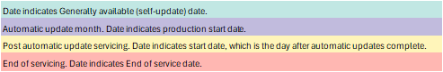

# One Version service updates FAQ

[!include[banner](../includes/banner.md)]

This FAQ is intended to provide clarity about the service updates, processes, and tools that you can use to prepare for the change. We continue to add information to this article as required.

For more information about One Version service updates, see [One Version service updates overview](../../dev-itpro/lifecycle-services/oneversion-overview.md).

> [!IMPORTANT]
> The number of service updates that are released annually is now reduced from seven to four. This change affects the preview availability, general availability (self-update), and end-of-service dates for version 10.0.38, and it went into full effect as of version 10.0.39 (the "April" 2024 release).

### What's changing with the new release cadence?

The following changes are being implemented:

- Service updates are released only in February (December self-update), April, July, and October. The May, August, and November releases are no longer available for self-update or autoupdate.
- The lifecycle of each release is substantially extended. It now lasts 404 to 414 days.
- The preview period is extended. Every release now includes one scheduled update to the preview build.
- The autoupdate and feedback phase of the [First Release program](https://aka.ms/FirstReleaseFnO) is extended by two weeks.
- The servicing window of every release is substantially extended. It now lasts 186 to 214 days, and there's improved overlap between releases.
- The maximum number of consecutive updates that can be paused is reduced from three to one. However, because release durations are extended, the same minimum of two service updates per year is maintained.
- We're introducing another autoupdate window for each service update, starting with version 10.0.39. For more information, see the FAQ for autoupdate section in this article.

### Is the change from the maximum of three pauses to one already in effect?

Yes. Beginning with 10.0.39 (the April'24 release) you're only able to pause a maximum of one update. See the [Targeted release schedule](public-preview-releases.md#targeted-release-schedule-dates-subject-to-change) for GA (self-update) and autoupdate dates by version.

The following table shows the allowed pauses through the transition based on your installed versions, starting 10.0.35, 10.0.36, and 10.0.37, which are noncompliant since the release of 10.0.39. For more information about how to pause service updates, see [Pause service updates through Lifecycle Services)](../../dev-itpro/lifecycle-services/pause-service-updates.md).

> [!NOTE]
> If your Lifecycle Services project has environments older, noncompliant versions like 10.0.35, 10.0.36, or 10.0.37, pausing the upcoming autoupdate (for example, 10.0.39 the May 2024 autoupdate) isn't supported. To comply, update all environments to the current version (10.0.39) in the next autoupdate window. You can also self-update to a compliant version (for example, 10.0.38 as of April 22, 2024) to pause an upcoming autoupdate. Microsoft can't make exceptions for projects with environments on noncompliant versions. Upgrade to a supported version to use the pause functionality.

| On 10.0.35 | On 10.0.36  | On 10.0.37  | On 10.0.38  | On 10.0.39   |
|------------|-------------|-------------|-------------|--------------------|
| 10.0.36 release can be paused. | 10.0.37 release can be paused. | 10.0.38 release can be paused. | 10.0.39 release can be paused. |10.0.40 release can be paused|
| 10.0.37 release can be paused. | 10.0.38 release can be paused. | Must take 10.0.39 release in one of the two autoupdate windows. | Must take 10.0.40 release in one of the two autoupdate windows. | Must take 10.0.41 release in one of the two autoupdate windows. |
| 10.0.38 release can be paused. | Must take 10.0.39 release autoupdate windows for pausing not applicable. | |  |  |
| Must take 10.0.39 release autoupdate windows for pausing not applicable. | | |  |  |

### What can I expect with the new (autoupdate) cadence?
Beginning version 10.0.39, the service update autoupdate window is divided into two windows that are separated by approximately a four-week gap. This change provides customers with greater flexibility in scheduling their autoupdates. Autoupdate Window one closely resembles the historical approach of OneVersion service updates. Autoupdate Window two allows you to schedule your update for four weeks later. Autoupdates continue to function as before, with UAT sandbox updates occurring seven days prior to production. Note that if your LCS project has environments on older, noncompliant versions like 10.0.35, 10.0.36, or 10.0.37, pausing the upcoming autoupdate (for example, 10.0.39 May autoupdate) isn't supported. To comply, update all environments to the current version (10.0.39) in the next autoupdate window. You can also self-update to a compliant version (for example, 10.0.38 as of April 22, 2024) to pause an upcoming autoupdate. Microsoft can't make exceptions for projects with environments on noncompliant versions. Upgrade to a supported version to use the pause functionality.

### Does the new release schedule affect when I can schedule autoupdates?
Yes, with version 10.0.39, there are two autoupdate windows to choose from for every service update. Customers can then select a weekend for the second autoupdate, which commences one month after the first autoupdate instance. There isn't a change in how autoupdates are scheduled in Microsoft Dynamics Lifecycle Services and when those autoupdates occur. The only change is which service updates are released each year. 

As an example, let's say you have opted for the 10.0.39 ("April") release through autoupdate. Microsoft makes this release generally available for self-update by all customers on March 15, 2024. If you've enabled autoupdates through Lifecycle Services, you'll start receiving production updates two weeks after the public availability date, which is March 15. This occurs during the first autoupdate window, starting either on April 5, April 12, depending on your chosen configuration. Alternatively, if you've selected the second autoupdate window, your updates begins on May 3, May 10. Opting for the second window gives you four more weeks between general availability and the final broadcast weekend, extending beyond the standard six-week timeframe.

In the example above, if a customer opts out of both autoupdate windows for the 10.0.39 release, they can only opt out of the first autoupdate window for the next release, 10.0.40 ("July"). This is because skipping a release is no longer possible due to a previous pause under the new pause policy. For more information about how to pause service updates, see [Pause service updates through Lifecycle Services (LCS)](../../dev-itpro/lifecycle-services/pause-service-updates.md).

> [!IMPORTANT]
> Customers are explicitly required to pause both autoupdate windows to pause a release if they are eligible to do so, based on the pause policy. Pausing the first autoupdate window will not auto pause the second window.

### When does the new service update release cadence take effect?

Version 10.0.38 (the "February" release) is revised to act as a transition release. Version 10.0.39 (the "April" release) is the first service update that's released under the new cadence.

### Is the published 10.0.38 schedule affected by the new service update release cadence?

Yes. To enable version 10.0.38 to act as a transition release, some release milestones were adjusted for alignment with the new release cadence.

- Preview availability was pushed out by two weeks, from October 13 to October 27, 2023.
- An update to the preview was added and released on November 3, 2023.
- Customers who participate in the [First Release program](https://aka.ms/FirstReleaseFnO) receive their autoupdates a month earlier, in December 2023.
- General availability for self-update occurs a month earlier, on December 22, 2023.
- There's no change to the general availability broadcast (autoupdate) dates.
- The servicing window is extended from April 12 to August 9, 2024.

### How does this change affect pausing updates for noncompliant versions like 10.0.35, 10.0.36, and 10.0.37?
If your Lifecycle Services project has any environment (default or sandbox or production) on noncompliant versions like 10.0.35, 10.0.36, or 10.0.37, pausing 10.0.39 isn't supported. To comply, update all environments to the current version (10.0.39) in the next autoupdate window. You can also self-update all environments to 10.0.38 to pause 10.0.39. See the autoupdate policy change for details.

### Is it possible to stop the 10.0.39 autoupdate from happening even though I'm on a version that isn't compliant (see related question above)?
At this time Microsoft can't make exceptions for projects that have environments on versions that are out of compliance. Upgrade to a supported version to use the pause functionality.

### Can the updates be delayed? What's the policy?

Yes, customers can pause, delay, or opt out of an update by using the update settings in Lifecycle Services projects. As of the April 2024 autoupdate, customers can choose to pause one update. Before April 2024, the number of pauses that are available to a customer depends on that customer's release version relative to the latest version. For more information, see **Is the change from the maximum of three pauses to one already in effect** in this FAQ. For more information on the twice autoupdate window we're introducing starting 10.0.39 see **What can I expect with the new (autoupdate) cadence** in this FAQ.

For information about how to pause an update, see [Pause service updates through Lifecycle Services (LCS)](../../dev-itpro/lifecycle-services/pause-service-updates.md).

### How does the timing for general availability of a release work?

The release package is made generally available to all customers for self-update before autoupdates. The timing of the package release for self-update relative to the production autoupdates varies. To determine the timing of self-update and autoupdates for upcoming releases, see [Targeted release schedule (dates subject to change)](public-preview-releases.md#targeted-release-schedule-dates-subject-to-change).

Sandbox updates are always scheduled one week before the update. Production autoupdates for releases are scheduled for the first, second, and third weeks of the month. Updates are received during the selected week based on the configuration set up in Lifecycle Services.

> [!IMPORTANT]
> Starting with version 10.0.39, customers can choose between two autoupdate windows that occur four weeks apart for every service update. There isn't a change in how the broadcast occurs between the first and second windows. See **What can I expect with the new (autoupdate) cadence** in this FAQ.

Customers can always choose to apply the update earlier than the suggested times in Lifecycle Services, or at a time that's more convenient. If a customer is already on the latest version, the automatic update is canceled.

## Service updates

### What product versions are affected by service updates?

| Version | Description |
|---|---|
| 10 | All customers are scheduled for automatic service updates. The updates are combined application and platform updates. As of February 2024, you can pause only one update before you're required to take the next update. For information about how to pause an update, see [Pause service updates through Lifecycle Services (LCS)](../../dev-itpro/lifecycle-services/pause-service-updates.md). |

### What do the service updates contain?

Service updates contain application and platform changes that are critical to the service, including regulatory updates. Service updates are backward compatible, and new experiences are configurable. The update is represented by a single version.

> [!NOTE]
> Add-in components, Power Apps, and Dataverse are updated independently of the service update package and process for finance and operations apps.

### What's a regulatory update?

A regulatory update is a new feature, or a change to an existing feature, that's required by law, usually for a specific country or region. A regulatory update is always required by a specific law enforcement date (LED) and should be enabled by that date or earlier.

### How can I determine what's changed in a service update?

The "What's new or changed" documentation is the primary source for the details of each service update. The release plans are the primary source of information for new features and changes for a future release. Features are also documented on Microsoft Learn as needed.

> [!NOTE]
> To view the specific fixes included in a major release version, such as 10.0.XX, search in LCS for "version 10.0.XX". This should bring up a result named "Version 10.0.XX of Finance and Operations apps".  All the fixes included in that release are listed under that item.

### What's the upcoming schedule of updates?

Each year, four service updates are released. You have the option to apply them at a time that's convenient for you, or you can let Microsoft automatically apply them, based on the selected maintenance window. You're required to use an update that's no more than one update behind the current update.

To view the targeted release schedule for upcoming releases, see [Service update availability](public-preview-releases.md).

### Are there any major differences between the updates?

There are two major updates each year: the April update and the October update. New experiences can be enabled in these updates. Major updates don't require code or data upgrade. Breaking changes are communicated 12 months in advance, so that customers can plan accordingly. Breaking changes are introduced only during major updates.

### What does it mean for an update to be backward compatible?

Backward compatibility covers binary and functional compatibility.

- **Binary compatibility** means that you can apply an update in any runtime environment without having to recompile, reconfigure, or redeploy customizations. It also means that, in a development environment at design time, X++ public and protected APIs and metadata aren't modified or deleted. If Microsoft must break compatibility by removing obsolete APIs, the change is communicated 12 months in advance and follows a deprecation schedule.
- **Functional compatibility** refers to the user experience. All new experiences are available on an opt-in basis for a 12-month period.

Backward compatibility doesn't include non-X++/metadata APIs. Microsoft reserves the right to update versions of any dependencies that the product uses, and to remove dependencies, without early warning. Microsoft doesn't commit itself to maintaining backward compatibility of dependent software libraries unless this commitment is expressly stated.

For more information about deprecation guidelines, and deprecated methods and metadata elements, see [Deprecation of methods and metadata elements](../../dev-itpro/migration-upgrade/deprecation-deletion-apis.md).

### What's the process for deprecation?

The deprecation notice is announced in the product documentation 12 months before Microsoft removes a feature from the app.

For breaking changes that only affect compilation time, but that are binary compatible with sandbox and production environments, the deprecation time is less than 12 months. Typically, these changes are functional updates that must be made to the compiler.

### If I'm not doing active development/recompilation of my code, how can I learn if there's a deprecated feature that affects me?

Deprecated features are documented for each release. For more information, see [Removed or Deprecated features](../../dev-itpro/migration-upgrade/deprecated-features.md).

### Can I update just the platform? Similarly, can I update just the application?

No, only combined application and platform update packages are released for both service updates and quality updates.

### Service updates for on-premises deployments

Both cloud deployments and on-premises deployments have the policy and schedule for service updates. For example, the option to delay one service update applies to both types of deployment. However, the process for applying each of these updates remains slightly different. For more information, see [Apply updates to on-premises deployments](../../dev-itpro/deployment/apply-updates-on-premises.md#update-an-on-premises-deployment).

## Process

### How does Microsoft ensure the quality of releases?

Ensuring the quality of releases is a fundamental principle that's enabled through a series of progressive, rigorous, automated validations, as described in [Service update availability](public-preview-releases.md).

### Can I select the day and time of the update?

You can configure the day and maintenance time windows in Lifecycle Services. The service update, which is based on your update settings, starts within 15 minutes. If you opt in to receive Lifecycle Services notifications, you receive an email that includes update instructions. You can select the designated Tier-2/user acceptance testing (UAT) sandbox for the update. You have seven calendar days to do testing and validation before the production environment is updated. All other sandboxes are automatically updated on the same day as the production environment. For more information, see [Configure service update](../../dev-itpro/lifecycle-services/configure-service-updates.md).

You can optionally apply the update earlier to all environments through Lifecycle Services. The production-ready deployable package is available to all customers via the Action Center in Lifecycle Services by the general availability (self-update) date. For the targeted release schedule of upcoming releases, see [Service update availability](public-preview-releases.md).

### A service update was applied to the environment. In Lifecycle Services, what does the number on the tile for this environment represent?

Microsoft automatically applies the same service update to all customers. Microsoft continues to service the update until the end-of-service date for that release is reached. In Lifecycle Services, the available updates tile for the environment represents the cumulative quality update package that's available to be applied to your environment. There are two numbers on the tile. The top number is the release version, and the bottom number is the build number of the latest quality update package. The build number is always larger than the number of the service update that was applied to your environment, either through self-update or autoupdate. Because Microsoft automatically applies the same version to all customers, you're responsible for applying the cumulative hotfix package if it's required.

> [!NOTE]
> If your environment version is earlier than the latest release version, a tile appears under **Available updates** to remind you to apply the latest service update by using self-update.

### How do I update to the latest version?

You can self-update to the latest version by using the tile on the **Environment details** page. After an update is released by Microsoft, the tile shows the available update. You can choose to apply the update by going through the update experience in your sandbox and production environments. For more information, see [Apply updates to cloud environments](../../dev-itpro/deployment/apply-deployable-package-system.md) and [Apply updates to on-premises deployments](../../dev-itpro/deployment/apply-updates-on-premises.md).

### How do I update the production environment to the same version after Microsoft updates the sandbox environment?

When Microsoft updates a sandbox environment, the package that's used for the update is saved in the project's Asset library. The name of the package is prefixed with the words "Service Update." Because the package was already applied to the sandbox environment, you can mark it as a release candidate. You can then go to the production environment and schedule to apply the package, just as you might schedule any other update.

### What's the expected downtime during an autoupdate?

The expected downtime for a successful update is approximately 15 minutes. However, Microsoft asks for three hours of downtime in case issues occur while the update is being applied.

### Can I delay an update?

Yes, you can pause, delay, or opt out of an update by using the update settings in Lifecycle Services projects. However, this option is unavailable if any of your sandbox and production environments are more than one version behind the latest available update. After the delay, Microsoft schedules and automatically applies an update. The update experience for a delayed update incurs more downtime.

### Can I delay an update for longer than the one permitted skipped service update because of seasonal activity or other business reasons?

No, after your environment version is more than one version older than the latest version, Microsoft automatically applies the latest service update to the default Tier-2 sandbox. Seven days later, the update is applied to all other sandbox environments and production environments that are also more than one version older than the latest version. You can pause only one update before you must take the next service update. Therefore, in effect, a minimum of two service updates are required annually. For example, a customer is running version 10.0.39 and chooses to pause update 10.0.40. In this case, service update 10.0.41 is automatically applied first to the Tier-2 sandbox environment, and then later to all other sandbox environments and production environments.

### What does it mean for a release to be "in service"?

A release is a service update version that has been made available to customers. A release is "in service" from the day when it's made available to customers for production use through its end-of-service date. For release milestones by release, see [Targeted release schedule (dates subject to change)](public-preview-releases.md#targeted-release-schedule-dates-subject-to-change).

A release in post-update servicing reaches its end-of-service date about one month after autoupdates are completed for the latest version. Therefore, customers who chose to pause have time to complete their required update before the servicing window for their version is closed. The following illustration shows the staggered release rollout and servicing model.

> [!IMPORTANT]
> The Support team at Microsoft can't accept cases for issues that are reported from versions that are at their end of service. You must first update to the latest service update and then apply the latest quality update. At that point, if the issue persists, you can report it.

### What happens to an environment that's running a finance and operations app version that's no longer supported?

For environments that are running a finance and operations apps version that's no longer supported, a warning message appears at the top of the **Environment details** page in Lifecycle Services.

For all Microsoft-managed environments, and for sandbox and production environments in on-premises implementation projects, some Lifecycle Services functionality might not be available when an environment is running a finance and operations apps version that's no longer supported. This functionality includes the ability to complete the following actions:

- Enable maintenance mode.
- Use all capabilities that are provided for moving databases within an environment or across environments.
- Enable firewall access to SQL Server databases.
- Download Regression suite automation tool (RSAT) certificates.
- Regenerate RSAT certificates.

After you apply a service update for a supported version, this functionality becomes available in the affected environment.

### How do the automatic updates affect my Microsoft-managed additional sandbox environments in my Lifecycle Services implementation project?

All additional sandbox environments are updated during the same update window as your production environment, and they're updated to the same release version that's used for the production update. The update is also applied to additional sandbox environments that are on versions that haven't reached their end of service.

### What happens during an update when my additional sandboxes are on different versions than the default sandbox and production environments, which are scheduled to receive the latest service update?

All environments are updated to the current version that's being used for autoupdates.

### What if the default sandbox environment is manually updated to the same version as, or a newer version than, the automatic update version?

Automatic updates for the production environment and all additional sandbox environments are updated to the current version that's being used for autoupdates.

Updates for the default sandbox environment are canceled.

### What if the default sandbox environment is manually updated to an older version than the automatic update version? 

The default sandbox environment, the production environment, and all additional sandbox environments are updated to the current version that's being used for autoupdates.

### What if the production environment is manually updated before the production environment email is sent?

Automatic updates for the production environment and all additional sandbox environments are canceled.

### What if the production environment is manually updated after the production environment email is sent?

Automatic updates for the production environment are canceled, but all additional sandbox environments are updated to the current version that's being used for autoupdates.

### What if I find an issue during the sandbox update?

If you find an issue while you're doing validations in a sandbox environment, you can request to skip the update directly through Lifecycle Services, by providing a valid support ticket number and a business justification. For more information, see [Pause service updates through Lifecycle Services (LCS)](../../dev-itpro/lifecycle-services/pause-service-updates.md).

### What if I find a critical issue during sandbox testing, but I can't pause the production automatic update?

Critical issues should always be submitted to the Support team via Lifecycle Services as soon as they're identified. The Support team works with you to fix the critical issue.

### How much time do I have for validation?

You have seven calendar days for validation after the update is applied to your sandbox environment. If you need more time, you can access the deployable package via the Action Center in Lifecycle Services and apply it to your environments. In this way, you get more time to test the update before a production roll-out.

### What happens when the service update is completed?

After the service update is applied by Microsoft, you receive a notification that indicates whether the update was successful, or whether it couldn't be applied. An update might not be applied for the following reasons:

- **Pending Package Sign off** – If a package is pending sign off, Microsoft won't apply the service update to production.
- **Deployment Failure** – If there was a deployment failure, the environment is rolled back to the original state.

### If there's a failure, can I reschedule the update to be automatically applied?

No, you can't reschedule the update. However, you can apply the package when it's convenient, just as you might schedule any other update.

### Will critical hotfixes be automatically applied to my sandbox/production environment during automatic update?

The service update that's generally available to all customers for self-update and autoupdate contains hotfixes and new functionality. If a critical issue is reported and fixed after the service update was applied, you can pull the latest cumulative quality update from the tile in Lifecycle Services.

### How do my ISVs stay current?

Service updates to customer environments are backward compatible, and no action by the independent software vendors (ISVs) is required. ISVs develop on the minimum required platform release that their code depends on. Breaking changes have a 12-month lead time, so that ISVs can include them and do validation. Microsoft recommends that ISVs take advantage of the preview release for each service update. In this way, they can get early access to the platform code and validate their solutions against the update before it's made generally available. Microsoft encourages both ISVs and customers to join the [Preview Early Access](https://www.yammer.com/dynamicsaxfeedbackprograms/#/threads/inGroup?type=in_group&feedId=12792233) Yammer group. This Yammer group provides a forum where participants can receive preview and release-related announcements, and collaborate with others in the finance and operations apps community.

### What about new features?

All new features are available on an opt-in basis for a 12-month period. They don't require any change management until you enable them.

### Are batch jobs suspended during a service update?

Batch jobs are suspended during the maintenance windows and resume when the maintenance is completed.

For information about how to pause an update, see [Pause service updates through Lifecycle Services (LCS)](../../dev-itpro/lifecycle-services/pause-service-updates.md).

## Tools

### How can I get early access to updates that haven't yet been released?

As of version 10.0.26, the preview package for all service updates is made available to all customers through the Shared asset library in Lifecycle Services, under **Software deployable package**. Preview packages can be deployed to development or test environments. However, they can't be used in production environments. You agree to the program terms at the time of installation. Sign-up for access to preview packages (formerly known as the Preview Early Access Program \[PEAP\]) is no longer required.

To be in the first group of customers to take service updates to production, you can join the [First Release program](https://aka.ms/FirstReleaseFnO). While you're enrolled in First Release, Microsoft keeps your system current with the latest updates. First Release customers receive updates to all sandbox and production environments, and are always updated before general availability.

### Is any tooling available to support testing of the latest release?

UAT is typically required before you take a Microsoft application update or apply custom code and configurations in your production environment. The [Regression suite automation tool (RSAT)](../../dev-itpro/lifecycle-services/using-task-guides-and-bpm-to-create-user-acceptance-tests.md) is [available now](https://www.microsoft.com/download/details.aspx?id=57357) and significantly reduces the time and cost of UAT.

RSAT lets functional power users record business tasks by using the Task recorder and then convert them into a suite of automated tests, without having to write source code. Test libraries are stored and distributed in Lifecycle Services by using the Business process modeler (BPM) libraries. They're fully integrated with Azure DevOps for test execution, reporting, and investigation. Test data parameters are decoupled from test steps and stored in Excel data files.

### How can I test and validate that the integrations continue to work?

Data task automation lets you easily repeat many types of data tasks and validate the outcome of each task. You can also do automated testing of data entities by using task outcome validation. For more information, see [Data task automation](../../dev-itpro/data-entities/data-task-automation.md).

## Preparing for One Version

### How can I log an extensibility request?

Extensibility requests can be logged in Lifecycle Services. For more information, see [Extensibility requests](../../dev-itpro/extensibility/extensibility-requests.md).

### What does "end of service" mean?

Microsoft doesn't provide any fixes for issues on versions that have reached their end of service. If you encounter an issue on a version that has reached its end of service, you must apply the latest update and then report the issue if it persists. For end-of-service dates by version, see [Service update availability](public-preview-releases.md).

All environments continue to be operated by Microsoft. In addition, all automatic processes that involve your environments, such as monitoring or self-healing, continue as-is for supported versions.

### Are individual hotfixes supported?

Individual hotfixes aren't supported after version 8.1. To apply a fix, you must update to the latest cumulative update available. Critical fixes are also applied via cumulative update and are available through the Lifecycle Services servicing experience.

### Will you notify me about critical hotfixes that are released for the monthly update that I'm on?

For every preview and general availability release, a searchable summary list of customer-reported issues is published to Issue search in Lifecycle Services. To find the list by title search, use the pattern "Version 10.0.xx of Finance and Operations apps." You can sign up to be notified when an open issue is resolved.

## Commerce service updates

### What options are available to help minimize the impact on my Commerce cloud components?

Commerce cloud components require the same downtime as Dynamics 365 headquarters. In an upcoming release, the Retail Cloud Scale Unit (RCSU) is available to reduce and further schedule updates to your deployment. For more information about RCSU, see the published release information on our [documentation](/business-applications-release-notes/October18/dynamics365-retail/planned-features) and [release notes](/business-applications-release-notes/?panel=products1#pivot=products) sites.

### Will there be options to take individual hotfixes for my Commerce solution components?

All fixes and updates for Commerce components are cumulative.

### What are the maintenance downtime requirements that might affect channel operations?

For retailers that have a business need for redundancy, Modern POS offline capability enables core point of sale (POS) operations to be available while the system is disconnected from the internet or the cloud environment is being updated. In addition, stores that use Commerce Scale Unit continue to operate and support core POS operations during cloud maintenance windows. For more information, see [Online and offline point of sale (POS) operations](../../../commerce/pos-operations.md).

### When will I have to update my in-store components?

To maintain support, all in-store components must be running released software that's less than one year old. Customers are responsible for updating self-hosted components (such as components that are installed in stores or in privately managed datacenters). They're also responsible for ensuring that the installed versions of those components are actively supported.

### Will there continue to be backward compatibility for the in-store components?

Updates to components that are hosted in the cloud continue to preserve backward compatibility with component versions that are self-hosted by the retailer for 12 months after the release date for that version. (These components include components that are installed in stores or in privately managed datacenters: Modern POS, Commerce Scale Unit, or Hardware Station.) Self-hosted components don't have to be updated at the same time as cloud-hosted components. They can be updated on a separate cadence, so that there's time to roll updates out to stores.

### What options are available for updating in-store components across my organization?

Customers can choose to manually update self-hosted components at each store, or they can use mass update tools such as Microsoft System Center Configuration Manager and Microsoft Intune.

### What options do I have to slowly enable new functionality across my channels?

Microsoft provides several mechanisms for progressively rolling out and enabling functional enhancements across stores, devices, and users.

- **Screen layout designer** – Most visual elements in POS are configured and centrally managed by an administrative user in the customer organization. Therefore, new POS operations don't automatically appear in POS unless they're explicitly configured for inclusion in corresponding screen layouts. Screen layouts are configured by using Screen layout designer. They can be specific to a store or a POS device. For more information, see [Screen layouts for the point of sale (POS)](../../../commerce/pos-screen-layouts.md).
- **Functionality profiles, POS permissions, and Commerce parameters** – Significant elements of functionality in POS are typically configurable by the user. These elements can be configured through functionality profiles, POS permissions, Commerce parameters, or other controls that allow for device-level, register-level, store-level, or user-level control over functionality in applicable scenarios.
- **Modern POS and Commerce Scale Unit** – Because Modern POS and Commerce Scale Unit are self-hosted by the retailer, topologies that include either of these components enable updates to be rolled out at a separate (and slower) cadence and in a more granular fashion than cloud-only topologies.

[!INCLUDE[footer-include](../../../includes/footer-banner.md)]
