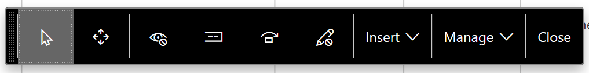

# What's new or changed in Dynamics 365 for Finance and Operations platform update 22 (December 2018)

[!include [banner](../../../finance/includes/banner.md)]

This article describes features that are either new or changed in Dynamics 365 for Finance and Operations platform update 22. This version has a build number of 7.0.5095.

### Dynamics 365 October '18 release notes

Wondering about upcoming and recently released capabilities in any of our business apps or platform?

[Check out the October '18 release notes](/dynamics365/release-plans/). We've captured all the details, end to end, top to bottom, in a single document that you can use for planning.

### Platform update 22 bug fixes

For information about the bug fixes included in each of the updates that are part of Platform update 22, sign in to Lifecycle Services (LCS) and view this [KB article](https://go.microsoft.com/fwlink/?linkid=2037790).

## Extensibility enhancements

With Platform update 22, a third wave of platform extensibility enhancements are available. For more information, see [Platform extensibility enhancements wave 3](/business-applications-release-notes/October18/dynamics365-finance-operations/platform-extensibility3).

## Export up to 1 million rows to Excel

The Export to Excel feature can now be configured to allow users to export up to 1 million rows from a grid in Finance and Operations, a substantial increase from the previous 10,000-row limit. By default, the export limit is set to 50,000 rows, but through the Client performance options page, system administrators can adjust the export limit as high as 1 million rows.

## Improved usability of the navigation pane

The navigation pane is a highly used navigation mechanism in Finance and Operations that provides access to favorites, recently opened pages, workspaces, and notably the main menu. Because of its high usage, the navigation pane has been enhanced in a few ways to improve its usability. These changes are available starting in Platform Update 22. To learn more, see [Improved usability of the navigation pane](/business-applications-release-notes/October18/dynamics365-finance-operations/updated-navigation-pane).

## Restyled personalization toolbar

The personalization toolbar has been restyled in Platform Update 22 to help users more easily tailor their own experiences in Finance and Operations. The following changes were made:

- The name of each personalization tool is now shown along with an icon, which helps users quickly recognize the tool they are interested in using.
- The description for how to use the current tool is also now shown, which helps users understand how to make the desired personalizations.
- The entire personalization toolbar can be moved across the screen by dragging and dropping on a specific region at the far left of the toolbar. This allows users to personalize elements that were previously obscured by the toolbar.

The following image shows how the personalization toolbar appeared before Platform update 22.

The following image shows how the personalization toolbar appears in Platform update 22 and later.

## Optimized "is one of" filtering experience

The "is one of" filtering operator is available for most fields when using the Filter Pane and grid header drop-down lists. This operator allows a user to filter a field based on multiple, different values. A new and improved experience for the "is one of" operator is available in Platform update 22. To learn more, see [Optimized "is one of" filtering experience](/business-applications-release-notes/October18/dynamics365-finance-operations/improved-isoneof-filtering).

## Paste lists from Excel into filter fields with the "is one of" operator

For some tasks, users might have a list of values in Excel that they'd like to use to filter data in Finance and Operations. For example, a finance user might have identified a set of vouchers from a report that need additional research in the system, and it would be ideal for this user to be able to copy the list directly from Excel into a filter field in Finance and Operations.

Starting in Platform update 22, the "is one of" operator in the Filter Pane and grid column filtering now recognizes lists copied from Excel so that they can be pasted directly into a filter field. This includes a collection of values copied from different rows and columns in Excel. To learn more about this feature, see [Paste lists from Excel into filter fields with the "is one of" operator](/business-applications-release-notes/October18/dynamics365-finance-operations/paste-filter-lists-from-excel).

## Batch job to handle SQL index defragmentation
In Platform update 22, a new system batch job has been introduced to rebuild fragmented indexes. Index fragmentation results in notable performance degradation in specific scenarios. To address fragmentation issues and keep the database in a top-performing state, this batch job will rebuild highly fragmented indexes periodically at a scheduled time. By default, the job scheduled to run at 3:00 AM local time every day for a maximum of 2 hours. If the batch job finds that not many fragmented indexes need to be rebuilt, it will complete early.  

[!INCLUDE[footer-include](../../../includes/footer-banner.md)]
