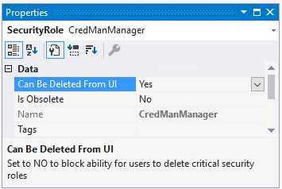

---
# required metadata

title: Platform updates for version 10.0.31 of finance and operations apps (February 2023)
description: This article lists the features that are included in the platform updates for version 10.0.31 of finance and operations apps.
author: twheeloc
ms.date: 09/29/2022
ms.topic: article
audience: Developer, IT Pro
ms.reviewer: sericks
ms.search.region: Global
ms.author: sericks
ms.search.validFrom: 2022-10-14

---
# Platform updates for version 10.0.31 of finance and operations apps (February 2023)

[!include [banner](../includes/banner.md)]
[!include [banner](../includes/preview-banner.md)]

This article lists the features that are included in the platform updates for version 10.0.31 of finance and operations apps. This version has a build number of 7.0.6651 and is available on the following schedule:

- **Preview of release:** October 2022
- **General availability of release (self-update):** January 2023
- **General availability of release (auto-update):** February 2023

## Features included in this release

The following table lists the features that are included in this release.

| Module or feature area | Feature name | More information | Enabled by |
|---|---|---|---|
| Data management | Allow Row version change tracking for tables and data entities (Preview) | See [Allow Row version change tracking for tables and data entities](../data-entities/rowversion-change-track.md). | Default |
| Power platform | Track changes for finance and operations virtual tables in Dataverse (Preview) | See [Track changes for finance and operations virtual tables in Dataverse](../power-platform/track-changes-fin-ops-virtual-table.md). | Default |
| System administration | Master company data sharing (Preview) | See [Cross-company data sharing overview](../sysadmin/srs-overview.md). | Feature management |
| System administration | New SecurityRole metadata property | 
A new **SecurityRole** metadata property, **Can Be Deleted From UI**, has been added to help protect system roles from being deleted by using finance and operations apps. The default value is **Yes**. If the value is set to **No**, a delete action will cause the following error message to be shown: "'NN' is a system role that can not be removed."
 | Default |
| System administration | New Table metadata property | 
A new **Table** metadata property, **DisableDatabaseLog**, lets you prevent tables from being added to the database log. The default value is **No**. If the value is set to **Yes**, the table can't be added when the database log is set up.
 | Default | 
|Additional languages available | Four additional languages are available | Four new languages are available for user selection in the preferred language list: Korean, Portuguese (Portugal), Vietnamese, and Chinese (Traditional). To select this option, go to **User options \> Preferences \> Language and country/region preference**. | Localized preferences |

### Bug fixes

For information about the bug fixes that are included in this update, sign in to Microsoft Dynamics Lifecycle Services, and view the [KB article](https://fix.lcs.dynamics.com/Issue/Details?bugId=775925).

### Dynamics 365: 2022 release wave 2 plan

Wondering about upcoming and recently released capabilities in any of our business apps or platform?

Check out the [Dynamics 365: 2022 release wave 2 plan](/dynamics365-release-plan/2022wave2/). We've captured all the details, end to end, top to bottom, in a single document that you can use for planning.

### Removed and deprecated platform features

The [Removed or deprecated platform features](removed-deprecated-features-platform-updates.md) topic describes features that have been removed, or that are planned for removal in platform updates of finance and operations apps.

- A *removed* feature is no longer available in the product.
- A *deprecated* feature isn't in active development and might be removed in a future update.

A deprecation notice will be added in the [Removed or deprecated platform features](removed-deprecated-features-platform-updates.md) topic 12 months before the removal of any feature from the product.

For breaking changes that affect only compilation time, but that are binary-compatible with sandbox and production environments, the deprecation time will be less than 12 months. Typically, these changes are functional updates that must be made to the compiler.
