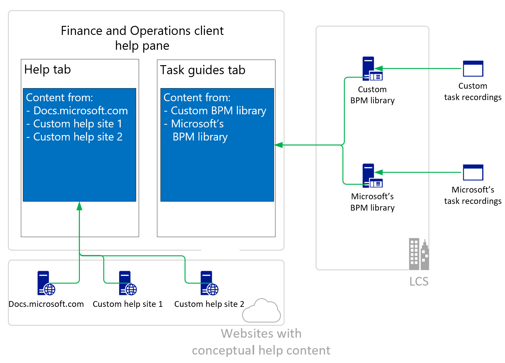

# Custom Help overview

[!include [banner](../includes/banner.md)]

[!INCLUDE [PEAP](../../../includes/peap-1.md)]

Finance and operations apps are often customized and extended to fit an organization's needs. If your solution is based on Microsoft Dynamics 365 Finance, Dynamics 365 Supply Chain Management, or Dynamics 365 Commerce, you can connect solution-specific and customer-specific Help content to the [Help pane](../../fin-ops/get-started/help-overview.md#in-product-help) in the finance and operations client. This article describes the main steps and decision points.

> [!NOTE]
> Users of finance and operations apps can create custom task guides to supplement conceptual content that describes the functionality of their solution. These conceptual descriptions are also referred to as Help and can be provided by Microsoft, partners, and an organization itself. For more information, see [Help system](../../fin-ops/get-started/help-overview.md).

The following illustration, and this article in general, use the term *Help* for conceptual descriptions that either include or exclude how-to guides. The term *task guides* refers to in-product task guides.

## Custom Help content

Custom Help content typically originates from one of three sources:

- Microsoft documentation repositories (repos)

    Microsoft's content in the various GitHub repos is optimized for the learn.microsoft.com site and the tools that are used for this site. It is not intended to be customized directly but to be supplemented by articles on your local website. However, depending on your solution, you might need a copy of Microsoft's content.

- Existing customized Dynamics AX content

    You can convert Dynamics AX custom Help content so that it can be used in Dynamics 365.

- HTML files that are created specifically for your solution

    [Learn more about the metadata](preparing-content.md#metadata) that must be added to your HTML files for context-sensitive Help and search to work correctly.

## Process

The end-to-end process depends on the actual customer solution and the users' expectations. A typical process involves the following steps:

1. Create the custom Help content.
2. Publish the content on a website.
3. Index the content by using a search service.
4. Connect the custom **Help** pane to the website and the search service.

You're welcome to share your knowledge by contributing to this documentation through the link at the bottom of the page or by joining the [Dynamics 365 community](https://community.dynamics.com/).

The following table outlines the main objectives that admins typically have for configuring the Help experience.

| Objective | Learn more |
|-----------|------------|
| I want to give my users a customized in-product Help experience that reflects their actual solution. | See the [Custom Help websites](#custom-help-sites) section of this article and [Create documentation or training with Task Recorder](../user-interface/task-recorder-training-docs.md). |
| I want to contribute to the Microsoft Help content. | See [Contribute to the Help](contributor-guide.md). |
| I want to add my content to the **Help** pane. | See [Connect a custom Help website to the Help pane](connect-help-pane.md). |

## Custom Help websites

Before the product can connect to your Help content, you must customize the in-product **Help** pane so that it shows your content. The following conditions must be met:

- Your content must be available on a website.

    You can deploy your content to an existing website, or you can set up a dedicated website to host your content. The website can be private or public, but we recommend that you **do not** require users to sign in to access your content.

- Your content must be indexed by a search service.

## See also

[Connect a custom Help website to the Help pane](connect-help-pane.md)  
[Language and locale descriptors in the product and in Help](language-locale.md)  
[Configure the Help experience for finance and operations apps](../../fin-ops/get-started/help-connect.md)  
[Help system](../../fin-ops/get-started/help-overview.md)

[!INCLUDE[footer-include](../../../includes/footer-banner.md)]
