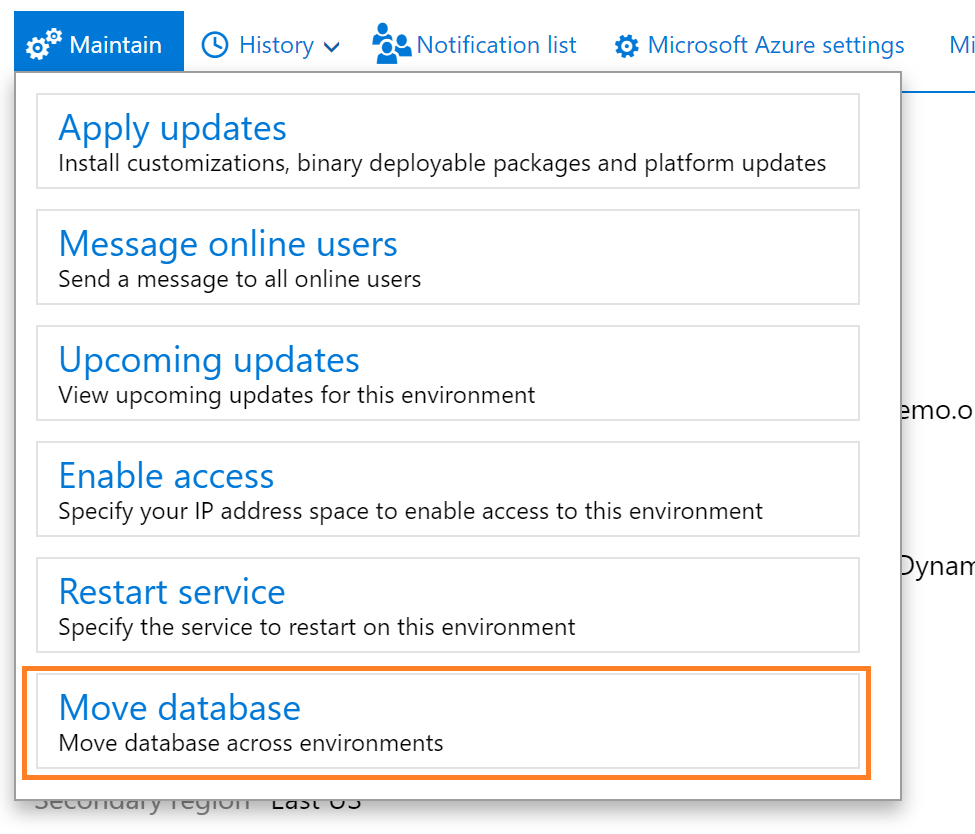
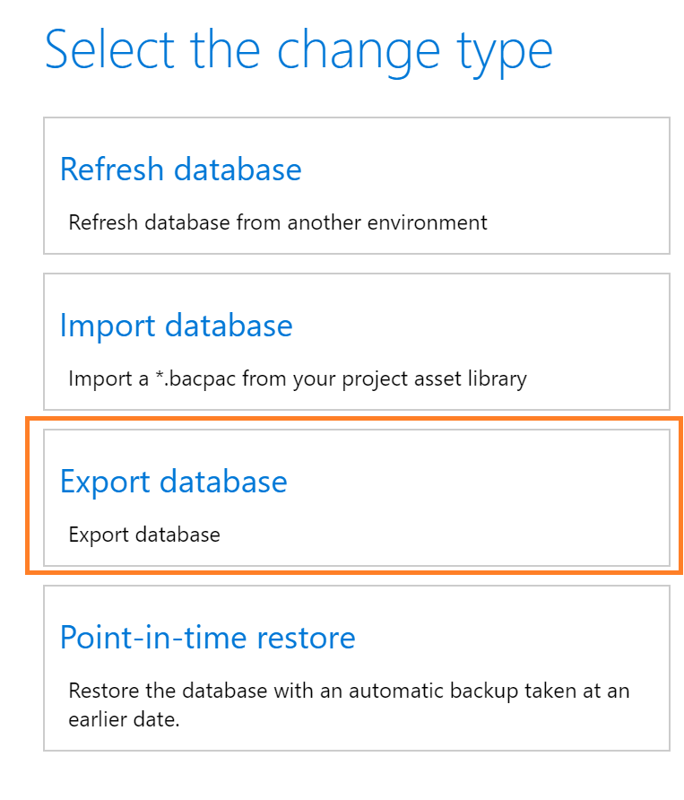

From your sandbox **Environment Details** page, click the **Maintain** menu, and then select **Move database**.

A slider pane will open on the page where you can use the **Export database** action.

The environment will be unavailable for other servicing operations, such as Sandbox refresh or package deployment during this time. The source environment will be usable from a Dynamics user perspective.  

After the export operation completes successfully, sign out of the servicing operation on your **Environment details** page. You can then see the asset in your **Asset Library** in the **Database backups** section.

The **.bacpac** files are stored here and can be manually downloaded to your Tier 1 developer environments for import. In the future, Microsoft will provide APIs to trigger the export action, as well as list the available backup files in your asset library. This includes the secured URL for automatically downloading a backup asset file or copying it directly to your secure blob storage using Microsoft Azure Storage SDKs.
