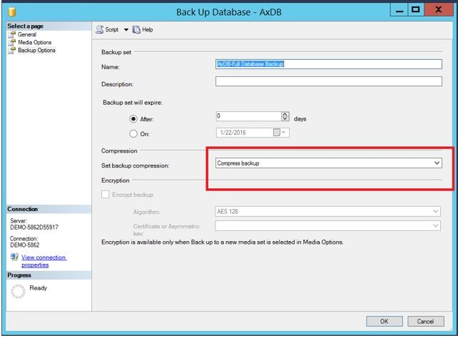

---
# required metadata

title: Back up the databases for Finance and Operations apps
description: This topic provides information about the database backup that is required for your Microsoft Dynamics Lifecycle Services (LCS) solution package.
author: kfend
ms.date: 04/13/2018
ms.topic: article
ms.prod: 
ms.technology: 

# optional metadata

# ms.search.form: 
# ROBOTS: 
audience: IT Pro
# ms.devlang: 
ms.reviewer: sericks
# ms.tgt_pltfrm: 
ms.custom: 196833
ms.assetid: fc0f06e8-1a20-45f7-ae98-ee074fe1f030
ms.search.region: Global
# ms.search.industry: 
ms.author: omarc

---

# Back up the databases for Finance and Operations apps

[!include[banner](../includes/banner.md)]

A backup of theFinance and Operations apps database is required for your Microsoft Dynamics Lifecycle Services (LCS) solution package. When you back up the database, you must include the master, reference, and transactional data that is specific to your solution and industry. This data will be used for your pre-sales demo deployments.

On demo or development environments, the database is typically named AXDBRain. Your database backup should be no larger than 15 gigabytes (GB). Otherwise, a time-out error might occur when you try to upload the database to the Asset library in LCS. 

To compress your database backup, in Microsoft SQL Server Management Studio, on the **Back Up Database** page, in the **Set backup compression** field, select **Compress backup**.

## Additional resources

[Requirements for publishing apps on AppSource](lcs-solutions-app-source.md)

[!INCLUDE[footer-include](../../../includes/footer-banner.md)]
