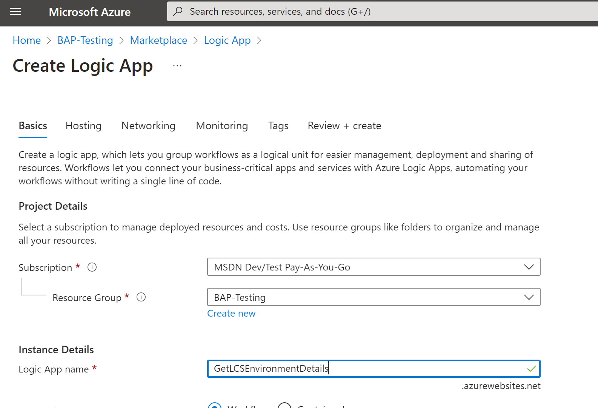
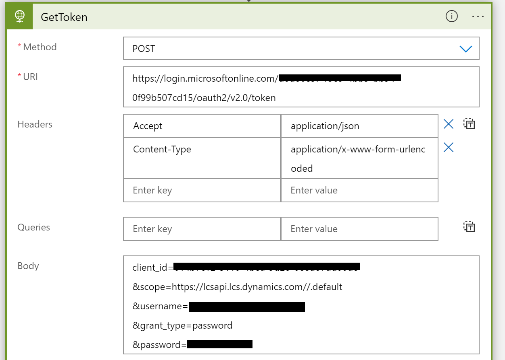
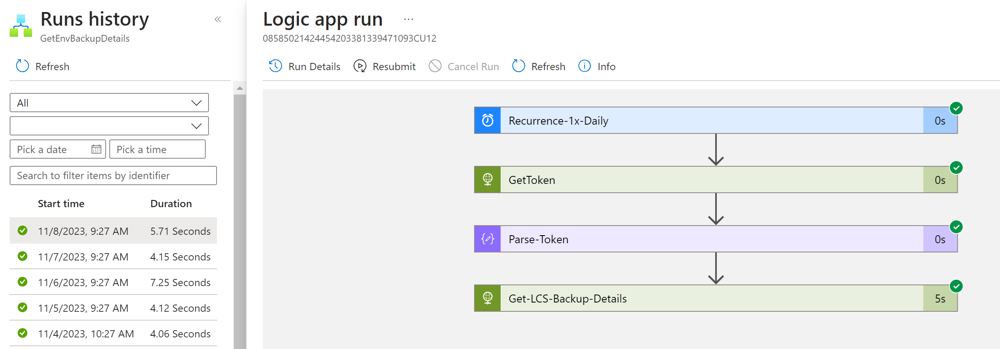

# Retrieve environment metadata via Logic Apps tutorial

This tutorial shows how you can take advantage of the Microsoft Dynamics Lifecycle Services API to periodically scan your environments and capture the metadata details.

In this tutorial, you learn how to perform these tasks:

1. Create a Power Automate flow or an Azure Logic Apps workflow that authenticates with the Lifecycle Services API.
2. Call the Environment Metadata endpoint to retrieve the details of a given environment.

In the example scenario, a customer must know the database backup location and whether a daily backup was made, so that it can meet its audit and compliance requirements. The customer retrieves the backup location by using the following steps.

## Step 1: Create the workflow and set up the variables

This tutorial uses a Logic Apps workflow. However, you can use a Power Automate flow or any other orchestration engine that your company prefers to use for automation. All the calls to retrieve the data use RESTful APIs. Therefore, any tooling that supports REST works with this tutorial.

In the [Azure portal](https://portal.azure.com/), create a new logic app, and give it a name.

> [!div class="mx-imgBorder"]
> 

After the new logic app is provisioned, use the designer to edit the workflow. Set up a **Recurrence** trigger that runs on a schedule of your choice.

> [!div class="mx-imgBorder"]
> 

To complete the remaining steps in this tutorial, you need a project ID and an environment ID.

- **Environment ID** – The ID of the environment where you want to install the package. You can find this ID on the environment details page in Lifecycle Service.
- **Project ID** – The ID of the project where the environment resides. You can find this ID in the URL of the environment details page.

Next, authenticate with Microsoft Entra ID, and retrieve a token that can be used to call the Lifecycle Services API. If you haven't finished setting up Microsoft Entra ID, see [Authentication (preview)](../../database/api/dbmovement-api-authentication.md).

To obtain the token, this tutorial uses user credentials that include a password. The following example shows a call to Microsoft Entra ID.

> [!div class="mx-imgBorder"]
> 

Next, parse the Microsoft Entra ID token response into a strongly typed object by using the following JavaScript Object Notation (JSON) schema in the **Parse JSON** action.

```json
{
    "properties": {
        "access_token": {
            "type": "string"
        },
        "expires_in": {
            "type": "integer"
        },
        "ext_expires_in": {
            "type": "integer"
        },
        "token_type": {
            "type": "string"
        }
    },
    "type": "object"
}
```

> [!div class="mx-imgBorder"]
> 

## Step 2: Retrieve the environment details

In this section, you retrieve the backup details. Be sure to have the environment ID and project ID available.

### Environment Metadata endpoint

Make your first call to the Lifecycle Services API. Use the [Fetch environment metadata](./v1/reference-environment-metadata.md) to retrieve all the available metadata properties. Be sure to use a bearer token from a user who has access to see this environment in the applicable Lifecycle Services project.

```http
GET https://lcsapi.lcs.dynamics.com/environmentinfo/v1/detail/project/{projectId}/?environmentId={environmentId}
```

The response that you receive resembles the following example.

```json
{
    "ResultPageCurrent": 1,
    "ResultHasMorePages": true,
    "Data": [
        {
            "EnvironmentId": "d15ed3a8c2c14054840b946c93915da9",
            "EnvironmentName": "ProdEnvironment1",
            "ProjectId": 112233,
            "EnvironmentInfrastructure": "MicrosoftManaged",
            "EnvironmentType": "Production",
            "EnvironmentGroup": "Primary",
            "EnvironmentProduct": "finance and operations",
            "EnvironmentEndpointBaseUrl": "<example>",
            "DeploymentState": "Finished",
            "TopologyDisplayName": "finance and operations - High Availability (10.0.20 with Platform update 44)",
            "CurrentApplicationBuildVersion": "10.0.886.48",
            "CurrentApplicationReleaseName": "10.0.20",
            "CurrentPlatformReleaseName": "Update44",
            "CurrentPlatformVersion": "7.0.6060.45",
            "DeployedOnUTC": "8/5/2021 11:00 PM",
            "CloudStorageLocation": "Central India",
            "DisasterRecoveryLocation": "South India",
            "DeploymentStatusDisplay": "Deployed",
            "CanStart": false,
            "CanStop": false,
            "DatabaseDailyBackupsEnabled": true,
            "DatabaseBackupLocation": "Central India"
        },
        {
            "EnvironmentId": "60b557b2-fefb-4690-859e-f83caf98c17e",
            "EnvironmentName": "SandboxEnvironment1",
            "ProjectId": 112233,
            "EnvironmentInfrastructure": "MicrosoftManaged",
            "EnvironmentType": "Sandbox",
            "EnvironmentGroup": "Primary",
            "EnvironmentProduct": "finance and operations",
            "EnvironmentEndpointBaseUrl": "<example>",
            "DeploymentState": "Finished",
            "TopologyDisplayName": "finance and operations - Sandbox (10.0.20 with Platform update 44)",
            "CurrentApplicationBuildVersion": "10.0.960.24",
            "CurrentApplicationReleaseName": "10.0.21",
            "CurrentPlatformReleaseName": "Update45",
            "CurrentPlatformVersion": "7.0.6129.19",
            "DeployedOnUTC": "8/5/2021 12:42 PM",
            "CloudStorageLocation": "East US",
            "DisasterRecoveryLocation": "West US",
            "DeploymentStatusDisplay": "Failed",
            "CanStart": false,
            "CanStop": true,
            "DatabaseDailyBackupsEnabled": true,
            "DatabaseBackupLocation": "East US"
        }
    ],
    "IsSuccess": true,
    "OperationActivityId": "216ea45d-113d-445a-a393-f67041f7aafe",
    "ErrorMessage": null,
    "VersionEOL": "9999-12-31T23:59:59.9999999"
}
```

### Applications of this data

Customers who must maintain logs or records of the environment details might use this approach to capture the state of the environment via the API, as shown in earlier steps. This state information can then be saved in the logs of the tool itself (for example, the run history of logic apps). Alternatively, for long-term retention, it can be saved as a file in Azure Blob Storage or on-premises.

> [!div class="mx-imgBorder"]
> 
