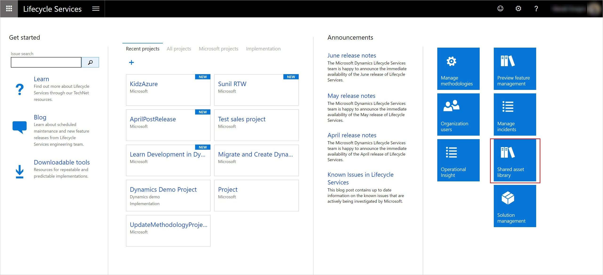

---
# required metadata

title: Asset library in Lifecycle Services
description: This article provides information about the Asset Library functionality in Microsoft Dynamics 365 Lifecycle Services.
author: laneswenka
ms.date: 02/08/2023
ms.topic: article
ms.prod: 
ms.technology: 

# optional metadata

# ms.search.form: 
# ROBOTS: 
audience: Developer, IT Pro
# ms.devlang: 
ms.reviewer: sericks
# ms.tgt_pltfrm: 
ms.custom: 266824
ms.assetid: 
ms.search.region: Global
# ms.search.industry: 
ms.author: laswenka
ms.search.validFrom: 2016-02-28
ms.dyn365.ops.version: AX 7.0.0

---

# Asset library in Lifecycle Services

[!include [banner](../includes/banner.md)]

The Asset library is a storage location for the various assets that are associated with a tenant in Microsoft Dynamics 365 Lifecycle Services. Two types of Asset library are available in Lifecycle Services: the Shared asset library and the project-level Asset library.

> [!NOTE]
> Asset library is not supported for Prospect projects or organizations.  In these situations, the Asset library menu option will not be visible. 

- **Shared asset library** – The Shared asset library is used by Microsoft and Partners to share assets across multiple tenants, projects, and environments in Lifecycle Services. This library can be accessed by any user who signs in to Lifecycle Services. To access the Shared asset library, sign in to Lifecycle Services, and then click the **Shared asset library** tile.

- **Project-level Asset library** – The project-level Asset library is used to share assets across environments within a project in Lifecycle Services. This library can be accessed by all users within a project. To access the project-level Asset library, sign in to Lifecycle Services, and open a project. Then, on the hamburger menu, click **Asset library**.

    
> [!NOTE]
> Uploading versions for the same asset in the project asset library is not supported. 

## Asset library support
The Asset library supports multiple types of assets. Here are some asset types that are frequently used:

- **Software deployable package** – This asset type represents all the packages that are used to update an environment with the latest set of updates.
- **Data package** – This asset type stores assets that are used for configuration and data management.
- **GER Configuration** – This asset type stores all localization and translation assets that are applied to the client.
- **Retail SDK** – This asset type stores all the latest scripts for the Retail software development kit (SDK).
- **Database backups** - This asset type is used for import and export of databases from Sandbox Tiers 2 - 5 environments.

### Asset scopes
Every asset that the Asset library supports has multiple scopes. Here are some of the supported asset scopes:

- **Me** – When an asset is uploaded, it's set to the **Me** scope. An asset that has the **Me** scope is visible only to the person who uploaded the asset.
- **Project** – When an asset is imported from the **Global** scope to another project, it's set to the **Project** scope.
- **Organization** – When an asset must be shared with multiple users within a tenant, the tenant admin can promote the asset to the **Organization** scope.
- **Global** – Only Microsoft can upload assets to the **Global** scope. These assets are assets that Microsoft wants to be made publicly available to all Lifecycle Services projects and users.

### Asset status
Every asset has one of two statuses: **Draft** or **Published**.

- **Draft** – The asset can still be edited.
- **Published** – The asset is published at an **Organization** or **Global** scope, and edits are completed.

## Actions in the Asset library
You can perform various actions in the Asset library as you require.

### Upload an asset to the Asset library
1. Select the tab to upload the asset to.
2. Click the plus sign (**+**).
3. Enter a name and description for the asset.
4. Upload the file for the asset, and then click **Confirm**.

### Upload a new version for a specific asset (Shared asset library only)
1. Select the asset in the Asset library.
2. On the toolbar, click the **Upload new version** button.
3. Repeat the steps in the previous procedure, "Upload an asset to the asset library."
4. On the toolbar, click **Versions** to view multiple versions for a single asset.
5. Individual versions can then be imported in to a specific project asset library as required.

### Move assets from the Shared asset library to the project-level Asset library
There are two ways to move an asset from the Shared asset library to the project-level asset library: you can import the asset or copy it.

#### Import from the Shared asset library
Follow these steps to import an asset from the Shared asset library to the project-level Asset library so that it can be applied across environments.

1. In the project-level Asset library, select the tab for the asset type to import.
2. Click **Import**.
3. In the list of assets in the Shared asset library, select the asset to import, and then click **Pick**.

The selected asset is imported and put into the project-level Asset library. The status of the asset in the project-level Asset library is set to **Published**. This method is for packages that you don't plan to edit. If you want to edit an imported package, create a copy by using the following procedure. The status of the package will then be **Draft**.

#### Copy from the Shared asset library
Follow these steps to create a copy of an asset so that it can be edited.

1. In the project-level Asset library, select the tab for the asset type to copy.
2. Select the asset to copy, and then, on the toolbar, click **Copy**.

A copy of the published asset is created, and the status is set to **Draft**.

### Save to my library
After you've edited an asset, follow these steps to move the edited asset back to the Shared asset library so that it can be promoted to the **Organization** scope and shared with multiple customers.

1. In the project-level Asset library, select the tab for the asset type to import.
2. Select the asset to save, and then click **Save to my library**.

The asset is saved from the project-level Asset library back to the Shared asset library, and the scope is set to **Me**.

[!INCLUDE[footer-include](../../../includes/footer-banner.md)]
