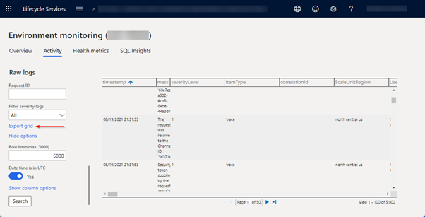
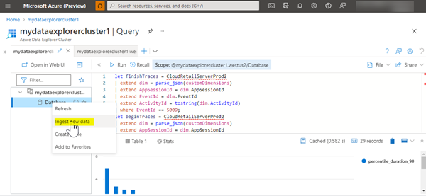
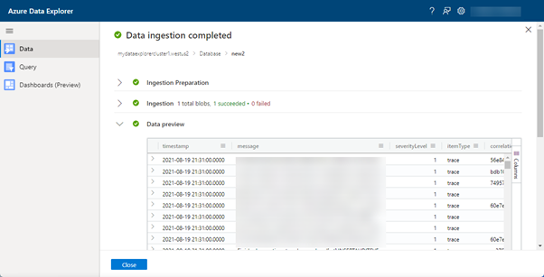
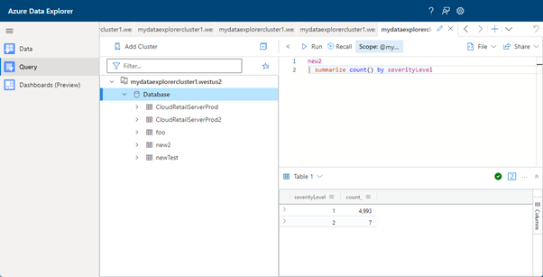

---
# required metadata

title: Use Azure Data Explorer to query raw information logs
description: This topic explains how to use Azure Data Explorer to query raw information logs.
author: andreashofmann1
ms.date: 09/13/2021
ms.topic: article
audience: IT Pro
ms.reviewer: sericks
ms.search.region: Global
ms.author: andreash
ms.search.validFrom: 2021-08-20
---

# Use Azure Data Explorer to query raw information logs

[!include[banner](../includes/banner.md)]

There are occasions when a customer, partner, consultant, or support engineer needs to look at the low-level telemetry data for a Finance and Operations app. These use cases include troubleshooting of errors, performance-related investigations, or just trying to gain some additional understanding of how the Finance and Operations app works. Telemetry data can be accessed by authorized users via the Environment monitoring features of Lifecycle Services (LCS) and can be filtered in a few different ways and displayed inside the LCS's [raw information logs](monitoring-diagnostics.md#raw-information-logs). A data grid can be used to inspect the log entries. LCS does not allow for more sophisticated pivoting, so users can use Excel for that purpose. The telemetry data can also be downloaded and formatted in CSV format. 

Excel is not the optimal tool for advanced querying of this data. A tool that is better designed for this purpose is the Azure Data Explorer. It provides an innovative query language, Kusto, that is optimized for high-performance data analytics. Answering questions like *how often a certain process has occurred*, *how long has it taken in 90% of the occurrences*, *how often per hour has a certain action taken place over the course of a day* becomes a lot easier and can be backed up with powerful graphics as well. 

Here are two examples of how these types of graphics could look.


A lesser-known feature of the Azure Data Explorer is that it supports CSV files. You can use Azure Data Explorer to get CSV data files uploaded and staged so they can be queried with the Kusto language. To set up Azure Data Explorer cluster, see [Quickstart: Create an Azure Data Explorer cluster and database](/azure/data-explorer/create-cluster-database-portal).

## Steps to upload to Azure Data Explorer
To upload to Azure Data Explorer, follow these steps: 

1.	Run your query on the LCS raw logs page.
    > [!NOTE]
    > For the next step, adjust the time interval or filter to get to the correct data (for export, the row limit is 5000).
   
2.	Export the grid to Excel.

    

3.	Open the file in Excel and save it without making any changes (this will fix any formatting issues).
4.	In Azure Data Explorer, right-click the cluster in the tree view and select **Ingest new data**. On the next page, select **Ingest data from a local file**.

    

5.	Select a cluster. Provide a name for the new table for the data to be imported into, and then select up to 10 CSV files to import. Select CSV format. Select **Next** until your data is imported.

    

6. Select the **Query** tile to display an area where you can write a Kusto query against your data. 

    

To learn more about the Kusto query language, see [Tutorial: Use Kusto queries in Azure Data Explorer and Azure Monitor](/azure/data-explorer/kusto/query/tutorial?pivots=azuredataexplorer).

## Sample queries
### Analysis of SQL queries occurring in the Commerce Runtime (custom or built-in)

```kusto
new2
| where EventId == 1809 // designates SQL finished trace
| project executionTimeMilliseconds, sqlQuery
| summarize NumAllCalls=count(), TotalDuration=sum(executionTimeMilliseconds), AvgDuration = avg(executionTimeMilliseconds), 
    percentiles(executionTimeMilliseconds, 90) by tostring(substring(sqlQuery, 0, 70))
| where percentile_executionTimeMilliseconds_90 > 1
| order by TotalDuration desc
```

### Performance of any RetailServer calls > 100ms

```kusto
// run this for the data
new2
| where EventId == 5009 // designates a RetailServer finished trace
| project executionTimeMilliseconds, apiAction
| summarize NumAllCalls=count(), TotalDuration=sum(executionTimeMilliseconds), AvgDuration = avg(executionTimeMilliseconds), percentiles(executionTimeMilliseconds, 90) by tostring(apiAction)
| where percentile_executionTimeMilliseconds_90 > 100
| order by percentile_executionTimeMilliseconds_90 desc

// include this for the chart
| project apiAction, percentile_executionTimeMilliseconds_90
| render columnchart
```
