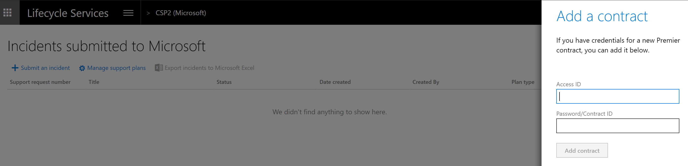

# Manage support experiences for finance and operations apps
[!include [banner](../includes/banner.md)]

## Open a new incident
1. In LCS, go to the project for which you want to file a support incident. 

2. Click the **Support** tile.

   

3. On the **Submitted to Microsoft** tab, click the **Submit an incident** button.

   

4. Select an issue category.

5. Select an issue area.

6. In the **Describe your issue** area, enter the following:

   - Select **Yes** if the issue occurred in an environment. Select the environment name.  
   - Enter a short description of your issue in the **Title** field.
   - Provide details about the issue detail and the steps needed to reproduce the error.
   - If applicable, enter an error message. 
   - If possible, attach screenshots that illustrate the problem. To do this, click **Attach file from computer**.
 
 
   > [!NOTE]
   > When you create an incident, Issue search will populate the top 10 "Possible issue solutions" search results based on the your selection and input, and dynamically refresh these results as more details are provided during support case creation. 
   > 
   > Standalone Issue search is still accessible using the drop-down menu if you need to search for more solutions. 
 
7. Enter the primary contact information. These contact details will be used by the customer support team to contact you about the case.

8. Select the support contract and the severity level. 
    
   - Support contracts for on-premises environments have a limited incident count. 
   - Support contracts for cloud environments have an unlimited incident count. 
   - For on-premises products or cloud environments, from the list of available support contracts, select the support option to use if you have multiple tier support contracts. 
  
9. Click **Submit**. 

After you click **Submit**, an incident is created and added to the **Incidents** list. You will receive an email message from the Microsoft Support Engineer assigned to your case. 

## Support plans in Lifecycle Services
Support plan entitlements are derived based on several different identifiers. Not all will apply to your situation. If you are missing a support plan or entitlement in LCS, determine which identifier is needed to tie it to your project in LCS. If there is more than one organization, note which one is current by clicking on your name in the upper-right corner of LCS. Select the organization that applies to your scenario and contains the benefits that you want to utilize.

### Unique contract ID/access ID
The following online support plans require a unique contract ID/access ID combination linked to your sign-in in LCS:

-   Unified
-   Premier
-   Advanced support for partners

If you do not know your unique contract ID/access ID combination, contact your Microsoft account manager to have an ID created for you.

To link your contract ID/access ID to your account, complete the following steps:

1. From within a project, select **Support** from the main menu, and then select **Manage Support plans**. 
2. Select **Add contract**.

   

3. Enter your access ID and your password or contract ID, and then select **Add contract**.

   

### PartnerSource Business Center account
The following support plan incidents can be used as part of your PartnerSource Business Center (PSBC) account if they exist: 

> [!NOTE]
> No online support plans can be utilized through the PSBC account.

-   Advanced support for partners on-premises incidents.
-   Advantage or Advantage + on-premises incidents.
-   Other pay per incident types of plans with an existing incident count in PSBC.

If you do not find the PartnerSource Business Center account, ensure that your sign in is added as a professional in your organization in PSBC. Make sure that you are signing in with the same Microsoft or work account login. This account is only applicable in an on-premises project.

### Sign-in specific options
The following incidents and support benefits will appear based on your sign in, if applicable:

-   MPN gold and silver incidents.
-   Signature cloud support.
-   Individual incidents and 5 packs purchased on [support.microsoft.com/supportforbusiness]. 

   > [!NOTE]
   > Incidents must be purchased with a Microsoft account such as \@hotmail.com or \@outlook.com. Work or Azure Active Directory accounts cannot have incidents tied to them.

### Tenant subscription
The following entitlements will appear based on your subscription and ProDirect
purchases within your tenant organization:

-   Subscription
-   ProDirect

### Software assurance
The following entitlements can be added by linking a subscription number and contact email:

-   Software assurance

To add, select **Add a Software Assurance plan** when you create the support incident. Enter the subscription number and the contact email, and then click **Continue**.

   
## Report production outage
For a quick and effective way to escalate issues to Microsoft Support in the event that the services in a production environment are degraded or become unavailable, see [Report a production outage](report-production-outage.md).

## Phone support
We prefer that you contact Support following the steps in [Open a new incident](cloud-powered-support-lcs.md#open-a-new-incident). If you're unable to open a new incident in LCS, phone support is available using [Premier phone support](https://support.microsoft.com/premier/contacts).

[!INCLUDE[footer-include](../../../includes/footer-banner.md)]

