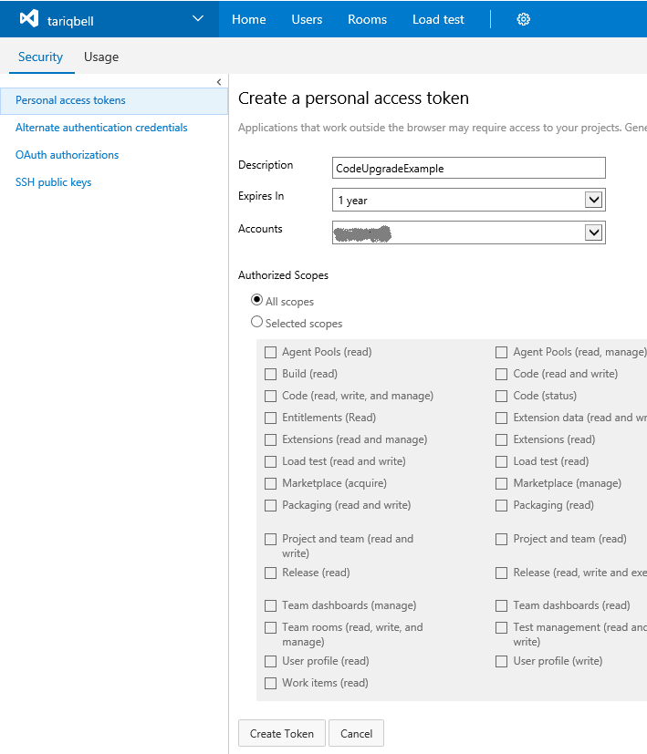
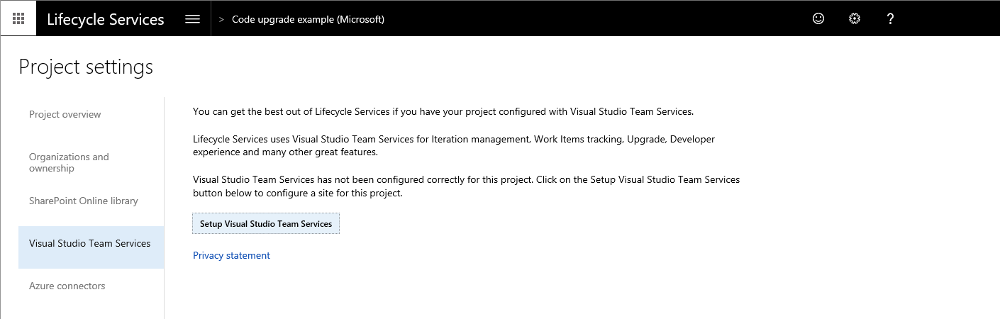
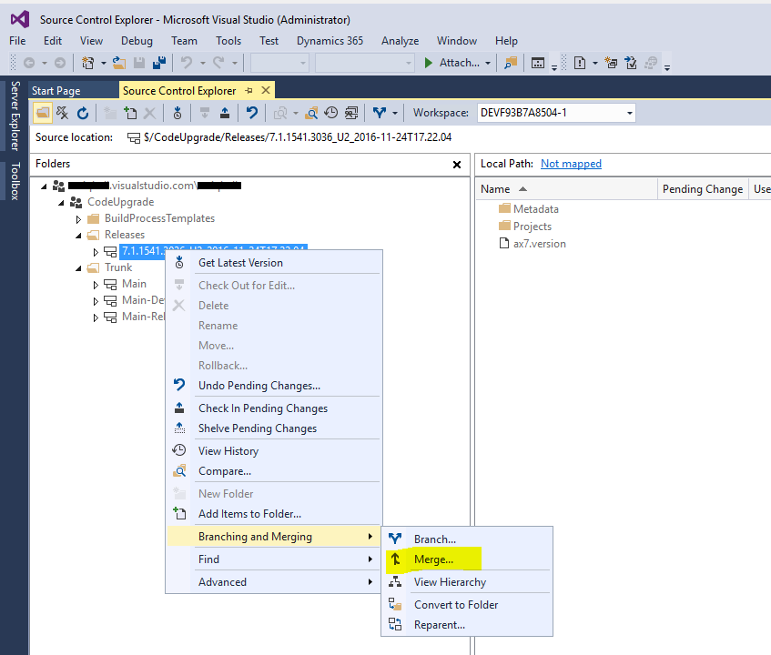

---
# required metadata

title: Configure the code upgrade service in Lifecycle Services (LCS)
description: This topic explains how to configure the Code upgrade tile to migrate your solution to the latest version of the Finance and Operations apps.
author: LaneSwenka
ms.date: 08/01/2017
ms.topic: article
ms.prod: 
ms.technology: 

# optional metadata

# ms.search.form: 
# ROBOTS: 
audience: Developer, IT Pro
# ms.devlang: 
ms.reviewer: sericks
# ms.tgt_pltfrm: 
ms.custom: 265594
ms.assetid: 964b5a15-9b9c-434c-a4c2-e14406ebfaeb
ms.search.region: Global
# ms.search.industry: 
ms.author: laswenka
ms.search.validFrom: 2016-02-28
ms.dyn365.ops.version: AX 7.0.0

---

# Configure the code upgrade service in Lifecycle Services (LCS)

[!include [banner](../includes/banner.md)]

This topic explains how to configure the <strong>Code upgrade </strong>tile in Lifecycle Services (LCS) to migrate your solution to the latest version of the Dynamics 365 Finance and Operations apps.

## Overview

The code upgrade tool operates by connecting to your Azure DevOps project, locating your Trunk\\Main branch, branching to a new branch that will be named as Releases\\\<version number\>, and then performing the code upgrade there. After this process is complete, you can synchronize your developer environment to this new branch under Releases\\\<version number\> and resolve conflicts. When you have compiled and tested your upgraded code you can merge the new branch back into Trunk\\Main, using source control explorer in Visual Studio and the process is complete.

Dynamics 365 for Finance and Operations version 8.0 and newer, does not allow customization via overlayering of Microsoft models. Before you upgrade, you must have a plan to refactor your customizations into extensions. For more information, see the [Extensibility home page](../extensibility/extensibility-home-page.md) and [Relax model restrictions to refactor overlayering into extensions](../extensibility/refactoring-over-layering.md).

## Process
### Create the Trunk\\Main folder structure

For the code upgrade service to recognize your source code, your Azure DevOps project must contain a Team Foundation Version Control (TFVC) code repository. In addition, the code repository folder structure must conform to the following strict pattern. 

 - For code and metadata: `/<DevOps project name>/Trunk/Main/Metadata`
 - For Visual Studio project and solution files: `/<DevOps project name>/Trunk/Main/Projects`
 
 You can create new folders directly in the Azure DevOps web interface under **Repos**.
 
 
> [!NOTE]
> - Folder names are case sensitive, that is, you must use Main and not MAIN, or the code upgrade service will not recognize the folder.
> - Azure DevOps projects use Git version control by default. You will need to add a TFVC repository.
>     1. Go to Project settings, then Repositories.
>     2. Select New repository.
>     3. In the Type field, select TFVC, and then click Create.

### Create a personal access token

To connect to an Azure DevOps project, LCS is authenticated using a personal access token. Use the following steps to create a personal access token in Azure DevOps. If you have already configured your LCS project to connect to your Azure DevOps project, you can skip this section.

1. Sign in to visualstudio.com and locate your Azure DevOps project.
2. In the top-right corner, hover over your name, a menu appears, select **Security**.
3. Select **Add** to create a new personal access token, give it a name, and then enter the amount of time that you want the token to last for. Select **Create Token**. 

   

4. Copy the token to your clipboard. You will not be able to find the token details after this step is completed, so be sure that you have copied the token before navigating away from this page.

### Configure your Lifecycle Services project to connect to Azure DevOps

1. In your LCS project, go to the **Project settings** tile, select **Visual Studio Team Services**, and then select the **Setup Visual Studio Team Services** button. This configuration is needed by many LCS tools, if you have already configured LCS to connect to your Azure DevOps project, you can skip this section. 

   

2. Enter the root URL for your Azure DevOps organization and the access token created earlier, and then select **Continue**.

   

3. Select the project within your Azure DevOps organization that you want to connect to, and select **Continue**. 
   
   

4. On the **Review and save** page, select **Save**.

### Create an ax7.version file

> [!NOTE]
> If you are migrating from AX 2012, you can skip this step.

The code upgrade tile in LCS automatically finds the version that you are migrating from, by reading the ax7.version file under the Main folder in your source control. You must create this file manually, either in Visual Studio or through the Azure DevOps web portal, as shown below. This file is not needed if you are migrating your code from Dynamics AX 2012 R3 or an earlier version. The version number entered here must be the application version (not the platform version). Take care to enter the correct version number here as entering an incorrect version number in this file may cause your code upgrade run to fail.

 

For more information about how to identify which application version you have, see [Overview of Microsoft Dynamics AX build numbers](https://blogs.msdn.microsoft.com/axsupport/2012/03/29/overview-of-microsoft-dynamics-ax-build-numbers/).

### Execute the code upgrade tile

1. In your LCS project, select the **Code upgrade** tile. 

   

2. In the bottom-left corner of the screen, select **Add**, and then enter a name and description. Select the version you are upgrading from as Microsoft Dynamics AX 7, and then select **Create**.
   -   If you are upgrading your code from Dynamics AX 2012 R3, select the version you are upgrading from. You will be prompted to upload a zipped version of your Dynamics AX 2012 R3 model store file.
   -   If the **Estimation Only** check box is selected, the tool only generates a report and does not check in or create a new code branch in Azure DevOps for you. You should use this option if you want to evaluate the potential size of the work involved in upgrading before you commit to the actual upgrade.

   

3. Select **Analyze code** in the bottom-right corner. The code upgrade process will start. This process typically takes 40 minutes for a large solution to complete. When complete, return to the **Code upgrade** tile in LCS to view the results.
4. The code upgrade service creates a new branch and checks in the upgraded code to your Azure DevOps project. After the upgrade process is complete, your code will exist in a new branch under the **Releases** folder. The branch name is suffixed with the date and time of the upgrade. 

   

### Merge Releases back into Trunk\\Main

Once the upgraded code in Releases\\\<version number\> compiles successfully and you have completed your code migration and testing, you are ready to merge this branch back into Trunk\\Main. To merge, on your development environment in Visual Studio, open the Source control explorer pane then right-click on the **Releases\\\<version number\>** branch, and in the context menu go to **Branching and Merging**, and then on the submenu select **Merge**.

The [Source Control Merge Wizard](https://www.visualstudio.com/docs/tfvc/merge-folders-files#sourcecontrolwizard) opens, which guides you through merging the Releases\\\<version number\> branch back into Trunk\\Main.

[!INCLUDE[footer-include](../../../includes/footer-banner.md)]