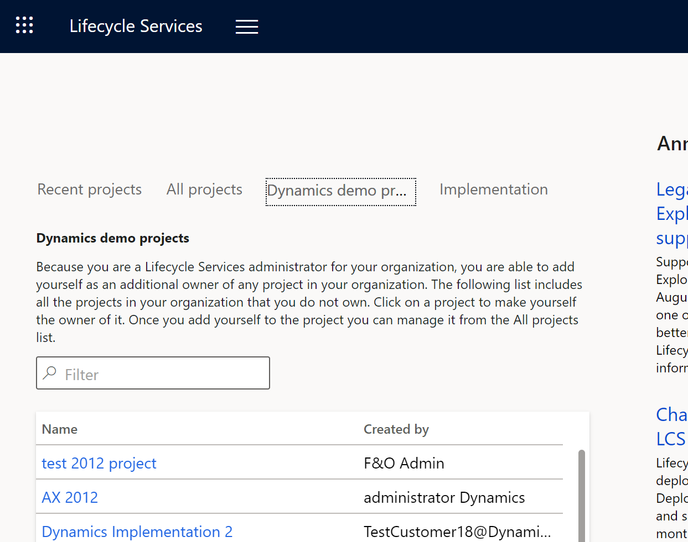

# Configure Lifecycle Services security

[!include [banner](../includes/banner.md)]
[!include [Lifecycle Services deprecation](../includes/lcs-deprecation.md)]

Security in Microsoft Dynamics Lifecycle Services is controlled at both the organization level and the project level. Not all members of an organization have access to all projects. The members of a project might not all be members of the same organization.  

Currently, users can sign in by using the Microsoft Entra credentials that they created in the Microsoft 365 portal when they signed up. Users who are administrators for their organization in Microsoft Entra ID are administrators in Lifecycle Services. 

Project-level access to Lifecycle Services is by invitation. You can invite members of your organization to be project owners and team members. You can invite users who aren't part of your organization, and who don't have accounts in Microsoft Entra to be team members.

> [!IMPORTANT]
> We strongly recommend that you manage all users within your company at the organization level. You help ensure that users can access the benefits that are available to your organization.

## Organizational roles
There are three types of organizational roles in Lifecycle Services:

- Admin
- Contributor
- Delegated admin

### Organization admin
At the organization or tenant level, anyone who has the Global Administrator role in Microsoft Entra ID automatically becomes an organization admin when they sign in to Lifecycle Services. These admins can then promote other users who are currently contributors to admins. Admins have unique capabilities. For example, they can add themselves as a project owner to any project that is owned by their tenant, even if they weren't previously part of that project.

In addition, admins can create other Lifecycle Services implementation projects by following the steps in [Create multiple Lifecycle Services projects](../../fin-ops/get-started/implement-multiple-projects-aad-tenant.md#create-multiple-lcs-projects).

### Organization contributor
Contributors are other users from your Microsoft Entra tenant, but they don't have admin capabilities. Contributors can create projects. They can also create the first implementation project if they're the first user of their tenant to sign in, and if they do so after the purchase of applicable finance and operations apps licenses.

### Delegated admin
The delegated admin role is identical to the admin role, except the user is from a Microsoft partner tenant and has an established relationship with the customer organization. The delegated admin can sign in on behalf of the customer, and can perform required operations and provide required support.

## Manage Lifecycle Services organization users
Only an administrator can manage users. Follow these steps.

1.  In PartnerSource Business Center (PSBC) or Microsoft Entra ID, associate all the users in your organization who require access to Lifecycle Services with your organization. Users might have to wait up to two business days before they can sign in to Lifecycle Services.
2.  Add your users to the appropriate projects in Lifecycle Services.

### Invite a user to an Lifecycle Services project

1.  Sign in to [Lifecycle Services](https://lcs.dynamics.com/).
2.  Select the project to add the user to.
3.  Select **Project users** on the hamburger menu or the **Project users** tile, and then, on the **Project users** page, select the plus sign (**+**).
4.  Enter the user’s email address, select the correct security role, and then select **Invite**.

> [!NOTE]
> For implementation projects, you can select the implementation role for the invited user. If you set **Allow FastTrack to contact** to **Yes**, then Microsoft FastTrack team may reach out to you based on your implementation role and the stages of the implementation project.   

## Configuring project security
You can invite users from inside or outside your organization to join your project as users. The following table describes the roles that are available for users.

| Role                           | Description |
| ------------------------------ | ----------- |
| Project owner                  | Members of this role have access to all tools in Lifecycle Services, can add other users in any role, and can delete the project. |
| Environment manager            | Members of this role have access to all tools in Lifecycle Services and can manage cloud-hosted environments. |
| Project team member            | Members of this role have access to all tools in Lifecycle Services but can't manage cloud-hosted environments. |
| Project team member (prospect) | Members of this role have limited access to all tools in an Lifecycle Services project. Prospects are users who have been added to a project, but who don't have an account in VOICE or a Microsoft Entra account. You can identify that a user is a prospect, because **prospect** is listed as the organization. |
| Operations user                | Members of this role have access to the following tools in Lifecycle Services: <ul><li>Asset library</li><li>System diagnostics</li><li>Issue search</li><li>Cloud-powered support</li><li>Updates</li><li>Cloud-hosted environments</li></ul> |

After you configure security for one project, you can import the users to another project.

## Configure implementation roles 
If you have an implementation project, you have the option to specify project user's implementation roles. For more information, see [Roles in a Dynamics 365 implementation](/training/modules/get-started-implementation-project/01-2-roles).

[!INCLUDE[footer-include](../../../includes/footer-banner.md)]
