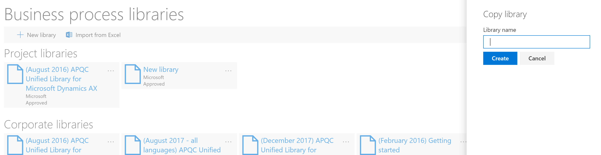
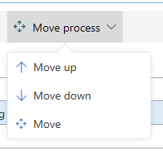
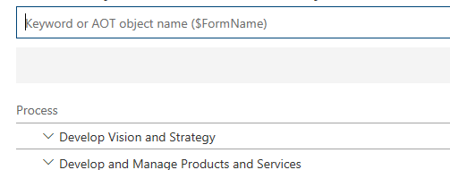

# Create, edit, and browse Business process modeler (BPM) libraries

[!include [banner](../includes/banner.md)]

This article provides information about how to create, edit, and browse Business process modeler (BPM) libraries. It's important to note You can browse a BPM library that is a global library or a corporate library. However, before you can edit and work with a BPM library, it must be part of your project in Microsoft Dynamics Lifecycle Services (LCS). Libraries that are distributed by Microsoft appear under **Global libraries**, whereas libraries that are published by your organization appear under **Corporate libraries**.

  >[!NOTE]
  >BPM localization is not supported. If you edit in the new BPM client in any language other than EN-US, your changes will only display when you view the BPM in the language in which the changes were made. To view any changes made in EN-US, you must synchronize with Visual Studio Team Server before the changes will display.

## Create a BPM library
There are several ways to author a BPM library. You can do so from scratch either building directly in the client or by importing an Excel template. Additionally, you can copy an existing library. This section walks through each of these methods.

### Use the BPM client 

1. On the **Business process libraries** page, select **New library**.
     
2. Enter a name for the new library, and then select **Create**.
     
    
### Use Excel Import

1. On the **Business process libraries** page, select **Import from Excel**.
     
2. Select **Download template** from the pane. Once downloaded, open the file.
3. The template has several columns, most importantly **Id** and **Parent Id**. Associate each line with a new Id number, if you'd like to make a line a child item, add the Id of the line you'd like it to fall under in the parent Id column. the 
4. Once complete, save the template and return to BPM.
5. Using the import pane, select **Browse** to upload the updated template, enter a name for the new library, and select **Import**. 
    
 
### Copy a library 

1. Open the **Business process libraries** page. 
2. On the tile for the library that you want to copy, select the ellipsis button (…), and then select **Copy**.
       
3. Enter a name for the library, and then click **Create**.
    

## Import a sections of another library
1. Openn the **Business process libraries** page, and then open the library you want to edit. 
2. Navigate to the line you would like to import to and select **Import**.
     
3. Select **As child** or **As sibling**.
     
4. In the pane, choose the library you would like to import from and click **Import**.
     

## Add a new process

1. In the BPM library, select an existing process.
2. Select **Add process**. You can select to add the process as a child or a sibling of the selected process node. In this way, you can create a semantic hierarchy of business processes.

    

## Edit the properties of a process

1. In the BPM library, select the process node to edit.
2. In the right pane, on the **Overview** tab, click **Edit mode**.
3. Enter a name and description for the process node.
4. Select the industries and the countries or regions that the process applies to. You can also add keywords and links. Keywords let you define categories, work streams, or other metadata. Links (URLs) let you reference external sites or documentation.

    

5. When you've finished editing the properties, click **Save**.

## Move a process

You can move a process node or assign it to another parent node in the BPM hierarchy.

1. Select the process node to move, and then click **Move process**. You can select to move the process up or down, or you can select **Move** to see more options.

    

2. If you selected **Move**, you can browse the hierarchy, select a node to move the process to, and then select **Move as child** or **Move as sibling**. To cancel the move operation, click **Cancel**.

## Delete a process

To delete a business process, select the process to delete, and then select **Delete**.

## Copy a global or corporate library to your project

You can browse a BPM library that is a global library or a corporate library. However, before you can edit and work with a BPM library, it must be part of your project in Microsoft Dynamics Lifecycle Services (LCS). Libraries that are distributed by Microsoft appear under **Global libraries**, whereas libraries that are published by your organization appear under **Corporate libraries**.

## Browse a BPM library

1. On the **Business process libraries** page, double-click the tile for the library that you want to browse.
2. In the BPM library, select a process to view its substeps.

    

3. Use the buttons on the toolbar to add, delete, or import processes as a child or a sibling. You can also select **Collapse all** to view only parent processes. 

    

## Search a BPM library

You can search for words or phrases in your BPM library. The search functionality searches the names and descriptions of business processes.

- To search for a _word_, enter the search word in the search box, and then press Enter.
- To search for a _phrase_, put double quotation marks around the search phrase.

    For example, enter **technology** (word) or **"information technology"** (phrase) in the search box.

- You can also search for Application Object Tree (AOT) elements that are part of the task recordings that are in your library. Typically, these AOT elements are the names of pages or menu items. When you search for an AOT element, prefix it with a dollar sign ($). For example, enter **$CustTable** in the search box.

   

[!INCLUDE[footer-include](../../../includes/footer-banner.md)]
