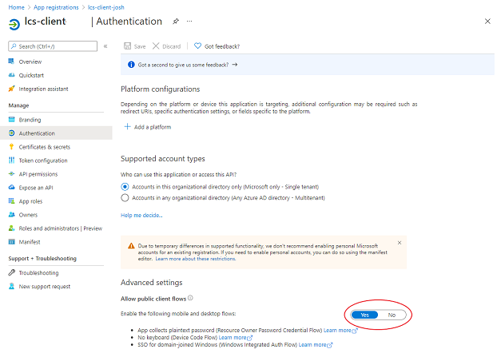
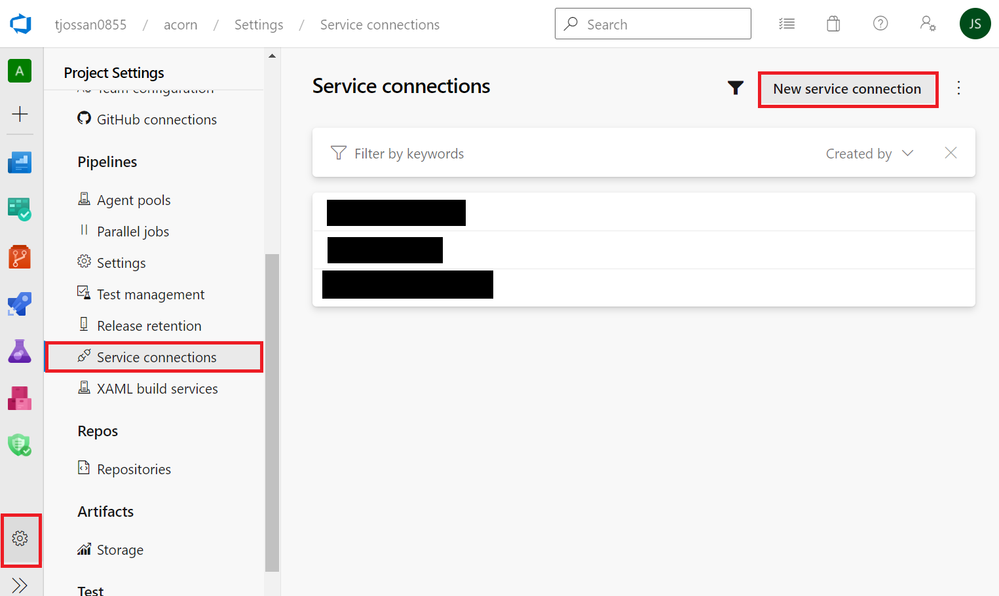
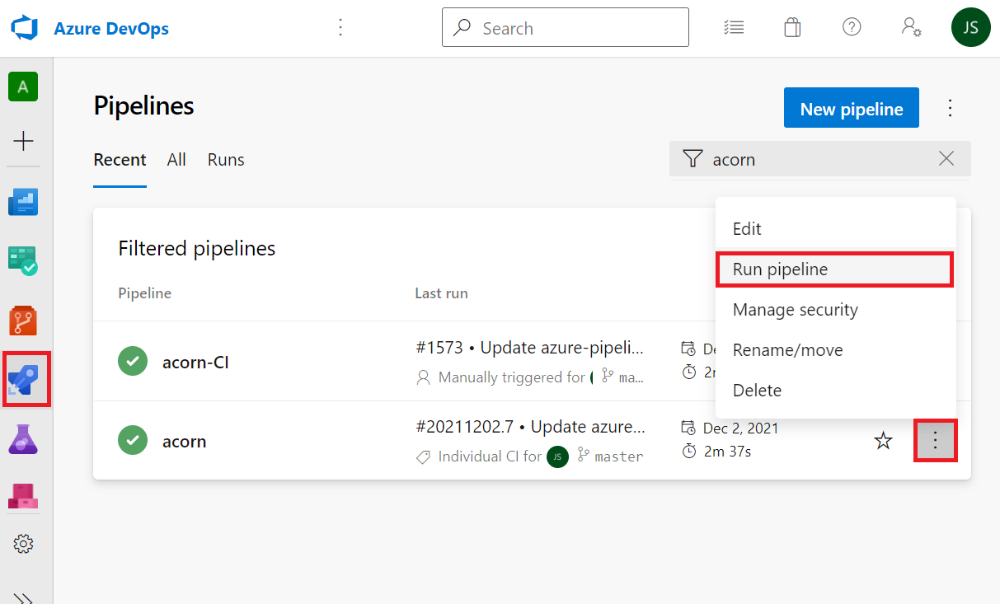

# Dynamics 365 Translation Service Azure DevOps extension tutorial 

[!include[banner](../includes/banner.md)]

The Microsoft Dynamics 365 Translation Service (DTS) Azure DevOps extension provides several tasks for pipeline integration. Use this extension to conveniently translate your Dynamics 365 solutions from Azure DevOps.

## Learning objectives

In this tutorial, you will complete the following objectives:

- Learn about the functionality and features of the DTS Azure DevOps extension.
- Submit translation requests through an Azure DevOps pipeline.
- Revise and regenerate translations.
- Submit alignment requests to create a translation memory from previously translated files.

## Prerequisites

- General knowledge of Azure DevOps
- General understanding of Microsoft Dynamics Lifecycle Services (LCS)

## Install and configure the DTS Azure DevOps extension

### Before you begin

For this exercise, you must have access to an Azure DevOps project. You must also have a repository (repo) that you can run pipelines on. Finally, you must have access to LCS.

In this exercise, you will complete the following tasks:

- Install the DTS extension in your Azure DevOps organization.
- Register an application so that it can be used with the LCS application programming interface (API).
- Create an LCS service connection.

### Install the DTS Azure DevOps extension

1. In a web browser, go to the [Visual Studio marketplace](https://marketplace.visualstudio.com/).
1. On the **Azure DevOps** tab, search for **Dynamics 365 Translation Service**.
1. In the search results, find the **Dynamics Translation Service Tasks** extension, and open it.
1. On the extension page, select **Get it free**.

    

1. On the installation page, select whether you want to install the extension to an Azure DevOps organization or download the .vsix package for server installation. 

After the extension is installed, you can use it from any pipeline in the organization.

### Register an application

To consume the DTS API, the extension must acquire an access token from the Microsoft identity platform. A service connection to LCS provides the configuration that the extension requires to obtain API permissions. This service connection uses a registered application that you configure with LCS permissions.

1. Sign in to the Azure portal by using either a work or school account, or a personal Microsoft account.
1. In the search bar, begin to type **App registrations**, and select it when it appears in the results.
1. On the **App registrations** page, select **New registration**.
1. On the **Register an application** page, enter the following information about your application's registration:

    - **Name** – Enter a meaningful name.
    - **Supported account types** – Select the types of accounts that the app should support.
    - **Redirect URI** – This field is optional. It isn't required for the current use case.

1. In the left navigation, under **Manage**, select **API permissions**.
1. On the **API permissions** page, select **Add a permission**.

    

1. On the **APIs my organization uses** tab, search for **LCS**.
1. In the **Request API permissions** dialog box, select the checkbox for the **user\_impersonation** permission to grant your application access to the LCS API.
1. Select **Add permissions**.

    

1. In the left navigation, under **Manage**, select **Authentication**.
1. On the **Authentication** page, under **Advanced settings**, set the **Allow public client flows** option to **Yes**.

    

1. Select **Save**.
1. In the left navigation, select **Overview**.
1. On the overview page for your app registration, make a note of the client ID, because you will have to enter it in the next task.
1. Select **Endpoints**, and then, in the list, find **OAuth 2.0 token endpoint**. This endpoint is the authentication endpoint that will be used with the extension service connection. Make a note of the value, because you will have to enter it in the next task.

    

### Create an LCS connection

Now that you have an app that is registered with the LCS API connections, you can create an LCS service connection. This service connection will enable the extension to obtain LCS permissions through the registered application.

> [!NOTE]
> LCS authentication requires Microsoft Entra accounts that multi-factor authentication is turned off for, and that aren't backed by federated sign-ins. For the service connection, we recommend that you use a separate account that has limited permissions.

1. In your Azure DevOps project, at the bottom of the left menu, select the **Project settings** button (gear symbol).
1. In the **Project settings** pane, under **Pipelines**, select **Service connections**. Then select **Create service connection**.

    

1. In the **New service connection** dialog box, search for and select the **Dynamics Lifecycle Services** service connection type, and then select **Next**.

    

1. Enter information about the service connection. Use the client ID and authentication endpoint that you made a note of when you registered the app. The name that you select for the service will be used as input for the DTS DevOps extension tasks. The **Lifecycle Services API Endpoint** field will be populated with a default value. If you are required to have all data processed within the European Union (EU), use ``https://lcsapi.eu.lcs.dynamics.com`` instead.

    

### Conclusion

In this exercise, you set up the DTS extension in your Azure DevOps organization. You're now ready to create new pipelines for automated translation, regeneration, and alignment tasks.

## Create a translation pipeline

The DTS extension provides a task that automates DTS translation requests as part of your development process. You can configure the translation task to collect resource files and upload them to DTS for localization. You can then review the localized files and translation memories, and adjust them as you require.

### Before you begin

For this exercise, you must have access to an Azure DevOps organization where the DTS extension is installed and an LCS service connection is configured. For more information, see the [Install and configure the DTS Azure DevOps extension](dts-ado-tutorial.md#install-and-configure-the-dts-azure-devops-extension) section.

In this exercise, you will complete the following tasks:

- In your Azure DevOps project, define a pipeline for translation requests.
- Run the translation pipeline.
- Get the translated files, and review the translation memory by using the Multilingual Editor.
- In your Azure DevOps project, define a pipeline for the regeneration task.
- Run the regeneration pipeline.

### Set up a sample repo for translation jobs

1. Open your Azure DevOps project, and go to your repo.
1. In the root of your repo, create a file that is named **res.label.txt** and that has the following content.

    ```text
    Greeting=Hello

    Farewell=Goodbye

    InvalidFileHelpText=The specified file is invalid. Please try again.
    ```

1. Commit the new file to your repo.

### Define a translation pipeline

1. On the left menu, select **Pipelines**. Then select **New pipeline**.
1. Follow the wizard by selecting your repository, and create a starter pipeline.
1. In the editor, expand the **Show assistant** menu item, and search for the **DTS Translation** task.
1. Configure the **DTS Translation** task:

    1. In the **LCS Service Connection** field, select the service connection that you created earlier.
    1. Enter any request name.
    1. Select **finance and operations** as the product.
    1. Select **English** as the source language.
    1. Select a target language (that is, the language that you will be translating to).
    1. Select **User interface** as the translation type.
    1. Enter the path of the resource file that you created earlier: **$(Build.SourcesDirectory)/\*.label.txt**.
    1. Enter **$(Build.ArtifactStagingDirectory)** as the output path.

1. Select **Add** to add the task to your pipeline.
1. Expand the **Show assistant** menu item, and search for the **Publish Pipeline Artifacts** task.
1. Configure the **Publish Pipeline Artifacts** task:

    1. Set the **File or directory path** field to **$(Build.ArtifactStagingDirectory)**.
    1. Enter any artifact name, and leave the publish location set to **Azure Pipelines**.

1. Select **Add** to add the task to your pipeline.
1. Save the pipeline.

### Run the translation pipeline

After you save the pipeline, an automatic run should be triggered. If the pipeline isn't automatically run, you can manually run it. On the **Pipelines** page, select the vertical ellipsis (three dots) for the pipeline, and then select **Run pipeline**.



### Review the translation pipeline output

After the pipeline is run, you're redirected to the pipeline summary page.

1. In the **Jobs** list, select the job. It should be in the **Queued** or **Running** state.
1. In the **Jobs output** pane, you should see the DTS translation task. Select it to view the output.
1. In the output, the translation ID identifies the job. It corresponds to the ID that you can find on the DTS dashboard in LCS. Make a note of the value, because you will have to enter it later, when you regenerate the translations.

    

    The **Publish Pipeline Artifact** task will let you download the translation output from the pipeline summary page.

1. Select the **Back** button (left arrow) to return to the summary page. 
1. In the **Related** column, select **1 published**.

    

1. Open the **For translation review** folder, and download the .xlf file.

### Review and edit the translations

After you download the translations, you might want to review them and make any required changes. You can use any XLIFF editor that you prefer. However, we recommend that you use the free [Multilingual Editor](/windows/apps/design/globalizing/multilingual-app-toolkit-editor-downloads). This tool helps prevent unwanted changes from being made in the XLIFF file. The following example shows how to use the Multilingual Editor.

1. In the Multilingual Editor, open the .xlf file. If an error occurs, ignore the message.
1. Select the **Strings** tab in the lower-left corner of the window.
1. To verify the translations, you can apply a filter for strings that are in the **Needs Review** state. In this way, you can show only translations that were either machine translated or recycled from a string that has a different resource ID.
1. After you've reviewed and edited the translations, and are confident that they are of the expected quality, mark them as **Translated**, **Final**, or **Signed off** so that they can be used for future requests.
1. Make some arbitrary change to any of the strings, and then save the file. In the next task, you will use the file to regenerate the resource files.


### Regenerate the translation

After you've finished reviewing and editing the translations in XLIFF file, you must regenerate the translated native formats. The DTS extension provides a task that automates the regeneration process.

1. Upload the edited .xlf file to your repo.
1. Create a new starter pipeline for your repo from the **Pipelines** page, just as you did in the [Define a translation pipeline](#define-a-translation-pipeline) section.
1. In the editor, expand the **Show assistant** menu item, and search for the **DTS Regeneration** task.
1. Configure the **DTS Regeneration** task:

    1. In the **LCS Service Connection** field, select the service connection that you created earlier.
    1. In the **Regenerate File** field, enter the path of the edited .xlf file. If you put that file in the root of your repo, the path will be **$(Build.SourcesDirectory)/res.fr.label.txt.xlf**.
    1. Set the **DTS Translation ID** field to the translation ID that you made a note of when you reviewed the translation pipeline output.
    1. Set the **Output Path** field to **$(Build.ArtifactStagingDirectory)**.

    

1. Add the task to your pipeline.
1. Expand the **Show assistant** menu item, and search for the **Publish Pipeline Artifacts** task.
1. Configure the **Publish Pipeline Artifacts** task:

    1. Set the **File or directory path** field to **$(Build.ArtifactStagingDirectory)**.
    1. Enter any artifact name, and leave the publish location set to **Azure Pipelines**.

1. Add the task to your pipeline.
1. Save the pipeline.

### Run the regeneration pipeline

After you save the pipeline, an automatic run should be triggered. If the pipeline isn't automatically run, you can manually run it from the **Pipelines** page, just as you did in the [Run the translation pipeline](#run-the-translation-pipeline) section.

### Review the regeneration pipeline output

After the pipeline is run, you're redirected to the pipeline summary page.

1. In the **Jobs** list, select the job. It should be in the **Queued** or **Running** state.
1. After job execution is completed, in the **Related** column, select **1 published** to view and download the regenerated resource files and translation memory.

The new resource files should reflect any edits that you made to the .xlf translation memory during your review.

### (Optional) Save changes it Git

After translation is completed, you might want to save the localized files to your project's Git repository. Before you run any Git commands, you must grant version control permissions to the pipeline agent.

### Grant permissions

1. Go to **Organization Settings \> General \> Projects**.
1. Select the project that you want to edit.
1. In the **Project Settings** pane, under **Repos**, select **Repositories**.
1. Select the repo that you're using for this exercise.
1. Select the **Security** tab to edit the security settings.
1. Search for the **Project Collection Build Service** user, and grant the permissions that are required for the Git commands that you want to run. You will probably want to grant the following permissions:

    - Contribute
    - Create branch
    - Read

    

### Add Git scripts to a pipeline

Before you run Git commands, you should enable the script to access the system token. You can complete this task by adding a **checkout** step where the **persistCredentials** parameter is set to **true**.

You can now add Git commands as part of a Windows PowerShell or bash script task. The following example shows a bash script that commits and pushes the translation task output. In this script, the **git config** command is first called two times to set the user's email address and name. The **git checkout** command is then used to create a new branch. Next, the **git add** command is used to stage all changes in the **$(Build.SourcesDirectory)**. Next, the **git commit** command is used to save the changes locally. Finally, **git push** uploads these local changes to the remote repository.

```YAML
- checkout: self

persistCredentials: true

- task: Bash@3

  inputs:

    targetType: 'inline'

    script: |

      # Write your commands here

      git config --global user.email "user@microsoft.com"

      git config --global user.name "User Name"

      git checkout -b localized

      git add $(Build.SourcesDirectory)

      git commit -m "Committing translations from pipeline"

      git push --set-upstream origin localized

    workingDirectory: '$(Build.SourcesDirectory)'

```

## Create a translation memory from previously translated files

The DTS alignment task can be used to create translation memory files. When you have previously translated files and the corresponding source files, the alignment task can be used to generate an XLIFF file.

### Before you begin

For this exercise, you must have access to an Azure DevOps organization where the DTS extension is installed and an LCS service connection is configured. For more information, see the [Install and configure the DTS Azure DevOps extension](dts-ado-tutorial.md#install-and-configure-the-dts-azure-devops-extension) section.

In this exercise, you will complete the following tasks:

- Define a pipeline that can be used with the alignment task.
- Run the pipeline, and inspect the results.

### Set up a sample repository for alignment jobs

1. Open your Azure DevOps project, and go to your repo.
1. In the root of your repo, create a file that is named **res.label.txt** and that has the following content.

    ```text
    Greeting=Hello

    Farewell=Goodbye

    InvalidFileHelpText=The specified file is invalid. Please try again.
    ```

1. Create a file that is named **res.label.fr.txt** and that has the following content.

    ```text
    Greeting=Bonjour

    Farewell=Au revoir

    InvalidFileHelpText=Le fichier spécifié n'est pas valide. Veuillez réessayer.
    ```

1. Commit both files to your repo.

### Define an alignment pipeline

1. On the left menu, select **Pipelines**.
1. Create a new starter pipeline.
1. In the editor, expand the **Show assistant** menu item, and search for the **DTS Alignment** task.
1. Configure the **DTS Alignment** task:

    1. In the **LCS Service Connection** field, select the service connection that you created earlier.
    1. Select **finance and operations** as the product.
    1. Select **English** as the source language.
    1. Select **French** as the target language.
    1. Select **User Interface** as the translation type.
    1. In the **Source file** field, enter the path of the resource file that you created earlier: **$(Build.SourcesDirectory)/res.label.txt**.
    1. In the **Target File** field, enter **$(Build.SourcesDirectory)/res.label.fr.txt**.
    1. In the **Output Path** field, enter **$(Build.ArtifactStagingDirectory)**.

    

1. Add the task to your pipeline.
1. Expand the **Show assistant** menu item, and search for the **Publish Pipeline Artifacts** task.
1. Configure the **Publish Pipeline Artifacts** task:

    1. Set the **File or directory path** field to **$(Build.ArtifactStagingDirectory)**.
    1. Enter any artifact name, and leave the publish location set to **Azure Pipelines**.

1. Add the task to your pipeline.
1. Save the pipeline.

### Run the alignment pipeline

After you save the pipeline, an automatic run should be triggered. If the pipeline isn't automatically run, you can manually run it from the **Pipelines** page.

### Review the alignment pipeline output

After the pipeline is run, you're redirected to the pipeline summary page.

1. In the **Jobs** list, select the job. It should be in the **Queued** or **Running** state.
1. After job execution is completed, you can select the published artifact to view and download the XLIFF file.
1. You can make further changes to the file in the Multilingual Editor, as described in the [Review and edit the translations](#review-and-edit-the-translations) section, or you can use the XLIFF file as the translation memory for future translation requests.

## Summary

In this tutorial, you learned about the functionality and features that the DTS Azure DevOps extension provides. You learned how to create a pipeline to automate translation requests. You also learned how to edit the translations and then regenerate them, based on your edits. Finally, you learned how to create XLIFF translation memories by using the alignment task.
