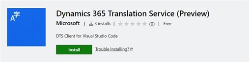
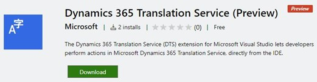

---
# required metadata

title: Announcements
description: This page will be used to announce all the latest DTS releases to the users
author: arianapadilla
ms.date: 11/08/2022
ms.topic: overview
ms.prod: 
ms.technology: 
audience: Developer, IT Pro
ms.reviewer: josaw
ms.search.region: Global
ms.author: arianap
ms.search.validFrom: 
ms.dyn365.ops.version: 2012
ms.custom:
ms.assetid:

---

# Announcements

[!include[banner](../includes/banner.md)]
[!include[preview banner](../includes/preview-banner.md)]

## Visual Studio Code Extension Release

DTS has released a Visual Studio Code extension that brings a set of DTS functionalities directly to VS Code so users can save the manual visit to LCS to use Translation Service and get the results within the app. This extension is targeted towards Business Central developers for whom VS Code is their primary development environment. 

### Where to download? 

[Dynamics 365 Translation Service Extension - Visual Studio Marketplace]([https://marketplace.visualstudio.com/](https://nam06.safelinks.protection.outlook.com/?url=https%3A%2F%2Fmarketplace.visualstudio.com%2Fitems%3FitemName%3Ddts-publisher.dts-vsc&data=05%7C01%7Carianap%40microsoft.com%7C2fcbec5426ce46f2a75108da4ad19678%7C72f988bf86f141af91ab2d7cd011db47%7C1%7C0%7C637904561304230329%7CUnknown%7CTWFpbGZsb3d8eyJWIjoiMC4wLjAwMDAiLCJQIjoiV2luMzIiLCJBTiI6Ik1haWwiLCJXVCI6Mn0%3D%7C3000%7C%7C%7C&sdata=bGNyOcGpLtlt%2Fs0D2LyoF3DyiOkipWHj0qbe1Mzep6g%3D&reserved=0))

### Features Included

- **DTS Translation**: Create translation requests for resource files in workspace.
- **Resource file explorer**: View and manage existing resource files.

Documentation is available [here](https://nam06.safelinks.protection.outlook.com/?url=https%3A%2F%2Fdocs.microsoft.com%2Fen-us%2Fdynamics365%2Ffin-ops-core%2Fdev-itpro%2Flifecycle-services%2Fdts-vscode-doc&data=05%7C01%7Carianap%40microsoft.com%7C2fcbec5426ce46f2a75108da4ad19678%7C72f988bf86f141af91ab2d7cd011db47%7C1%7C0%7C637904561304230329%7CUnknown%7CTWFpbGZsb3d8eyJWIjoiMC4wLjAwMDAiLCJQIjoiV2luMzIiLCJBTiI6Ik1haWwiLCJXVCI6Mn0%3D%7C3000%7C%7C%7C&sdata=gkEl5PNldkEKdv9HVzggN8ij62%2B7AK99uoBJtYX%2BNj4%3D&reserved=0).

### Who is this for? 

This extension was created for Dynamics 365 Business Central users who develop extensions in AL using the AL language extension. The extension provides a DTS integration into the AL environment for Business Central developers.

## Visual Studio Extension Release

DTS has released a Visual Studio extension which provides Translation, Regeneration, and Alignment support within the app. This extension is targeted towards Finance & Operations developers for whom Visual Studio is their primary development environment. 

### Where to download? 

[Dynamics 365 Translation Service Extension - Visual Studio Marketplace](https://nam06.safelinks.protection.outlook.com/?url=https%3A%2F%2Fmarketplace.visualstudio.com%2Fitems%3FitemName%3Ddts-publisher.dts-vs-ext%26ssr%3Dfalse%23overview&data=05%7C01%7Carianap%40microsoft.com%7C86fbe9e548d84f345ab708da5478d62b%7C72f988bf86f141af91ab2d7cd011db47%7C1%7C0%7C637915175207697758%7CUnknown%7CTWFpbGZsb3d8eyJWIjoiMC4wLjAwMDAiLCJQIjoiV2luMzIiLCJBTiI6Ik1haWwiLCJXVCI6Mn0%3D%7C3000%7C%7C%7C&sdata=2GyaUhBDFpbrZQdoBawScYNAuj4sJUZojM63zN9JdA4%3D&reserved=0)

### Features Included

- **Translation**: Create translation requests for label resource files in the project.
- **Regenerate**: Post edit the XLIFF outputs and regenerate the label resource files.
- **Align**: Create XLIFF Translation Memories (TM) from previously translated label resource files.

Documentation is available [here](https://nam06.safelinks.protection.outlook.com/?url=https%3A%2F%2Fdocs.microsoft.com%2Fen-us%2Fdynamics365%2Ffin-ops-core%2Fdev-itpro%2Flifecycle-services%2Fdts-visual-studio&data=05%7C01%7Carianap%40microsoft.com%7C86fbe9e548d84f345ab708da5478d62b%7C72f988bf86f141af91ab2d7cd011db47%7C1%7C0%7C637915175207697758%7CUnknown%7CTWFpbGZsb3d8eyJWIjoiMC4wLjAwMDAiLCJQIjoiV2luMzIiLCJBTiI6Ik1haWwiLCJXVCI6Mn0%3D%7C3000%7C%7C%7C&sdata=%2FH4%2B2xHeV3ma5iz5vg7zY7cJpnKCpGFNCVJCGL3bvTY%3D&reserved=0).

### Who is this for? 

The Microsoft Dynamics 365 Translation Service (DTS) extension for Visual Studio was created for finance and operations developers to perform actions in DTS directly from their Visual Studio integrated development environment (IDE). To use the DTS Visual Studio extension, the user must have access to Microsoft Dynamics Lifecycle Services (LCS). Additionally, the extension is intended primarily to support the development workflow for finance and operations apps in Visual Studio.

