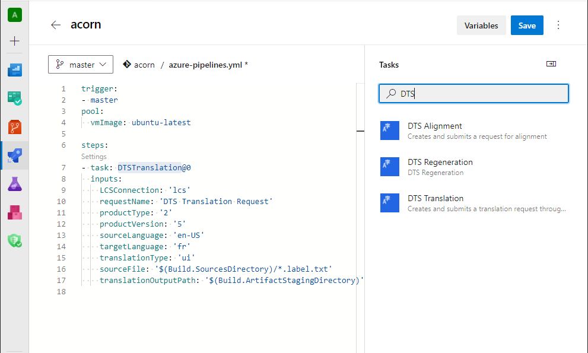
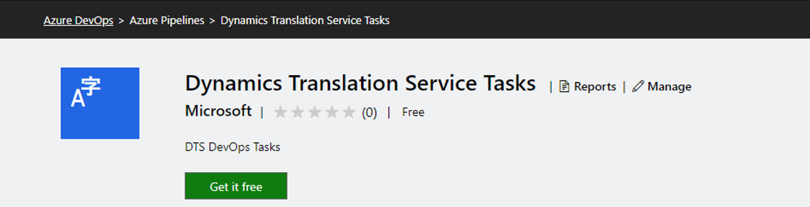
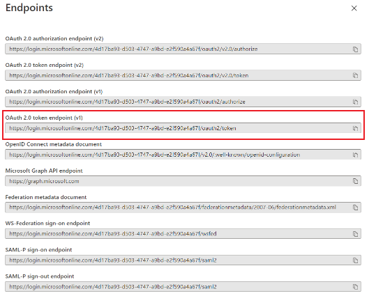
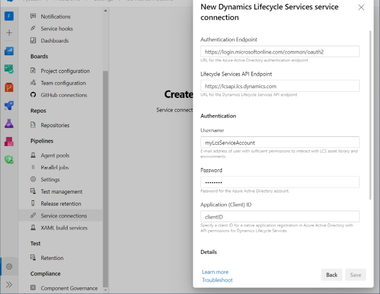
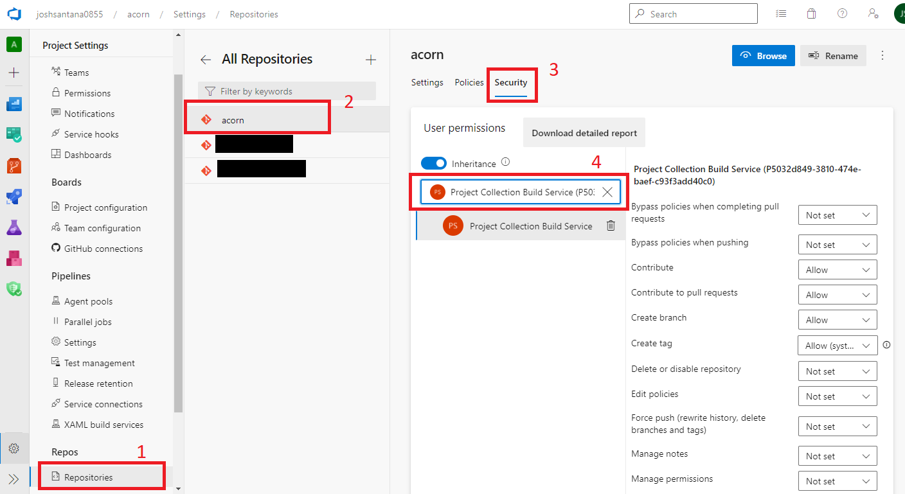

---
# required metadata

title: Dynamics 365 Translation Service Azure DevOps extension
description: This topic explains how to integrate the Dynamics 365 Translation Service DevOps extension into your Azure DevOps workflow.
author: joshsantana
ms.date: 04/14/2022
ms.topic: article
audience: IT Pro
ms.reviewer: sericks
ms.search.region: Global
ms.author: joshsantana
ms.search.validFrom: 2021-11-19

---

# Dynamics 365 Translation Service Azure DevOps extension (Public Preview)

[!include[banner](../includes/banner.md)]

The Microsoft Dynamics 365 Translation Service (DTS) extension for Azure DevOps has several pipeline tasks that let you perform actions in DTS. For example, you can translate user interface (UI) files, regenerate translation requests, and create translation memory (TM) files.

To start to use the DTS pipeline tasks, you must install the extension in your organization and then connect to the translation service. For more information, see the [Setting up the extension](#setting-up-the-extension) section later in this topic.

This topic assumes that you have a working knowledge of [Azure Pipelines](/azure/devops/pipelines/create-first-pipeline).

## Running a task

To create new translation, regeneration, or alignment requests, add a new task in the YAML for your pipeline.

The following example shows the definition for a new translation task.

```yaml
- task: DTSTranslation@0
    inputs:
        LCSConnection: 'DTS connection'
        requestName: 'My Request'
        productType: '2'
        productVersion: '5'
        sourceLanguage: 'en-US'
        targetLanguage: 'es'
        translationType: 'ui'
        sourceFile: '$(Build.SourcesDirectory)/resources/en-US/*.label.txt'
        translationOutputPath: '$(Build.ArtifactStagingDirectory)'
```



By default, the request output is prepared in the Build.ArtifactStagingDirectory staging folder. For information about how to download the translation output, see [Publish and download artifacts in Azure Pipelines](/azure/devops/pipelines/artifacts/pipeline-artifacts). If you want to push the translation output back to your repository, see the [Commit translation output to your repository](#commit-translation-output-to-your-repository) section later in this topic.

## Overview of task inputs

### DTS translation task

The translation task lets users submit new translation requests through DTS.

| Input | Required | Description |
|-------|----------|-------------|
| Dynamics Lifecycle Services service connection | Yes | The Microsoft Dynamics Lifecycle Services (LCS) service connection that is used for authentication with LCS. For more information, see the [Create a service connection](#create-a-service-connection) section later in this topic. |
| Request Name | Yes | Enter a name for the request. |
| Product Name | Yes | Select a product name. |
| Product Version | Yes | Select a product version. |
| Source Language | Yes | The language to translate from. |
| Target Language | No\* | The language to translate to. |
| Multiple Target Languages | No\* | <p>A comma-separated list of target language codes.</p><p>This input is used to submit requests that have multiple target languages. It overrides the **Target Language** input, if it's set. Here is an example: **ja, pt-BR, fr**.</p> |
| Translation type | Yes | <p>Select the file type.</p><p>Only **User Interface** files are currently supported. For more information, see [Supported products and file types](translation-service-overview.md#supported-products).</p> |
| Path to resource files | Yes | <p>The path of the files to translate.</p><p>You can use wildcard characters in the path. Subfolder recursion is supported. Here are two examples:</p><p>`$(Build.SourcesDirectory)/**/*.label.txt`</p><p>`$(Build.SourcesDirectory)/resources`</p> |
| Path to translation memory files | No | <p>The path of the TM files.</p><p>Wildcard characters are supported.</p> |
| Output Path | Yes | The path to save the translation output to. This path is relative to your pipeline. For more information, see [Artifacts in Azure Pipelines](/azure/devops/pipelines/artifacts/build-artifacts). |

\*You must either select a single target language or specify multiple target languages as part of the request.

### DTS alignment task

If you have files that were previously translated, and you also have corresponding source files, you can use the Align tool to create a TM in XML Localization Interchange File Format (XLIFF).

| Input | Required | Description |
|-------|----------|-------------|
| Dynamics Lifecycle Services service connection | Yes | The credentials that are used for authentication with LCS. For more information, see the [Create a service connection](#create-a-service-connection) section later in this topic. |
| Product Name | Yes | The product to translate resource files for. |
| Product Version | Yes | Select a product version. |
| Source Language | Yes | The language to translate from. |
| Target Language | Yes | The language to translate to. |
| Source file | Yes | The path of the source file. |
| Target file | Yes | The path of the target file. |
| Output Path | Yes | The path to save the alignment output to. This path is relative to your pipeline. For more information, see [Artifacts in Azure Pipelines](/azure/devops/pipelines/artifacts/build-artifacts). |

### DTS regeneration task

The regeneration task lets users submit new regeneration requests through DTS.

| Input | Required | Description |
|-------|----------|-------------|
| Dynamics Lifecycle Services service connection | Yes | The credentials that are used for authentication with LCS. For more information, see the [Create a service connection](#create-a-service-connection) section later in this topic. |
| Regenerate File | Yes | The path of the edited TM files. |
| DTS Translation ID | Yes | <p>The ID of the original translation.</p><p>If you're regenerating from the [translation task](#dts-translation-task), the translation ID is in the task output.</p> |
| Output Path | Yes | The path to save the translation output to. This path is relative to your pipeline. For more information, see [Artifacts in Azure Pipelines](/azure/devops/pipelines/artifacts/build-artifacts). |

## Setting up the extension

### Install the extension

To install the extension to your Azure DevOps organization, follow these steps.

1. Open [Visual Studio Marketplace](https://marketplace.visualstudio.com/).
2. On the **Azure DevOps** tab, search for "Dynamics 365 Translation Service."
3. Find the **Dynamics Translation Service Tasks** extension, and open it.
4. On the extension page, select **Get it free**.

    

5. On the installation page, you can either select an Azure DevOps organization to install the extension to, or you can download the VSIX package for server installation.

After the extension is installed, the DTS tasks will be visible in your Azure DevOps organization's pipelines.

### Register an application

To create an LCS service connection to authenticate with DTS, you must first register an app that has appropriate LCS permissions. The following procedure guides you through the app registration process. It also shows how to obtain a client ID and the Azure Open Authorization (OAuth) endpoint that is required to set up an LCS service connection.

1. Sign in to the [Azure portal](https://portal.azure.com/) as the user who will be used to communicate with the LCS application programming interface (API).
2. Under **Azure services**, select **App registrations**. 
3. On the **App registrations** page, select **New registration**.
4. On the **Register an application** page, in the **Name** field, enter a name for the app.
5. Under **Supported account types**, select an option to specify which accounts should be supported.
6. Select **Register**.
7. On the page for your new app registration, in the left navigation pane, under **Manage**, select **API permissions**.
8. On the **API permissions** page, select **Add a permission**.
9. On the **APIs my organization uses** tab, find and select the **Dynamics Lifecycle services** API.
10. Select the checkbox for the API permission that has the **user\_impersonation** scope, and then select **Add permissions**.
11. Select the button to grant admin consent for the permissions. When you're prompted to confirm the action, select **Yes**.
12. In the left navigation pane, under **Manage**, select **Authentication**.
13. On the **Authentication** page, under **Advanced settings**, set the **Allow public client flows** option to **Yes**.
14. In the left navigation pane, select **Overview**.
15. The overview page for your app registration shows the client ID. To find the authentication endpoint, select **Endpoints**. Use the OAuth 2.0 token endpoint.

    

### Create a service connection

Now that you have an app that is registered with LCS API connections, you must create a service connection to authenticate with LCS.

> [!NOTE]
> LCS authentication requires Azure Active Directory (Azure AD) accounts where multifactor authentication (MFA) is turned off, and that aren't backed by federated sign-ins. Microsoft is reviewing options for new authentication features that will enable the API and these tasks to be authenticated in these types of setups.

The service connection takes the following inputs.

| Input | Required | Description |
|-------|----------|-------------|
| Authentication Endpoint | Yes | The endpoint to use for the app. For more information, see the [Register an application](#register-an-application) section. |
| Lifecycle Services API Endpoint | Yes | The LCS API endpoint.  The default value is https://lcsapi.lcs.dynamics.com. If you are required to have all data processed within the European Union (EU), use https://lcsapi.eu.lcs.dynamics.com.
| Username | Yes | <p>The user who is submitting the requests through DTS.</p><p><strong>Note:</strong> MFA must be turned off.</p> |
| Password | Yes | The user's password. |
| Client ID | Yes | The client ID of the registered app. For more information, see the [Register an application](#register-an-application) section earlier in this topic. |


1. In your Azure DevOps project, at the bottom of the left menu, select **Project settings**.
2. In the **Project Settings** pane, under **Pipelines**, select **Service connections**. Then select **Create service connection**.
3. In the **New service connection** dialog box, search for and select the **Dynamics Lifecycle Services** service connection type. Then select **Next**.
4. Enter the information for the service connection. Use the client ID and authentication endpoint from the registered app. The name that you select for this service will be used as input for the DTS Azure DevOps extension tasks.

    

## Commit translation output to your repository

After translation is completed, you might be interested in automatically pushing the localized files to your project's repository. Before you run any Git commands, version control permissions must be granted to the Pipeline agent.

1. Go to **Organization Settings \> General \> Projects**.
2. On the project settings page, select the project to edit.
3. In the **Project Settings** pane, under **Repos**, select **Repositories**. Then select the repository that you're using for this topic.
4. Select the **Security** tab to edit the security settings.
5. Search for the **Project Collection Build Service** user.
6. Grant the permissions that are required for the Git commands that you want to run. You will likely want to grant the following permissions:

    - Contribute
    - Create branch
    - Read

    

### Add Git scripts to a pipeline

Before you run Git commands, you will want to allow the script to access the system token. To complete this setup, add a `checkout` step where `persistCredentials` is set to *true*.

You can now add Git commands as part of a PowerShell or bash script task. The following example of a bash script commits the translation task output and pushes it to a branch that is named **localized**.

```bash
- checkout: self
    persistCredentials: true
- task: Bash@3
    inputs:
        targetType: 'inline'
        script: |
            # Write your commands here
            git config --global user.email "user@microsoft.com"
            git config --global user.name "User Name"
            git checkout -b localized
            git add $(Build.SourcesDirectory)
            git commit -m "Committing translations from pipeline"
            git push --set-upstream origin localized
        workingDirectory: '$(Build.SourcesDirectory)'
```
