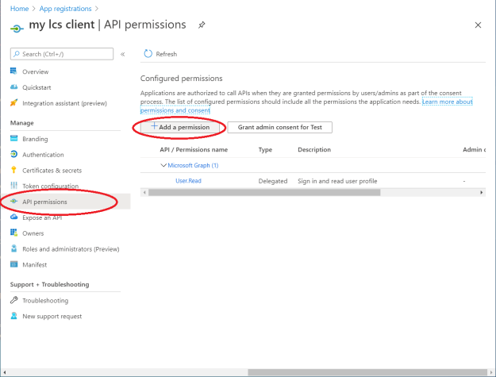

---
# required metadata

title: Dynamics 365 Translation Service Azure DevOps Extension
description: This article explains how to integrate the Microsoft Dynamics 365 Translation Service DevOps extension into your Azure DevOps workflow.
author: joshsantana
ms.date: 11/15/2021
ms.topic: article
ms.prod: 
ms.service: dynamics-ax-applications
ms.technology: 

# optional metadata

# ms.search.form:
audience: IT Pro
# ms.devlang: 
ms.reviewer: sericks
ms.search.scope: Operations
# ms.tgt_pltfrm: 
ms.search.region: Global
# ms.search.industry:
ms.author: joshsantana
ms.search.validFrom: 2021-11-15
ms.dyn365.ops.version: 
---


# Dynamics 365 Translation Service Azure DevOps Extension (Public Preview)
[!include[banner](../includes/banner.md)]

The Dynamics 365 Translation Service (DTS) extension for Microsoft Azure DevOps has several pipeline tasks that let you perform actions in Microsoft Dynamics 365 Translation Service. For example, you can translate user interface files, regenerate translation requests, and create translation memory files. 


To start using the DTS pipeline tasks, you must install the extension to your organization and then connect to the translation service. See [Setting up the extension](#setting-up-the-extension) for more information.

This topic assumes that you have a working knowledge of [Azure Pipelines](/azure/devops/pipelines/create-first-pipeline).

[!NOTE] The Dynamics 365 Translation Service extension for Azure DevOps is only available as public preview. As Dynamics 365 Translation Service is currently only deployed in the US, your data may be processed and stored outside of your geo-political boundary.

## Running a task
To create new translation, regeneration, or alignment requests, add a new task in the YAML for your pipeline.

For example, here's what the definition for a new translation task might look like.

```
- task: DTSTranslation@0
  inputs:
    LCSConnection: 'DTS connection'
    requestName: 'My Request'
    productType: '2'
    productVersion: '5'
    sourceLanguage: 'en-US'
    targetLanguage: 'es'
    translationType: 'ui'
    sourceFile: '$(Build.SourcesDirectory)/resources/en-US/*.label.txt'
    translationOutputPath: '$(Build.ArtifactStagingDirectory)'
```


By default, the request output is prepared in the staging folder `Build.ArtifactStagingDirectory`. To download the translation output, see [Publish and download artifacts in Azure Pipelines](/azure/devops/pipelines/artifacts/pipeline-artifacts). If you wish to push the translation output back to your repository, see [Commit translation output to your repository](#commit-translation-output-to-your-repository).


## Overview of task inputs

### DTS translation task

The translation task lets users submit new translation requests through DTS.

| Input | Required | Description | Notes |
|-------|----------|-------------|-------|
| Dynamics Lifecycle Services service connection | Yes | The Microsoft Dynamics Lifecycle Services (LCS) service connection that is used for authentication with LCS. | See [Create a service connection](#create-a-service-connection) for more information. |
| Request Name | Yes | Enter a name for the request. | |
| Product Name | Yes | Select a product name. | |
| Product Version | Yes | Select a product version. | |
| Source Language | Yes | The language that is being translated from. | |
| Target Language | No\* | The language that is being translated to. | |
| Multiple Target Languages | No\* | A comma-separated list of target language codes. | This input is used to submit requests that have multiple target languages. It overrides the **Target Language** input, if it's set. Here's an example: **ja, pt-BR, fr**. |
| Translation type | Yes | Select the file type. | Only **User Interface** files are currently supported. View [supported products and file types](/dynamics365/fin-ops-core/dev-itpro/lifecycle-services/translation-service-overview#supported-products). |
| Path to resource files | Yes | The path of the files to translate. | You can use wildcard characters in the path. Subfolder recursion is supported. Here are two examples: `$(Build.SourcesDirectory)/**/*.label.txt` `$(Build.SourcesDirectory)/resources` |
| Path to translation memory files | No | The path of the translation memory (TM) files. | Wildcard characters are supported. |
| Output Path | Yes |  The path (relative to your pipeline) to save the translation output. | See [Artifacts in Azure Pipelines](/azure/devops/pipelines/artifacts/build-artifacts). |


### DTS alignment task

If you have files that were previously translated, and you also have corresponding source files, you can use the Align tool to create a TM in XML Localization Interchange File Format (XLIFF).

| Input | Required | Description | Notes |
|-------|----------|-------------|-------|
| Dynamics Lifecycle Services service connection | Yes | The credentials that are used for authentication with LCS. | See [Create a service connection](#create-a-service-connection) for more information. |
| Product Name | Yes | The product to translate resource files for. | |
| Product Version | Yes | Select a product version. | |
| Source Language | Yes | The language that is being translated from. | |
| Target Language | Yes | The language that is being translated to. | |
| Source file | Yes | The path of the source file. | |
| Target file | Yes | The path of the target file. | |
| Output Path | Yes |  The path (relative to your pipeline) to save the alignment output. | See [Artifacts in Azure Pipelines](/azure/devops/pipelines/artifacts/build-artifacts). |

### DTS regeneration task

The regeneration task lets users submit new regeneration requests through DTS.

| Input | Required | Description | Notes |
|-------|----------|-------------|-------|
| Dynamics Lifecycle Services service connection | Yes | The credentials that are used for authentication with LCS. | See [Create a service connection](#create-a-service-connection) for more information. |
| Regenerate File | Yes | The path of the edited TM files. | |
| DTS Translation ID | Yes | The ID of the original translation. | If you're regenerating from the [translation task](#dts-translation-task), the translation ID is in the task output. |
| Output Path | Yes |  The path (relative to your pipeline) to save the translation output. | See [Artifacts in Azure Pipelines](/azure/devops/pipelines/artifacts/build-artifacts). |


## Setting up the extension
### Install the extension

To install the extension to your DevOps organization, navigate to the Visual Studio Marketplace. Switch to the Azure DevOps tab and search for “Dynamics 365 Translation Service”. **Find the Dynamics Translation Tasks** extension and open it. From the extension page, select **Get it free**. 


The installation page will open. You can either choose a DevOps organization to install the extension to, or you can download the vsix package for server installation. Once the extension is installed, the DTS tasks will be visible in your DevOps organization's pipelines. 


### Register an application

In order to create an LCS service connection to authenticate with DTS, you must first register an app with appropriate LCS permissions. The following procedure guides you through the app registration process. It also shows how to obtain a client ID and the Azure Open Authorization (OAuth) endpoint that is required to set up an LCS service connection.

1. Sign in to the Azure Portal as the user who will be used to communicate with the LCS API.
2. Under **Azure services**, select **App registrations**. 
3. On the **App registrations** page, select **New registration**.

   

4. On the **Register an application** page, in the **Name** field, enter a name for the app. Under **Supported account types**, select an option to specify which accounts should be supported. When you've finished, select **Register**.

    

5. On the page for your new app registration, in the left navigation pane, under **Manage**, select **API permissions**. 
6. On the **API permissions** page, select **Add a permission**. 

   

7. In the **APIs my organization uses** tab, find and select the **Dynamics Lifecycle services** API. Select the check box for the API permission that has the **user\_impersonation** scope, and then select **Add permissions**. 

   

8. Select the button to grant admin consent for the permissions. When you're prompted to confirm the action, select **Yes**.
9.  In the left navigation pane, under **Manage**, select **Authentication**.
10. On the **Authentication** page, under **Advanced settings**, select **Yes** to enable the option to **Allow public client flows**. 

    

11. In the left navigation pane, select **Overview**. The overview page for your app registration shows the client ID.
12. On the overview page, you can select **Endpoints** to find the authentication endpoint. Use the OAuth 2.0 token endpoint. 

    

    

### Create a service connection

Now that you have an app that is registered with Dynamics Lifecycle Services API connections, you must create a service connection to authenticate with LCS.

[!NOTE] LCS authentication requires Azure Active Directory (Azure AD) accounts where multi-factor authentication (MFA) is turned off, and that aren't backed by federated sign-ons. Microsoft is reviewing options for new authentication features that will enable the API and these tasks to be authenticated in these types of setups.

The service connection takes the following inputs.

| Input | Required | Description | Notes |
|-------|----------|-------------|-------|
| Username | Yes | The user who is submitting the requests through DTS. | MFA must be turned off. |
| Password | Yes | The user's password. | |
| Client ID | Yes | The client ID of the registered app. | See [Register an application](#register-an-application). |
| Authentication Endpoint | Yes | The endpoint to use for the app. | See [Register an application](#register-an-application). |

1. In your Azure DevOps project, at the bottom of the left menu, select **Project settings**.
2. In the **Project Settings** pane, under **Pipelines**, find and select **Service connections**. Then select **Create service connection**.
3. In the **New service connection** dialog box, search for and select the **Dynamics Lifecycle Services** service connection type. Select **Next**.
4. Enter the information for the service connection. Use the client ID and authentication endpoint from the registered app. The name that you select for this service will be used as input for the DTS DevOps extension tasks.

    


## Commit translation output to your repository

After translation, you may be interested in automatically pushing the localized files to your project’s repository. Before running any Git commands, version control permissions must be granted to the Pipeline agent.

1.	Go to the project settings page at **Organization Settings > General > Projects**.
2.	Select the project you want to edit.
3.	Within **Project Settings**, select **Repositories**. Select the repository you are using for this exercise.
4.	Select the **Security** tab to edit the security settings.
5.	Search for the **Project Collection Build Service** user. Grant the permissions needed for the Git commands you want to run. You’ll likely want to grant:
    -	Contribute
    -	Create branch
    -	Read

    

### Add Git scripts to pipeline

Before running Git commands, you’ll want to allow the script to access the system token. You can do so by adding a `checkout` step with `persistCredentials` set to true. 
You can now add Git commands as part of a PowerShell or bash script task. Below is an example bash script that commits and pushes the translation task output to a branch named "localized".
```
- checkout: self
  persistCredentials: true
- task: Bash@3
  inputs:
    targetType: 'inline'
    script: |
      # Write your commands here
      git config --global user.email "user@microsoft.com"
      git config --global user.name "User Name"
      git checkout -b localized
      git add $(Build.SourcesDirectory)
      git commit -m "Commiting translations from pipeline"
      git push --set-upstream origin localized
    workingDirectory: '$(Build.SourcesDirectory)'
```
